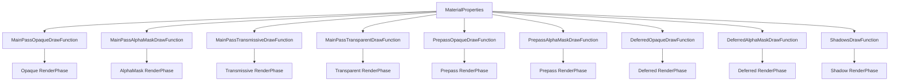

+++
title = "#21021 make material draw functions instance independent"
date = "2025-11-04T00:00:00"
draft = false
template = "pull_request_page.html"
in_search_index = false

[extra]
current_language = "zh-cn"
available_languages = {"en" = { name = "English", url = "/pull_request/bevy/2025-11/pr-21021-en-20251104" }, "zh-cn" = { name = "中文", url = "/pull_request/bevy/2025-11/pr-21021-zh-cn-20251104" }}
labels = ["A-Rendering", "C-Code-Quality", "M-Migration-Guide"]
+++

# make material draw functions instance independent

## Basic Information
- **Title**: make material draw functions instance independent
- **PR Link**: https://github.com/bevyengine/bevy/pull/21021
- **Author**: ecoskey
- **Status**: MERGED
- **Labels**: A-Rendering, C-Code-Quality, S-Ready-For-Review, M-Migration-Guide
- **Created**: 2025-09-13T21:26:53Z
- **Merged**: 2025-11-04T21:09:58Z
- **Merged By**: alice-i-cecile

## Description Translation
# 目标

#19667 引入了一个类型擦除的材质系统，它通过单个缓存处理所有材质实例：在资产准备阶段（`ErasedRenderAssetPlugin`），材质被处理成一组包含渲染所需所有数据的 `MaterialProperties`，这些数据会根据需要进行缓存和去重。

这提供了最大的灵活性（每个材质实例都可以有不同的"类型"），但使逻辑复杂化并使缓存键变得非常大。因此，我计划对材质系统进行重构（我认为 @tychedelia 也同意），目标是在两个级别缓存材质：材质"类型"和材质"实例"，其中材质类型大致映射到当前实现 `Material` 的 Rust 类型。在不深入实现细节的情况下，将大部分静态数据与实例数据分开存储将让我们简化很多逻辑，同时只需要为完全动态的用例多做一点工作。

这个 PR 是朝着这个方向迈出的第一步，它将*所有*可用的绘制函数存储在 `MaterialProperties` 中，并将"我应该为这个材质使用什么绘制函数？"的决定推迟到队列时间，而之前这个决定是在资产准备阶段和队列阶段之间分割的。这使得可用绘制函数列表与实例无关，并将在以后允许我们将其与其他"静态"材质数据一起存储。

## 解决方案

- 使绘制函数标签与渲染阶段一一对应，并在 `MaterialProperties` 的列表中包含所有绘制函数

## 测试

- 运行了 `3d_scene`
- 运行了 `manual_material`

## The Story of This Pull Request

这个 PR 解决了一个在 Bevy 渲染系统中关于材质绘制函数管理的架构问题。问题的核心在于现有的类型擦除材质系统将所有材质实例通过单一缓存处理，导致缓存键过大且逻辑复杂。

在 PR #19667 引入的类型擦除材质系统中，所有材质实例都被处理成统一的 `MaterialProperties` 结构，虽然提供了最大的灵活性，但带来了显著的复杂性。每个材质实例都需要单独处理，缓存键变得非常庞大，这影响了系统的性能和可维护性。

开发者 ecoskey 提出了一个两级的缓存策略来解决这个问题：在材质"类型"和材质"实例"两个级别进行缓存。材质类型大致对应于实现 `Material` trait 的 Rust 类型，这样可以将大部分静态数据与实例数据分开存储。

这个 PR 是实现这个长期目标的第一步。核心思路是将绘制函数的管理从资产准备阶段转移到队列阶段。具体来说，之前绘制函数的选择逻辑被分割在资产准备和队列两个阶段，现在统一在队列阶段处理。这使得 `MaterialProperties` 中的绘制函数列表与具体实例无关，为将来将其归类为"静态"材质数据奠定了基础。

实现的关键变化是将通用的绘制函数标签细化为针对特定渲染阶段的专用标签。之前系统使用 `MaterialDrawFunction`、`PrepassDrawFunction` 和 `DeferredDrawFunction` 这样的通用标签，现在替换为更具体的标签如 `MainPassOpaqueDrawFunction`、`PrepassAlphaMaskDrawFunction` 等。

在技术实现上，这个改变影响了多个核心模块。在 `material.rs` 中，绘制函数的定义从少数几个通用标签扩展为针对每个渲染阶段的专用标签。在队列函数中，获取绘制函数的逻辑从统一的 `MaterialDrawFunction` 改为根据具体渲染阶段获取对应的绘制函数。

这种架构改进带来了几个好处：首先，它简化了绘制函数的管理逻辑；其次，它为后续的两级缓存策略奠定了基础；最后，它使得材质系统的设计更加清晰，静态数据和实例数据的边界更加明确。

虽然这个改变主要影响低级别的"手动材质" API，但它为整个材质系统的长期改进铺平了道路。通过将绘制函数的选择推迟到队列阶段，系统获得了更大的灵活性，同时为未来的性能优化创造了条件。

## Visual Representation



## Key Files Changed

### `crates/bevy_pbr/src/material.rs` (+66/-45)

这个文件包含了最核心的改动，重新定义了绘制函数标签系统：

**绘制函数标签定义的变化：**
```rust
// 之前：
#[derive(DrawFunctionLabel, Debug, Hash, PartialEq, Eq, Clone, Default)]
pub struct MaterialDrawFunction;

#[derive(DrawFunctionLabel, Debug, Hash, PartialEq, Eq, Clone, Default)]
pub struct PrepassDrawFunction;

#[derive(DrawFunctionLabel, Debug, Hash, PartialEq, Eq, Clone, Default)]
pub struct DeferredDrawFunction;

// 之后：
#[derive(DrawFunctionLabel, Debug, Hash, PartialEq, Eq, Clone, Default)]
pub struct MainPassOpaqueDrawFunction;
#[derive(DrawFunctionLabel, Debug, Hash, PartialEq, Eq, Clone, Default)]
pub struct MainPassAlphaMaskDrawFunction;
#[derive(DrawFunctionLabel, Debug, Hash, PartialEq, Eq, Clone, Default)]
pub struct MainPassTransmissiveDrawFunction;
#[derive(DrawFunctionLabel, Debug, Hash, PartialEq, Eq, Clone, Default)]
pub struct MainPassTransparentDrawFunction;

#[derive(DrawFunctionLabel, Debug, Hash, PartialEq, Eq, Clone, Default)]
pub struct PrepassOpaqueDrawFunction;
#[derive(DrawFunctionLabel, Debug, Hash, PartialEq, Eq, Clone, Default)]
pub struct PrepassAlphaMaskDrawFunction;

#[derive(DrawFunctionLabel, Debug, Hash, PartialEq, Eq, Clone, Default)]
pub struct DeferredOpaqueDrawFunction;
#[derive(DrawFunctionLabel, Debug, Hash, PartialEq, Eq, Clone, Default)]
pub struct DeferredAlphaMaskDrawFunction;
```

**队列逻辑的变化：**
```rust
// 之前：
let Some(draw_function) = material.properties.get_draw_function(MaterialDrawFunction)
else {
    continue;
};

// 之后（针对每个渲染阶段）：
match material.properties.render_phase_type {
    RenderPhaseType::Transmissive => {
        let Some(draw_function) = material
            .properties
            .get_draw_function(MainPassTransmissiveDrawFunction)
        else {
            continue;
        };
        // ... 使用绘制函数
    }
    // 其他渲染阶段类似处理
}
```

**材质准备阶段的变化：**
```rust
// 之前：根据渲染阶段类型选择性地添加绘制函数
let draw_function_id = match render_phase_type {
    RenderPhaseType::Opaque => draw_opaque_pbr,
    RenderPhaseType::AlphaMask => draw_alpha_mask_pbr,
    // ...
};
let mut draw_functions = SmallVec::new();
draw_functions.push((MaterialDrawFunction.intern(), draw_function_id));
// 条件性地添加其他绘制函数

// 之后：统一添加所有绘制函数
let draw_functions = SmallVec::from_iter([
    (MainPassOpaqueDrawFunction.intern(), draw_opaque_pbr),
    (MainPassAlphaMaskDrawFunction.intern(), draw_alpha_mask_pbr),
    (MainPassTransmissiveDrawFunction.intern(), draw_transmissive_pbr),
    // ... 所有其他绘制函数
]);
```

### `crates/bevy_pbr/src/prepass/mod.rs` (+35/-22)

这个文件更新了预处理通道的队列逻辑，以使用新的绘制函数标签系统：

```rust
// 之前：
let batch_set_key = OpaqueNoLightmap3dBatchSetKey {
    draw_function: material
        .properties
        .get_draw_function(PrepassDrawFunction)
        .unwrap(),
    // ...
};

// 之后：
let Some(draw_function) = material
    .properties
    .get_draw_function(PrepassOpaqueDrawFunction)
else {
    continue;
};
let batch_set_key = OpaqueNoLightmap3dBatchSetKey {
    draw_function,
    // ...
};
```

### `examples/shader_advanced/manual_material.rs` (+3/-3)

更新了手动材质示例以使用新的绘制函数标签：

```rust
// 之前：
properties.add_draw_function(MaterialDrawFunction, draw_function_id);

// 之后：
properties.add_draw_function(MainPassOpaqueDrawFunction, draw_function_id);
```

### `release-content/migration-guides/draw_functions.md` (+24/-0)

新增了迁移指南，详细说明了从旧的绘制函数标签迁移到新系统的变化。

## Further Reading

- [Bevy Material System Documentation](https://bevyengine.org/learn/books/introduction/features/3d-rendering/materials)
- [Render Phases in Bevy](https://bevyengine.org/learn/books/introduction/features/3d-rendering/render-phases)
- [Type Erasure in Rust](https://doc.rust-lang.org/book/ch17-02-trait-objects.html)
- [Draw Functions Architecture](https://bevyengine.org/learn/books/introduction/features/3d-rendering/draw-functions)