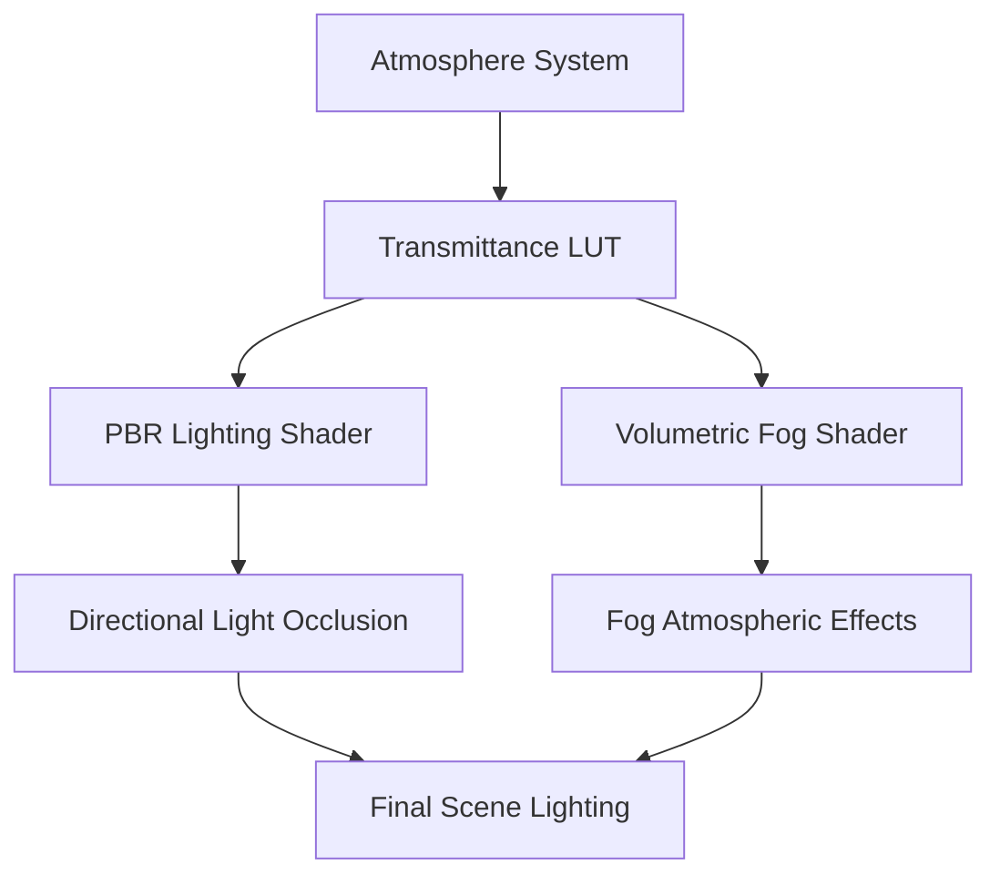

+++
title = "#21383 Atmosphere occlusion and PBR shading"
date = "2025-11-01T00:00:00"
draft = false
template = "pull_request_page.html"
in_search_index = true

[taxonomies]
list_display = ["show"]

[extra]
current_language = "en"
available_languages = {"en" = { name = "English", url = "/pull_request/bevy/2025-11/pr-21383-en-20251101" }, "zh-cn" = { name = "中文", url = "/pull_request/bevy/2025-11/pr-21383-zh-cn-20251101" }}
labels = ["C-Feature", "A-Rendering", "M-Release-Note"]
+++

# Title
Atmosphere occlusion and PBR shading

## Basic Information
- **Title**: Atmosphere occlusion and PBR shading
- **PR Link**: https://github.com/bevyengine/bevy/pull/21383
- **Author**: mate-h
- **Status**: MERGED
- **Labels**: C-Feature, A-Rendering, S-Ready-For-Final-Review, M-Release-Note
- **Created**: 2025-10-04T17:58:55Z
- **Merged**: 2025-11-01T21:47:56Z
- **Merged By**: alice-i-cecile

## Description Translation

# Objective

- Occlude the directional lights by the atmosphere
- More Physically accurate light values reaching the objects from directional lights
- Support volumetric shadowing through the atmosphere with an additional layer of FogVolume
- Strategic direction: use the FogVolume and expand on that implementation for shadow sampling Since it already uses pipeline specialization.
- For now keep the atmosphere pipeline as is, free from shadow sampling code since these effects only matter at large scales. Shadow sampling for the atmosphere can be implemented in a later PR for planetary rings, objects in space, other large scale objects.

## Solution

- Bind the transmittance LUT to the core 3d mesh PBR shader
- tint the incoming light L to point P by the transmittance through the atmospheric medium
- Apply the same effects to volumetric fog
- Ensured that new new Atmosphere pipeline key works with deferred rendering
- Updated example to include water plane and screen space reflections. Removed the water plane from the GLB terrain asset. (small asset churn!)

## Testing

```bash
cargo run --example atmosphere
# or
cargo run --example atmosphere --features=free_camera
```

---

## Showcase


## The Story of This Pull Request

This PR addresses a fundamental limitation in Bevy's atmospheric rendering system: the lack of proper atmospheric occlusion for directional lights. Previously, sunlight would pass through the atmosphere without being attenuated, resulting in unrealistic lighting that didn't account for how atmospheric scattering affects light reaching objects in the scene.

The core problem was that while Bevy had atmospheric rendering for skyboxes, this atmospheric data wasn't being used to modify how directional lights illuminated objects. This meant scenes lacked the realistic color shifts that occur when sunlight travels through different atmospheric densities - particularly the orange and red hues seen at sunrise and sunset.

The solution approach centered on integrating the existing atmospheric transmittance Look-Up Table (LUT) into the core PBR lighting calculations. The developer made a strategic decision to build upon the existing FogVolume infrastructure since it already used pipeline specialization, which would allow for a more maintainable architecture.

The implementation required changes across multiple rendering subsystems. First, the transmittance LUT needed to be bound to the mesh PBR shader so it could sample atmospheric transmittance data. Then, the directional light calculations were modified to tint incoming light based on the transmittance through the atmospheric medium at each point in the scene.

A key technical insight was that this same atmospheric occlusion logic needed to be applied to volumetric fog as well, ensuring consistent lighting behavior across different rendering features. The developer also ensured the new atmosphere pipeline key worked properly with deferred rendering, which required updating pipeline specialization logic in multiple locations.

The changes significantly improve physical accuracy by making directional light intensity and color vary based on atmospheric conditions and the sun's position relative to objects in the scene. This creates more realistic outdoor lighting where objects appear properly illuminated by sunlight that has traveled through the atmosphere.

## Visual Representation



## Key Files Changed

### `crates/bevy_pbr/src/render/mesh_view_bindings.rs` (+53/-3)
This file handles the binding of resources to shaders. The changes add support for binding atmospheric resources to the core mesh rendering pipeline.

**Key additions:**
```rust
// Atmosphere buffer binding
(31, storage_buffer_read_only::<AtmosphereData>(false)),

// Transmittance LUT texture and sampler bindings
(29, texture_2d(TextureSampleType::Float { filterable: true })),
(30, sampler(SamplerBindingType::Filtering)),
```

### `crates/bevy_pbr/src/render/pbr_lighting.wgsl` (+32/-1)
This is the core PBR lighting shader where atmospheric occlusion is applied to directional lights.

**Key implementation:**
```rust
#ifdef ATMOSPHERE
    let P = (*input).P;
    let atmosphere = view_bindings::atmosphere_data.atmosphere;
    let O = vec3(0.0, atmosphere.bottom_radius, 0.0);
    let P_scaled = P * vec3(view_bindings::atmosphere_data.settings.scene_units_to_m);
    let P_as = P_scaled + O;
    let r = length(P_as);
    let local_up = normalize(P_as);
    let mu_light = dot(L, local_up);

    // Sample atmosphere
    let transmittance = sample_transmittance_lut(r, mu_light);
    let sun_visibility = calculate_visible_sun_ratio(atmosphere, r, mu_light, (*light).sun_disk_angular_size);
    
    // Apply atmospheric effects
    color *= transmittance * sun_visibility;
#endif
```

### `crates/bevy_pbr/src/volumetric_fog/volumetric_fog.wgsl` (+38/-5)
This file applies the same atmospheric occlusion to volumetric fog, ensuring consistent lighting.

**Key changes:**
```rust
#ifdef ATMOSPHERE
    // attenuate by atmospheric scattering
    let P = P_world + depth_offset;
    let P_scaled = P * vec3(atmosphere_data.settings.scene_units_to_m);
    let O = vec3(0.0, atmosphere_data.atmosphere.bottom_radius, 0.0);
    let P_as = P_scaled + O;
    let r = length(P_as);
    let local_up = normalize(P_as);
    let mu_light = dot(L, local_up);
    
    let transmittance = sample_transmittance_lut(r, mu_light);
    let sun_visibility = calculate_visible_sun_ratio(atmosphere_data.atmosphere, r, mu_light, (*light).sun_disk_angular_size);
    light_factors_per_step *= transmittance * sun_visibility;
#endif
```

### `crates/bevy_pbr/src/atmosphere/resources.rs` (+42/-0)
This file adds the infrastructure for managing atmosphere data buffers.

**Key additions:**
```rust
#[derive(ShaderType)]
#[repr(C)]
pub(crate) struct AtmosphereData {
    pub atmosphere: GpuAtmosphere,
    pub settings: GpuAtmosphereSettings,
}

#[derive(Resource)]
pub struct AtmosphereBuffer {
    pub(crate) buffer: StorageBuffer<AtmosphereData>,
}
```

### `examples/3d/atmosphere.rs` (+205/-23)
The example was significantly enhanced to showcase the new atmospheric occlusion features with improved visuals and controls.

**Key improvements:**
- Added water plane with animated ripples
- Added screen space reflections
- Added interactive controls for atmosphere rendering modes
- Added pause/resume functionality for sun motion
- Added exposure controls

## Further Reading

- [Bevy PBR Documentation](https://bevyengine.org/learn/books/reference/pbr)
- [Atmospheric Scattering Theory](https://developer.nvidia.com/gpugems/gpugems2/part-ii-shading-lighting-and-shadows/chapter-16-accurate-atmospheric-scattering)
- [Volumetric Rendering Techniques](https://www.alexandre-pestana.com/volumetric-lights/)
- [Bruneton and Neyret Precomputed Atmospheric Scattering Paper](https://hal.inria.fr/inria-00288758/document)