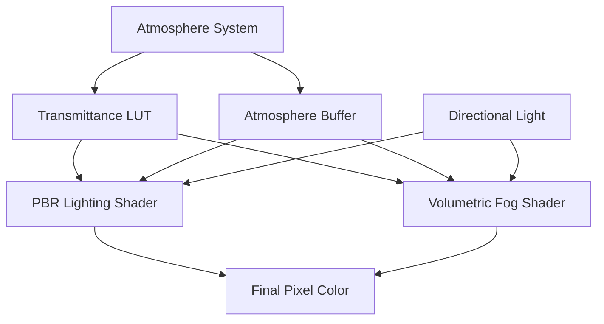

+++
title = "#21383 Atmosphere occlusion and PBR shading"
date = "2025-11-01T00:00:00"
draft = false
template = "pull_request_page.html"
in_search_index = false

[extra]
current_language = "zh-cn"
available_languages = {"en" = { name = "English", url = "/pull_request/bevy/2025-11/pr-21383-en-20251101" }, "zh-cn" = { name = "中文", url = "/pull_request/bevy/2025-11/pr-21383-zh-cn-20251101" }}
labels = ["C-Feature", "A-Rendering", "M-Release-Note"]
+++

# Title

## Basic Information
- **Title**: Atmosphere occlusion and PBR shading
- **PR Link**: https://github.com/bevyengine/bevy/pull/21383
- **Author**: mate-h
- **Status**: MERGED
- **Labels**: C-Feature, A-Rendering, S-Ready-For-Final-Review, M-Release-Note
- **Created**: 2025-10-04T17:58:55Z
- **Merged**: 2025-11-01T21:47:56Z
- **Merged By**: alice-i-cecile

## Description Translation
# 目标

- 通过大气层遮挡方向光
- 从方向光到达物体的光线值更加物理准确
- 通过额外的 FogVolume 层支持通过大气层的体积阴影
- 战略方向：使用 FogVolume 并扩展该实现以进行阴影采样，因为它已经使用了管道专门化
- 目前保持大气层管道不变，不包含阴影采样代码，因为这些效果仅在大尺度下才有意义。大气层的阴影采样可以在后续的 PR 中为行星环、太空中的物体和其他大尺度对象实现

## 解决方案

- 将透射率 LUT 绑定到核心 3D 网格 PBR 着色器
- 通过大气介质的透射率对到达点 P 的入射光 L 进行着色
- 对体积雾应用相同的效果
- 确保新的 Atmosphere 管道键与延迟渲染一起工作
- 更新示例以包括水面和屏幕空间反射。从 GLB 地形资源中移除水面（少量资源变动！）

## 测试

```bash
cargo run --example atmosphere
# 或者
cargo run --example atmosphere --features=free_camera
```

---

## 展示


## The Story of This Pull Request

这个 PR 解决了 Bevy 渲染系统中一个重要的物理准确性问题：大气层对光线的遮挡效应。在之前的实现中，方向光（如太阳光）会直接照射到场景中的物体，而不考虑光线穿过大气层时的衰减和散射效应。

**问题与背景**

在真实的物理世界中，太阳光穿过大气层时会经历瑞利散射和米氏散射，导致光线强度衰减和颜色变化。特别是在日出和日落时，太阳光需要穿过更厚的大气层，呈现出红色或橙色的色调。之前的 Bevy 大气系统虽然能够渲染天空，但没有将这些物理效应应用到场景中的物体光照上。

**解决方案方法**

开发者采用了基于 Bruneton 大气模型的预计算透射率查找表（LUT）方法。核心思路是：

1. 预计算大气透射率 LUT，存储不同高度和角度下光线的透射率
2. 在 PBR 光照计算中采样这个 LUT，根据光线穿过大气层的路径长度来衰减光照强度
3. 对体积雾系统应用相同的物理模型，确保一致性

**技术实现细节**

实现的关键是在现有的渲染管线中集成大气透射率计算。这需要：

- 在网格视图绑定中添加大气相关的纹理和缓冲区绑定
- 修改 PBR 光照着色器，在方向光计算中加入大气透射率采样
- 扩展体积雾着色器，应用相同的物理模型
- 确保所有渲染路径（前向、延迟）都支持大气效果

一个重要的技术决策是重用现有的 FogVolume 系统架构，因为它在管线专门化方面已经提供了良好的基础。这种策略避免了重复造轮子，也使得后续添加更复杂的阴影采样功能更加容易。

**性能考虑**

由于使用了预计算的 LUT，运行时性能开销很小。透射率查询只是额外的纹理采样操作，在现代 GPU 上成本很低。这种实现保持了实时渲染的性能要求，同时显著提升了视觉真实性。

**架构影响**

这个改动影响了 Bevy 渲染管线的多个层级：
- 增加了新的 MeshPipelineKey::ATMOSPHERE 标志
- 扩展了网格视图绑定布局以包含大气资源
- 修改了核心 PBR 光照计算
- 更新了体积雾渲染

这种集成确保了大气效果能够无缝地与其他渲染特性（如屏幕空间反射、环境光遮蔽等）协同工作。

## Visual Representation



## Key Files Changed

### `examples/3d/atmosphere.rs` (+205/-23)
这个示例文件进行了重大扩展，展示了新的大气遮挡功能：

```rust
// 添加了水面材质和屏幕空间反射
commands.spawn((
    Mesh3d(meshes.add(Plane3d::new(Vec3::Y, Vec2::splat(1.0)))),
    MeshMaterial3d(water_materials.add(ExtendedMaterial {
        base: StandardMaterial {
            base_color: BLACK.into(),
            perceptual_roughness: 0.0,
            ..default()
        },
        extension: Water {
            normals: asset_server.load_with_settings::<Image, ImageLoaderSettings>(
                "textures/water_normals.png",
                |settings| {
                    settings.is_srgb = false;
                    settings.sampler = ImageSampler::Descriptor(ImageSamplerDescriptor {
                        address_mode_u: ImageAddressMode::Repeat,
                        address_mode_v: ImageAddressMode::Repeat,
                        mag_filter: ImageFilterMode::Linear,
                        min_filter: ImageFilterMode::Linear,
                        ..default()
                    });
                },
            ),
            settings: WaterSettings {
                octave_vectors: [
                    vec4(0.080, 0.059, 0.073, -0.062),
                    vec4(0.153, 0.138, -0.149, -0.195),
                ],
                octave_scales: vec4(1.0, 2.1, 7.9, 14.9) * 500.0,
                octave_strengths: vec4(0.16, 0.18, 0.093, 0.044) * 0.2,
            },
        },
    })),
    Transform::from_scale(Vec3::splat(100.0)),
));
```

### `crates/bevy_pbr/src/render/mesh_view_bindings.rs` (+53/-3)
扩展了网格视图绑定以支持大气数据：

```rust
// 在大气启用时添加绑定
if layout_key.contains(MeshPipelineViewLayoutKey::ATMOSPHERE) {
    entries = entries.extend_with_indices((
        // transmittance LUT
        (
            29,
            texture_2d(TextureSampleType::Float { filterable: true }),
        ),
        (30, sampler(SamplerBindingType::Filtering)),
        // atmosphere data buffer
        (31, storage_buffer_read_only::<AtmosphereData>(false)),
    ));
}
```

### `crates/bevy_pbr/src/volumetric_fog/volumetric_fog.wgsl` (+38/-5)
在体积雾着色器中集成了大气透射率：

```wgsl
#ifdef ATMOSPHERE
// attenuate by atmospheric scattering
let P = P_world + depth_offset;
let P_scaled = P * vec3(atmosphere_data.settings.scene_units_to_m);
let O = vec3(0.0, atmosphere_data.atmosphere.bottom_radius, 0.0);
let P_as = P_scaled + O;
let r = length(P_as);
let local_up = normalize(P_as);
let mu_light = dot(L, local_up);

let transmittance = sample_transmittance_lut(r, mu_light);
let sun_visibility = calculate_visible_sun_ratio(atmosphere_data.atmosphere, r, mu_light, (*light).sun_disk_angular_size);
light_factors_per_step *= transmittance * sun_visibility;
#endif
```

### `crates/bevy_pbr/src/atmosphere/resources.rs` (+42/-0)
添加了大气数据缓冲区的管理：

```rust
#[derive(ShaderType)]
#[repr(C)]
pub(crate) struct AtmosphereData {
    pub atmosphere: GpuAtmosphere,
    pub settings: GpuAtmosphereSettings,
}

pub fn init_atmosphere_buffer(mut commands: Commands) {
    commands.insert_resource(AtmosphereBuffer {
        buffer: StorageBuffer::from(AtmosphereData {
            atmosphere: GpuAtmosphere {
                ground_albedo: Vec3::ZERO,
                bottom_radius: 0.0,
                top_radius: 0.0,
            },
            settings: GpuAtmosphereSettings::default(),
        }),
    });
}
```

### `crates/bevy_pbr/src/render/pbr_lighting.wgsl` (+32/-1)
在 PBR 光照计算中集成了大气透射率：

```wgsl
#ifdef ATMOSPHERE
let P = (*input).P;
let atmosphere = view_bindings::atmosphere_data.atmosphere;
let O = vec3(0.0, atmosphere.bottom_radius, 0.0);
let P_scaled = P * vec3(view_bindings::atmosphere_data.settings.scene_units_to_m);
let P_as = P_scaled + O;
let r = length(P_as);
let local_up = normalize(P_as);
let mu_light = dot(L, local_up);

// Sample atmosphere
let transmittance = sample_transmittance_lut(r, mu_light);
let sun_visibility = calculate_visible_sun_ratio(atmosphere, r, mu_light, (*light).sun_disk_angular_size);

// Apply atmospheric effects
color *= transmittance * sun_visibility;
#endif
```

## Further Reading

- [Bruneton and Neyret 的预计算大气散射论文](https://hal.inria.fr/inria-00288758/document) - 这个 PR 实现的大气模型的基础
- [Bevy 大气系统文档](https://bevyengine.org/learn/books/render/atmosphere/) - Bevy 官方文档中的大气渲染章节
- [实时渲染中的体积效果](https://advances.realtimerendering.com/s2015/The%20Real-time%20Volumetric%20Cloudscapes%20of%20Horizon%20-%20Zero%20Dawn%20-%20ARTR.pdf) - 关于实时体积渲染的深入讨论
- [WGSL 着色语言规范](https://gpuweb.github.io/gpuweb/wgsl/) - 这个 PR 中使用的着色语言