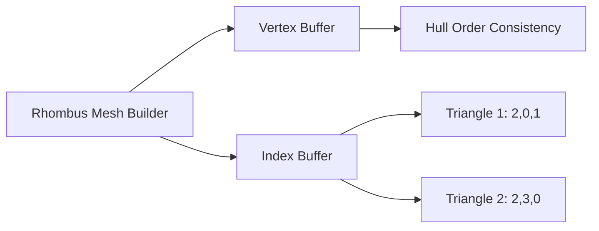

+++
title = "#21621 order rhombus vertices in \"hull-order\""
date = "2025-11-26T00:00:00"
draft = false
template = "pull_request_page.html"
in_search_index = true

[taxonomies]
list_display = ["show"]

[extra]
current_language = "en"
available_languages = {"en" = { name = "English", url = "/pull_request/bevy/2025-11/pr-21621-en-20251126" }, "zh-cn" = { name = "中文", url = "/pull_request/bevy/2025-11/pr-21621-zh-cn-20251126" }}
labels = ["A-Rendering", "A-Math"]
+++

# Title
order rhombus vertices in "hull-order"

## Basic Information
- **Title**: order rhombus vertices in "hull-order"
- **PR Link**: https://github.com/bevyengine/bevy/pull/21621
- **Author**: ChristopherBiscardi
- **Status**: MERGED
- **Labels**: A-Rendering, S-Ready-For-Final-Review, A-Math
- **Created**: 2025-10-21T16:07:38Z
- **Merged**: 2025-11-26T20:38:05Z
- **Merged By**: mockersf

## Description Translation
# Objective

Most Mesh2d primitives order their vertices in what I'll call "hull order", which is to say, in an sequential outline of the shape.
A Rectangle, for example, is:

```rust
let positions = vec![
  [hw, hh, 0.0],
  [-hw, hh, 0.0],
  [-hw, -hh, 0.0],
  [hw, -hh, 0.0],
];
```

The Rhombus does not follow this pattern, instead using "right, left, top, bottom" order for the vertex buffer.

This isn't a general issue, but there is definitely a pattern to the way the shapes are laid out, and Rhombus doesn't follow it.
This means you can use the vertex buffer alone to define a hull for most 2d shapes (regular polygons, lines, circles, capsules, etc), except the rhombus (also not valid for annulus/ring afaik)

## Solution

Re-order the indices and vertices for Rhombus, resulting in the same output, but enabling the vertex buffer to be used to define a "hull" directly, without the index buffer.

## Testing

Run the 2d_shapes demo, see wireframe is as expected.


---

## Showcase

In a 2d visibility mesh demo I was building, this caused an issue when trying to directly use the vertex buffer to define the outer "hull" shape.

old rhombus on left, new rhombus on right.


## The Story of This Pull Request

This PR addresses a consistency issue in Bevy's 2D mesh primitives where the Rhombus shape didn't follow the established "hull order" pattern used by other shapes. The problem emerged when the author was building a 2D visibility mesh system and discovered that the rhombus vertex buffer couldn't be used directly to define the outer hull shape, unlike other primitives.

The core issue was that most Bevy 2D primitives organize their vertices in sequential outline order, creating a natural hull when traversed. For example, a rectangle's vertices follow a clockwise or counter-clockwise path around the shape. However, the rhombus used a different ordering scheme: "right, left, top, bottom" - essentially grouping vertices by axis alignment rather than sequential position around the perimeter.

The solution involved reordering the triangle indices while keeping the vertex positions unchanged. The change from `[0, 1, 2, 2, 3, 0]` to `[2, 0, 1, 2, 3, 0]` maintains the same visual output but reorganizes how the triangles are constructed. This subtle change enables the vertex buffer to be interpreted as a sequential hull when needed, while preserving backward compatibility for rendering purposes.

From an engineering perspective, this change demonstrates the importance of consistent data organization patterns in graphics programming. The vertex buffer serves dual purposes: it defines the geometry for rendering through the index buffer, but can also be used directly for computational geometry tasks like hull detection and visibility calculations. By aligning the rhombus with the established pattern, the PR maintains consistency across the 2D primitive ecosystem.

The implementation is minimal and surgical - a single line change that modifies only the index ordering. This approach ensures zero performance impact while enabling new use cases. The testing strategy was straightforward: verify that the wireframe rendering remains identical, confirming that the visual output is preserved while the underlying data organization improves.

## Visual Representation



## Key Files Changed

- `crates/bevy_mesh/src/primitives/dim2.rs` (+1/-1)

The only change modifies the index buffer ordering in the RhombusMeshBuilder implementation:

```rust
// File: crates/bevy_mesh/src/primitives/dim2.rs
// Before:
let indices = Indices::U32(vec![0, 1, 2, 2, 3, 0]);

// After:
let indices = Indices::U32(vec![2, 0, 1, 2, 3, 0]);
```

This change reorganizes the triangle construction while maintaining the same geometric output. The vertex positions remain unchanged at:
- `[self.half_diagonals.x, 0.0, 0.0]` (right)
- `[-self.half_diagonals.x, 0.0, 0.0]` (left)  
- `[0.0, self.half_diagonals.y, 0.0]` (top)
- `[0.0, -self.half_diagonals.y, 0.0]` (bottom)

The new index ordering creates triangles that follow a more sequential pattern around the shape, enabling direct use of the vertex buffer for hull detection without requiring index buffer processing.

## Further Reading

- [Bevy Mesh Primitives Documentation](https://docs.rs/bevy_mesh/latest/bevy_mesh/primitives/index.html)
- [Computer Graphics: Triangle Mesh Representation](https://en.wikipedia.org/wiki/Triangle_mesh)
- [2D Convex Hull Algorithms](https://en.wikipedia.org/wiki/Convex_hull_algorithms)

# Full Code Diff
```diff
diff --git a/crates/bevy_mesh/src/primitives/dim2.rs b/crates/bevy_mesh/src/primitives/dim2.rs
index f2a5862c6f390..2a8bb4edf50cf 100644
--- a/crates/bevy_mesh/src/primitives/dim2.rs
+++ b/crates/bevy_mesh/src/primitives/dim2.rs
@@ -906,7 +906,7 @@ impl MeshBuilder for RhombusMeshBuilder {
         ];
         let normals = vec![[0.0, 0.0, 1.0]; 4];
         let uvs = vec![[1.0, 0.5], [0.5, 0.0], [0.0, 0.5], [0.5, 1.0]];
-        let indices = Indices::U32(vec![0, 1, 2, 2, 3, 0]);
+        let indices = Indices::U32(vec![2, 0, 1, 2, 3, 0]);
 
         Mesh::new(
             PrimitiveTopology::TriangleList,
```