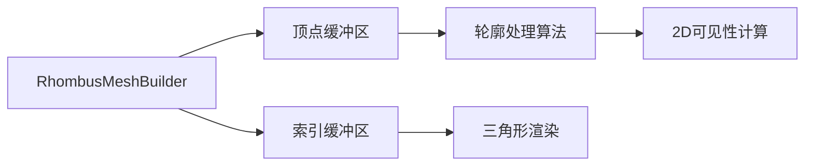

+++
title = "#21621 order rhombus vertices in \"hull-order\""
date = "2025-11-26T00:00:00"
draft = false
template = "pull_request_page.html"
in_search_index = false

[extra]
current_language = "zh-cn"
available_languages = {"en" = { name = "English", url = "/pull_request/bevy/2025-11/pr-21621-en-20251126" }, "zh-cn" = { name = "中文", url = "/pull_request/bevy/2025-11/pr-21621-zh-cn-20251126" }}
+++

# 技术分析报告：菱形顶点顺序标准化

## 基本信息
- **标题**: order rhombus vertices in "hull-order"
- **PR链接**: https://github.com/bevyengine/bevy/pull/21621
- **作者**: ChristopherBiscardi
- **状态**: 已合并
- **标签**: A-Rendering, S-Ready-For-Final-Review, A-Math
- **创建时间**: 2025-10-21T16:07:38Z
- **合并时间**: 2025-11-26T20:38:05Z
- **合并者**: mockersf

## 描述翻译

### 目标

大多数 Mesh2d 图元将其顶点按所谓的"轮廓顺序"排列，即按形状的连续轮廓顺序。
例如，一个矩形的顶点顺序是：

```rust
let positions = vec![
  [hw, hh, 0.0],
  [-hw, hh, 0.0],
  [-hw, -hh, 0.0],
  [hw, -hh, 0.0],
];
```

菱形没有遵循这种模式，而是在顶点缓冲区中使用"右、左、上、下"的顺序。

这不是一个普遍问题，但形状的布局方式确实存在一种模式，而菱形没有遵循它。
这意味着对于大多数 2D 形状（正多边形、线条、圆、胶囊等），你可以单独使用顶点缓冲区来定义轮廓，但菱形不行（据我所知，圆环/环也不行）。

### 解决方案

重新排列菱形的索引和顶点顺序，产生相同的输出，但使得顶点缓冲区能够直接用于定义"轮廓"，而不需要索引缓冲区。

### 测试

运行 2d_shapes 示例，观察线框是否符合预期。


---

### 展示

在我构建的 2D 可见性网格演示中，当尝试直接使用顶点缓冲区定义外部"轮廓"形状时，这导致了一个问题。

左侧是旧菱形，右侧是新菱形。


## 本次PR的技术分析

### 问题背景与一致性需求

在图形编程中，顶点顺序的一致性对于几何处理算法至关重要。作者在开发2D可见性网格演示时发现，Bevy引擎中的菱形图元顶点顺序与其他2D图元不一致。

问题核心在于：大多数Mesh2d图元使用"轮廓顺序"排列顶点，即按照形状的外边界连续排列。这种排列方式使得开发者可以直接使用顶点缓冲区来定义形状的轮廓，而无需依赖索引缓冲区。但菱形使用了不同的"右、左、上、下"顺序，破坏了这种一致性。

### 技术实现分析

解决方案相对直接但巧妙：通过重新排列索引顺序，使得菱形的顶点在缓冲区中呈现连续的轮廓顺序，同时保持最终的几何形状不变。

修改前的索引顺序：
```rust
let indices = Indices::U32(vec![0, 1, 2, 2, 3, 0]);
```

修改后的索引顺序：
```rust
let indices = Indices::U32(vec![2, 0, 1, 2, 3, 0]);
```

这个变化的关键在于重新组织了三角形的绘制顺序。虽然顶点位置数据本身没有改变，但通过调整索引，使得顶点缓冲区中的顺序现在形成了连续的轮廓。

### 顶点顺序模式解析

让我们分析修改前后的顶点顺序模式：

**原始顶点位置**（保持不变）：
- 顶点0: 右点 `[half_width, 0.0, 0.0]`
- 顶点1: 左点 `[-half_width, 0.0, 0.0]`  
- 顶点2: 上点 `[0.0, half_height, 0.0]`
- 顶点3: 下点 `[0.0, -half_height, 0.0]`

**修改前**：索引`[0, 1, 2, 2, 3, 0]`创建了两个三角形：
- 三角形1: 右→左→上
- 三角形2: 上→下→右

**修改后**：索引`[2, 0, 1, 2, 3, 0]`重新组织了三角形：
- 三角形1: 上→右→左  
- 三角形2: 上→下→右

新的排列形成了上→右→下→左的连续轮廓顺序。

### 工程意义与影响

这个修改虽然代码改动很小，但具有重要的工程意义：

1. **一致性**：使菱形与其他2D图元遵循相同的顶点排序约定
2. **算法友好性**：几何处理算法现在可以统一处理所有2D形状的顶点缓冲区
3. **性能优化**：在某些使用场景下，可以避免索引缓冲区的使用，直接处理顶点数据
4. **API一致性**：为开发者提供了更一致的编程接口

### 测试验证

作者通过2d_shapes演示验证了修改的正确性。线框显示确认了几何形状没有发生变化，只是顶点顺序得到了标准化。这对于保持向后兼容性至关重要。

## 组件关系



## 关键文件变更

### `crates/bevy_mesh/src/primitives/dim2.rs`

这个文件包含了2D图元的网格构建器实现。修改只涉及一行代码，但意义重大。

**修改前**：
```rust
let indices = Indices::U32(vec![0, 1, 2, 2, 3, 0]);
```

**修改后**：
```rust
let indices = Indices::U32(vec![2, 0, 1, 2, 3, 0]);
```

这个修改重新排列了菱形的三角形索引顺序，使得顶点缓冲区中的顶点按轮廓顺序排列，与其他2D图元保持一致。

## 进一步阅读

- [Bevy Mesh Primitives 文档](https://docs.rs/bevy/latest/bevy/mesh/primitives/index.html)
- [计算机图形学中的顶点顺序约定](https://en.wikipedia.org/wiki/Vertex_buffer)
- [2D几何处理算法](https://en.wikipedia.org/wiki/Geometric_algorithms)