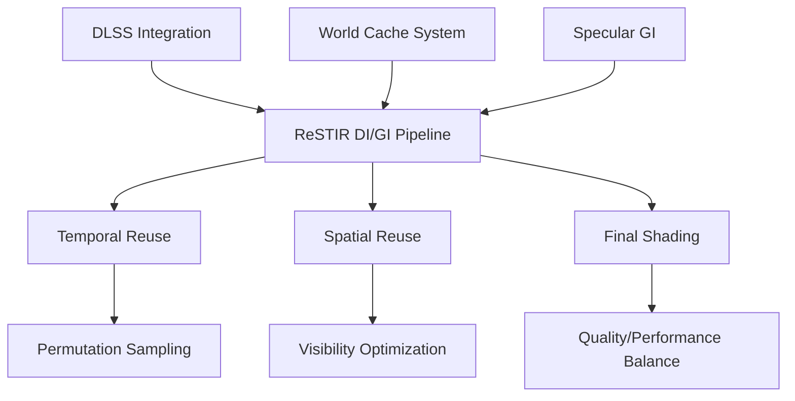

+++
title = "#21649 Various Solari improvements"
date = "2025-11-02T00:00:00"
draft = false
template = "pull_request_page.html"
in_search_index = true

[taxonomies]
list_display = ["show"]

[extra]
current_language = "en"
available_languages = {"en" = { name = "English", url = "/pull_request/bevy/2025-11/pr-21649-en-20251102" }, "zh-cn" = { name = "中文", url = "/pull_request/bevy/2025-11/pr-21649-zh-cn-20251102" }}
labels = ["C-Bug", "A-Rendering", "C-Refinement"]
+++

# Title
Various Solari improvements

## Basic Information
- **Title**: Various Solari improvements
- **PR Link**: https://github.com/bevyengine/bevy/pull/21649
- **Author**: JMS55
- **Status**: MERGED
- **Labels**: C-Bug, A-Rendering, S-Ready-For-Final-Review, C-Refinement
- **Created**: 2025-10-25T00:59:44Z
- **Merged**: 2025-11-02T17:59:48Z
- **Merged By**: alice-i-cecile

## Description Translation
* Fix compile error when compiling with DLSS enabled after https://github.com/bevyengine/bevy/pull/21205
* Use permutation sampling for ReSTIR DI temporal reuse to fix artifacts under DLSS-RR
  * For both DI and GI, removed the spatial raytrace, and moved it to the final reservoir before shading.
* Reduced DI initial samples 32 -> 8 for better performance at the cost of quality
* Various specular GI improvements and bugfixes (still kinda terrible overall, I need to do some research on how people usually do this kind of thing)
* Made the world cache adapt faster / be less stable
* Switched spatial hashing collisions from to linear probing

## The Story of This Pull Request

This PR addresses several technical challenges in Bevy's Solari real-time global illumination system, focusing on fixing bugs, improving performance, and reducing visual artifacts. The changes span multiple components of the rendering pipeline with a common theme: making the GI system more robust and efficient.

The work began with a straightforward bug fix for DLSS compilation errors. After PR #21205, the DLSS integration was broken due to incorrect bind group layout handling. The fix was simple but critical - properly retrieving the bind group layout from the pipeline cache:

```rust
// Before:
&self.bind_group_layout_resolve_dlss_rr_textures,

// After:
&pipeline_cache.get_bind_group_layout(&self.bind_group_layout_resolve_dlss_rr_textures),
```

The core improvements focus on the ReSTIR (Reservoir-based Spatio-Temporal Importance Resampling) implementation. The most significant change was adopting permutation sampling for temporal reuse in both Direct Illumination (DI) and Global Illumination (GI). Under DLSS-RR, traditional temporal sampling could produce artifacts due to the relationship between sample positions and DLSS's reconstruction. Permutation sampling breaks this correlation by deterministically shuffling pixel coordinates each frame:

```wgsl
fn permute_pixel(pixel_id: vec2<u32>, frame_index: u32, view_size: vec2<f32>) -> vec2<u32> {
    let r = frame_index;
    let offset = vec2(r & 3u, (r >> 2u) & 3u);
    var shifted_pixel_id = pixel_id + offset;
    shifted_pixel_id ^= vec2(3u);
    shifted_pixel_id -= offset;
    return min(shifted_pixel_id, vec2<u32>(view_size - 1.0));
}
```

This approach significantly reduced temporal artifacts while maintaining the benefits of reuse across frames.

Another key optimization was restructuring when visibility testing occurs. Previously, spatial reuse involved tracing rays for each neighbor sample during the gathering phase. This was moved to the final shading stage, where only the selected sample needs visibility testing:

```wgsl
// In restir_di.wgsl - visibility test moved to final reservoir
if reservoir_valid(combined_reservoir) {
    let resolved_light_sample = resolve_light_sample(combined_reservoir.sample, light_sources[combined_reservoir.sample.light_id >> 16u]);
    combined_reservoir.unbiased_contribution_weight *= trace_light_visibility(surface.world_position, resolved_light_sample.world_position);
}
```

This change reduced the number of ray traces from potentially dozens per pixel to exactly one, providing substantial performance gains.

For performance tuning, the DI initial samples were reduced from 32 to 8. This trade-off sacrifices some quality for better performance, as fewer initial light samples are evaluated. The change reflects practical engineering considerations for real-time rendering where performance targets must be met.

The world cache system received multiple improvements to make it more responsive. The temporal accumulation window was halved from 20 to 10 frames, and cell lifetime was drastically reduced from 30 to 4 frames. This makes the cache adapt faster to scene changes but potentially increases noise. The collision resolution strategy was also changed from hash-based probing to linear probing, which can provide better cache locality.

For specular GI, several adjustments were made. The roughness threshold for using ReSTIR GI reservoirs was increased from 0.04 to 0.1, meaning more surfaces will benefit from the optimized path. The glossy path tracing was restructured to accumulate world cache contributions at each bounce rather than only at termination:

```wgsl
// Add world cache contribution at each bounce
let diffuse_brdf = ray_hit.material.base_color / PI;
radiance += throughput * diffuse_brdf * query_world_cache(ray_hit.world_position, ray_hit.geometric_world_normal, view.world_position, rng);
```

The author notes that specular GI remains challenging and acknowledges the need for further research into established techniques in this area.

A subtle but important improvement was adding position jittering to world cache queries, implementing a technique referenced from external research. This reduces artifacts by sampling slightly offset positions in the tangent plane:

```wgsl
// Jitter world position in tangent plane to reduce artifacts
let TBN = orthonormalize(world_normal);
let offset = (rand_vec2f(rng) * 2.0 - 1.0) * cell_size * 0.5;
let jittered_position = world_position + offset.x * TBN[0] + offset.y * TBN[1];
```

The changes demonstrate a systematic approach to real-time rendering optimization: identify performance bottlenecks, reduce redundant computations, implement proven sampling techniques, and make deliberate quality/performance trade-offs where appropriate. The improvements work together to create a more robust and efficient global illumination system while maintaining visual quality.

## Visual Representation



## Key Files Changed

### `crates/bevy_solari/src/realtime/restir_di.wgsl` (+10/-12)
**Purpose**: Optimize Direct Illumination ReSTIR implementation
- Reduced initial samples from 32 to 8 for performance
- Moved visibility testing to final reservoir
- Added permutation sampling for temporal reuse

```wgsl
// Key change: Reduced initial samples
const INITIAL_SAMPLES = 8u;  // Was 32u

// Key change: Visibility testing moved to final stage
if reservoir_valid(combined_reservoir) {
    let resolved_light_sample = resolve_light_sample(combined_reservoir.sample, light_sources[combined_reservoir.sample.light_id >> 16u]);
    combined_reservoir.unbiased_contribution_weight *= trace_light_visibility(surface.world_position, resolved_light_sample.world_position);
}
```

### `crates/bevy_solari/src/realtime/restir_gi.wgsl` (+24/-56)
**Purpose**: Optimize Global Illumination ReSTIR implementation
- Simplified temporal reservoir loading using permutation sampling
- Moved visibility testing to final reservoir
- Cleaned up merge logic and removed redundant permutation function

```wgsl
// Key change: Simplified temporal loading with permutation
let temporal_pixel_id = permute_pixel(vec2<u32>(temporal_pixel_id_float), constants.frame_index, view.viewport.zw);

// Key change: Final visibility test
combined_reservoir.radiance *= trace_point_visibility(surface.world_position, combined_reservoir.sample_point_world_position);
```

### `crates/bevy_solari/src/realtime/world_cache_query.wgsl` (+16/-7)
**Purpose**: Improve world cache responsiveness and reduce artifacts
- Reduced temporal accumulation and cell lifetime for faster adaptation
- Added position jittering to reduce artifacts
- Changed collision resolution to linear probing

```wgsl
// Key changes: Faster adaptation
const WORLD_CACHE_MAX_TEMPORAL_SAMPLES: f32 = 10.0;  // Was 20.0
const WORLD_CACHE_CELL_LIFETIME: u32 = 4u;           // Was 30u

// Key change: Position jittering
let TBN = orthonormalize(world_normal);
let offset = (rand_vec2f(rng) * 2.0 - 1.0) * cell_size * 0.5;
let jittered_position = world_position + offset.x * TBN[0] + offset.y * TBN[1];

// Key change: Linear probing for collisions
key += 1u;  // Was: key = wrap_key(pcg_hash(key));
```

### `crates/bevy_solari/src/realtime/specular_gi.wgsl` (+13/-7)
**Purpose**: Improve specular global illumination quality
- Increased roughness threshold for ReSTIR GI reuse
- Restructured path tracing to accumulate world cache contributions
- Fixed cosine term calculation

```wgsl
// Key change: Higher roughness threshold
if surface.material.roughness > 0.1 {  // Was 0.04

// Key change: Accumulate world cache at each bounce
radiance += throughput * diffuse_brdf * query_world_cache(ray_hit.world_position, ray_hit.geometric_world_normal, view.world_position, rng);

// Key change: Fixed cosine term
let cos_theta = saturate(dot(wi, N));  // Was: dot(wi, N)
```

### `crates/bevy_solari/src/realtime/gbuffer_utils.wgsl` (+9/-0)
**Purpose**: Add permutation sampling utility function
- Centralized permutation sampling logic for reuse across DI and GI

```wgsl
// New utility function for permutation sampling
fn permute_pixel(pixel_id: vec2<u32>, frame_index: u32, view_size: vec2<f32>) -> vec2<u32> {
    let r = frame_index;
    let offset = vec2(r & 3u, (r >> 2u) & 3u);
    var shifted_pixel_id = pixel_id + offset;
    shifted_pixel_id ^= vec2(3u);
    shifted_pixel_id -= offset;
    return min(shifted_pixel_id, vec2<u32>(view_size - 1.0));
}
```

## Further Reading

- [ReSTIR Paper](https://research.nvidia.com/publication/2020-07_restir-reservoir-based-spatio-temporal-importance-resampling) - Original research on reservoir-based spatio-temporal importance resampling
- [Real-time Global Illumination](https://tomclabault.github.io/blog/2025/regir) - Blog post referenced for world cache jittering technique
- [DLSS Documentation](https://developer.nvidia.com/dlss) - NVIDIA DLSS technology overview
- [Importance Sampling Techniques](https://www.pbr-book.org/3ed-2018/Monte_Carlo_Integration/Importance_Sampling) - Theoretical background on sampling methods used in ReSTIR