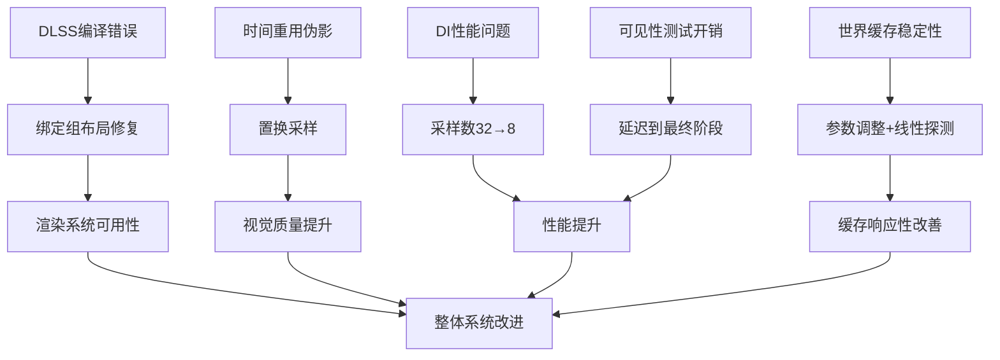

+++
title = "#21649 Various Solari improvements"
date = "2025-11-02T00:00:00"
draft = false
template = "pull_request_page.html"
in_search_index = false

[extra]
current_language = "zh-cn"
available_languages = {"en" = { name = "English", url = "/pull_request/bevy/2025-11/pr-21649-en-20251102" }, "zh-cn" = { name = "中文", url = "/pull_request/bevy/2025-11/pr-21649-zh-cn-20251102" }}
+++

# Various Solari improvements

## 基本信息
- **标题**: Various Solari improvements
- **PR链接**: https://github.com/bevyengine/bevy/pull/21649
- **作者**: JMS55
- **状态**: 已合并
- **标签**: C-Bug, A-Rendering, S-Ready-For-Final-Review, C-Refinement
- **创建时间**: 2025-10-25T00:59:44Z
- **合并时间**: 2025-11-02T17:59:48Z
- **合并者**: alice-i-cecile

## 描述翻译
* 修复了在 https://github.com/bevyengine/bevy/pull/21205 之后启用DLSS编译时的编译错误
* 对ReSTIR DI时间重用使用置换采样(permutation sampling)来修复DLSS-RR下的伪影(artifacts)
  * 对于DI和GI，移除了空间光线追踪(spatial raytrace)，并将其移至着色前的最终储备(final reservoir)
* 将DI初始样本从32减少到8，以性能为代价提高质量
* 各种镜面GI改进和错误修复（总体上仍然不太好，我需要研究一下人们通常是如何做这类事情的）
* 使世界缓存(world cache)适应更快/更不稳定
* 将空间哈希碰撞从切换到线性探测(linear probing)

## 这个Pull Request的故事

这个PR主要解决了Bevy引擎中Solari光照系统的几个关键问题，从编译错误修复到渲染算法优化，涵盖了多个技术层面的改进。

### 问题识别与背景

问题始于一个编译错误：在之前的PR #21205之后，当启用DLSS时会出现编译失败。这是一个直接影响开发工作流的问题，需要立即解决。同时，在DLSS-RR（光线重建）模式下，ReSTIR DI的时间重用会出现明显的渲染伪影，这影响了渲染质量。

性能方面，直接光照(DI)的初始采样数量为32，这在实时渲染中成本较高。作者需要权衡性能与质量，决定降低采样数以提升性能。镜面全局光照(specular GI)的实现也存在问题，作者承认"仍然不太好"，表明这是一个需要持续改进的领域。

### 解决方案架构

作者采用了多管齐下的方法来解决这些问题。对于编译错误，修复相对直接，主要是正确获取绑定组布局。对于渲染伪影，核心解决方案是引入置换采样(permutation sampling)来打破时间重用中的固定模式。

在性能优化方面，作者将DI初始采样从32减少到8，这是一个明确的性能与质量的权衡决策。更重要的是，重新组织了可见性测试的时机——将空间光线追踪从中间阶段移除，推迟到最终储备阶段执行，这样既减少了计算量，又保持了正确的光照计算。

### 具体实现细节

在`restir_di.wgsl`中，关键的改变包括：
```wgsl
// 采样数量减少
const INITIAL_SAMPLES = 8u;  // 从32减少

// 可见性测试移至最终阶段
if reservoir_valid(combined_reservoir) {
    let resolved_light_sample = resolve_light_sample(combined_reservoir.sample, light_sources[combined_reservoir.sample.light_id >> 16u]);
    combined_reservoir.unbiased_contribution_weight *= trace_light_visibility(surface.world_position, resolved_light_sample.world_position);
}
```

置换采样的实现在`gbuffer_utils.wgsl`中新增：
```wgsl
fn permute_pixel(pixel_id: vec2<u32>, frame_index: u32, view_size: vec2<f32>) -> vec2<u32> {
    let r = frame_index;
    let offset = vec2(r & 3u, (r >> 2u) & 3u);
    var shifted_pixel_id = pixel_id + offset;
    shifted_pixel_id ^= vec2(3u);
    shifted_pixel_id -= offset;
    return min(shifted_pixel_id, vec2<u32>(view_size - 1.0));
}
```

这个函数通过帧索引来偏移像素坐标，然后进行异或操作，最后再减回偏移，有效地打乱了采样模式，避免了固定的时间重用模式导致的伪影。

在世界缓存方面，`world_cache_query.wgsl`中的改进包括：
- 将最大时间样本从20减少到10，使缓存响应更快
- 将细胞生命周期从30帧减少到4帧，加速缓存更新
- 引入位置抖动来减少带状伪影
- 将哈希碰撞处理从复杂的哈希函数改为简单的线性探测

```wgsl
// 位置抖动实现
let TBN = orthonormalize(world_normal);
let offset = (rand_vec2f(rng) * 2.0 - 1.0) * cell_size * 0.5;
let jittered_position = world_position + offset.x * TBN[0] + offset.y * TBN[1];

// 线性探测替代复杂哈希
key += 1u;  // 替代原来的 wrap_key(pcg_hash(key))
```

### 技术洞察与权衡

这个PR展示了几个重要的实时渲染技术原则：

1. **采样策略优化**：置换采样是处理时间性伪影的有效方法，通过打破固定的采样模式来分散误差。

2. **计算延迟**：将昂贵的可见性测试从中间阶段推迟到最终阶段，只有在确实需要时才执行，这是典型的延迟计算优化模式。

3. **缓存行为调整**：通过减少缓存参数（最大时间样本和细胞生命周期），使系统对场景变化更敏感，但代价是可能增加噪声。

4. **碰撞解决简化**：从复杂的哈希函数切换到线性探测，虽然理论上可能性能稍差，但实现更简单，在实际使用中往往足够好。

镜面GI的改进包括调整粗糙度阈值从0.04到0.1，这意味着更多表面会使用ReSTIR GI储备而不是路径追踪，这是另一个性能与质量的权衡。

### 影响评估

这些改进共同作用，显著提升了Solari光照系统的实用性和性能。编译错误的修复确保了系统的可用性，置换采样解决了DLSS-RR下的视觉伪影，采样数量减少直接提升了性能，而世界缓存的改进使得全局光照能更快地适应场景变化。

特别值得注意的是，作者对镜面GI的状态有清醒的认识——承认当前实现"仍然不太好"，这表明这是一个持续优化的领域，为未来的改进留下了空间。

## 可视化表示



## 关键文件更改

### `crates/bevy_solari/src/realtime/restir_gi.wgsl` (+24/-56)
**主要变化**: 重构了时间重用和空间重用逻辑，移除了复杂的像素置换循环，简化了储备合并。

```wgsl
// 之前: 复杂的4次尝试循环
for (var i = 0u; i < 4u; i++) {
    let temporal_pixel_id = permute_pixel(temporal_pixel_id_base, i);
    // ... 复杂的检查逻辑
}

// 之后: 直接使用置换后的像素ID
let temporal_pixel_id = permute_pixel(vec2<u32>(temporal_pixel_id_float), constants.frame_index, view.viewport.zw);
// 简化的单次检查
```

### `crates/bevy_solari/src/realtime/world_cache_query.wgsl` (+16/-7)
**主要变化**: 世界缓存参数优化和碰撞解决改进。

```wgsl
// 缓存参数调整
const WORLD_CACHE_MAX_TEMPORAL_SAMPLES: f32 = 10.0;  // 从20减少
const WORLD_CACHE_CELL_LIFETIME: u32 = 4u;          // 从30减少

// 位置抖动引入
let jittered_position = world_position + offset.x * TBN[0] + offset.y * TBN[1];

// 碰撞解决简化
key += 1u;  // 替代复杂的哈希计算
```

### `crates/bevy_solari/src/realtime/restir_di.wgsl` (+10/-12)
**主要变化**: 采样数减少和可见性测试时机调整。

```wgsl
// 采样数减少
const INITIAL_SAMPLES = 8u;  // 从32减少

// 可见性测试移至最终阶段
if reservoir_valid(combined_reservoir) {
    let resolved_light_sample = resolve_light_sample(combined_reservoir.sample, light_sources[combined_reservoir.sample.light_id >> 16u]);
    combined_reservoir.unbiased_contribution_weight *= trace_light_visibility(surface.world_position, resolved_light_sample.world_position);
}
```

### `crates/bevy_solari/src/realtime/specular_gi.wgsl` (+13/-7)
**主要变化**: 镜面GI路径追踪改进和粗糙度阈值调整。

```wgsl
// 粗糙度阈值调整
if surface.material.roughness > 0.1 {  // 从0.04调整
    // 使用ReSTIR GI储备
} else {
    // 使用路径追踪
}

// 路径追踪改进 - 累积世界缓存贡献
radiance += throughput * diffuse_brdf * query_world_cache(ray_hit.world_position, ray_hit.geometric_world_normal, view.world_position, rng);
```

### `crates/bevy_solari/src/realtime/gbuffer_utils.wgsl` (+9/-0)
**主要变化**: 新增置换采样工具函数。

```wgsl
fn permute_pixel(pixel_id: vec2<u32>, frame_index: u32, view_size: vec2<f32>) -> vec2<u32> {
    let r = frame_index;
    let offset = vec2(r & 3u, (r >> 2u) & 3u);
    var shifted_pixel_id = pixel_id + offset;
    shifted_pixel_id ^= vec2(3u);
    shifted_pixel_id -= offset;
    return min(shifted_pixel_id, vec2<u32>(view_size - 1.0));
}
```

## 进一步阅读

- [ReSTIR论文](https://research.nvidia.com/publication/2020-07_restir-path-resampling-real-time-path-tracing) - 了解ReSTIR算法的基本原理
- [实时全局光照技术](https://advances.realtimerendering.com/s2021/index.html) - 现代实时GI技术概述
- [置换采样在时间抗锯齿中的应用](https://de45xmedrsdbp.cloudfront.net/Resources/files/TemporalAA_small-59732822.pdf) - 类似技术在TAA中的应用
- [空间哈希与线性探测](https://en.wikipedia.org/wiki/Linear_probing) - 哈希表冲突解决策略比较