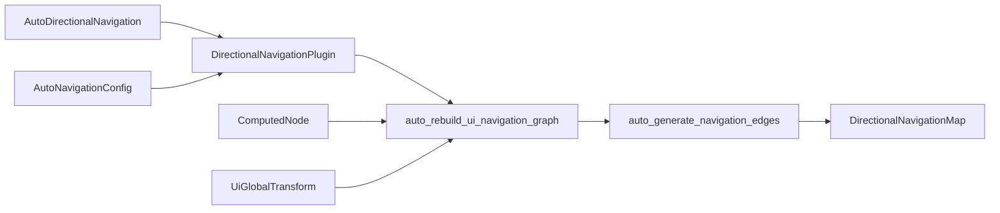

+++
title = "#21668 Add Automatic Directional Navigation Graph Generation"
date = "2025-11-12T00:00:00"
draft = false
template = "pull_request_page.html"
in_search_index = true

[taxonomies]
list_display = ["show"]

[extra]
current_language = "en"
available_languages = {"en" = { name = "English", url = "/pull_request/bevy/2025-11/pr-21668-en-20251112" }, "zh-cn" = { name = "中文", url = "/pull_request/bevy/2025-11/pr-21668-zh-cn-20251112" }}
labels = ["C-Feature", "A-UI", "M-Release-Note"]
+++

# Title
Add Automatic Directional Navigation Graph Generation

## Basic Information
- **Title**: Add Automatic Directional Navigation Graph Generation
- **PR Link**: https://github.com/bevyengine/bevy/pull/21668
- **Author**: jbuehler23
- **Status**: MERGED
- **Labels**: C-Feature, A-UI, S-Ready-For-Final-Review, M-Release-Note
- **Created**: 2025-10-27T14:31:53Z
- **Merged**: 2025-11-10T04:17:05Z
- **Merged By**: alice-i-cecile

## Description Translation
**Objective**

Resolves #21661

Adds automatic directional navigation graph generation based on UI node positions and sizes, eliminating the need for tedious manual graph construction in dynamic UIs.

**Solution**

Implements a spatial navigation algorithm that automatically computes the nearest neighbor in each compass direction for UI elements, while respecting any manually-defined edges.

**Features**

- **Automatic edge generation**: Finds the best neighbor in each of 8 compass directions based on distance, alignment, and overlap
- **Manual override support**: Manual edges always take precedence over auto-generated ones
- **Configurable**: `AutoNavigationConfig` resource allows tuning alignment requirements, distance limits, and preference weighting
- **Opt-in**: Entities must have `AutoDirectionalNavigation` component added to use, and therefore **not** a breaking change
- **Generic**: Core algorithm works with any `Vec2` position/size data, not just `bevy_ui`

**Implementation**

**New Components & Resources** (`bevy_input_focus/src/directional_navigation.rs`):
- `AutoDirectionalNavigation` - Marker component to enable auto-navigation
- `AutoNavigationConfig` - Configuration resource with settings:
  - `min_alignment_factor`: Minimum perpendicular overlap (0.0-1.0) required for cardinal directions
  - `max_search_distance`: Optional distance limit for connections
  - `prefer_aligned`: Whether to strongly prefer well-aligned nodes

**Core Algorithm**:
```rust
pub fn auto_generate_navigation_edges(
    nav_map: &mut DirectionalNavigationMap,
    nodes: &[(Entity, Vec2, Vec2)],  // (entity, center_pos, size)
    config: &AutoNavigationConfig,
)
```

For each node and each direction:
1. Filter candidates that are actually in that direction (cone-based check)
2. Calculate overlap factor for cardinal directions (horizontal overlap for N/S, vertical for E/W)
3. Score candidates based on:
   - Distance (closer is better)
   - Alignment with direction vector (more aligned is better)
   - Overlap factor (must meet minimum threshold)
4. Select the best-scoring candidate as the neighbor

**Scoring Formula**:
```
score = distance + alignment_penalty
where alignment_penalty = (1.0 - alignment) * distance * 2.0
```

This makes misaligned nodes significantly less attractive while still considering distance.

**Usage**

**Before (manual)**:
```rust
// Must manually specify all connections
for row in 0..N_ROWS {
    let entities_in_row: Vec<Entity> = (0..N_COLS)
        .map(|col| button_entities.get(&(row, col)).unwrap())
        .copied()
        .collect();
    directional_nav_map.add_looping_edges(&entities_in_row, CompassOctant::East);
}

// Repeat for columns...
for col in 0..N_COLS {
    let entities_in_column: Vec<Entity> = (0..N_ROWS)
        .map(|row| button_entities.get(&(row, col)).unwrap())
        .copied()
        .collect();
    directional_nav_map.add_edges(&entities_in_column, CompassOctant::South);
}
```

**After**:
```rust
// Just add the `AutoDirectionalNavigation` component!
commands.spawn((
    Button,
    Node { /* ... */ },
    AutoDirectionalNavigation::default(),
    // ... other components
));
```

**Testing**
- Added new example: `auto_directional_navigation`
- Ran existing `directional_navigation`

**Showcase**

**New Example: `auto_directional_navigation`**

Demonstrates automatic navigation with irregularly-positioned buttons. Unlike a regular grid, these buttons are scattered, but auto-navigation figures out the correct connections - also shows currently focused button, and the last "input" pressed to show the logical flow of navigating:

```bash
cargo run --example auto_directional_navigation
```

https://github.com/user-attachments/assets/8dce1d8d-53b5-41b8-bc9a-7e32067f7978

**Key differences from manual `directional_navigation` example**:
- No manual `add_edges()` or `add_looping_edges()` calls
- Buttons positioned irregularly (not in a perfect grid)
- Works with absolute positioning and dynamic layouts

**Migration Guide**

No breaking changes - this is a purely additive feature.

To adopt automatic navigation:
1. Add `AutoDirectionalNavigation` component to focusable entities
2. Optionally configure `AutoNavigationConfig` resource

## The Story of This Pull Request

### The Problem and Context

Before this PR, setting up directional navigation in Bevy UI required manually constructing a navigation graph using `DirectionalNavigationMap`. Developers had to explicitly define every connection between UI elements using methods like `add_edge()` and `add_looping_edges()`. This approach was tedious, error-prone, and didn't adapt well to dynamic UIs where elements could be added, removed, or repositioned.

The manual approach was particularly problematic for:
- Complex layouts with many elements
- Dynamic UIs that change at runtime
- Irregular or non-grid layouts
- Rapid prototyping where navigation setup became a bottleneck

### The Solution Approach

The developer chose to implement a spatial navigation algorithm that automatically computes the nearest neighbor in each compass direction based on UI element positions and sizes. This approach leverages the existing `DirectionalNavigationMap` infrastructure while adding automatic graph generation as an opt-in feature.

Key design decisions:
1. **Opt-in approach**: Use a marker component (`AutoDirectionalNavigation`) rather than making automatic navigation the default
2. **Manual override priority**: Preserve existing manual edges and allow them to override automatic connections
3. **Generic algorithm**: Design the core algorithm to work with any position/size data, not just Bevy UI
4. **Configurable behavior**: Provide a resource (`AutoNavigationConfig`) to tune the algorithm for different UI layouts

### The Implementation

The implementation centers around a new spatial navigation algorithm in `directional_navigation.rs`. The core function `auto_generate_navigation_edges()` takes a collection of focusable areas and populates the navigation map with connections to the nearest neighbor in each of the 8 compass directions.

The algorithm works by:
1. **Direction filtering**: Using cone-based checks to ensure candidates are actually in the target direction
2. **Overlap calculation**: For cardinal directions, requiring minimum perpendicular overlap between elements
3. **Candidate scoring**: Combining distance and alignment factors to find the best neighbor

```rust
fn score_candidate(
    origin_pos: Vec2,
    origin_size: Vec2,
    candidate_pos: Vec2,
    candidate_size: Vec2,
    octant: CompassOctant,
    config: &AutoNavigationConfig,
) -> f32 {
    // Get direction in mathematical coordinates, then flip Y for UI coordinates
    let dir = Dir2::from(octant).as_vec2() * Vec2::new(1.0, -1.0);
    let to_candidate = candidate_pos - origin_pos;
    let distance = to_candidate.length();
    
    // ... direction validation, overlap checks, and scoring logic
}
```

The scoring formula balances distance and alignment:
- **Distance**: Straight-line distance between element centers (closer is better)
- **Alignment penalty**: Penalty for misaligned nodes, scaled by distance to make misalignment more significant for farther elements

The system integrates with Bevy's ECS through:
- A new built-in system `auto_rebuild_ui_navigation_graph` that automatically updates the navigation graph when UI elements change
- Query filters that detect when nodes with `AutoDirectionalNavigation` are added, moved, or resized
- Integration with the existing `DirectionalNavigationPlugin`

### Technical Insights

**Coordinate System Handling**: The implementation carefully handles the difference between mathematical coordinates (Y+ = up) and UI coordinates (Y+ = down) by flipping the Y-axis when necessary. This ensures the navigation directions work correctly with Bevy's UI system.

**Performance Considerations**: The algorithm has O(n²) complexity in the worst case, but this is acceptable for typical UI scenarios where the number of focusable elements is limited. The system only runs when relevant components change, minimizing unnecessary computation.

**Extensibility**: The `FocusableArea` struct and `auto_generate_navigation_edges()` function are designed to work with any UI system that can provide position and size information, not just Bevy UI. This makes the algorithm reusable for custom UI implementations.

**Configuration Flexibility**: The `AutoNavigationConfig` resource provides three key tuning parameters:
- `min_alignment_factor`: Controls how strictly elements must align for cardinal direction navigation
- `max_search_distance`: Prevents navigation between distant elements
- `prefer_aligned`: Toggles whether well-aligned nodes are strongly preferred

### The Impact

This PR significantly improves the developer experience for implementing directional navigation in Bevy UI applications:

**Before**:
```rust
// Complex manual setup for a simple grid
for row in 0..N_ROWS {
    let entities_in_row: Vec<Entity> = (0..N_COLS)
        .map(|col| button_entities.get(&(row, col)).unwrap())
        .copied()
        .collect();
    directional_nav_map.add_looping_edges(&entities_in_row, CompassOctant::East);
}
```

**After**:
```rust
// Simple component addition
commands.spawn((
    Button,
    Node { /* ... */ },
    AutoDirectionalNavigation::default(),
));
```

The automatic system handles dynamic UI changes seamlessly - when elements are added, removed, or repositioned, the navigation graph automatically updates. This makes it ideal for games with complex, state-dependent UIs.

The implementation is non-breaking and coexists perfectly with existing manual navigation setups, allowing gradual adoption and hybrid approaches where automatic navigation handles most cases while manual edges provide specific overrides.

## Visual Representation



## Key Files Changed

### `crates/bevy_input_focus/src/directional_navigation.rs` (+744/-3)

This is the core implementation file containing the automatic navigation algorithm, components, and systems.

**Key additions:**
- `AutoDirectionalNavigation` component for opting into automatic navigation
- `AutoNavigationConfig` resource for algorithm configuration
- `FocusableArea` struct representing UI elements with position/size data
- `auto_generate_navigation_edges()` function implementing the core algorithm
- `auto_rebuild_ui_navigation_graph` system for automatic graph maintenance

```rust
// Core algorithm function
pub fn auto_generate_navigation_edges(
    nav_map: &mut DirectionalNavigationMap,
    nodes: &[FocusableArea],
    config: &AutoNavigationConfig,
) {
    for origin in nodes {
        for octant in CompassOctant::all() {
            // Skip if manual edge exists
            if nav_map.get_neighbors(origin.entity)
                .and_then(|neighbors| neighbors.get(octant))
                .is_some() {
                continue;
            }
            
            // Find best candidate in this direction
            let mut best_candidate = None;
            let mut best_score = f32::INFINITY;
            
            for candidate in nodes {
                if candidate.entity == origin.entity { continue; }
                
                let score = score_candidate(
                    origin.position, origin.size,
                    candidate.position, candidate.size,
                    octant, config,
                );
                
                if score < best_score {
                    best_score = score;
                    best_candidate = Some(candidate.entity);
                }
            }
            
            if let Some(neighbor) = best_candidate {
                nav_map.add_edge(origin.entity, neighbor, octant);
            }
        }
    }
}
```

### `examples/ui/auto_directional_navigation.rs` (+463/-0)

New example demonstrating automatic navigation with irregularly positioned buttons.

**Key features:**
- Shows scattered button layout that would be difficult to wire manually
- Demonstrates automatic navigation without any manual edge definitions
- Includes visual feedback for focused element and navigation input

```rust
// Key usage example - just add the component
commands.spawn((
    Button,
    Node { /* ... */ },
    AutoDirectionalNavigation::default(), // That's it!
    // ... other components
));
```

### `crates/bevy_math/src/compass.rs` (+70/-2)

Added direction validation methods to compass types.

**Key additions:**
- `is_in_direction()` methods for `CompassQuadrant` and `CompassOctant`
- Cone-based direction checking using dot products

```rust
pub fn is_in_direction(self, origin: Vec2, candidate: Vec2) -> bool {
    let dir = Dir2::from(self);
    let to_candidate = candidate - origin;
    to_candidate.dot(*dir) > 0.0
}
```

### `release-content/release-notes/automatic_directional_navigation.md` (+91/-0)

Comprehensive release notes documenting the new feature, usage examples, and migration guide.

### `Cargo.toml` (+11/-0)

Added the new example to the workspace and updated dependencies for the input focus crate.

## Further Reading

- [Bevy UI Documentation](https://bevyengine.org/learn/books/introduction/bevy-ui/) - Learn about Bevy's UI system
- [Spatial Navigation Specification](https://drafts.csswg.org/css-nav-1/) - W3C specification for spatial navigation
- [Gamepad Navigation Patterns](https://developer.mozilla.org/en-US/docs/Web/API/Gamepad) - Understanding gamepad input handling
- [Entity Component System Pattern](https://bevyengine.org/learn/books/introduction/ecs/) - Bevy's ECS architecture