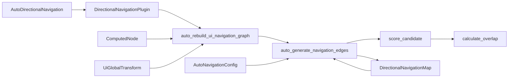

+++
title = "#21668 Add Automatic Directional Navigation Graph Generation"
date = "2025-11-12T00:00:00"
draft = false
template = "pull_request_page.html"
in_search_index = false

[extra]
current_language = "zh-cn"
available_languages = {"en" = { name = "English", url = "/pull_request/bevy/2025-11/pr-21668-en-20251112" }, "zh-cn" = { name = "中文", url = "/pull_request/bevy/2025-11/pr-21668-zh-cn-20251112" }}
+++

# 添加自动方向导航图生成

## 基本信息
- **标题**: Add Automatic Directional Navigation Graph Generation
- **PR 链接**: https://github.com/bevyengine/bevy/pull/21668
- **作者**: jbuehler23
- **状态**: 已合并
- **标签**: C-Feature, A-UI, S-Ready-For-Final-Review, M-Release-Note
- **创建时间**: 2025-10-27T14:31:53Z
- **合并时间**: 2025-11-10T04:17:05Z
- **合并者**: alice-i-cecile

## 描述翻译

### 目标

解决 #21661

基于 UI 节点位置和大小添加自动方向导航图生成，消除了在动态 UI 中繁琐的手动图构建需求。

### 解决方案

实现空间导航算法，自动计算 UI 元素在每个罗盘方向上的最近邻居，同时尊重任何手动定义的边。

### 特性

- **自动边生成**: 基于距离、对齐和重叠，在8个罗盘方向中找到最佳邻居
- **手动覆盖支持**: 手动边始终优先于自动生成的边
- **可配置**: `AutoNavigationConfig` 资源允许调整对齐要求、距离限制和偏好权重
- **可选启用**: 实体必须添加 `AutoDirectionalNavigation` 组件才能使用，因此**不是**破坏性变更
- **通用性**: 核心算法适用于任何 `Vec2` 位置/大小数据，而不仅仅是 `bevy_ui`

### 实现

**新组件和资源** (`bevy_input_focus/src/directional_navigation.rs`):
- `AutoDirectionalNavigation` - 启用自动导航的标记组件
- `AutoNavigationConfig` - 配置资源，包含设置:
  - `min_alignment_factor`: 基本方向所需的最小垂直重叠 (0.0-1.0)
  - `max_search_distance`: 连接的可选距离限制
  - `prefer_aligned`: 是否强烈偏好良好对齐的节点

**核心算法**:
```rust
pub fn auto_generate_navigation_edges(
    nav_map: &mut DirectionalNavigationMap,
    nodes: &[(Entity, Vec2, Vec2)],  // (entity, center_pos, size)
    config: &AutoNavigationConfig,
)
```

对于每个节点和每个方向:
1. 过滤实际在该方向上的候选节点（基于锥形检查）
2. 计算基本方向的重叠因子（北/南为水平重叠，东/西为垂直重叠）
3. 基于以下因素对候选节点评分:
   - 距离（越近越好）
   - 与方向向量的对齐（越对齐越好）
   - 重叠因子（必须满足最小阈值）
4. 选择得分最高的候选节点作为邻居

**评分公式**:
```
score = distance + alignment_penalty
其中 alignment_penalty = (1.0 - alignment) * distance * 2.0
```

这使得未对齐的节点明显不那么有吸引力，同时仍考虑距离。

### 使用方式

**之前（手动）**:
```rust
// 必须手动指定所有连接
for row in 0..N_ROWS {
    let entities_in_row: Vec<Entity> = (0..N_COLS)
        .map(|col| button_entities.get(&(row, col)).unwrap())
        .copied()
        .collect();
    directional_nav_map.add_looping_edges(&entities_in_row, CompassOctant::East);
}

// 对列重复...
for col in 0..N_COLS {
    let entities_in_column: Vec<Entity> = (0..N_ROWS)
        .map(|row| button_entities.get(&(row, col)).unwrap())
        .copied()
        .collect();
    directional_nav_map.add_edges(&entities_in_column, CompassOctant::South);
}
```

**之后**:
```rust
// 只需添加 `AutoDirectionalNavigation` 组件！
commands.spawn((
    Button,
    Node { /* ... */ },
    AutoDirectionalNavigation::default(),
    // ... 其他组件
));
```

### 测试
- 添加了新示例: `auto_directional_navigation`
- 运行了现有的 `directional_navigation`

### 展示

#### 新示例: `auto_directional_navigation`

演示了不规则位置按钮的自动导航。与常规网格不同，这些按钮是分散的，但自动导航能找出正确的连接 - 还显示当前聚焦的按钮和最后的"输入"按键，以显示导航的逻辑流程:

```bash
cargo run --example auto_directional_navigation
```

https://github.com/user-attachments/assets/8dce1d8d-53b5-41b8-bc9a-7e32067f7978

**与手动 `directional_navigation` 示例的主要区别**:
- 没有手动 `add_edges()` 或 `add_looping_edges()` 调用
- 按钮位置不规则（不在完美网格中）
- 适用于绝对定位和动态布局

### 迁移指南

没有破坏性变更 - 这是一个纯粹的添加功能。

要采用自动导航:
1. 向可聚焦实体添加 `AutoDirectionalNavigation` 组件
2. 可选配置 `AutoNavigationConfig` 资源

## 这个 Pull Request 的故事

### 问题和背景

在游戏 UI 开发中，方向导航是一个常见需求，特别是在游戏手柄或键盘控制的界面中。在 PR #21668 之前，Bevy 的 `DirectionalNavigationMap` 需要开发者手动定义所有导航连接。对于动态 UI 或复杂布局，这意味着编写大量样板代码来连接每个按钮、菜单项或其他可聚焦元素。

问题 #21661 强调了这种手动方法的局限性：当 UI 元素动态添加、移除或重新定位时，维护导航图变得繁琐且容易出错。开发人员需要为每个可能的导航方向显式指定邻居，这对于大型或动态 UI 来说是不可扩展的。

### 解决方案方法

作者选择实现一个基于空间位置的自动导航系统，而不是扩展手动 API。这种方法的核心洞察是：大多数 UI 导航遵循直观的空间关系 - 用户期望按下"右"键会移动到右侧的元素，按下"下"键会移动到下方的元素。

技术决策包括：
- **选择加入机制**: 使用 `AutoDirectionalNavigation` 组件，避免破坏性变更
- **手动优先**: 手动定义的边始终覆盖自动生成的边，允许混合方法
- **通用算法**: 核心算法适用于任何提供位置和大小数据的系统，而不仅仅是 `bevy_ui`
- **可配置性**: 通过 `AutoNavigationConfig` 资源暴露关键参数，适应不同 UI 需求

### 实现细节

实现的核心是 `auto_generate_navigation_edges` 函数，它采用系统化的方法来计算导航连接：

```rust
pub fn auto_generate_navigation_edges(
    nav_map: &mut DirectionalNavigationMap,
    nodes: &[FocusableArea],
    config: &AutoNavigationConfig,
) {
    // 对于每个节点，在每个方向找到最佳邻居
    for origin in nodes {
        for octant in CompassOctant::all() {
            // 如果手动边已存在则跳过（检查内联以避免借用问题）
            if nav_map
                .get_neighbors(origin.entity)
                .and_then(|neighbors| neighbors.get(octant))
                .is_some()
            {
                continue; // 尊重手动覆盖
            }

            // 在此方向找到最佳候选
            let mut best_candidate = None;
            let mut best_score = f32::INFINITY;

            for candidate in nodes {
                // 跳过自身
                if candidate.entity == origin.entity {
                    continue;
                }

                // 对候选评分
                let score = score_candidate(
                    origin.position,
                    origin.size,
                    candidate.position,
                    candidate.size,
                    octant,
                    config,
                );

                if score < best_score {
                    best_score = score;
                    best_candidate = Some(candidate.entity);
                }
            }

            // 如果找到有效候选则添加边
            if let Some(neighbor) = best_candidate {
                nav_map.add_edge(origin.entity, neighbor, octant);
            }
        }
    }
}
```

评分算法是系统的关键部分，平衡了距离和对齐：

```rust
fn score_candidate(
    origin_pos: Vec2,
    origin_size: Vec2,
    candidate_pos: Vec2,
    candidate_size: Vec2,
    octant: CompassOctant,
    config: &AutoNavigationConfig,
) -> f32 {
    // ... 方向检查 ...

    // 检查基本方向的重叠
    let overlap_factor = calculate_overlap(/* ... */);
    if overlap_factor < config.min_alignment_factor {
        return f32::INFINITY;
    }

    // 计算对齐分数
    let alignment = if distance > 0.0 {
        to_candidate.normalize().dot(dir).max(0.0)
    } else {
        1.0
    };

    // 结合距离和对齐
    let alignment_penalty = if config.prefer_aligned {
        (1.0 - alignment) * distance * 2.0 // 未对齐随距离缩放
    } else {
        0.0
    };

    distance + alignment_penalty
}
```

系统集成通过 `auto_rebuild_ui_navigation_graph` 系统实现，该系统在 UI 布局后自动运行：

```rust
fn auto_rebuild_ui_navigation_graph(
    mut directional_nav_map: ResMut<DirectionalNavigationMap>,
    config: Res<AutoNavigationConfig>,
    changed_nodes: Query</* ... */>,
    all_nodes: Query</* ... */>,
) {
    if changed_nodes.is_empty() {
        return;
    }

    let nodes: Vec<FocusableArea> = all_nodes
        .iter()
        .filter_map(|(entity, computed, transform, visibility)| {
            // 跳过隐藏或零大小节点
            if computed.is_empty() || matches!(visibility, Some(Visibility::Hidden)) {
                return None;
            }
            // 提取位置和大小信息
            Some(FocusableArea { entity, position: translation, size: computed.size() })
        })
        .collect();

    auto_generate_navigation_edges(&mut directional_nav_map, &nodes, &config);
}
```

### 技术洞察

这个实现展示了几个重要的工程模式：

1. **增量采用策略**: 通过选择加入组件，现有代码无需修改即可继续工作
2. **配置驱动行为**: `AutoNavigationConfig` 允许微调算法，无需修改核心逻辑
3. **关注点分离**: 核心算法 (`auto_generate_navigation_edges`) 与特定 UI 系统 (`auto_rebuild_ui_navigation_graph`) 分离
4. **性能考虑**: 系统只在检测到相关变更时重建导航图

一个值得注意的限制是当前实现对 z-index 不感知，这意味着自动导航可能会在不同 UI 层之间跳转。文档明确指出了这一点，并提供了解决方法的建议。

### 影响

这个 PR 显著改善了 Bevy UI 的开发体验：

- **减少样板代码**: 从手动连接数十个元素到只需添加一个组件
- **更好的可维护性**: 动态 UI 变更自动反映在导航中
- **更直观的导航**: 基于空间位置的行为通常比手动定义的连接更符合用户期望
- **灵活的混合方法**: 开发人员可以在需要时覆盖特定连接

从技术角度来看，这个实现为未来扩展奠定了基础，比如分层导航支持或更复杂的导航算法。

## 视觉表示



## 关键文件变更

### `crates/bevy_input_focus/src/directional_navigation.rs` (+744/-3)

这是主要的实现文件，添加了自动导航的核心功能：

```rust
// 新增：自动导航标记组件
#[derive(Component, Default, Debug, Clone, Copy, PartialEq)]
pub struct AutoDirectionalNavigation {
    pub respect_tab_order: bool,
}

// 新增：配置资源
#[derive(Resource, Debug, Clone, PartialEq)]
pub struct AutoNavigationConfig {
    pub min_alignment_factor: f32,
    pub max_search_distance: Option<f32>,
    pub prefer_aligned: bool,
}

// 新增：核心算法函数
pub fn auto_generate_navigation_edges(
    nav_map: &mut DirectionalNavigationMap,
    nodes: &[FocusableArea],
    config: &AutoNavigationConfig,
) {
    // 实现细节...
}

// 新增：自动重建系统
fn auto_rebuild_ui_navigation_graph(
    mut directional_nav_map: ResMut<DirectionalNavigationMap>,
    config: Res<AutoNavigationConfig>,
    changed_nodes: Query</* ... */>,
    all_nodes: Query</* ... */>,
) {
    // 实现细节...
}
```

### `examples/ui/auto_directional_navigation.rs` (+463/-0)

新增的示例展示了自动导航的使用：

```rust
fn setup_scattered_ui(mut commands: Commands, mut input_focus: ResMut<InputFocus>) {
    // 创建不规则位置的按钮
    let button_positions = [
        (350.0, 100.0), (520.0, 120.0), (700.0, 90.0), // 顶部行
        (380.0, 220.0), (600.0, 240.0), // 中上部
        // ... 更多位置
    ];

    for (i, (x, y)) in button_positions.iter().enumerate() {
        commands.spawn((
            Button,
            Node { /* 位置和大小 */ },
            // 关键：只需添加这个组件即可启用自动导航！
            AutoDirectionalNavigation::default(),
            // ... 其他组件
        ));
    }
}
```

### `crates/bevy_math/src/compass.rs` (+70/-2)

扩展了罗盘方向的功能，添加了方向检查方法：

```rust
impl CompassOctant {
    pub fn is_in_direction(self, origin: Vec2, candidate: Vec2) -> bool {
        let dir = Dir2::from(self);
        let to_candidate = candidate - origin;
        to_candidate.dot(*dir) > 0.0
    }
}

// 同样为 CompassQuadrant 添加了相同方法
```

### `release-content/release-notes/automatic_directional_navigation.md` (+91/-0)

发布说明文档，详细描述了新功能和使用方法。

### `Cargo.toml` (+11/-0)

添加了新示例的配置：

```toml
[[example]]
name = "auto_directional_navigation"
path = "examples/ui/auto_directional_navigation.rs"
doc-scrape-examples = true

[package.metadata.example.auto_directional_navigation]
name = "Automatic Directional Navigation"
description = "Demonstration of automatic directional navigation graph generation based on UI element positions"
category = "UI (User Interface)"
wasm = true
```

## 进一步阅读

- [Bevy UI 系统文档](https://bevyengine.org/learn/books/ui/) - 了解 Bevy UI 的基础知识
- [方向导航示例](https://github.com/bevyengine/bevy/blob/main/examples/ui/directional_navigation.rs) - 手动导航的对比示例
- [空间导航算法](https://www.w3.org/TR/spatial-navigation/) - W3C 关于空间导航的规范
- [游戏 UI 导航模式](https://gameuidatabase.com/) - 游戏 UI 导航的设计模式和最佳实践