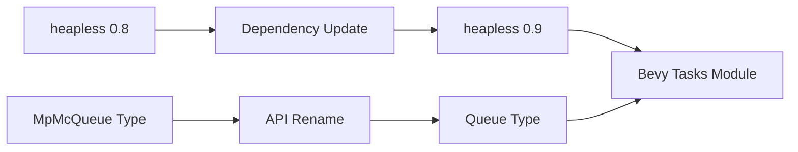

+++
title = "#21670 Update heapless requirement from 0.8 to 0.9"
date = "2025-11-01T00:00:00"
draft = false
template = "pull_request_page.html"
in_search_index = true

[taxonomies]
list_display = ["show"]

[extra]
current_language = "en"
available_languages = {"en" = { name = "English", url = "/pull_request/bevy/2025-11/pr-21670-en-20251101" }, "zh-cn" = { name = "中文", url = "/pull_request/bevy/2025-11/pr-21670-zh-cn-20251101" }}
labels = ["D-Trivial", "C-Dependencies", "A-Tasks"]
+++

# Update heapless requirement from 0.8 to 0.9

## Basic Information
- **Title**: Update heapless requirement from 0.8 to 0.9
- **PR Link**: https://github.com/bevyengine/bevy/pull/21670
- **Author**: mnmaita
- **Status**: MERGED
- **Labels**: D-Trivial, C-Dependencies, S-Ready-For-Final-Review, A-Tasks
- **Created**: 2025-10-27T23:20:00Z
- **Merged**: 2025-11-01T19:22:54Z
- **Merged By**: mockersf

## Description Translation
# Objective

- Closes #21610 

## Solution

- Updated code to account for breaking changes in `heapless` 0.9.

## Testing

- cargo check + tests

## The Story of This Pull Request

This PR addresses a routine but important dependency maintenance task - updating the `heapless` crate from version 0.8 to 0.9. The update was necessary because version 0.9 introduced breaking API changes that required corresponding code modifications in Bevy's task execution system.

The core issue was straightforward: the `heapless::mpmc::MpMcQueue` type had been renamed to `heapless::mpmc::Queue` in the new version. This type is used in Bevy's edge executor, which handles task scheduling and execution in a multi-producer, multi-consumer pattern. The edge executor is a critical component of Bevy's async task system, responsible for managing runnable tasks in a lock-free manner.

The implementation approach was minimal and surgical. The developer made two key changes: updating the dependency version in Cargo.toml and modifying the type name in the edge executor implementation. This demonstrates a common pattern in dependency updates where breaking changes are limited to straightforward API renames rather than complex behavioral modifications.

From a technical perspective, the `heapless` crate provides stack-allocated, fixed-capacity data structures for embedded and high-performance applications. The MPMC queue in particular is essential for Bevy's task system because it allows multiple threads to safely enqueue and dequeue tasks without dynamic memory allocation, which is crucial for maintaining predictable performance in game engines.

The impact of this change is primarily maintenance-oriented. By keeping dependencies up to date, the Bevy project benefits from bug fixes, performance improvements, and new features in the `heapless` crate. The minimal code changes required suggest that the breaking changes in version 0.9 were well-designed and backward-compatible in spirit, requiring only simple type name adjustments.

## Visual Representation



## Key Files Changed

### `crates/bevy_tasks/Cargo.toml`
- **Change**: Updated heapless dependency from 0.8 to 0.9
- **Purpose**: Bring in the latest version with potential bug fixes and improvements

```toml
# Before:
heapless = { version = "0.8", default-features = false, features = [
  "portable-atomic",
] }

# After:
heapless = { version = "0.9", default-features = false, features = [
  "portable-atomic",
] }
```

### `crates/bevy_tasks/src/edge_executor.rs`
- **Change**: Updated type name from `MpMcQueue` to `Queue`
- **Purpose**: Accommodate breaking API change in heapless 0.9

```rust
// Before:
queue: heapless::mpmc::MpMcQueue<Runnable, C>,

// After:
queue: heapless::mpmc::Queue<Runnable, C>,
```

```rust
// Before:
queue: heapless::mpmc::MpMcQueue::new(),

// After:
queue: heapless::mpmc::Queue::new(),
```

## Further Reading

- [heapless crate documentation](https://docs.rs/heapless/) - Official documentation for the heapless crate
- [Bevy Tasks documentation](https://docs.rs/bevy_tasks/) - Bevy's async task system
- [Semantic Versioning](https://semver.org/) - Understanding version numbers and breaking changes
- [Rust Dependency Management](https://doc.rust-lang.org/cargo/guide/dependencies.html) - Cargo dependency management best practices

# Full Code Diff
diff --git a/crates/bevy_tasks/Cargo.toml b/crates/bevy_tasks/Cargo.toml
index abe5a1485a6ad..80d77fa2dcd5b 100644
--- a/crates/bevy_tasks/Cargo.toml
+++ b/crates/bevy_tasks/Cargo.toml
@@ -61,7 +61,7 @@ async-channel = { version = "2.3.0", default-features = false }
 async-task = { version = "4.4.0", default-features = false, features = [
   "portable-atomic",
 ] }
-heapless = { version = "0.8", default-features = false, features = [
+heapless = { version = "0.9", default-features = false, features = [
   "portable-atomic",
 ] }
 atomic-waker = { version = "1", default-features = false, features = [
diff --git a/crates/bevy_tasks/src/edge_executor.rs b/crates/bevy_tasks/src/edge_executor.rs
index a8c80725cafe9..2bf719029d621 100644
--- a/crates/bevy_tasks/src/edge_executor.rs
+++ b/crates/bevy_tasks/src/edge_executor.rs
@@ -449,7 +449,7 @@ struct State<const C: usize> {
         target_has_atomic = "64",
         target_has_atomic = "ptr"
     )))]
-    queue: heapless::mpmc::MpMcQueue<Runnable, C>,
+    queue: heapless::mpmc::Queue<Runnable, C>,
     waker: AtomicWaker,
 }
 
@@ -471,7 +471,7 @@ impl<const C: usize> State<C> {
                 target_has_atomic = "64",
                 target_has_atomic = "ptr"
             )))]
-            queue: heapless::mpmc::MpMcQueue::new(),
+            queue: heapless::mpmc::Queue::new(),
             waker: AtomicWaker::new(),
         }
     }