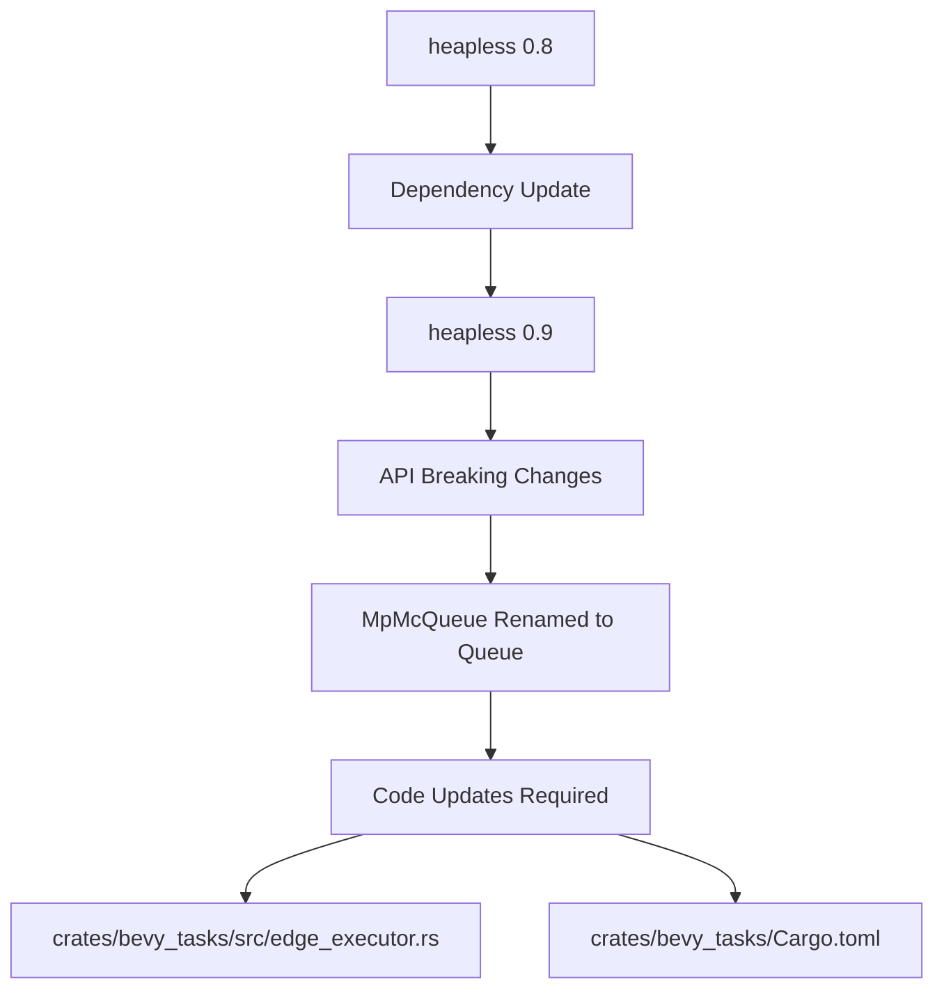

+++
title = "#21670 Update heapless requirement from 0.8 to 0.9"
date = "2025-11-01T00:00:00"
draft = false
template = "pull_request_page.html"
in_search_index = false

[extra]
current_language = "zh-cn"
available_languages = {"en" = { name = "English", url = "/pull_request/bevy/2025-11/pr-21670-en-20251101" }, "zh-cn" = { name = "中文", url = "/pull_request/bevy/2025-11/pr-21670-zh-cn-20251101" }}
labels = ["D-Trivial", "C-Dependencies", "A-Tasks"]
+++

# Title

## Basic Information
- **Title**: Update heapless requirement from 0.8 to 0.9
- **PR Link**: https://github.com/bevyengine/bevy/pull/21670
- **Author**: mnmaita
- **Status**: MERGED
- **Labels**: D-Trivial, C-Dependencies, S-Ready-For-Final-Review, A-Tasks
- **Created**: 2025-10-27T23:20:00Z
- **Merged**: 2025-11-01T19:22:54Z
- **Merged By**: mockersf

## Description Translation
**目标**

- 关闭 #21610

**解决方案**

- 更新代码以适配 `heapless` 0.9 中的破坏性变更。

**测试**

- cargo check + 测试

## The Story of This Pull Request

这是一个典型的依赖项升级PR，主要解决 `heapless` 库从 0.8 版本升级到 0.9 版本带来的破坏性变更问题。依赖管理是任何大型软件项目中的常规维护任务，特别是在 Rust 生态系统中，依赖项更新相对频繁。

问题起源于 `heapless` 库在 0.9 版本中进行了 API 重构。具体来说，该库将其多生产者多消费者队列的类型名称从 `MpMcQueue` 更名为 `Queue`。这是一个破坏性变更，意味着所有使用旧类型名称的代码都需要相应更新。

在 Bevy 引擎中，`bevy_tasks` 模块使用了 `heapless` 库来实现任务调度系统中的队列功能。当开发团队决定升级 `heapless` 依赖时，发现编译失败，因为原有的 `MpMcQueue` 类型在新版本中已不存在。

解决方案相对直接但必要：首先在 `Cargo.toml` 中更新依赖版本，然后在代码中将所有对 `MpMcQueue` 的引用替换为新的 `Queue` 类型。这种类型的变更在 Rust 生态系统中很常见，因为库作者经常会在主版本更新时重构 API 以提供更好的设计。

从技术实现角度看，这个变更涉及两个关键文件。在 `Cargo.toml` 中，版本号从 `0.8` 更新为 `0.9`，保持了相同的特性标志配置。在 `edge_executor.rs` 中，类型声明和实例化代码都需要更新以使用新的类型名称。

这种依赖升级的重要性在于保持项目与生态系统同步。较新的依赖版本通常包含性能改进、安全修复和新功能。同时，及时处理破坏性变更可以避免技术债务积累，否则未来升级会更加困难。

测试策略也很实用：使用 `cargo check` 验证编译是否成功，然后运行现有测试确保功能没有回归。对于这种纯类型名称变更，只要编译通过，功能通常不会受到影响。

## Visual Representation



## Key Files Changed

### `crates/bevy_tasks/Cargo.toml`
**变更描述**: 更新 `heapless` 依赖版本从 0.8 到 0.9

```toml
# Before:
heapless = { version = "0.8", default-features = false, features = [
  "portable-atomic",
] }

# After:
heapless = { version = "0.9", default-features = false, features = [
  "portable-atomic",
] }
```

### `crates/bevy_tasks/src/edge_executor.rs`
**变更描述**: 适配 `heapless` 0.9 的 API 变更，将 `MpMcQueue` 替换为 `Queue`

```rust
// Before:
queue: heapless::mpmc::MpMcQueue<Runnable, C>,

// After:
queue: heapless::mpmc::Queue<Runnable, C>,
```

```rust
// Before:
queue: heapless::mpmc::MpMcQueue::new(),

// After:
queue: heapless::mpmc::Queue::new(),
```

这些变更直接对应 `heapless` 库在 0.9 版本中的 API 重构，保持了相同的功能但使用了新的类型名称。

## Further Reading

- [heapless crate documentation](https://docs.rs/heapless/) - 官方文档
- [Semantic Versioning in Rust](https://doc.rust-lang.org/cargo/reference/semver.html) - Rust 中的语义版本控制
- [Bevy Tasks System](https://bevyengine.org/learn/book/next/programming/tasks/) - Bevy 任务系统文档

# Full Code Diff
diff --git a/crates/bevy_tasks/Cargo.toml b/crates/bevy_tasks/Cargo.toml
index abe5a1485a6ad..80d77fa2dcd5b 100644
--- a/crates/bevy_tasks/Cargo.toml
+++ b/crates/bevy_tasks/Cargo.toml
@@ -61,7 +61,7 @@ async-channel = { version = "2.3.0", default-features = false }
 async-task = { version = "4.4.0", default-features = false, features = [
   "portable-atomic",
 ] }
-heapless = { version = "0.8", default-features = false, features = [
+heapless = { version = "0.9", default-features = false, features = [
   "portable-atomic",
 ] }
 atomic-waker = { version = "1", default-features = false, features = [
diff --git a/crates/bevy_tasks/src/edge_executor.rs b/crates/bevy_tasks/src/edge_executor.rs
index a8c80725cafe9..2bf719029d621 100644
--- a/crates/bevy_tasks/src/edge_executor.rs
+++ b/crates/bevy_tasks/src/edge_executor.rs
@@ -449,7 +449,7 @@ struct State<const C: usize> {
         target_has_atomic = "64",
         target_has_atomic = "ptr"
     )))]
-    queue: heapless::mpmc::MpMcQueue<Runnable, C>,
+    queue: heapless::mpmc::Queue<Runnable, C>,
     waker: AtomicWaker,
 }
 
@@ -471,7 +471,7 @@ impl<const C: usize> State<C> {
                 target_has_atomic = "64",
                 target_has_atomic = "ptr"
             )))]
-            queue: heapless::mpmc::MpMcQueue::new(),
+            queue: heapless::mpmc::Queue::new(),
             waker: AtomicWaker::new(),
         }
     }