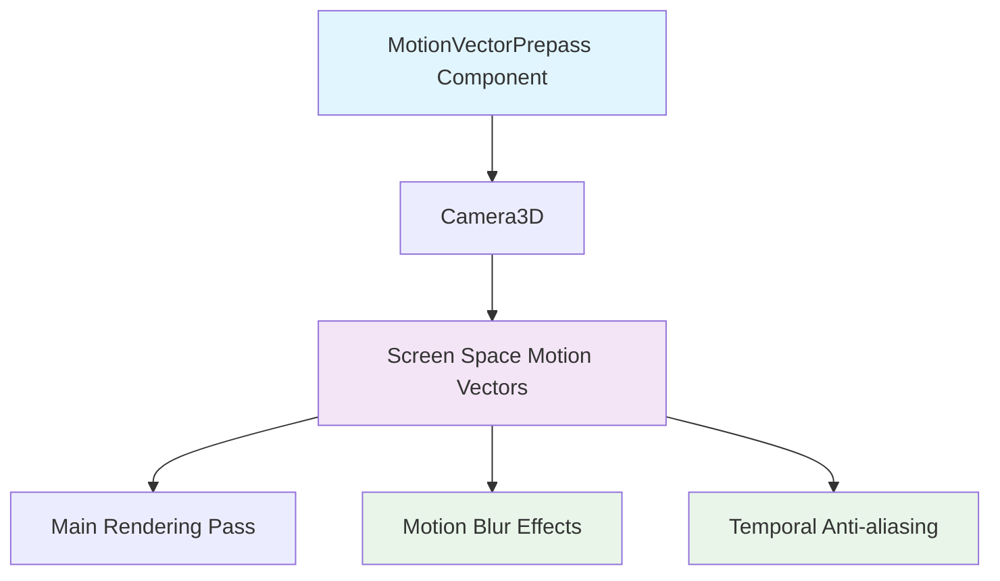

+++
title = "#21671 document MotionVectorPrepass better"
date = "2025-11-03T00:00:00"
draft = false
template = "pull_request_page.html"
in_search_index = true

[taxonomies]
list_display = ["show"]

[extra]
current_language = "en"
available_languages = {"en" = { name = "English", url = "/pull_request/bevy/2025-11/pr-21671-en-20251103" }, "zh-cn" = { name = "中文", url = "/pull_request/bevy/2025-11/pr-21671-zh-cn-20251103" }}
labels = ["C-Docs", "A-Rendering"]
+++

# Title
document MotionVectorPrepass better

## Basic Information
- **Title**: document MotionVectorPrepass better
- **PR Link**: https://github.com/bevyengine/bevy/pull/21671
- **Author**: atlv24
- **Status**: MERGED
- **Labels**: C-Docs, A-Rendering, S-Ready-For-Review
- **Created**: 2025-10-27T23:33:28Z
- **Merged**: 2025-11-03T19:04:05Z
- **Merged By**: alice-i-cecile

## Description Translation
# Objective

- document MotionVectorPrepass better

## Solution

- mostly based off the docs in https://github.com/bevyengine/bevy/blob/main/crates/bevy_pbr/src/prepass/prepass.wgsl#L199

## Testing

- its docs

## The Story of This Pull Request

This PR addresses a documentation gap in the Bevy game engine's rendering pipeline. The `MotionVectorPrepass` component, when added to a 3D camera, enables screen space motion vector calculation and makes these vectors available to the main rendering pass. However, the original documentation lacked critical details about how to interpret the motion vector data.

The problem was straightforward: developers using the motion vector feature had no clear specification about the coordinate system and value ranges of the motion vectors. Without this information, correctly utilizing motion vectors for effects like motion blur or temporal anti-aliasing was challenging and error-prone.

The solution approach was practical and efficient. The developer leveraged existing documentation from the shader code in `prepass.wgsl`, specifically the comments that already defined the coordinate system and value interpretation for motion vectors. This ensured consistency between the Rust API documentation and the underlying shader implementation.

The implementation consisted of adding two crucial lines of documentation that precisely define:
- The coordinate system: "+x right and +y down"
- The value range: "-1,1" 
- A concrete example: "(1.0,1.0) indicates a pixel moved from the top left corner to the bottom right corner"

This documentation improvement is significant because motion vectors are fundamental for advanced rendering techniques. The coordinate system specification (+x right, +y down) aligns with standard screen space coordinates in graphics programming, while the -1 to 1 range provides a normalized representation that's consistent across different resolutions.

The technical insight here is that motion vectors represent the screen-space displacement of pixels between frames. Understanding the coordinate system and value range is essential for correctly implementing temporal effects. The example provided gives developers an immediate mental model for how to interpret the vector values in practical scenarios.

This change has minimal impact on the codebase but substantial impact on developer experience. It follows the principle that well-documented APIs reduce implementation errors and accelerate development. The documentation now provides the necessary context for developers to correctly consume motion vector data without needing to dive into the shader code or conduct extensive experimentation.

## Visual Representation



## Key Files Changed

### `crates/bevy_core_pipeline/src/prepass/mod.rs` (+3/-0)

This file contains the core prepass components for Bevy's rendering pipeline. The changes add detailed documentation to the `MotionVectorPrepass` component.

**Key modification:**
```rust
// File: crates/bevy_core_pipeline/src/prepass/mod.rs
// Before:
/// If added to a [`bevy_camera::Camera3d`] then screen space motion vectors will be copied to a separate texture available to the main pass.
#[derive(Component, Default, Reflect, Clone)]
#[reflect(Component, Default, Clone)]
pub struct MotionVectorPrepass;

// After:
/// If added to a [`bevy_camera::Camera3d`] then screen space motion vectors will be copied to a separate texture available to the main pass.
///
/// Motion vectors are stored in the range -1,1, with +x right and +y down.
/// A value of (1.0,1.0) indicates a pixel moved from the top left corner to the bottom right corner of the screen.
#[derive(Component, Default, Reflect, Clone)]
#[reflect(Component, Default, Clone)]
pub struct MotionVectorPrepass;
```

The changes add two critical documentation lines that specify:
1. The coordinate system orientation (+x right, +y down)
2. The normalized value range (-1 to 1)
3. A concrete example illustrating vector interpretation

These changes directly address the PR's objective by providing comprehensive documentation for the `MotionVectorPrepass` component, making it easier for developers to correctly implement motion-based rendering effects.

## Further Reading

- [Bevy Prepass Documentation](https://github.com/bevyengine/bevy/blob/main/crates/bevy_pbr/src/prepass/prepass.wgsl#L199) - The original shader documentation that inspired these changes
- [Screen Space Motion Vectors in Game Rendering](https://alextardif.com/MotionBlur.html) - Technical overview of motion vector implementation
- [Temporal Anti-aliasing Techniques](https://www.elopezr.com/temporal-aa-and-the-quest-for-the-holy-trail/) - How motion vectors are used in modern anti-aliasing
- [Bevy Rendering Pipeline](https://bevy-cheatbook.github.io/features/3d.html) - General Bevy 3D rendering concepts

# Full Code Diff
```diff
diff --git a/crates/bevy_core_pipeline/src/prepass/mod.rs b/crates/bevy_core_pipeline/src/prepass/mod.rs
index 89b09c88b3f09..7b3cc05a66aa1 100644
--- a/crates/bevy_core_pipeline/src/prepass/mod.rs
+++ b/crates/bevy_core_pipeline/src/prepass/mod.rs
@@ -64,6 +64,9 @@ pub struct DepthPrepass;
 pub struct NormalPrepass;
 
 /// If added to a [`bevy_camera::Camera3d`] then screen space motion vectors will be copied to a separate texture available to the main pass.
+///
+/// Motion vectors are stored in the range -1,1, with +x right and +y down.
+/// A value of (1.0,1.0) indicates a pixel moved from the top left corner to the bottom right corner of the screen.
 #[derive(Component, Default, Reflect, Clone)]
 #[reflect(Component, Default, Clone)]
 pub struct MotionVectorPrepass;
```