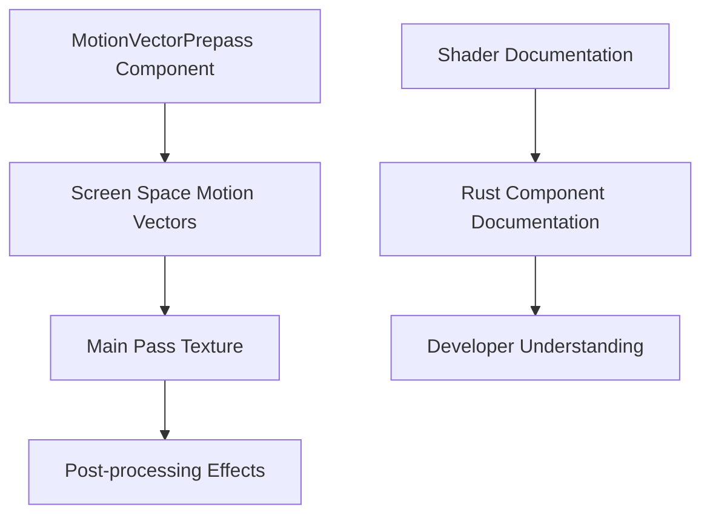

+++
title = "#21671 document MotionVectorPrepass better"
date = "2025-11-03T00:00:00"
draft = false
template = "pull_request_page.html"
in_search_index = false

[extra]
current_language = "zh-cn"
available_languages = {"en" = { name = "English", url = "/pull_request/bevy/2025-11/pr-21671-en-20251103" }, "zh-cn" = { name = "中文", url = "/pull_request/bevy/2025-11/pr-21671-zh-cn-20251103" }}
labels = ["C-Docs", "A-Rendering"]
+++

# Title

## Basic Information
- **Title**: document MotionVectorPrepass better
- **PR Link**: https://github.com/bevyengine/bevy/pull/21671
- **Author**: atlv24
- **Status**: MERGED
- **Labels**: C-Docs, A-Rendering, S-Ready-For-Final-Review
- **Created**: 2025-10-27T23:33:28Z
- **Merged**: 2025-11-03T19:04:05Z
- **Merged By**: alice-i-cecile

## Description Translation
**目标**

- 更好地记录 MotionVectorPrepass

**解决方案**

- 主要基于 https://github.com/bevyengine/bevy/blob/main/crates/bevy_pbr/src/prepass/prepass.wgsl#L199 中的文档

**测试**

- 它的文档

## The Story of This Pull Request

这个PR解决了一个常见的工程问题：API文档不完整导致开发者使用困难。MotionVectorPrepass是一个用于处理屏幕空间运动向量的组件，但在PR修改之前，其文档仅包含基本的组件定义，缺乏对运动向量格式和坐标系的详细说明。

问题的核心在于，当开发者在主通道中使用运动向量纹理时，需要准确理解这些数据的编码方式和坐标系约定。没有清晰的文档，开发者只能通过阅读shader代码或进行实验来理解这些细节，这增加了开发成本并可能导致错误实现。

开发者采用了直接的解决方案：从现有的shader文档中提取关键信息并移植到Rust组件文档中。具体来说，他们参考了`prepass.wgsl`文件第199行附近的注释，这些注释详细描述了运动向量的存储格式和坐标系约定。

这种方法的优势在于保持了文档的一致性。通过确保Rust组件文档与shader代码中的注释保持一致，开发者可以避免不同层级文档之间的冲突，这对于图形编程这种涉及多语言协作的领域尤为重要。

技术实现上，这个PR在`MotionVectorPrepass`组件的定义前添加了三行文档注释：

```rust
/// Motion vectors are stored in the range -1,1, with +x right and +y down.
/// A value of (1.0,1.0) indicates a pixel moved from the top left corner to the bottom right corner of the screen.
```

这些注释明确指出了两个关键信息：
1. 运动向量的数值范围是[-1, 1]
2. 坐标系约定：+x向右，+y向下
3. 提供了具体的数值示例来说明运动方向

从工程角度看，这种文档改进虽然代码量很小，但对项目的可维护性和开发者体验有显著提升。清晰的API文档减少了新开发者上手的时间，也降低了现有开发者犯错的可能性。

这个PR体现了良好的工程实践：及时填补文档空白，确保代码库各部分的文档一致性，以及通过具体示例来阐明抽象概念。虽然改动简单，但它解决了实际开发中可能遇到的困惑。

## Visual Representation



## Key Files Changed

**crates/bevy_core_pipeline/src/prepass/mod.rs** (+3/-0)

这个文件包含了运动向量预处理组件的定义。修改前，`MotionVectorPrepass`组件只有基本的组件定义，缺乏对运动向量格式的详细说明。

修改前的代码：
```rust
/// If added to a [`bevy_camera::Camera3d`] then screen space motion vectors will be copied to a separate texture available to the main pass.
#[derive(Component, Default, Reflect, Clone)]
#[reflect(Component, Default, Clone)]
pub struct MotionVectorPrepass;
```

修改后的代码：
```rust
/// If added to a [`bevy_camera::Camera3d`] then screen space motion vectors will be copied to a separate texture available to the main pass.
///
/// Motion vectors are stored in the range -1,1, with +x right and +y down.
/// A value of (1.0,1.0) indicates a pixel moved from the top left corner to the bottom right corner of the screen.
#[derive(Component, Default, Reflect, Clone)]
#[reflect(Component, Default, Clone)]
pub struct MotionVectorPrepass;
```

这些更改通过添加具体的数值范围和坐标系信息，完善了运动向量预处理功能的文档。新增的文档行直接解释了运动向量的存储格式，这对于后续使用这些数据的开发者至关重要。

## Further Reading

- [Bevy Prepass Documentation](https://github.com/bevyengine/bevy/blob/main/crates/bevy_pbr/src/prepass/prepass.wgsl#L199) - 原始shader文档来源
- [Motion Vectors in Computer Graphics](https://en.wikipedia.org/wiki/Motion_vector) - 运动向量的基本概念
- [Bevy Camera3d Documentation](https://docs.rs/bevy/latest/bevy/core_pipeline/prepass/struct.Camera3d.html) - 相关的相机组件文档

# Full Code Diff
diff --git a/crates/bevy_core_pipeline/src/prepass/mod.rs b/crates/bevy_core_pipeline/src/prepass/mod.rs
index 89b09c88b3f09..7b3cc05a66aa1 100644
--- a/crates/bevy_core_pipeline/src/prepass/mod.rs
+++ b/crates/bevy_core_pipeline/src/prepass/mod.rs
@@ -64,6 +64,9 @@ pub struct DepthPrepass;
 pub struct NormalPrepass;
 
 /// If added to a [`bevy_camera::Camera3d`] then screen space motion vectors will be copied to a separate texture available to the main pass.
+///
+/// Motion vectors are stored in the range -1,1, with +x right and +y down.
+/// A value of (1.0,1.0) indicates a pixel moved from the top left corner to the bottom right corner of the screen.
 #[derive(Component, Default, Reflect, Clone)]
 #[reflect(Component, Default, Clone)]
 pub struct MotionVectorPrepass;