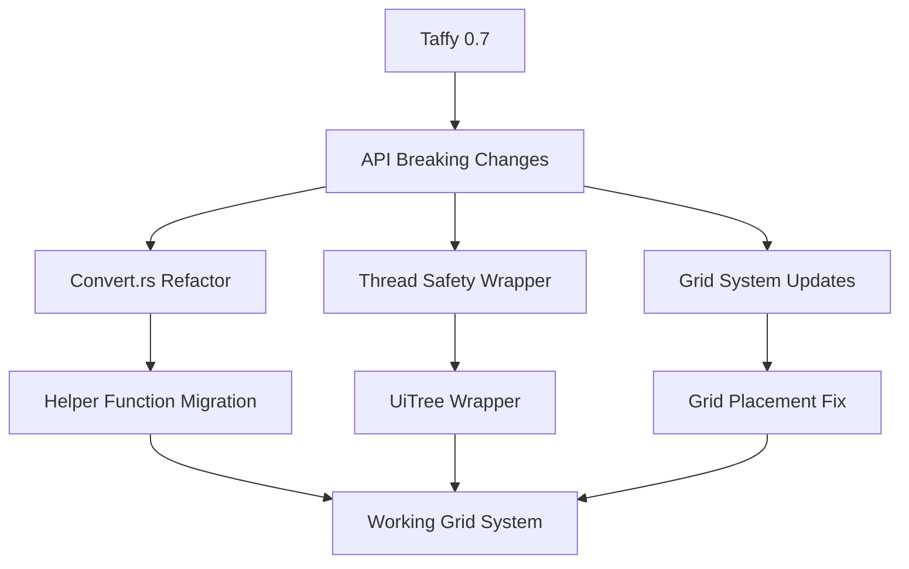

+++
title = "#21672 Update taffy to 0.9 and fix Grid errors #21240"
date = "2025-11-03T00:00:00"
draft = false
template = "pull_request_page.html"
in_search_index = true

[taxonomies]
list_display = ["show"]

[extra]
current_language = "en"
available_languages = {"en" = { name = "English", url = "/pull_request/bevy/2025-11/pr-21672-en-20251103" }, "zh-cn" = { name = "中文", url = "/pull_request/bevy/2025-11/pr-21672-zh-cn-20251103" }}
labels = ["C-Dependencies", "A-UI", "X-Contentious"]
+++

# Update taffy to 0.9 and fix Grid errors #21240

## Basic Information
- **Title**: Update taffy to 0.9 and fix Grid errors #21240
- **PR Link**: https://github.com/bevyengine/bevy/pull/21672
- **Author**: rossleonardy
- **Status**: MERGED
- **Labels**: C-Dependencies, A-UI, S-Ready-For-Final-Review, X-Contentious
- **Created**: 2025-10-28T00:20:03Z
- **Merged**: 2025-11-03T19:06:01Z
- **Merged By**: alice-i-cecile

## Description Translation
**Objective**

- #21240
- Update taffy to 0.9.1 and grid placement with start and ends works again.

**Solution**
I had to make some rather un-ergonomic changes I would like advice on, so I've left comments below.

**Testing**
- Pending...

---

**Showcase**


Fixes issue with grid start and ends...

## The Story of This Pull Request

This PR addresses a dependency upgrade challenge where the Bevy UI system needed to migrate from Taffy 0.7 to 0.9.1 to fix broken grid placement functionality. The core problem was that Taffy's API underwent significant breaking changes between versions, requiring substantial refactoring of Bevy's layout conversion layer.

The migration began with updating the dependency specification in `Cargo.toml`. The Taffy 0.9 version required explicit feature flags and disabled default features, reflecting the library's more modular architecture in the newer version:

```toml
taffy = { version = "0.9", default-features = false, features = [
  "std",
  "block_layout",
  "flexbox",
  "grid",
  "content_size",
  "taffy_tree",
] }
```

The most extensive changes occurred in `convert.rs`, where the conversion logic between Bevy's layout types and Taffy's types needed complete restructuring. The Taffy 0.9 API introduced helper functions and changed enum variants from direct constructors to function calls. For example, converting `Val::Auto` changed from:

```rust
// Before (Taffy 0.7):
Val::Auto => taffy::style::LengthPercentageAuto::Auto,

// After (Taffy 0.9):
Val::Auto => style_helpers::auto(),
```

This pattern repeated throughout the conversion functions, affecting length percentages, track sizing functions, and grid templates. The grid system required particular attention because Taffy 0.9 introduced generic types for grid placement and changed the `GridTemplateComponent` structure.

One significant technical challenge was maintaining thread safety. Taffy 0.9's `TaffyTree` isn't thread-safe when using the `calc` feature, so the solution wrapped it in a custom `UiTree` type with manual `Send` and `Sync` implementations:

```rust
pub(crate) struct UiTree<T>(TaffyTree<T>);

#[expect(unsafe_code, reason = "TaffyTree is safe as long as calc is not used")]
unsafe impl Send for UiTree<NodeMeasure> {}

#[expect(unsafe_code, reason = "TaffyTree is safe as long as calc is not used")]
unsafe impl Sync for UiTree<NodeMeasure> {}
```

The image widget measurement system also needed adaptation because Taffy 0.9 changed the `maybe_resolve` method signature to require a function pointer for calc resolution. Since Bevy doesn't use this feature, a no-op function was provided:

```rust
fn resolve_calc(_calc_ptr: *const (), _parent_size: f32) -> f32 {
    0.0
}
```

Throughout the conversion, the developer maintained the existing Bevy UI semantics while adapting to Taffy's new API patterns. The changes ensured that grid placement with start and end specifications worked correctly again, as demonstrated by the showcase image showing properly positioned grid elements.

The migration required careful attention to detail because many Taffy enum variants changed from direct constructors to function calls, and the grid system API underwent significant restructuring. The solution maintains backward compatibility for Bevy UI users while fixing the underlying grid placement issues.

## Visual Representation



## Key Files Changed

### `crates/bevy_ui/src/layout/convert.rs` (+100/-103)
This file underwent the most extensive changes, converting from Taffy 0.7's direct enum constructors to Taffy 0.9's helper function API. The changes affected value conversions, grid placement, and track sizing functions.

**Key changes:**
```rust
// Before:
Val::Auto => taffy::style::LengthPercentageAuto::Auto,

// After:
Val::Auto => style_helpers::auto(),
```

```rust
// Grid placement conversion updated:
impl From<GridPlacement> for taffy::geometry::Line<taffy::style::GridPlacement<String>> {
    fn from(value: GridPlacement) -> Self {
        // Implementation adapted for new generic type
    }
}
```

### `crates/bevy_ui/src/layout/ui_surface.rs` (+29/-5)
Added thread safety wrapper for TaffyTree and updated viewport node styling to use new helper functions.

**Key addition:**
```rust
pub(crate) struct UiTree<T>(TaffyTree<T>);

// Manual Send/Sync implementations for thread safety
unsafe impl Send for UiTree<NodeMeasure> {}
unsafe impl Sync for UiTree<NodeMeasure> {}
```

### `crates/bevy_ui/src/widget/image.rs` (+23/-6)
Updated measurement system to work with Taffy 0.9's new `maybe_resolve` method signature.

**Key change:**
```rust
// Added no-op function for calc resolution
fn resolve_calc(_calc_ptr: *const (), _parent_size: f32) -> f32 {
    0.0
}

// Updated method calls:
let s_width = style.size.width.maybe_resolve(parent_width, resolve_calc);
```

### `crates/bevy_ui/Cargo.toml` (+8/-1)
Updated Taffy dependency with explicit feature flags and disabled default features.

### `crates/bevy_ui/src/layout/mod.rs` (+1/-1)
Updated error type to match Taffy 0.9's reorganized module structure.

## Further Reading

- [Taffy 0.9 Migration Guide](https://github.com/DioxusLabs/taffy/blob/main/UPGRADE_GUIDE.md)
- [Bevy UI Layout System Documentation](https://bevyengine.org/learn/quick-start/ui/)
- [CSS Grid Layout Specification](https://developer.mozilla.org/en-US/docs/Web/CSS/CSS_Grid_Layout) (relevant for understanding grid placement concepts)