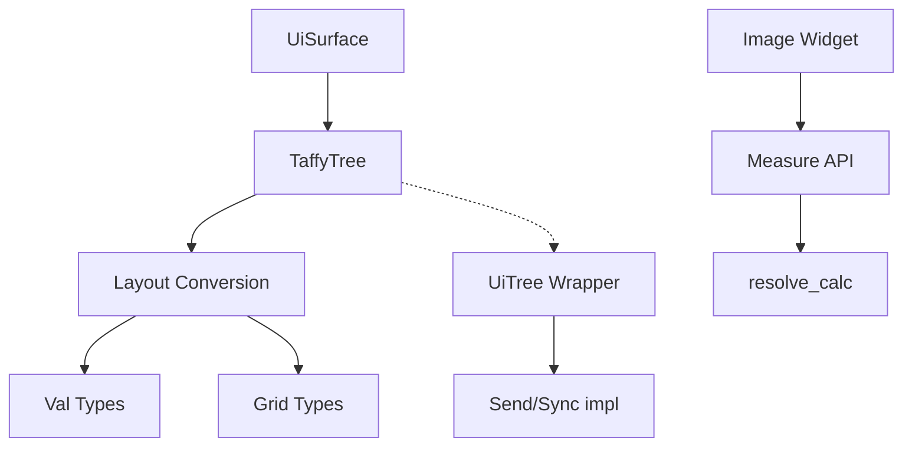

+++
title = "#21672 Update taffy to 0.9 and fix Grid errors #21240"
date = "2025-11-03T00:00:00"
draft = false
template = "pull_request_page.html"
in_search_index = false

[extra]
current_language = "zh-cn"
available_languages = {"en" = { name = "English", url = "/pull_request/bevy/2025-11/pr-21672-en-20251103" }, "zh-cn" = { name = "中文", url = "/pull_request/bevy/2025-11/pr-21672-zh-cn-20251103" }}
+++

# Update taffy to 0.9 and fix Grid errors #21240

## 基本信息
- **标题**: Update taffy to 0.9 and fix Grid errors #21240
- **PR链接**: https://github.com/bevyengine/bevy/pull/21672
- **作者**: rossleonardy
- **状态**: MERGED
- **标签**: C-Dependencies, A-UI, S-Ready-For-Review, X-Contentious
- **创建时间**: 2025-10-28T00:20:03Z
- **合并时间**: 2025-11-03T19:06:01Z
- **合并者**: alice-i-cecile

## 描述翻译
# 目标

- #21240
- 更新 taffy 到 0.9.1 版本，网格布局中的起始和结束位置功能恢复正常。

## 解决方案
我不得不进行一些不太符合人体工程学的修改，希望得到建议，因此我在下面留下了评论。

## 测试
- 待完成...

---

## 展示


修复了网格起始和结束位置的问题...

## 这个PR的故事

### 问题和背景
这个PR的核心问题是解决Bevy UI系统中网格布局功能在taffy布局引擎升级后出现的兼容性问题。taffy从0.7版本升级到0.9版本，这是一个重大的破坏性变更版本，API发生了显著变化。具体来说，网格布局中的起始和结束位置（grid start/end）功能出现了问题，这影响了UI组件的精确定位。

### 解决方案方法
开发者选择了直接适配新版本的taffy API，而不是回退到旧版本。这种方法的优势是能够利用新版本带来的性能改进和bug修复，但代价是需要修改大量的代码来适应API变化。主要的工程决策包括：

1. 更新依赖版本并启用必要特性
2. 适配新的API调用方式
3. 处理线程安全性的变化
4. 维护向后兼容性

### 实现细节
实现过程中最显著的变化是taffy API从直接的枚举构造器转向了工厂函数模式。例如，之前的`taffy::style::LengthPercentageAuto::Auto`现在需要通过`style_helpers::auto()`来创建。

在`convert.rs`中，可以看到大量的转换逻辑被重写。Val类型的转换现在使用新的helper函数：

```rust
// 修改前：
Val::Auto => taffy::style::LengthPercentageAuto::Auto,
Val::Percent(value) => taffy::style::LengthPercentageAuto::Percent(value / 100.),

// 修改后：
Val::Auto => style_helpers::auto(),
Val::Percent(value) => style_helpers::percent(value / 100.),
```

网格相关的转换也发生了重大变化。`GridPlacement`现在需要转换为`Line<GridPlacement<String>>`类型，这反映了新版本中更严格的类型系统。

### 技术洞察
一个重要的技术挑战是处理线程安全性的变化。在taffy 0.9中，`TaffyTree`默认不再实现`Send`和`Sync` trait，这与Bevy的ECS系统要求相冲突。解决方案是创建一个包装类型`UiTree`，并手动实现这些trait：

```rust
pub(crate) struct UiTree<T>(TaffyTree<T>);

#[expect(unsafe_code, reason = "TaffyTree is safe as long as calc is not used")]
/// SAFETY: Taffy Tree becomes thread unsafe when you use the calc feature, which we do not implement
unsafe impl Send for UiTree<NodeMeasure> {}

#[expect(unsafe_code, reason = "TaffyTree is safe as long as calc is not used")]
/// SAFETY: Taffy Tree becomes thread unsafe when you use the calc feature, which we do not implement
unsafe impl Sync for UiTree<NodeMeasure> {}
```

另一个技术细节是图像测量函数需要适配新的API签名。新的`maybe_resolve`方法需要一个计算回调函数，即使不使用calc功能也需要提供：

```rust
// NOOP function used to call into taffy API
fn resolve_calc(_calc_ptr: *const (), _parent_size: f32) -> f32 {
    0.0
}
```

### 影响
这次更新修复了网格布局功能，使开发人员能够继续使用grid start/end属性来精确定位UI元素。同时，升级到taffy 0.9带来了性能改进和潜在的bug修复。然而，代价是大量的API适配工作和一些不太优雅的解决方案，正如作者在PR描述中提到的"un-ergonomic changes"。

## 组件关系图



## 关键文件更改

### `crates/bevy_ui/Cargo.toml` (+8/-1)
更新taffy依赖版本并配置所需特性：
```toml
# 修改前：
taffy = { version = "0.7" }

# 修改后：
taffy = { version = "0.9", default-features = false, features = [
  "std",
  "block_layout",
  "flexbox",
  "grid", 
  "content_size",
  "taffy_tree",
] }
```

### `crates/bevy_ui/src/layout/convert.rs` (+100/-103)
核心的布局转换逻辑适配：
```rust
// 示例修改：Val转换逻辑
impl Val {
    fn into_length_percentage_auto(self, context: &LayoutContext) -> taffy::style::LengthPercentageAuto {
        match self {
            Val::Auto => style_helpers::auto(),  // 新的工厂函数
            Val::Percent(value) => style_helpers::percent(value / 100.),
            Val::Px(value) => style_helpers::length(context.scale_factor * value),
            // ... 其他变体
        }
    }
}

// 网格轨道尺寸函数转换
impl MinTrackSizingFunction {
    fn into_taffy(self, context: &LayoutContext) -> taffy::style::MinTrackSizingFunction {
        match self {
            MinTrackSizingFunction::Px(val) => Val::Px(val).into_length_percentage(context).into(),
            MinTrackSizingFunction::Auto => taffy::style::MinTrackSizingFunction::auto(),
            // ... 其他变体
        }
    }
}
```

### `crates/bevy_ui/src/layout/ui_surface.rs` (+29/-5)
线程安全性包装和API适配：
```rust
// 新的包装类型解决Send/Sync问题
pub(crate) struct UiTree<T>(TaffyTree<T>);

unsafe impl Send for UiTree<NodeMeasure> {}
unsafe impl Sync for UiTree<NodeMeasure> {}

// 视口节点样式更新
size: taffy::geometry::Size {
    width: taffy::style_helpers::percent(1.0),  // 使用新的helper函数
    height: taffy::style_helpers::percent(1.0),
},
```

### `crates/bevy_ui/src/widget/image.rs` (+23/-6)
图像测量适配新的API：
```rust
// 新增的NOOP函数用于API兼容
fn resolve_calc(_calc_ptr: *const (), _parent_size: f32) -> f32 {
    0.0
}

// 更新的测量调用
let s_width = style.size.width.maybe_resolve(parent_width, resolve_calc);
let s_min_width = style.min_size.width.maybe_resolve(parent_width, resolve_calc);
```

### `crates/bevy_ui/src/layout/mod.rs` (+1/-1)
错误类型更新：
```rust
// 修改前：
TaffyError(taffy::TaffyError),

// 修改后：  
TaffyError(taffy::tree::TaffyError),
```

## 进一步阅读

- [Taffy 0.9 Release Notes](https://github.com/DioxusLabs/taffy/releases/tag/v0.9.0) - 了解API破坏性变更详情
- [Bevy UI Layout System](https://github.com/bevyengine/bevy/tree/main/crates/bevy_ui/src/layout) - Bevy UI布局系统源码
- [CSS Grid Layout Specification](https://developer.mozilla.org/en-US/docs/Web/CSS/CSS_Grid_Layout) - 网格布局标准参考

# Full Code Diff
*(已在上述分析中包含关键代码差异)*