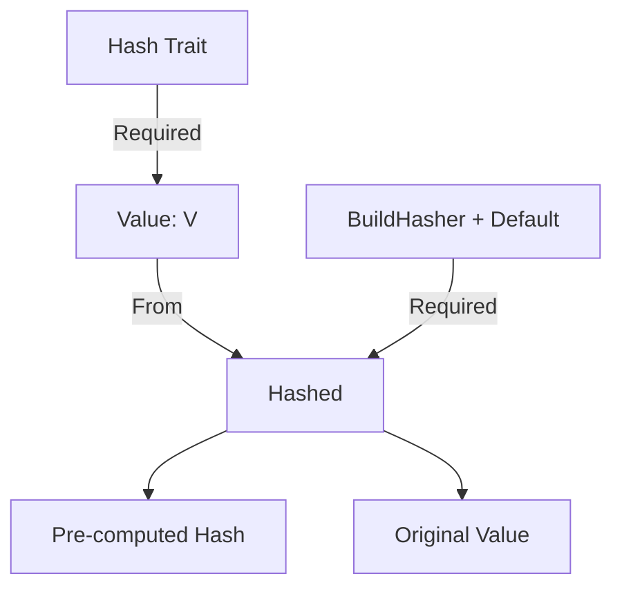

+++
title = "#21690 Add `From` for `Hashed`"
date = "2025-11-30T00:00:00"
draft = false
template = "pull_request_page.html"
in_search_index = false

[extra]
current_language = "zh-cn"
available_languages = {"en" = { name = "English", url = "/pull_request/bevy/2025-11/pr-21690-en-20251130" }, "zh-cn" = { name = "中文", url = "/pull_request/bevy/2025-11/pr-21690-zh-cn-20251130" }}
labels = ["D-Trivial", "A-Utils", "X-Contentious"]
+++

# Title
Add `From` for `Hashed`

## Basic Information
- **Title**: Add `From` for `Hashed`
- **PR Link**: https://github.com/bevyengine/bevy/pull/21690
- **Author**: Shatur
- **Status**: MERGED
- **Labels**: D-Trivial, S-Ready-For-Final-Review, A-Utils, X-Contentious
- **Created**: 2025-10-29T20:57:12Z
- **Merged**: 2025-11-30T20:23:16Z
- **Merged By**: alice-i-cecile

## Description Translation
# Objective

- 当函数接受 `Hashed` 参数时，调用 `Hashed::new` 可能会很繁琐。

## Solution

- 添加 `From` 实现，允许创建接受 `impl From<V>` 参数的函数。

## The Story of This Pull Request

这个PR解决了一个API易用性问题。`Hashed` 类型是一个包装器，它存储一个值并预先计算其哈希值，这在需要频繁哈希相同值的场景中很有用，可以避免重复计算哈希值。

在实际使用中，开发者经常需要将普通值转换为 `Hashed` 类型。原来的做法是显式调用 `Hashed::new(value)`，这在函数参数传递时显得比较繁琐。考虑以下使用场景：

```rust
// 之前：需要显式构造 Hashed
fn process_hashed(hashed: Hashed<String>) {
    // 处理逻辑
}

// 调用时
let value = "hello".to_string();
process_hashed(Hashed::new(value));  // 需要显式构造
```

通过添加 `From<V>` trait 实现，现在可以直接使用 `.into()` 或者让函数接受 `impl From<V>`，大大简化了代码：

```rust
// 现在：可以使用 into() 自动转换
let value = "hello".to_string();
process_hashed(value.into());  // 自动转换

// 或者函数可以定义为接受 impl From<V>
fn process_hashed<T: Into<Hashed<String>>>(hashed: T) {
    let hashed = hashed.into();
    // 处理逻辑
}
```

这个实现的技术细节很直接。`From<V> for Hashed<V, H>` trait 实现要求类型 `V` 实现 `Hash` trait（因为需要计算哈希值），而 `H`（哈希器构建器）需要实现 `BuildHasher + Default`。实现体简单地调用了现有的 `Hashed::new` 方法：

```rust
impl<V: Hash, H: BuildHasher + Default> From<V> for Hashed<V, H> {
    fn from(value: V) -> Self {
        Self::new(value)
    }
}
```

这种模式在Rust生态系统中很常见，遵循了"让常用操作更便捷"的设计原则。它没有改变任何现有功能，只是提供了更符合人体工程学的API。

从工程角度看，这是一个典型的"语法糖"改进 - 不改变底层行为，但显著改善了开发者体验。这种改进特别有价值，因为它遵循了Rust的标准惯例，让API更加一致和直观。

## Visual Representation



## Key Files Changed

### `crates/bevy_platform/src/hash.rs` (+6/-0)

这个文件包含了 `Hashed` 类型的核心实现。主要的修改是添加了 `From<V>` trait 实现。

**修改内容：**
```rust
// 新增的 From trait 实现
impl<V: Hash, H: BuildHasher + Default> From<V> for Hashed<V, H> {
    fn from(value: V) -> Self {
        Self::new(value)
    }
}
```

这个实现：
1. 允许任何实现了 `Hash` 的类型 `V` 自动转换为 `Hashed<V, H>`
2. 要求哈希器构建器 `H` 实现 `BuildHasher + Default` trait
3. 内部重用现有的 `Hashed::new` 方法，确保行为一致性

## Further Reading

- [Rust标准库 - From trait文档](https://doc.rust-lang.org/std/convert/trait.From.html)
- [Rust API指南 - 类型转换](https://rust-lang.github.io/api-guidelines/interoperability.html#conversions-use-the-standard-traits-from-asref-asmut-c-conv)
- [Bevy Engine - Hashed类型文档](https://docs.rs/bevy/latest/bevy/utils/struct.Hashed.html)

# Full Code Diff
```diff
diff --git a/crates/bevy_platform/src/hash.rs b/crates/bevy_platform/src/hash.rs
index 66814bc583623..812b88cd10572 100644
--- a/crates/bevy_platform/src/hash.rs
+++ b/crates/bevy_platform/src/hash.rs
@@ -66,6 +66,12 @@ impl<V, H> Hash for Hashed<V, H> {
     }
 }
 
+impl<V: Hash, H: BuildHasher + Default> From<V> for Hashed<V, H> {
+    fn from(value: V) -> Self {
+        Self::new(value)
+    }
+}
+
 impl<V, H> Deref for Hashed<V, H> {
     type Target = V;
 
```