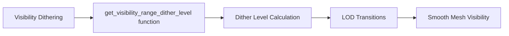

+++
title = "#21696 remove `level` from `LOD level` in comment / change to `Dither Level`"
date = "2025-11-01T00:00:00"
draft = false
template = "pull_request_page.html"
in_search_index = false

[extra]
current_language = "zh-cn"
available_languages = {"en" = { name = "English", url = "/pull_request/bevy/2025-11/pr-21696-en-20251101" }, "zh-cn" = { name = "中文", url = "/pull_request/bevy/2025-11/pr-21696-zh-cn-20251101" }}
labels = ["C-Docs", "A-Rendering", "D-Straightforward"]
+++

# Title

## Basic Information
- **Title**: remove `level` from `LOD level` in comment / change to `Dither Level`
- **PR Link**: https://github.com/bevyengine/bevy/pull/21696
- **Author**: NicoZweifel
- **Status**: MERGED
- **Labels**: C-Docs, A-Rendering, S-Ready-For-Final-Review, D-Straightforward
- **Created**: 2025-10-30T15:37:03Z
- **Merged**: 2025-11-01T21:44:31Z
- **Merged By**: alice-i-cecile

## Description Translation
# 目标

- 在阅读可见性抖动（visibility dithering）的源代码时，注意到 `LOD level` 这个表述，即 `Level of detail level`（细节级别级别），存在冗余。

## 解决方案

- 从注释/表达式中移除 `level`，或者将其改为 `Dither Level`（抖动级别），这在上下文中似乎更准确。

## The Story of This Pull Request

在阅读 Bevy 渲染引擎的可见性抖动相关代码时，开发者注意到一个术语问题。在 `mesh_functions.wgsl` 文件中，有一段注释使用了 `LOD level` 这个表述。从技术角度来看，LOD 本身就是 "Level of Detail"（细节级别）的缩写，因此 `LOD level` 实际上构成了 "Level of Detail level" 这样的冗余表达，类似于 "RAS syndrome"（冗余首字母缩写综合征）。

这个问题的核心在于代码文档的精确性。虽然这看起来是一个小问题，但在专业代码库中，准确的术语使用对于代码的可读性和维护性至关重要。特别是在图形编程领域，术语的精确性直接影响开发者对算法和实现的理解。

开发者选择了最直接的解决方案：更新注释中的术语。将 `LOD level` 改为 `Dither Level` 不仅消除了冗余，还更准确地反映了这个参数在可见性抖动上下文中的实际用途。这个改动虽然简单，但体现了对代码质量细节的关注。

从技术实现角度看，这个修改涉及到 WGSL（WebGPU Shading Language）着色器代码中的注释。WGSL 是 WebGPU 的着色语言，用于编写在现代图形 API 上运行的着色器程序。在图形编程中，细节级别（LOD）和抖动（dithering）都是重要的概念：

- **细节级别（LOD）**：根据物体与相机的距离使用不同复杂度的模型
- **抖动（Dithering）**：在可见性过渡区域使用噪声模式来平滑过渡，避免突兀的视觉变化

修改后的注释更清晰地表明这个特定的参数控制的是抖动级别，而不是通用的 LOD 级别。

## Visual Representation



## Key Files Changed

### `crates/bevy_pbr/src/render/mesh_functions.wgsl` (+1/-1)

这个文件包含了用于网格渲染的 WGSL 着色器函数。具体修改涉及可见性抖动相关的注释，目的是提高术语的准确性。

**修改前：**
```wgsl
//        LOD level  -16    -16       0        0        16      16  LOD level
```

**修改后：**
```wgsl
//     Dither Level  -16    -16       0        0        16      16  Dither Level
```

这个修改位于 `get_visibility_range_dither_level` 函数中，该函数负责计算基于距离的可见性抖动级别。注释中的图表展示了抖动级别如何随相机距离变化，从 -16 到 16 的范围内平滑过渡。修改后的术语更准确地描述了该参数在可见性抖动算法中的作用。

## Further Reading

- [WebGPU Shading Language (WGSL) Specification](https://www.w3.org/TR/WGSL/)
- [Level of Detail (LOD) in Computer Graphics](https://en.wikipedia.org/wiki/Level_of_detail)
- [Dithering Techniques in Real-Time Rendering](https://en.wikipedia.org/wiki/Dither)
- [Bevy Engine Rendering Documentation](https://bevyengine.org/learn/book/getting-started/rendering/)

# Full Code Diff
```diff
diff --git a/crates/bevy_pbr/src/render/mesh_functions.wgsl b/crates/bevy_pbr/src/render/mesh_functions.wgsl
index 6d4c53a19fa96..4514f1270c163 100644
--- a/crates/bevy_pbr/src/render/mesh_functions.wgsl
+++ b/crates/bevy_pbr/src/render/mesh_functions.wgsl
@@ -152,7 +152,7 @@ fn get_visibility_range_dither_level(instance_index: u32, world_position: vec4<f
     //
     //     `lod_range.`          x        y        z        w           camera distance
     //                   ←───────┼────────┼────────┼────────┼────────→
-    //        LOD level  -16    -16       0        0        16      16  LOD level
+    //     Dither Level  -16    -16       0        0        16      16  Dither Level
     let offset = select(-16, 0, camera_distance >= lod_range.z);
     let bounds = select(lod_range.xy, lod_range.zw, camera_distance >= lod_range.z);
     let level = i32(round((camera_distance - bounds.x) / (bounds.y - bounds.x) * 16.0));
```