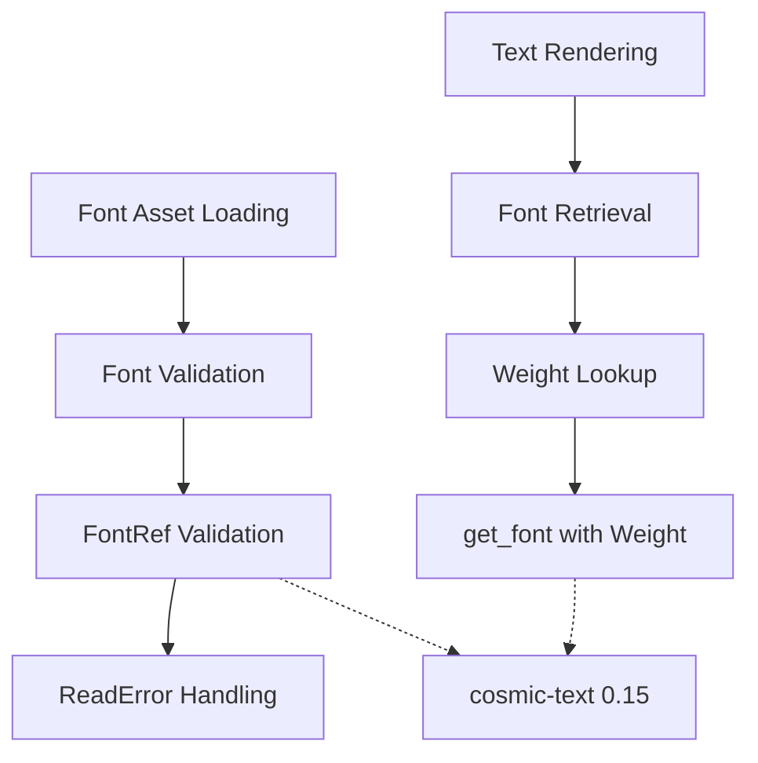

+++
title = "#21699 Update to cosmic-text 0.15"
date = "2025-11-13T00:00:00"
draft = false
template = "pull_request_page.html"
in_search_index = true

[taxonomies]
list_display = ["show"]

[extra]
current_language = "en"
available_languages = {"en" = { name = "English", url = "/pull_request/bevy/2025-11/pr-21699-en-20251113" }, "zh-cn" = { name = "中文", url = "/pull_request/bevy/2025-11/pr-21699-zh-cn-20251113" }}
labels = ["C-Dependencies", "A-Text", "D-Modest"]
+++

# Title
Update to cosmic-text 0.15

## Basic Information
- **Title**: Update to cosmic-text 0.15
- **PR Link**: https://github.com/bevyengine/bevy/pull/21699
- **Author**: ickshonpe
- **Status**: MERGED
- **Labels**: C-Dependencies, S-Ready-For-Final-Review, A-Text, D-Modest
- **Created**: 2025-10-30T20:39:29Z
- **Merged**: 2025-11-13T01:56:35Z
- **Merged By**: cart

## Description Translation
# Objective

Update `bevy_text`'s cosmic-text dependency to 0.15

Fixes #21766

## Solution

Very minimal changes here, nothing user facing except an error return type.

* Cosmic-text no longer uses `ttf_parser`, so, to validate fonts during asset loading, a `skrifa::FontRef` is constructed instead. If the font is invalid, the font asset loader now returns a `skrifa::ReadError`, not a `ttf_parser::FaceParsingError`.
* To get a font from the global `CosmicFontSystem` instance, the `get_font` function requires a weight now. The weight is looked up from the `CosmicFontSystems` font database, immediately before the `get_font` call.

The changes here are a little hackish, but that's a symptom of our lack of support for font collections.

## The Story of This Pull Request

This pull request addresses a dependency update from cosmic-text 0.14 to 0.15, which required adapting to breaking changes in the underlying font parsing library. The core issue was that cosmic-text migrated from using `ttf_parser` to `skrifa` for font handling, which necessitated changes in how Bevy validates fonts and retrieves font metrics.

The problem emerged because cosmic-text 0.15's API changes broke Bevy's existing font loading pipeline. Specifically, the font validation mechanism needed to transition from `ttf_parser::Face` to `skrifa::FontRef`, and the font retrieval API now required additional parameters that weren't previously needed.

The solution approach was straightforward but required careful adaptation of the font loading and retrieval logic. The implementation involved two main changes:

First, the font validation in `Font::try_from_bytes` was updated to use `skrifa::FontRef::from_index` instead of `ttf_parser::Face::parse`. This change also required updating the error type throughout the font loading pipeline from `ttf_parser::FaceParsingError` to `skrifa::raw::ReadError`.

Second, the text rendering pipeline needed to adapt to cosmic-text's new `get_font` API, which now requires a font weight parameter. Since Bevy's current font system doesn't store font weights directly, the implementation looks up the weight from the cosmic-text font database right before calling `get_font`.

The technical insights from this update reveal some architectural limitations in Bevy's current font handling. The author notes that the solution is "a little hackish" because it exposes Bevy's lack of proper support for font collections and comprehensive font metadata management. The current approach works around these limitations by querying the cosmic-text database directly when needed.

The impact of these changes is minimal from a user perspective - the main observable difference is the different error type returned when font loading fails. However, the update ensures compatibility with the latest cosmic-text version and maintains the text rendering functionality without performance regressions.

From an engineering perspective, this PR demonstrates a common pattern in dependency management: adapting to upstream API changes while maintaining backward compatibility for users. The changes are surgical and focused, affecting only the necessary components to make the upgrade work.

## Visual Representation



## Key Files Changed

### `crates/bevy_text/Cargo.toml`
Updated the cosmic-text dependency from 0.14 to 0.15:
```toml
# Before:
cosmic-text = { version = "0.14", features = ["shape-run-cache"] }

# After:
cosmic-text = { version = "0.15", features = ["shape-run-cache"] }
```

### `crates/bevy_text/src/font.rs`
Updated font validation to use skrifa instead of ttf_parser:
```rust
// Before:
pub fn try_from_bytes(font_data: Vec<u8>) -> Result<Self, cosmic_text::ttf_parser::FaceParsingError> {
    use cosmic_text::ttf_parser;
    ttf_parser::Face::parse(&font_data, 0)?;
    Ok(Self {
        data: Arc::new(font_data),
    })
}

// After:
pub fn try_from_bytes(font_data: Vec<u8>) -> Result<Self, ReadError> {
    let _ = FontRef::from_index(&font_data, 0)?;
    Ok(Self {
        data: Arc::new(font_data),
    })
}
```

### `crates/bevy_text/src/font_loader.rs`
Updated error type to match the new validation mechanism:
```rust
// Before:
#[error(transparent)]
Content(#[from] cosmic_text::ttf_parser::FaceParsingError),

// After:
#[error(transparent)]
Content(#[from] ReadError),
```

### `crates/bevy_text/src/pipeline.rs`
Updated font retrieval to include weight parameter:
```rust
// Before:
if let Some(font) = font_system.get_font(*id) {

// After:
let weight = font_system
    .db()
    .face(*id)
    .map(|f| f.weight)
    .unwrap_or(cosmic_text::Weight::NORMAL);
if let Some(font) = font_system.get_font(*id, weight) {
```

## Further Reading

- [cosmic-text GitHub Repository](https://github.com/pop-os/cosmic-text) - The text shaping and layout library used by Bevy
- [skrifa crate documentation](https://docs.rs/skrifa/) - The new font parsing backend used by cosmic-text 0.15
- [Bevy Text Documentation](https://docs.rs/bevy_text/) - Bevy's text rendering capabilities
- [Font Weight in Typography](https://developer.mozilla.org/en-US/docs/Web/CSS/font-weight) - Understanding font weight values in CSS (similar concepts apply)