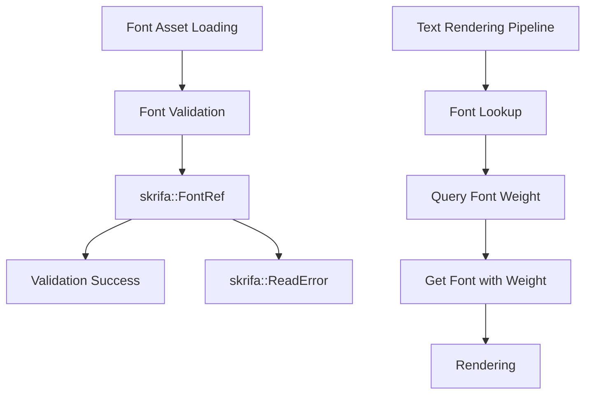

+++
title = "#21699 Update to cosmic-text 0.15"
date = "2025-11-13T00:00:00"
draft = false
template = "pull_request_page.html"
in_search_index = false

[extra]
current_language = "zh-cn"
available_languages = {"en" = { name = "English", url = "/pull_request/bevy/2025-11/pr-21699-en-20251113" }, "zh-cn" = { name = "中文", url = "/pull_request/bevy/2025-11/pr-21699-zh-cn-20251113" }}
labels = ["C-Dependencies", "A-Text", "D-Modest"]
+++

# Title

## Basic Information
- **Title**: Update to cosmic-text 0.15
- **PR Link**: https://github.com/bevyengine/bevy/pull/21699
- **Author**: ickshonpe
- **Status**: MERGED
- **Labels**: C-Dependencies, S-Ready-For-Final-Review, A-Text, D-Modest
- **Created**: 2025-10-30T20:39:29Z
- **Merged**: 2025-11-13T01:56:35Z
- **Merged By**: cart

## Description Translation
**目标**

更新 `bevy_text` 的 cosmic-text 依赖到 0.15 版本

修复 #21766

**解决方案**

这里的改动非常小，除了错误返回类型外，没有用户可见的变化。

* Cosmic-text 不再使用 `ttf_parser`，因此为了在资源加载期间验证字体，改为构造 `skrifa::FontRef`。如果字体无效，字体资源加载器现在返回 `skrifa::ReadError`，而不是 `ttf_parser::FaceParsingError`。
* 要从全局 `CosmicFontSystem` 实例获取字体，`get_font` 函数现在需要权重参数。在调用 `get_font` 之前，会从 `CosmicFontSystems` 字体数据库中查找权重。

这里的改动有点临时，但这反映了我们缺乏对字体集合的支持。

## The Story of This Pull Request

这个PR的核心是一个依赖升级任务。开发团队需要将cosmic-text依赖从0.14版本更新到0.15版本，以解决兼容性问题并保持依赖的现代化。这种类型的维护工作在大型项目中很常见，特别是当底层库进行重大API变更时。

问题的根源在于cosmic-text 0.15版本进行了内部重构，移除了对`ttf_parser`的依赖，转而使用`skrifa`库来处理字体解析。这种底层依赖的变化需要Bevy代码库进行相应的适配。

在字体验证方面，代码需要进行根本性的改变。之前的实现使用`ttf_parser::Face::parse`来验证字体数据：

```rust
// Before:
pub fn try_from_bytes(font_data: Vec<u8>) -> Result<Self, cosmic_text::ttf_parser::FaceParsingError> {
    use cosmic_text::ttf_parser;
    ttf_parser::Face::parse(&font_data, 0)?;
    Ok(Self {
        data: Arc::new(font_data),
    })
}
```

现在改为使用`skrifa::FontRef::from_index`：

```rust
// After:
pub fn try_from_bytes(font_data: Vec<u8>) -> Result<Self, ReadError> {
    let _ = FontRef::from_index(&font_data, 0)?;
    Ok(Self {
        data: Arc::new(font_data),
    })
}
```

这种变化不仅仅是API调用方式的改变，还涉及到错误类型的变更。从`ttf_parser::FaceParsingError`到`skrifa::ReadError`的转换需要在错误处理链中进行相应的更新。

另一个重要的变化是在字体获取方面。新的cosmic-text API要求在使用`get_font`函数时提供字体权重参数。这个需求暴露了Bevy当前字体系统的一个限制——缺乏对字体集合的完整支持。开发人员采用了一个实用的解决方案：在调用`get_font`之前，从字体数据库中动态查询权重信息：

```rust
// 新增的权重查询逻辑
let weight = font_system
    .db()
    .face(*id)
    .map(|f| f.weight)
    .unwrap_or(cosmic_text::Weight::NORMAL);
if let Some(font) = font_system.get_font(*id, weight) {
    // 使用字体
}
```

这种方法虽然被作者描述为"有点临时"，但在当前架构约束下是一个合理的折中方案。它确保了API的兼容性，同时为将来更完整的字体集合支持留下了改进空间。

从工程角度来看，这个PR展示了处理依赖升级的典型模式：识别API变化、更新相应的调用、调整错误处理，以及在必要时实现适配层。整个过程保持了向后兼容性，没有破坏现有的用户代码。

## Visual Representation



## Key Files Changed

### `crates/bevy_text/Cargo.toml`
**变化**: 更新cosmic-text依赖版本
```toml
# Before:
cosmic-text = { version = "0.14", features = ["shape-run-cache"] }

# After:
cosmic-text = { version = "0.15", features = ["shape-run-cache"] }
```

### `crates/bevy_text/src/font.rs`
**变化**: 字体验证从ttf_parser迁移到skrifa
```rust
// Before:
pub fn try_from_bytes(
    font_data: Vec<u8>,
) -> Result<Self, cosmic_text::ttf_parser::FaceParsingError> {
    use cosmic_text::ttf_parser;
    ttf_parser::Face::parse(&font_data, 0)?;
    Ok(Self {
        data: Arc::new(font_data),
    })
}

// After:
pub fn try_from_bytes(font_data: Vec<u8>) -> Result<Self, ReadError> {
    let _ = FontRef::from_index(&font_data, 0)?;
    Ok(Self {
        data: Arc::new(font_data),
    })
}
```

### `crates/bevy_text/src/font_loader.rs`
**变化**: 更新错误类型以匹配新的验证机制
```rust
// Before:
#[error(transparent)]
Content(#[from] cosmic_text::ttf_parser::FaceParsingError),

// After:
#[error(transparent)]
Content(#[from] ReadError),
```

### `crates/bevy_text/src/pipeline.rs`
**变化**: 适配新的get_font API，需要提供字体权重
```rust
// 新增的权重查询和字体获取逻辑
let weight = font_system
    .db()
    .face(*id)
    .map(|f| f.weight)
    .unwrap_or(cosmic_text::Weight::NORMAL);
if let Some(font) = font_system.get_font(*id, weight) {
    // 使用字体进行渲染
}
```

## Further Reading

- [cosmic-text GitHub Repository](https://github.com/pop-os/cosmic-text) - 了解底层文本渲染库
- [skrifa crate documentation](https://docs.rs/skrifa) - 新的字体处理库
- [Bevy Text System Documentation](https://docs.rs/bevy_text) - Bevy文本系统的使用指南
- [Semantic Versioning and Breaking Changes](https://semver.org/) - 理解依赖版本管理和破坏性变更