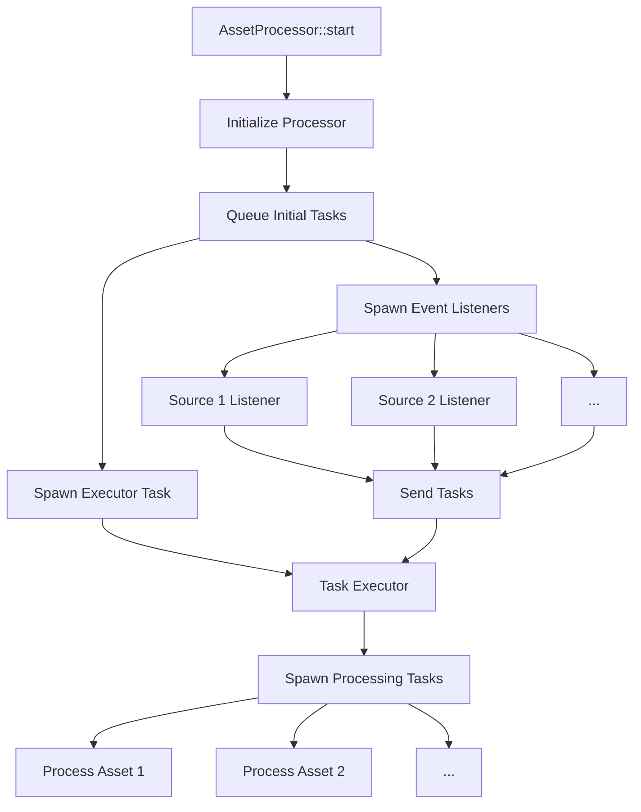

+++
title = "#21701 Parallelize and simplify the asset processing loop."
date = "2025-11-05T00:00:00"
draft = false
template = "pull_request_page.html"
in_search_index = true

[taxonomies]
list_display = ["show"]

[extra]
current_language = "en"
available_languages = {"en" = { name = "English", url = "/pull_request/bevy/2025-11/pr-21701-en-20251105" }, "zh-cn" = { name = "中文", url = "/pull_request/bevy/2025-11/pr-21701-zh-cn-20251105" }}
labels = ["A-Assets", "C-Performance", "C-Code-Quality", "D-Modest"]
+++

# Parallelize and simplify the asset processing loop

## Basic Information
- **Title**: Parallelize and simplify the asset processing loop.
- **PR Link**: https://github.com/bevyengine/bevy/pull/21701
- **Author**: andriyDev
- **Status**: MERGED
- **Labels**: A-Assets, C-Performance, C-Code-Quality, S-Ready-For-Final-Review, D-Modest
- **Created**: 2025-10-31T00:45:27Z
- **Merged**: 2025-11-05T18:11:02Z
- **Merged By**: alice-i-cecile

## Description Translation
# Objective

- The previous asset processing loop was very difficult to understand (IMO).
    - The initial processing of tasks would start a bunch of tasks. Then listening would listen for events and then await on processing tasks one at a time before continuing to listen to events. Finishing a task would also add paths to a **separate** `check_reprocess_queue` which would only be checked after all the current events have been handled.
- Also processing tasks did not occur in parallel - so we'd process assets one at a time.

## Solution

Approximately throw everything out. The asset processor now does these things:

1. Initialize the processor: same as before, recover from the transaction log, initialize the state of all processed assets (so we can lock them).
2. Queue all the initial processing tasks: iterate through all processed sources, finding all their assets, and queue a task for them (to recheck whether they need to be processed, and reprocess them if so). Note we don't spawn any bevy_task::Tasks here.
3. Spawn the "executor" bevy_task::Task: This task spawns the queued tasks and updates the overall state of processing (i.e., processing vs finished).
4. Spawn the source change event listeners: spawns a bevy_task::Task for each asset source to listen on its event receiver and queued up any new tasks as source assets change.

So this parallelizes event processing from asset sources, parallelizes processing each asset, and (IMO) makes the whole processing loop much simpler.

Also I think it's funny that parallelizing could make things simpler lol.

### Caveats

- I've removed the public methods for `process_assets` and `listen_for_source_change_events`. My guess is these were public so that users can call them outside the context of a running app? I'm not entirely sure. I think this needs to be rethought though if that's the case. For one, a running app currently will not be gated on processing from another app, meaning things will probably get out-of-sync very easily. If need be, I think we can bring this back fairly straight forward. There also isn't a migration guide since there's nothing to migrate to here.
- Parallelizing asset processing **could** be bad for very large tasks. Some GLTF files can get REALLY big, and managing memory there is very important (though we're still bad at this). So parallelizing asset processing can result in many tasks running concurrently consuming more memory without a way to control it. However I think this is a more general problem and we should find other solutions than "don't parallelize".

## Testing

- The asset processing tests still pass!
- The asset_processing example seems to behave the same!

## The Story of This Pull Request

The asset processing system in Bevy was facing two major problems: complexity and performance. The original implementation had a convoluted processing loop that was difficult to understand and debug, while also processing assets sequentially, creating a performance bottleneck.

The complexity stemmed from several intertwined concerns. The system would start processing tasks, then listen for events while awaiting tasks one at a time. When tasks finished, they would add paths to a separate `check_reprocess_queue` that was only checked after all current events were handled. This created multiple coordination points and made the flow hard to follow.

The developer took a radical approach to solving both problems simultaneously: parallelize everything and simplify the architecture. The new design separates concerns cleanly into four distinct phases that run concurrently:

1. **Initialization** - Recover from transaction logs and initialize asset states
2. **Task Queueing** - Scan all processed sources and queue processing tasks
3. **Task Execution** - Spawn and manage the actual processing tasks
4. **Event Listening** - Handle source change events and queue new tasks

The key insight was that by using async channels for communication between components, the system could be both parallel and simpler. Each component focuses on one responsibility, and the channel-based communication creates clear boundaries between them.

The implementation uses `async_channel` to create an unbounded channel for task coordination. The `new_task_sender` is used by both the initial scanning and event listeners to queue tasks, while the `new_task_receiver` is consumed by the executor to spawn actual processing tasks. This design allows multiple producers (initial scanning and event listeners) to feed tasks to a single consumer (executor) that manages the parallel execution.

One notable change was the removal of the separate `check_reprocess_queue`. Instead, when assets need reprocessing, they're simply sent through the same channel as new tasks. This eliminates the complex coordination logic that was previously needed to manage the reprocessing queue.

The parallelization does introduce a potential memory concern for very large assets like GLTF files, as noted in the caveats. However, the developer argued this is a general memory management problem that should be solved separately rather than preventing parallelization.

## Visual Representation



## Key Files Changed

### `crates/bevy_asset/src/processor/mod.rs` (+221/-140)

This file contains the core logic changes that implement the new parallel processing architecture. The main changes include:

1. **Complete rewrite of the `start` method** to implement the new four-phase approach
2. **New task coordination system** using `async_channel` for communication
3. **Parallel event processing** with separate tasks for each asset source
4. **Simplified state management** by eliminating complex reprocessing queues

Key code changes:

```rust
// Before: Complex sequential processing
pub async fn process_assets(&self) {
    let start_time = std::time::Instant::now();
    debug!("Processing Assets");
    let mut tasks = vec![];
    self.initialize().await.unwrap();
    for source in self.sources().iter_processed() {
        self.process_assets_internal(source, PathBuf::from(""), &mut tasks)
            .await
            .unwrap();
    }
    join_all(tasks).await;
    self.finish_processing_assets().await;
    let end_time = std::time::Instant::now();
    debug!("Processing finished in {:?}", end_time - start_time);
}

// After: Parallel task-based processing
pub fn start(processor: Res<Self>) {
    let processor = processor.clone();
    IoTaskPool::get()
        .spawn(async move {
            let start_time = std::time::Instant::now();
            debug!("Processing Assets");

            processor.initialize().await.unwrap();

            let (new_task_sender, new_task_receiver) = async_channel::unbounded();
            processor
                .queue_initial_processing_tasks(&new_task_sender)
                .await;

            // Spawn executor task
            {
                let processor = processor.clone();
                let new_task_sender = new_task_sender.clone();
                IoTaskPool::get()
                    .spawn(async move {
                        processor
                            .execute_processing_tasks(new_task_sender, new_task_receiver)
                            .await;
                    })
                    .detach();
            }

            processor.data.wait_until_finished().await;

            let end_time = std::time::Instant::now();
            debug!("Processing finished in {:?}", end_time - start_time);

            debug!("Listening for changes to source assets");
            processor.spawn_source_change_event_listeners(&new_task_sender);
        })
        .detach();
}
```

The event handling was also significantly simplified:

```rust
// Before: Complex event processing with manual polling
while let Some(mut item) = {
    if next.is_none() {
        next = Some(all_receiver.next());
    }
    next.take().unwrap()
}.await
{
    self.set_state(ProcessorState::Processing).await;
    loop {
        let (source_id, event) = item;
        self.handle_asset_source_event(self.data.sources.get(source_id).unwrap(), event)
            .await;
        let mut next_next = all_receiver.next();
        item = match poll_once(&mut next_next).await {
            None => {
                next = Some(next_next);
                break;
            }
            Some(None) => return,
            Some(Some(item)) => item,
        };
    }
    self.finish_processing_assets().await;
}

// After: Simple parallel event listeners per source
fn spawn_source_change_event_listeners(
    &self,
    sender: &async_channel::Sender<(AssetSourceId<'static>, PathBuf)>,
) {
    for source in self.data.sources.iter_processed() {
        let Some(receiver) = source.event_receiver().cloned() else {
            continue;
        };
        let source_id = source.id();
        let processor = self.clone();
        let sender = sender.clone();
        IoTaskPool::get()
            .spawn(async move {
                while let Ok(event) = receiver.recv().await {
                    let Ok(source) = processor.get_source(source_id.clone()) else {
                        return;
                    };
                    processor
                        .handle_asset_source_event(source, event, &sender)
                        .await;
                }
            })
            .detach();
    }
}
```

### `crates/bevy_asset/Cargo.toml` (+1/-0)

Added the `async-await-macro` feature to `futures-util` to support the new async architecture:

```toml
futures-util = { version = "0.3", default-features = false, features = [
  "async-await-macro",
  "alloc",
] }
```

## Further Reading

- [Bevy Asset System Documentation](https://bevyengine.org/learn/book/assets/)
- [async-channel crate documentation](https://docs.rs/async-channel/)
- [Bevy Tasks and Parallelism](https://bevyengine.org/learn/book/async-tasks/)
- [Rust Async/Await Patterns](https://rust-lang.github.io/async-book/)