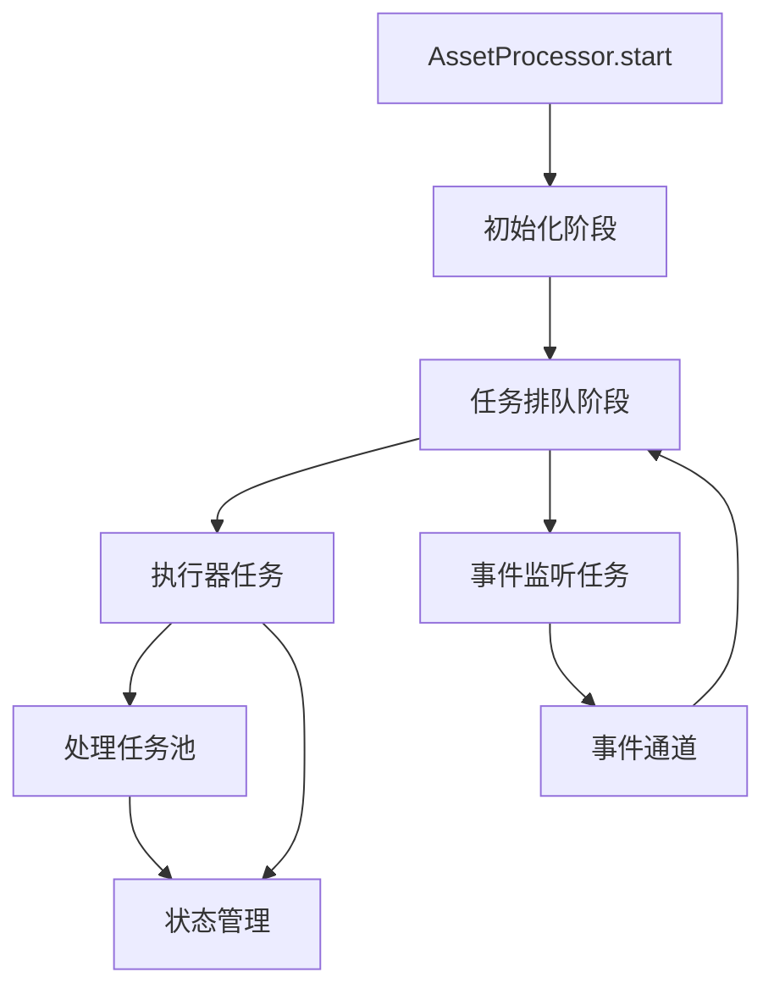

+++
title = "#21701 Parallelize and simplify the asset processing loop."
date = "2025-11-05T00:00:00"
draft = false
template = "pull_request_page.html"
in_search_index = false

[extra]
current_language = "zh-cn"
available_languages = {"en" = { name = "English", url = "/pull_request/bevy/2025-11/pr-21701-en-20251105" }, "zh-cn" = { name = "中文", url = "/pull_request/bevy/2025-11/pr-21701-zh-cn-20251105" }}
labels = ["A-Assets", "C-Performance", "C-Code-Quality", "D-Modest"]
+++

# Parallelize and simplify the asset processing loop.

## Basic Information
- **Title**: Parallelize and simplify the asset processing loop.
- **PR Link**: https://github.com/bevyengine/bevy/pull/21701
- **Author**: andriyDev
- **Status**: MERGED
- **Labels**: A-Assets, C-Performance, C-Code-Quality, S-Ready-For-Final-Review, D-Modest
- **Created**: 2025-10-31T00:45:27Z
- **Merged**: 2025-11-05T18:11:02Z
- **Merged By**: alice-i-cecile

## Description Translation
**目标**

- 之前的资产处理循环非常难以理解（在我看来）。
    - 初始处理任务会启动一堆任务。然后监听会监听事件，并在继续监听事件之前一次等待一个处理任务。完成一个任务还会将路径添加到**单独的**`check_reprocess_queue`中，该队列只有在所有当前事件处理完后才会被检查。
- 而且处理任务不是并行发生的 - 所以我们会一次处理一个资产。

**解决方案**

大致上把一切都扔掉。资产处理器现在做这些事情：

1. 初始化处理器：和之前一样，从事务日志中恢复，初始化所有已处理资产的状态（以便我们可以锁定它们）。
2. 排队所有初始处理任务：遍历所有已处理的源，找到它们的所有资产，并为它们排队一个任务（重新检查它们是否需要被处理，如果需要则重新处理）。注意我们这里没有生成任何bevy_task::Tasks。
3. 生成"执行器"bevy_task::Task：这个任务生成已排队的任务并更新处理的整体状态（即，处理中 vs 完成）。
4. 生成源变更事件监听器：为每个资产源生成一个bevy_task::Task来监听其事件接收器，并在源资产变更时排队任何新任务。

所以这并行化了来自资产源的事件处理，并行化了处理每个资产，并且（在我看来）使整个处理循环简单得多。

而且我觉得并行化可以让事情变得更简单，这很有趣。

**注意事项**

- 我已经移除了`process_assets`和`listen_for_source_change_events`的公共方法。我猜这些是公共的，以便用户可以在运行的应用上下文之外调用它们？我不完全确定。我认为如果需要的话，这需要重新考虑。首先，一个正在运行的应用目前不会等待来自另一个应用的处理，这意味着事情可能很容易失去同步。如果需要，我认为我们可以相当直接地恢复这个。这里也没有迁移指南，因为这里没有什么可以迁移的。
- 并行化资产处理**可能**对非常大的任务不利。一些GLTF文件可能真的很大，在那里管理内存非常重要（尽管我们在这方面仍然很差）。所以并行化资产处理可能导致许多任务并发运行，消耗更多内存，而无法控制它。然而我认为这是一个更普遍的问题，我们应该找到其他解决方案，而不是"不要并行化"。

**测试**

- 资产处理测试仍然通过！
- asset_processing示例似乎行为相同！

## The Story of This Pull Request

这个PR的故事始于对Bevy引擎资产处理系统复杂性的识别。原有的资产处理循环存在两个核心问题：代码逻辑难以理解，以及处理性能受限于串行执行。

原有的处理流程采用了一种混合的同步-异步模式：初始处理会启动一批任务，然后系统进入监听事件和逐个等待处理任务完成的循环。更复杂的是，完成的任务会将需要重新处理的路径添加到一个单独的`check_reprocess_queue`队列中，这个队列只有在所有当前事件处理完成后才会被检查。这种设计导致了逻辑分散和难以追踪的数据流。

**解决方案的技术设计**

开发者选择了彻底重构而非渐进改进。新的架构将处理流程分解为四个清晰的阶段：

1. **初始化阶段**：与之前相同，负责从事务日志恢复状态和初始化资产锁定
2. **任务排队阶段**：遍历所有已处理的资产源，为每个资产创建处理任务但不立即执行
3. **执行器阶段**：专门的异步任务负责实际执行排队的处理任务并管理整体状态
4. **事件监听阶段**：为每个资产源创建独立的事件监听任务

这种设计的核心优势在于将任务生成、任务执行和事件监听解耦，使得每个组件可以专注于单一职责。

**实现细节与代码演变**

关键的变化体现在新的`execute_processing_tasks`方法中，它使用`select_biased`来同时处理新任务到达和任务完成两种事件：

```rust
select_biased! {
    result = new_task_receiver.recv().fuse() => {
        result.map(|(source_id, path)| ProcessorTaskEvent::Start(source_id, path))
    },
    result = task_finished_receiver.recv().fuse() => {
        result.map(|()| ProcessorTaskEvent::Finished)
    }
}
```

这种方法取代了原有的复杂事件循环，提供了更清晰的状态管理。当有新任务时，系统增加`pending_tasks`计数并设置状态为`Processing`；当任务完成时，减少计数并在所有任务完成时设置状态为`Finished`。

**依赖关系管理的改进**

原有的`check_reprocess_queue`机制被完全移除，取而代之的是通过通道发送重新处理请求：

```rust
// 之前：使用队列
infos.check_reprocess_queue.push_back(dependent);

// 之后：使用通道
let _ = new_task_sender.send((dependent.source().clone_owned(), dependent.path().to_owned())).await;
```

这种改变使得依赖关系处理更加直接，并且自然地融入了新的并行架构。

**性能与内存权衡**

PR作者明确承认了并行化可能带来的内存消耗问题，特别是对于大型GLTF文件。然而，他们采取了务实的立场：将内存管理视为一个需要单独解决的通用问题，而不是因此放弃并行化的性能优势。

**公共API的变更**

移除了`process_assets`和`listen_for_source_change_events`公共方法，这反映了架构理念的转变 - 资产处理现在被视为一个集成的系统级操作，而不是可以由外部代码随意调用的独立功能。

**技术洞察**

这个重构展示了几个重要的软件工程原则：
- 并行化不仅可以提高性能，还可以通过强制清晰的职责分离来简化架构
- 基于通道的通信比共享状态队列更易于推理和维护
- 有时彻底的重构比在现有复杂代码上修补更有效

最终，这个PR成功地将一个难以理解的复杂处理循环转变为结构清晰、性能更好的并行系统，同时保持了向后兼容的行为。

## Visual Representation



## Key Files Changed

### `crates/bevy_asset/src/processor/mod.rs` (+221/-140)

这是主要的代码变更文件，实现了资产处理循环的完整重构。

**关键变更：**

1. **新的处理流程架构**：
```rust
// 新的start方法结构
pub fn start(processor: Res<Self>) {
    IoTaskPool::get().spawn(async move {
        processor.initialize().await.unwrap();
        
        let (new_task_sender, new_task_receiver) = async_channel::unbounded();
        processor.queue_initial_processing_tasks(&new_task_sender).await;
        
        // 执行器任务
        IoTaskPool::get().spawn(async move {
            processor.execute_processing_tasks(new_task_sender, new_task_receiver).await;
        }).detach();
        
        processor.spawn_source_change_event_listeners(&new_task_sender);
    }).detach();
}
```

2. **并行任务执行**：
```rust
async fn execute_processing_tasks(
    &self,
    new_task_sender: async_channel::Sender<(AssetSourceId<'static>, PathBuf)>,
    new_task_receiver: async_channel::Receiver<(AssetSourceId<'static>, PathBuf)>,
) {
    // 使用select_biased并行处理任务开始和完成事件
    while let Ok(event) = select_biased! {
        result = new_task_receiver.recv().fuse() => ...,
        result = task_finished_receiver.recv().fuse() => ...,
    } {
        match event {
            ProcessorTaskEvent::Start(source_id, path) => {
                // 生成新的处理任务
                pending_tasks += 1;
                IoTaskPool::get().spawn(async move {
                    processor.process_asset(source, path, new_task_sender).await;
                }).detach();
            }
            ProcessorTaskEvent::Finished => {
                pending_tasks -= 1;
                // 状态管理
            }
        }
    }
}
```

3. **事件处理集成**：
```rust
fn spawn_source_change_event_listeners(
    &self,
    sender: &async_channel::Sender<(AssetSourceId<'static>, PathBuf)>,
) {
    for source in self.data.sources.iter_processed() {
        IoTaskPool::get().spawn(async move {
            while let Ok(event) = receiver.recv().await {
                processor.handle_asset_source_event(source, event, &sender).await;
            }
        }).detach();
    }
}
```

### `crates/bevy_asset/Cargo.toml` (+1/-0)

**依赖项更新：**
```toml
futures-util = { version = "0.3", default-features = false, features = [
  "async-await-macro",  # 新增特性
  "alloc",
] }
```

添加了`async-await-macro`特性以支持新的异步模式，特别是`select_biased`宏的使用。

## Further Reading

- [Bevy Assets Documentation](https://bevyengine.org/learn/books/introduction/assets/)
- [async-channel crate documentation](https://docs.rs/async-channel/)
- [futures-util select_biased documentation](https://docs.rs/futures-util/latest/futures_util/macro.select_biased.html)
- [Rust Async Programming](https://rust-lang.github.io/async-book/)