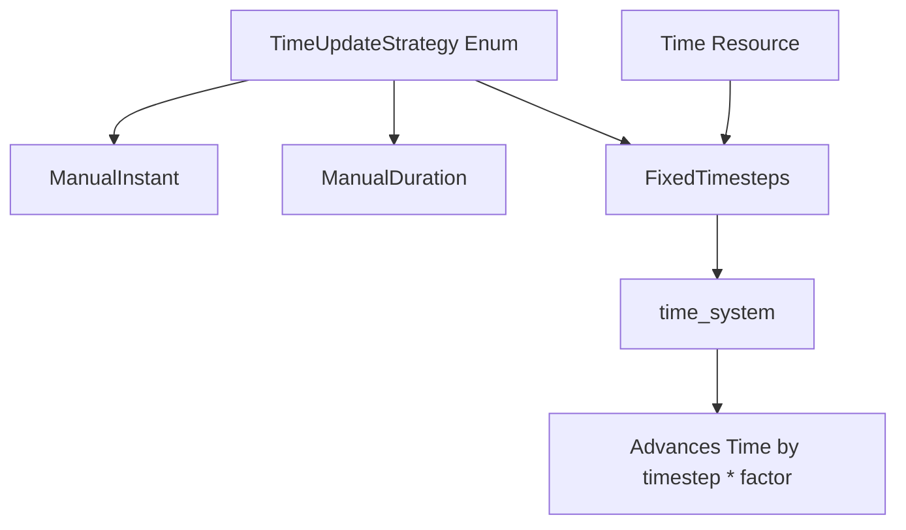

+++
title = "#21705 Make it easier to write tests involving fixed timesteps"
date = "2025-11-01T00:00:00"
draft = false
template = "pull_request_page.html"
in_search_index = true

[taxonomies]
list_display = ["show"]

[extra]
current_language = "en"
available_languages = {"en" = { name = "English", url = "/pull_request/bevy/2025-11/pr-21705-en-20251101" }, "zh-cn" = { name = "中文", url = "/pull_request/bevy/2025-11/pr-21705-zh-cn-20251101" }}
labels = ["C-Usability", "A-Time", "D-Straightforward"]
+++

# Title

## Basic Information
- **Title**: Make it easier to write tests involving fixed timesteps
- **PR Link**: https://github.com/bevyengine/bevy/pull/21705
- **Author**: janhohenheim
- **Status**: MERGED
- **Labels**: C-Usability, S-Ready-For-Final-Review, A-Time, D-Straightforward
- **Created**: 2025-10-31T19:39:23Z
- **Merged**: 2025-11-01T19:20:41Z
- **Merged By**: mockersf

## Description Translation
# Objective

- For running tests involving fixed timesteps, I want to advance the time so that every call to `app.update()` triggers a fixed update
- Right now, the most precise way to do that to my knowledge is
  ```rust
  app.insert_resource(TimeUpdateStrategy::ManualDuration(Time::<Fixed>::default().timestep()))
  ```
- But this is a bit clumsy, and also doesn't work when the fixed timestep isn't at the default. Some more boilerplate would be needed in the test setup to deal with that:
  ```rust
  app.insert_resource(TimeUpdateStrategy::ManualDuration(app.world().resource::<Time<Fixed>>().timestep()))
  ```
- Good luck adapting this for the case when the fixed timestep ever changes at runtime lol

## Solution

- Create an alternative strategy called `TimeUpdateStrategy::FixedTimesteps` that advances time by the fixed timestep automatically:
  ```rust
  // Now `app.update()` will run the fixed loop exactly once!
  app.insert_resource(TimeUpdateStrategy::FixedTimesteps(1))
  ```

## Testing

- None, as this is trivial

## The Story of This Pull Request

The problem started with testing fixed timestep systems in Bevy. When writing tests for game logic that depends on fixed updates, developers need precise control over how time advances between `app.update()` calls. The goal was to ensure each call to `app.update()` would trigger exactly one fixed update, which requires advancing time by exactly the fixed timestep duration.

The existing approach using `TimeUpdateStrategy::ManualDuration` had several practical issues. First, it required manually calculating the timestep duration, which was verbose and error-prone. Second, it didn't adapt to changes in the fixed timestep configuration - if a test changed the timestep value, the manual duration calculation would be incorrect. Third, the boilerplate code made tests harder to read and maintain.

The solution introduced a new `TimeUpdateStrategy::FixedTimesteps` variant that directly addresses these issues. Instead of requiring manual duration calculations, this new strategy automatically uses the current fixed timestep from the `Time<Fixed>` resource and multiplies it by a factor. This means developers can simply specify how many fixed timesteps they want to advance per frame update.

The implementation required two key changes. First, the enum definition was extended with the new variant. Second, the time system was modified to handle this new case by accessing the fixed time resource and multiplying its timestep by the specified factor. This approach maintains consistency with the existing time update architecture while providing a much cleaner API for testing.

From a technical perspective, this change demonstrates good API design principles. It solves the immediate testing pain point while being flexible enough to handle multiple timesteps per update. The factor parameter allows tests to simulate scenarios where multiple fixed updates occur in a single frame, which is common in real-world game scenarios when frame times exceed the fixed timestep.

The impact is significant for developers writing tests involving fixed timesteps. Test setup code becomes more readable and less error-prone. The new approach automatically adapts to changes in fixed timestep configuration, making tests more robust. This is particularly valuable for test suites that need to verify behavior under different timestep configurations.

## Visual Representation



## Key Files Changed

### `crates/bevy_time/src/lib.rs` (+7/-0)

This file contains the core changes that implement the new fixed timestep strategy.

**Key modifications:**
```rust
// Added new enum variant
pub enum TimeUpdateStrategy {
    // ... existing variants ...
    /// [`Time`] will be incremented by the fixed timestep each frame, multiplied by the specified factor `n`.
    /// This means that a call to [`App::update`] will always run the fixed loop exactly n times.
    FixedTimesteps(u32),
}

// Modified time_system to handle the new variant
pub fn time_system(
    mut real_time: ResMut<Time<Real>>,
    mut virtual_time: ResMut<Time<Virtual>>,
    fixed_time: Res<Time<Fixed>>,  // Added this parameter
    mut time: ResMut<Time>,
    update_strategy: Res<TimeUpdateStrategy>,
    #[cfg(feature = "std")] time_recv: Option<Res<TimeReceiver>>,
) {
    // ... existing logic ...
    
    // Added this match arm
    TimeUpdateStrategy::FixedTimesteps(factor) => {
        real_time.update_with_duration(fixed_time.timestep() * *factor);
    }
}
```

The changes add a new variant to the `TimeUpdateStrategy` enum and modify the `time_system` to handle this case by accessing the fixed time resource and using its timestep multiplied by the specified factor.

### `crates/bevy_time/src/fixed.rs` (+1/-1)

This file contains a minor whitespace cleanup that doesn't affect functionality.

**Change:**
```rust
// Before:
///     
// After:
///
```

This is purely a documentation formatting fix that removes trailing whitespace.

## Further Reading

- [Bevy Time Documentation](https://docs.rs/bevy_time/latest/bevy_time/) - Official documentation for Bevy's time systems
- [Fixed Timestep Pattern](https://gafferongames.com/post/fix_your_timestep/) - Classic article on fixed timestep implementation patterns
- [Bevy Testing Guide](https://bevy-cheatbook.github.io/programming/testing.html) - General testing patterns in Bevy

# Full Code Diff
diff --git a/crates/bevy_time/src/fixed.rs b/crates/bevy_time/src/fixed.rs
index f1c67ea4a0ca9..13f1590b33a95 100644
--- a/crates/bevy_time/src/fixed.rs
+++ b/crates/bevy_time/src/fixed.rs
@@ -10,7 +10,7 @@ use crate::{time::Time, virt::Virtual};
 ///
 /// A specialization of the [`Time`] structure. **For method documentation, see
 /// [`Time<Fixed>#impl-Time<Fixed>`].**
-///     
+///
 /// It is automatically inserted as a resource by
 /// [`TimePlugin`](crate::TimePlugin) and updated based on
 /// [`Time<Virtual>`](Virtual). The fixed clock is automatically set as the
diff --git a/crates/bevy_time/src/lib.rs b/crates/bevy_time/src/lib.rs
index 3d515597ac6e8..d4c8d67806a37 100644
--- a/crates/bevy_time/src/lib.rs
+++ b/crates/bevy_time/src/lib.rs
@@ -118,6 +118,9 @@ pub enum TimeUpdateStrategy {
     ManualInstant(Instant),
     /// [`Time`] will be incremented by the specified [`Duration`] each frame.
     ManualDuration(Duration),
+    /// [`Time`] will be incremented by the fixed timestep each frame, multiplied by the specified factor `n`.
+    /// This means that a call to [`App::update`] will always run the fixed loop exactly n times.
+    FixedTimesteps(u32),
 }
 
 /// Channel resource used to receive time from the render world.
@@ -144,6 +147,7 @@ pub fn create_time_channels() -> (TimeSender, TimeReceiver) {
 pub fn time_system(
     mut real_time: ResMut<Time<Real>>,
     mut virtual_time: ResMut<Time<Virtual>>,
+    fixed_time: Res<Time<Fixed>>,
     mut time: ResMut<Time>,
     update_strategy: Res<TimeUpdateStrategy>,
     #[cfg(feature = "std")] time_recv: Option<Res<TimeReceiver>>,
@@ -175,6 +179,9 @@ pub fn time_system(
         }
         TimeUpdateStrategy::ManualInstant(instant) => real_time.update_with_instant(*instant),
         TimeUpdateStrategy::ManualDuration(duration) => real_time.update_with_duration(*duration),
+        TimeUpdateStrategy::FixedTimesteps(factor) => {
+            real_time.update_with_duration(fixed_time.timestep() * *factor);
+        }
     }
 
     update_virtual_time(&mut time, &mut virtual_time, &real_time);