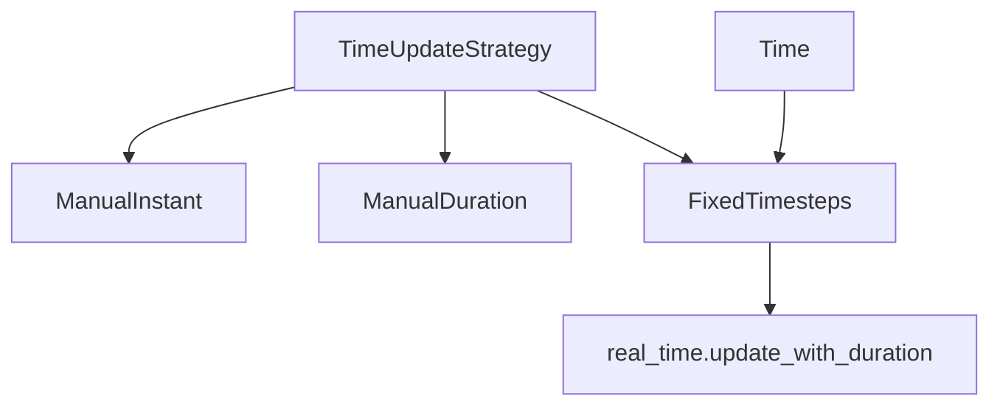

+++
title = "#21705 Make it easier to write tests involving fixed timesteps"
date = "2025-11-01T00:00:00"
draft = false
template = "pull_request_page.html"
in_search_index = false

[extra]
current_language = "zh-cn"
available_languages = {"en" = { name = "English", url = "/pull_request/bevy/2025-11/pr-21705-en-20251101" }, "zh-cn" = { name = "中文", url = "/pull_request/bevy/2025-11/pr-21705-zh-cn-20251101" }}
labels = ["C-Usability", "A-Time", "D-Straightforward"]
+++

# Make it easier to write tests involving fixed timesteps

## Basic Information
- **Title**: Make it easier to write tests involving fixed timesteps
- **PR Link**: https://github.com/bevyengine/bevy/pull/21705
- **Author**: janhohenheim
- **Status**: MERGED
- **Labels**: C-Usability, S-Ready-For-Final-Review, A-Time, D-Straightforward
- **Created**: 2025-10-31T19:39:23Z
- **Merged**: 2025-11-01T19:20:41Z
- **Merged By**: mockersf

## Description Translation
# 目标

- 对于涉及固定时间步长的测试，我希望能够推进时间，使得每次调用 `app.update()` 都会触发一次固定更新
- 目前，据我所知最精确的实现方式是：
  ```rust
  app.insert_resource(TimeUpdateStrategy::ManualDuration(Time::<Fixed>::default().timestep()))
  ```
- 但这有点笨拙，而且在固定时间步长不是默认值的情况下也不起作用。在测试设置中需要更多样板代码来处理这种情况：
  ```rust
  app.insert_resource(TimeUpdateStrategy::ManualDuration(app.world().resource::<Time<Fixed>>().timestep()))
  ```
- 如果固定时间步长在运行时发生变化，那就更难适应了

## 解决方案

- 创建一个名为 `TimeUpdateStrategy::FixedTimesteps` 的替代策略，自动按固定时间步长推进时间：
  ```rust
  // 现在 `app.update()` 将正好运行一次固定循环！
  app.insert_resource(TimeUpdateStrategy::FixedTimesteps(1))
  ```

## 测试

- 没有进行测试，因为这是简单的改动

## The Story of This Pull Request

这个PR解决了一个在Bevy引擎中编写涉及固定时间步长测试时遇到的实际问题。开发者在测试游戏逻辑时，经常需要精确控制时间的推进方式，特别是当代码依赖于固定时间步长更新时。

问题的核心在于现有的时间更新策略不够直观和灵活。开发者想要确保每次调用`app.update()`时，固定时间步长系统都能恰好执行一次。现有的解决方案需要手动计算并设置时间步长，这不仅代码冗长，而且在固定时间步长发生变化时无法自动适应。

开发者最初使用的解决方案是：
```rust
app.insert_resource(TimeUpdateStrategy::ManualDuration(Time::<Fixed>::default().timestep()))
```

这种方法的缺点很明显：它依赖于默认的固定时间步长，如果测试中修改了时间步长设置，这个代码就无法正确工作。更健壮的版本需要从world中获取当前的固定时间步长：
```rust
app.insert_resource(TimeUpdateStrategy::ManualDuration(app.world().resource::<Time<Fixed>>().timestep()))
```

但这仍然不够优雅，而且在时间步长动态变化的情况下维护起来很困难。

解决方案是引入一个新的`TimeUpdateStrategy::FixedTimesteps`变体。这个策略的设计很巧妙 - 它接受一个`u32`类型的乘数参数，允许开发者指定每次更新要执行多少次固定时间步长循环。在实现层面，这个策略利用了系统中已经存在的`Time<Fixed>`资源，自动获取当前设置的固定时间步长。

在技术实现上，这个PR修改了`time_system`函数，添加了对新策略的处理：
```rust
TimeUpdateStrategy::FixedTimesteps(factor) => {
    real_time.update_with_duration(fixed_time.timestep() * *factor);
}
```

这里的关键洞察是，通过将固定时间步长系统的时间步长与新的更新策略解耦，系统能够自动适应任何时间步长的变化。如果测试中修改了固定时间步长，`FixedTimesteps`策略会自动使用新的值，无需修改测试代码。

这个改动体现了良好的API设计原则：它提供了更高级别的抽象，隐藏了实现细节，同时保持了向后兼容性。现有的`ManualDuration`和`ManualInstant`策略仍然可用，新的`FixedTimesteps`策略只是提供了一个更便捷的替代方案。

从工程角度看，这个PR是一个典型的使用体验改进。它没有改变核心功能，而是通过提供更好的工具来简化常见任务。这种类型的改进对于提高开发效率和降低代码错误率非常重要。

## Visual Representation



## Key Files Changed

### `crates/bevy_time/src/lib.rs` (+7/-0)

这个文件包含了主要的逻辑改动，添加了新的时间更新策略变体和相应的处理逻辑。

**关键修改：**

1. 在`TimeUpdateStrategy`枚举中添加了新变体：
```rust
// 新增的变体
/// [`Time`] will be incremented by the fixed timestep each frame, multiplied by the specified factor `n`.
/// This means that a call to [`App::update`] will always run the fixed loop exactly n times.
FixedTimesteps(u32),
```

2. 在`time_system`函数中添加了对新策略的处理：
```rust
// 新增的处理分支
TimeUpdateStrategy::FixedTimesteps(factor) => {
    real_time.update_with_duration(fixed_time.timestep() * *factor);
}
```

**相关修改：**
- 在函数签名中添加了`fixed_time: Res<Time<Fixed>>`参数，用于获取当前的固定时间步长

### `crates/bevy_time/src/fixed.rs` (+1/-1)

这个文件只有格式化的改动，修复了尾随空格问题。

**修改内容：**
```rust
// 修改前：    
// 修改后：
```

这个改动与功能无关，只是代码格式的清理。

## Further Reading

- [Bevy Time System Documentation](https://docs.rs/bevy_time/latest/bevy_time/) - Bevy时间系统的官方文档
- [Fixed Timestep Pattern](https://gameprogrammingpatterns.com/game-loop.html#play-catch-up) - 游戏循环中的固定时间步长模式
- [Rust Enum Patterns](https://doc.rust-lang.org/book/ch06-00-enums.html) - Rust枚举的使用模式