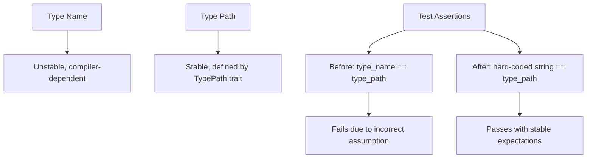

+++
title = "#21706 bevy_reflect: define expected type paths as strings in tests"
date = "2025-11-01T00:00:00"
draft = false
template = "pull_request_page.html"
in_search_index = true

[taxonomies]
list_display = ["show"]

[extra]
current_language = "en"
available_languages = {"en" = { name = "English", url = "/pull_request/bevy/2025-11/pr-21706-en-20251101" }, "zh-cn" = { name = "中文", url = "/pull_request/bevy/2025-11/pr-21706-zh-cn-20251101" }}
labels = ["C-Bug", "C-Testing"]
+++

# Title

## Basic Information
- **Title**: bevy_reflect: define expected type paths as strings in tests
- **PR Link**: https://github.com/bevyengine/bevy/pull/21706
- **Author**: cart
- **Status**: MERGED
- **Labels**: C-Bug, C-Testing
- **Created**: 2025-10-31T20:19:44Z
- **Merged**: 2025-11-01T00:04:53Z
- **Merged By**: cart

## Description Translation
# Objective

`bevy_reflect` tests are failing currently because they rely on `type_name == type_path`, which is not necessarily true (and could change at any time). TypePath exists to solve the type_name stability problem!

Fixes #21702.

## Solution

Hard-code the expected TypePath string as a string literal.

## The Story of This Pull Request

This PR addresses a fundamental testing issue in the bevy_reflect crate where tests were making incorrect assumptions about the relationship between type names and type paths. The core problem was that tests were asserting that `type_name` should equal `type_path`, which is not guaranteed to be true and represents a misunderstanding of what these two concepts represent.

In Rust's type system, `type_name` provides a human-readable name for a type, but this name is not stable and can change between compiler versions or based on optimization settings. The `TypePath` trait was specifically designed to provide a stable, consistent path for types that doesn't suffer from the same instability issues as `type_name`.

The failing tests were checking two type aliases: `MyCowStr` (an alias for `Cow<'static, str>`) and `MyCowSlice` (an alias for `Cow<'static, [u8]>`). The tests were incorrectly assuming that the type path would match the type name of the alias, when in reality the type path should reflect the underlying concrete type.

The solution was straightforward but important: replace the dynamic `core::any::type_name` calls in the test assertions with hard-coded string literals that represent the expected stable type paths. This change ensures that tests are checking for the correct, stable type paths rather than relying on potentially unstable type names.

For the `MyCowStr` type, the test now expects the type path to be `"alloc::borrow::Cow<str>"` instead of the type name of the alias. Similarly, for `MyCowSlice`, the test expects `"alloc::borrow::Cow<[u8]>"` for the type path and `"u8"` for the item type path.

This fix is particularly important because it ensures that the tests are actually validating the correct behavior of the `TypePath` implementation. By hard-coding the expected values, the tests become more reliable and less susceptible to breaking due to compiler changes or optimization differences.

## Visual Representation



## Key Files Changed

**File: `crates/bevy_reflect/src/lib.rs`** (+3/-3)

This file contains the core reflection functionality and tests for the bevy_reflect crate. The changes are focused on fixing test assertions that were making incorrect assumptions about type paths.

**Key changes:**
- Replaced dynamic `type_name` calls with hard-coded string literals in test assertions
- Ensured tests validate stable type paths rather than unstable type names

```rust
// Before:
assert_eq!(core::any::type_name::<MyCowStr>(), info.type_path());

// After:
assert_eq!("alloc::borrow::Cow<str>", info.type_path());
```

```rust
// Before:
assert_eq!(core::any::type_name::<MyCowSlice>(), info.type_path());
assert_eq!(core::any::type_name::<u8>(), info.item_ty().path());

// After:
assert_eq!("alloc::borrow::Cow<[u8]>", info.type_path());
assert_eq!("u8", info.item_ty().path());
```

These changes ensure that the tests are validating the correct, stable type path behavior rather than relying on compiler-specific type name representations.

## Further Reading

- [Rust `core::any::type_name` documentation](https://doc.rust-lang.org/std/any/fn.type_name.html) - Explains the limitations and purpose of type names
- [Bevy TypePath trait documentation](https://docs.rs/bevy_reflect/latest/bevy_reflect/trait.TypePath.html) - Details the stable type path functionality
- [Issue #21702](https://github.com/bevyengine/bevy/issues/21702) - The original issue that prompted this fix

# Full Code Diff
```diff
diff --git a/crates/bevy_reflect/src/lib.rs b/crates/bevy_reflect/src/lib.rs
index 87e868d0dabc1..72397bfe39674 100644
--- a/crates/bevy_reflect/src/lib.rs
+++ b/crates/bevy_reflect/src/lib.rs
@@ -2305,7 +2305,7 @@ mod tests {
         let info = MyCowStr::type_info().as_opaque().unwrap();
 
         assert!(info.is::<MyCowStr>());
-        assert_eq!(core::any::type_name::<MyCowStr>(), info.type_path());
+        assert_eq!("alloc::borrow::Cow<str>", info.type_path());
 
         let value: &dyn Reflect = &Cow::<'static, str>::Owned("Hello!".to_string());
         let info = value.reflect_type_info();
@@ -2319,8 +2319,8 @@ mod tests {
         assert!(info.is::<MyCowSlice>());
         assert!(info.item_ty().is::<u8>());
         assert!(info.item_info().unwrap().is::<u8>());
-        assert_eq!(core::any::type_name::<MyCowSlice>(), info.type_path());
-        assert_eq!(core::any::type_name::<u8>(), info.item_ty().path());
+        assert_eq!("alloc::borrow::Cow<[u8]>", info.type_path());
+        assert_eq!("u8", info.item_ty().path());
 
         let value: &dyn Reflect = &Cow::<'static, [u8]>::Owned(vec![0, 1, 2, 3]);
         let info = value.reflect_type_info();
```