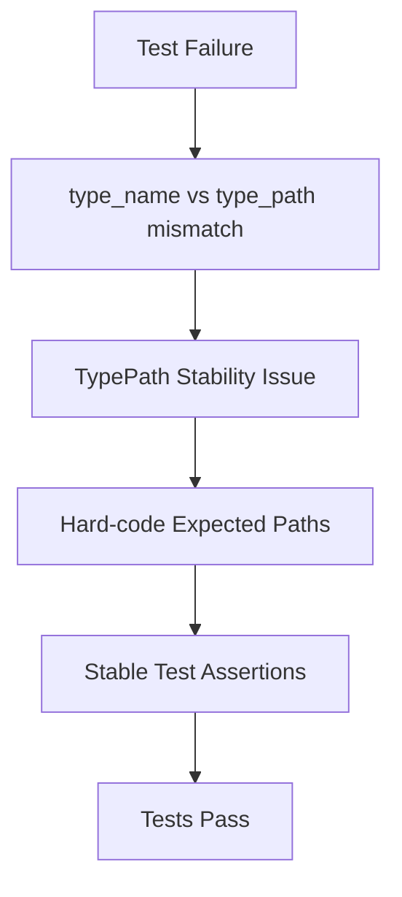

+++
title = "#21706 bevy_reflect: define expected type paths as strings in tests"
date = "2025-11-01T00:00:00"
draft = false
template = "pull_request_page.html"
in_search_index = false

[extra]
current_language = "zh-cn"
available_languages = {"en" = { name = "English", url = "/pull_request/bevy/2025-11/pr-21706-en-20251101" }, "zh-cn" = { name = "中文", url = "/pull_request/bevy/2025-11/pr-21706-zh-cn-20251101" }}
labels = ["C-Bug", "C-Testing"]
+++

# Title

## Basic Information
- **Title**: bevy_reflect: define expected type paths as strings in tests
- **PR Link**: https://github.com/bevyengine/bevy/pull/21706
- **Author**: cart
- **Status**: MERGED
- **Labels**: C-Bug, C-Testing
- **Created**: 2025-10-31T20:19:44Z
- **Merged**: 2025-11-01T00:04:53Z
- **Merged By**: cart

## Description Translation
**目标**

`bevy_reflect` 测试当前失败，因为它们依赖 `type_name == type_path`，但这不一定成立（并且可能随时改变）。TypePath 的存在就是为了解决 type_name 的稳定性问题！

修复 #21702。

**解决方案**

将预期的 TypePath 字符串硬编码为字符串字面量。

## The Story of This Pull Request

这个 PR 解决了一个在 bevy_reflect 测试套件中发现的根本性问题。问题的核心在于测试代码错误地假设了 `type_name` 和 `type_path` 的等价性，这种假设在 Rust 的类型系统中是不成立的。

**问题根源**

在原来的测试代码中，开发人员使用了 `core::any::type_name::<MyCowStr>()` 来获取类型的名称，然后与反射系统提供的 `type_path()` 进行比较。这种做法存在两个关键问题：

1. `type_name` 返回的是编译器内部使用的类型名称，这个名称在不同的编译器版本或编译上下文中可能会改变
2. 对于类型别名（type alias），`type_name` 返回的是别名名称，而 `type_path` 应该返回的是底层类型的路径

这正是 TypePath trait 要解决的问题 - 提供一个稳定、可靠的类型路径表示，而不是依赖不稳定的编译器内部名称。

**解决方案的实现**

这个修复采用了直接但有效的方法：将预期的类型路径硬编码为字符串字面量。这种方法有几个优势：

- 完全消除了对编译器内部实现的依赖
- 提供了稳定的测试预期值
- 明确了测试的意图，使测试更加自文档化

在具体实现中，代码将原来依赖 `type_name` 的断言：
```rust
assert_eq!(core::any::type_name::<MyCowStr>(), info.type_path());
```

改为使用明确的字符串字面量：
```rust
assert_eq!("alloc::borrow::Cow<str>", info.type_path());
```

这种改变确保了测试的稳定性，因为字符串字面量在编译时就是确定的，不会受到编译器内部实现变化的影响。

**技术洞察**

这个修复体现了测试设计的一个重要原则：测试应该验证行为而不是实现细节。原来的测试错误地验证了实现细节（编译器生成的类型名称），而现在验证的是系统的实际行为（类型路径的正确性）。

对于 `Cow<str>` 类型，TypePath 实现返回的是底层类型的标准路径 `"alloc::borrow::Cow<str>"`，而不是类型别名 `MyCowStr` 的名称。这确保了类型路径的一致性和可预测性，这正是 TypePath trait 设计的初衷。

## Visual Representation



## Key Files Changed

**crates/bevy_reflect/src/lib.rs** (+3/-3)

这个文件包含了 bevy_reflect 的核心测试套件。修改涉及两个测试用例，将原来依赖 `core::any::type_name` 的断言改为使用硬编码的字符串字面量。

主要修改：

```rust
// 修改前：
assert_eq!(core::any::type_name::<MyCowStr>(), info.type_path());

// 修改后：
assert_eq!("alloc::borrow::Cow<str>", info.type_path());
```

```rust
// 修改前：
assert_eq!(core::any::type_name::<MyCowSlice>(), info.type_path());
assert_eq!(core::any::type_name::<u8>(), info.item_ty().path());

// 修改后：
assert_eq!("alloc::borrow::Cow<[u8]>", info.type_path());
assert_eq!("u8", info.item_ty().path());
```

这些修改确保了测试不再依赖不稳定的编译器内部类型名称，而是验证 TypePath 系统提供的稳定类型路径表示。

## Further Reading

- [Rust `core::any::type_name` 文档](https://doc.rust-lang.org/std/any/fn.type_name.html) - 了解 `type_name` 的不稳定性警告
- [Bevy TypePath Trait](https://docs.rs/bevy_reflect/latest/bevy_reflect/trait.TypePath.html) - TypePath trait 的设计目的和使用方法
- [Rust 类型别名](https://doc.rust-lang.org/book/ch19-04-advanced-types.html#creating-type-synonyms-with-type-aliases) - 理解类型别名与底层类型的关系