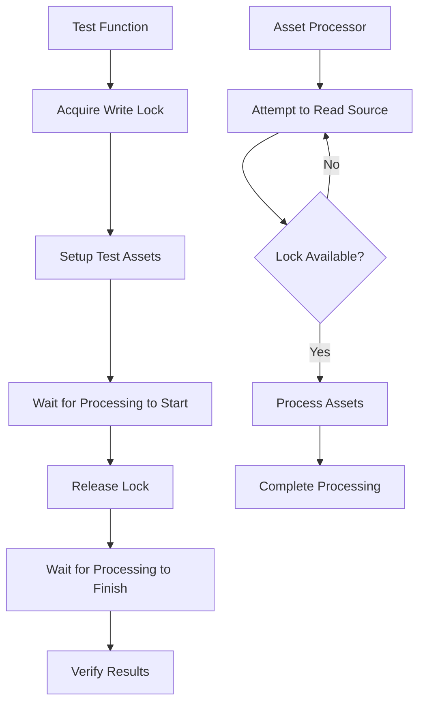

+++
title = "#21708 Fix asset processing tests being flaky from hot reloading."
date = "2025-11-01T00:00:00"
draft = false
template = "pull_request_page.html"
in_search_index = true

[taxonomies]
list_display = ["show"]

[extra]
current_language = "en"
available_languages = {"en" = { name = "English", url = "/pull_request/bevy/2025-11/pr-21708-en-20251101" }, "zh-cn" = { name = "中文", url = "/pull_request/bevy/2025-11/pr-21708-zh-cn-20251101" }}
labels = ["A-Assets", "C-Testing", "D-Straightforward"]
+++

# Fix asset processing tests being flaky from hot reloading

## Basic Information
- **Title**: Fix asset processing tests being flaky from hot reloading.
- **PR Link**: https://github.com/bevyengine/bevy/pull/21708
- **Author**: andriyDev
- **Status**: MERGED
- **Labels**: A-Assets, S-Ready-For-Final-Review, C-Testing, D-Straightforward
- **Created**: 2025-10-31T23:50:30Z
- **Merged**: 2025-11-01T01:01:56Z
- **Merged By**: cart

## Description Translation
# Objective

- Fixes flaky asset processing tests introduced in #21673.
- Previously the hot-reloading processor tests would just check for the finished processor state. However it was possible for processing to not start quickly enough in multi_threaded, resulting in the test still seeing the state as finished.

## Solution

- Use a lock to block reading the source directory until after processing has started. This way the asset processor can't even check if there's work to do until the guard is released, so we can't miss the processing state.

## Testing

- Ran it locally with singlethreaded and multithreaded mode.

## The Story of This Pull Request

This PR addresses a race condition in asset processing tests that was causing intermittent failures in multi-threaded environments. The core issue stemmed from how the tests were verifying that asset processing had completed.

The problem occurred because the test code would check for the `ProcessorState::Finished` state, but in multi-threaded scenarios, the asset processor might not have started processing yet when the check occurred. This created a timing-dependent failure where tests could pass or fail randomly based on thread scheduling.

The solution implements a synchronization mechanism using an `RwLock` to coordinate between the test code and the asset processor. Here's how it works:

1. **The Gate Mechanism**: A new `LockGatedReader` struct wraps the existing `MemoryAssetReader` and uses an `RwLock` to control when the asset processor can read from source directories.

2. **Test Control Flow**: Tests now acquire a write lock on the gate before making any changes to source assets. This prevents the asset processor from starting to process assets until the test is ready.

3. **State Monitoring**: The `run_app_until_finished_processing` function was modified to first wait for the processor to enter a processing state (`ProcessorState::Processing` or `ProcessorState::Initializing`) before releasing the lock and then waiting for completion.

The key insight here is that by controlling when the asset processor can access source files, the test can ensure it observes the entire processing lifecycle rather than potentially missing the processing phase entirely.

This approach is particularly elegant because:
- It doesn't require complex timing adjustments or arbitrary delays
- It provides deterministic test behavior regardless of thread scheduling
- It maintains the existing test structure while fixing the underlying race condition

The implementation required changes across multiple test functions, but the pattern is consistent: acquire the lock, set up test data, then run processing with the coordination mechanism.

## Visual Representation



## Key Files Changed

### `crates/bevy_asset/src/processor/tests.rs` (+115/-33)

This file contains all the asset processing tests and received significant modifications to implement the synchronization mechanism.

**Key Changes:**

1. **New LockGatedReader Implementation:**
```rust
/// Similar to [`crate::io::gated::GatedReader`], but uses a lock instead of a channel to avoid
/// needing to send the "correct" number of messages.
#[derive(Clone)]
struct LockGatedReader<R: AssetReader> {
    reader: R,
    gate: Arc<RwLock<()>>,
}

impl<R: AssetReader> AssetReader for LockGatedReader<R> {
    async fn read<'a>(&'a self, path: &'a Path) -> Result<impl Reader + 'a, AssetReaderError> {
        let _guard = self.gate.read().await;
        self.reader.read(path).await
    }
    // ... other methods follow same pattern
}
```

2. **Modified App Structure:**
```rust
struct AppWithProcessor {
    app: App,
    source_gate: Arc<RwLock<()>>,  // New field
    default_source_dirs: ProcessingDirs,
    extra_sources_dirs: HashMap<String, ProcessingDirs>,
}
```

3. **Updated Processing Coordination:**
```rust
fn run_app_until_finished_processing(app: &mut App, guard: RwLockWriteGuard<'_, ()>) {
    let processor = app.world().resource::<AssetProcessor>().clone();
    // Wait for processing to start, then finish
    run_app_until(app, |_| {
        let state = bevy_tasks::block_on(processor.get_state());
        (state == ProcessorState::Processing || state == ProcessorState::Initializing).then_some(())
    });
    drop(guard);  // Release the lock, allowing processing to proceed
    run_app_until(app, |_| {
        (bevy_tasks::block_on(processor.get_state()) == ProcessorState::Finished).then_some(())
    });
}
```

4. **Test Pattern Updates:** Each test now follows this pattern:
```rust
let guard = source_gate.write_blocking();
// Setup test assets...
run_app_until_finished_processing(&mut app, guard);
// Verify results...
```

## Further Reading

- [RwLock documentation](https://doc.rust-lang.org/std/sync/struct.RwLock.html) - Understanding reader-writer locks
- [Async locks in Rust](https://docs.rs/async-lock/) - The async_lock crate used in this implementation
- [Testing concurrent systems](https://doc.rust-lang.org/book/ch16-00-concurrency.html) - General principles for testing multi-threaded code
- [Bevy Asset System](https://bevyengine.org/learn/quick-start/assets/) - Bevy's asset processing architecture