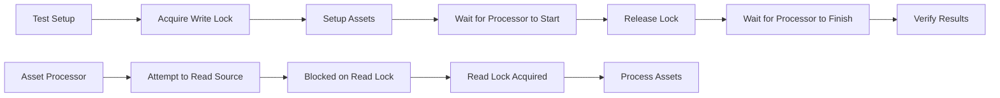

+++
title = "#21708 Fix asset processing tests being flaky from hot reloading."
date = "2025-11-01T00:00:00"
draft = false
template = "pull_request_page.html"
in_search_index = false

[extra]
current_language = "zh-cn"
available_languages = {"en" = { name = "English", url = "/pull_request/bevy/2025-11/pr-21708-en-20251101" }, "zh-cn" = { name = "中文", url = "/pull_request/bevy/2025-11/pr-21708-zh-cn-20251101" }}
labels = ["A-Assets", "C-Testing", "D-Straightforward"]
+++

# Fix asset processing tests being flaky from hot reloading

## Basic Information
- **Title**: Fix asset processing tests being flaky from hot reloading.
- **PR Link**: https://github.com/bevyengine/bevy/pull/21708
- **Author**: andriyDev
- **Status**: MERGED
- **Labels**: A-Assets, S-Ready-For-Final-Review, C-Testing, D-Straightforward
- **Created**: 2025-10-31T23:50:30Z
- **Merged**: 2025-11-01T01:01:56Z
- **Merged By**: cart

## 描述翻译
# 目标

- 修复 #21673 中引入的不稳定的资产处理测试。
- 之前的热重载处理器测试只会检查完成的处理器状态。但在多线程模式下，处理可能没有足够快地开始，导致测试仍然看到状态为已完成。

## 解决方案

- 使用锁来阻止读取源目录，直到处理开始后。这样资产处理器在守卫释放之前甚至无法检查是否有工作要做，因此我们不会错过处理状态。

## 测试

- 在本地以单线程和多线程模式运行。

## 这个拉取请求的故事

这个拉取请求解决了一个在多线程环境下出现的竞态条件问题，该问题导致资产处理测试变得不稳定。

问题的核心在于测试逻辑和资产处理器线程之间的时序问题。在原来的实现中，测试会设置资产数据，然后立即检查处理器的状态。但是在多线程环境中，资产处理器的后台线程可能还没有开始处理工作，测试就已经检查了处理器状态并错误地认为处理已经完成。

开发者采用了同步机制来解决这个问题。具体来说，他们引入了一个读写锁（RwLock）来协调测试代码和资产处理器线程之间的执行顺序：

```rust
struct AppWithProcessor {
    app: App,
    source_gate: Arc<RwLock<()>>,  // 新增的同步机制
    default_source_dirs: ProcessingDirs,
    extra_sources_dirs: HashMap<String, ProcessingDirs>,
}
```

这个 `source_gate` 的作用是在测试开始时获取写锁，从而阻止资产处理器读取源目录。只有当测试完成所有设置工作并准备好让处理器开始工作时，才会释放这个锁。

为了实现这个同步机制，开发者创建了一个新的 `LockGatedReader` 包装器：

```rust
struct LockGatedReader<R: AssetReader> {
    reader: R,
    gate: Arc<RwLock<()>>,
}
```

这个包装器实现了 `AssetReader` trait，在所有读取操作之前都会先获取读锁。由于测试持有写锁，这些读取操作会被阻塞，直到测试释放锁。

测试执行流程也进行了重构：

```rust
fn run_app_until_finished_processing(app: &mut App, guard: RwLockWriteGuard<'_, ()>) {
    let processor = app.world().resource::<AssetProcessor>().clone();
    // 等待处理器开始处理
    run_app_until(app, |_| {
        let state = bevy_tasks::block_on(processor.get_state());
        (state == ProcessorState::Processing || state == ProcessorState::Initializing).then_some(())
    });
    drop(guard);  // 释放锁，允许处理器读取源目录
    run_app_until(app, |_| {
        (bevy_tasks::block_on(processor.get_state()) == ProcessorState::Finished).then_some(())
    });
}
```

新的流程分为两个阶段：
1. 等待处理器进入 Processing 或 Initializing 状态
2. 释放锁，让处理器能够实际读取源目录并处理资产
3. 等待处理器完成所有工作

这种方法比简单地增加重试次数更加可靠，因为它确保了处理器在测试准备好之前不会开始工作，从而消除了竞态条件。

所有相关的测试都被更新以使用这个新的同步机制，每个测试现在都会在开始时获取锁：

```rust
let guard = source_gate.write_blocking();
```

这个解决方案展示了在处理多线程测试时的一个重要模式：使用同步原语来控制并发执行的顺序，而不是依赖于时间延迟或重试机制。

## 可视化表示



## 关键文件更改

- `crates/bevy_asset/src/processor/tests.rs` (+115/-33)

这个文件包含了所有的修改，主要变化包括：

1. 引入了新的同步机制：
```rust
// 新增的 LockGatedReader 结构
struct LockGatedReader<R: AssetReader> {
    reader: R,
    gate: Arc<RwLock<()>>,
}

// 更新 AppWithProcessor 结构
struct AppWithProcessor {
    app: App,
    source_gate: Arc<RwLock<()>>,  // 新增的锁
    default_source_dirs: ProcessingDirs,
    extra_sources_dirs: HashMap<String, ProcessingDirs>,
}
```

2. 重构了测试执行逻辑：
```rust
// 之前的方法
fn run_app_until_finished_processing(app: &mut App) {
    // 简单的重试机制
    for _ in 0..5 {
        app.update();
    }
    run_app_until(app, |world| {
        if bevy_tasks::block_on(world.resource::<AssetProcessor>().get_state())
            == ProcessorState::Finished
        {
            Some(())
        } else {
            None
        }
    });
}

// 新的方法
fn run_app_until_finished_processing(app: &mut App, guard: RwLockWriteGuard<'_, ()>) {
    let processor = app.world().resource::<AssetProcessor>().clone();
    // 等待处理器开始处理
    run_app_until(app, |_| {
        let state = bevy_tasks::block_on(processor.get_state());
        (state == ProcessorState::Processing || state == ProcessorState::Initializing).then_some(())
    });
    drop(guard);  // 释放锁
    // 等待处理器完成
    run_app_until(app, |_| {
        (bevy_tasks::block_on(processor.get_state()) == ProcessorState::Finished).then_some(())
    });
}
```

3. 更新了所有测试用例以使用新的同步机制：
```rust
fn no_meta_or_default_processor_copies_asset() {
    let AppWithProcessor {
        mut app,
        source_gate,  // 新增
        // ...
    } = create_app_with_asset_processor(&[]);

    let guard = source_gate.write_blocking();  // 获取锁

    // 设置资产...
    source_dir.insert_asset_text(path, source_asset);

    run_app_until_finished_processing(&mut app, guard);  // 传递锁守卫

    // 验证结果...
}
```

## 进一步阅读

- [RwLock 文档](https://docs.rs/async-lock/latest/async_lock/struct.RwLock.html) - 了解使用的同步原语
- [Bevy 资产系统](https://bevyengine.org/learn/quick-start/assets/) - 了解 Bevy 的资产处理机制
- [并发测试模式](https://doc.rust-lang.org/book/ch16-00-concurrency.html) - Rust 中的并发编程和测试最佳实践

# Full Code Diff
```diff
diff --git a/crates/bevy_asset/src/processor/tests.rs b/crates/bevy_asset/src/processor/tests.rs
index 133fde43ee3fd..6097ac8a26a12 100644
--- a/crates/bevy_asset/src/processor/tests.rs
+++ b/crates/bevy_asset/src/processor/tests.rs
@@ -6,6 +6,7 @@ use alloc::{
     vec,
     vec::Vec,
 };
+use async_lock::{RwLock, RwLockWriteGuard};
 use bevy_platform::{
     collections::HashMap,
     sync::{Mutex, PoisonError},
@@ -24,7 +25,8 @@ use bevy_tasks::BoxedFuture;
 use crate::{
     io::{
         memory::{Dir, MemoryAssetReader, MemoryAssetWriter},
-        AssetSource, AssetSourceEvent, AssetSourceId, AssetWatcher, Reader,
+        AssetReader, AssetReaderError, AssetSource, AssetSourceEvent, AssetSourceId, AssetWatcher,
+        PathStream, Reader,
     },
     processor::{
         AssetProcessor, LoadTransformAndSave, LogEntry, ProcessorState, ProcessorTransactionLog,
@@ -45,12 +47,55 @@ struct ProcessingDirs {
 
 struct AppWithProcessor {
     app: App,
+    source_gate: Arc<RwLock<()>>,
     default_source_dirs: ProcessingDirs,
     extra_sources_dirs: HashMap<String, ProcessingDirs>,
 }
 
+/// Similar to [`crate::io::gated::GatedReader`], but uses a lock instead of a channel to avoid
+/// needing to send the "correct" number of messages.
+#[derive(Clone)]
+struct LockGatedReader<R: AssetReader> {
+    reader: R,
+    gate: Arc<RwLock<()>>,
+}
+
+impl<R: AssetReader> LockGatedReader<R> {
+    /// Creates a new [`GatedReader`], which wraps the given `reader`. Also returns a [`GateOpener`] which
+    /// can be used to open "path gates" for this [`GatedReader`].
+    fn new(gate: Arc<RwLock<()>>, reader: R) -> Self {
+        Self { gate, reader }
+    }
+}
+
+impl<R: AssetReader> AssetReader for LockGatedReader<R> {
+    async fn read<'a>(&'a self, path: &'a Path) -> Result<impl Reader + 'a, AssetReaderError> {
+        let _guard = self.gate.read().await;
+        self.reader.read(path).await
+    }
+
+    async fn read_meta<'a>(&'a self, path: &'a Path) -> Result<impl Reader + 'a, AssetReaderError> {
+        let _guard = self.gate.read().await;
+        self.reader.read_meta(path).await
+    }
+
+    async fn read_directory<'a>(
+        &'a self,
+        path: &'a Path,
+    ) -> Result<Box<PathStream>, AssetReaderError> {
+        let _guard = self.gate.read().await;
+        self.reader.read_directory(path).await
+    }
+
+    async fn is_directory<'a>(&'a self, path: &'a Path) -> Result<bool, AssetReaderError> {
+        let _guard = self.gate.read().await;
+        self.reader.is_directory(path).await
+    }
+}
+
 fn create_app_with_asset_processor(extra_sources: &[String]) -> AppWithProcessor {
     let mut app = App::new();
+    let source_gate = Arc::new(RwLock::new(()));
 
     struct UnfinishedProcessingDirs {
         source: Dir,
@@ -72,13 +117,20 @@ fn create_app_with_asset_processor(extra_sources: &[String]) -> AppWithProcessor
         }
     }
 
-    fn create_source(app: &mut App, source_id: AssetSourceId<'static>) -> UnfinishedProcessingDirs {
+    fn create_source(
+        app: &mut App,
+        source_id: AssetSourceId<'static>,
+        source_gate: Arc<RwLock<()>>,
+    ) -> UnfinishedProcessingDirs {
         let source_dir = Dir::default();
         let processed_dir = Dir::default();
 
-        let source_memory_reader = MemoryAssetReader {
-            root: source_dir.clone(),
-        };
+        let source_memory_reader = LockGatedReader::new(
+            source_gate,
+            MemoryAssetReader {
+                root: source_dir.clone(),
+            },
+        );
         let processed_memory_reader = MemoryAssetReader {
             root: processed_dir.clone(),
         };
@@ -111,14 +163,18 @@ fn create_app_with_asset_processor(extra_sources: &[String]) -> AppWithProcessor
         }
     }
 
-    let default_source_dirs = create_source(&mut app, AssetSourceId::Default);
+    let default_source_dirs = create_source(&mut app, AssetSourceId::Default, source_gate.clone());
 
     let extra_sources_dirs = extra_sources
         .iter()
         .map(|source_name| {
             (
                 source_name.clone(),
-                create_source(&mut app, AssetSourceId::Name(source_name.clone().into())),
+                create_source(
+                    &mut app,
+                    AssetSourceId::Name(source_name.clone().into()),
+                    source_gate.clone(),
+                ),
             )
         })
         .collect::<Vec<_>>();
@@ -183,6 +239,7 @@ fn create_app_with_asset_processor(extra_sources: &[String]) -> AppWithProcessor
 
     AppWithProcessor {
         app,
+        source_gate,
         default_source_dirs: default_source_dirs.finish(),
         extra_sources_dirs: extra_sources_dirs
             .into_iter()
@@ -191,21 +248,18 @@ fn create_app_with_asset_processor(extra_sources: &[String]) -> AppWithProcessor
     }
 }
 
-fn run_app_until_finished_processing(app: &mut App) {
-    // If the original source changes through an AssetSourceEvent, we'll be racing (on
-    // multithreaded) between this and processor thread switching the state to `Processing`. So do a
-    // fixed number of iterations so the processor thread is likely to win.
-    for _ in 0..5 {
-        app.update();
-    }
-    run_app_until(app, |world| {
-        if bevy_tasks::block_on(world.resource::<AssetProcessor>().get_state())
-            == ProcessorState::Finished
-        {
-            Some(())
-        } else {
-            None
-        }
+fn run_app_until_finished_processing(app: &mut App, guard: RwLockWriteGuard<'_, ()>) {
+    let processor = app.world().resource::<AssetProcessor>().clone();
+    // We can't just wait for the processor state to be finished since we could have already
+    // finished before, but now that something has changed, we may not have restarted processing
+    // yet. So wait for processing to start, then finish.
+    run_app_until(app, |_| {
+        let state = bevy_tasks::block_on(processor.get_state());
+        (state == ProcessorState::Processing || state == ProcessorState::Initializing).then_some(())
+    });
+    drop(guard);
+    run_app_until(app, |_| {
+        (bevy_tasks::block_on(processor.get_state()) == ProcessorState::Finished).then_some(())
     });
 }
 
@@ -299,6 +353,7 @@ fn no_meta_or_default_processor_copies_asset() {
 
     let AppWithProcessor {
         mut app,
+        source_gate,
         default_source_dirs:
             ProcessingDirs {
                 source: source_dir,
@@ -308,6 +363,8 @@ fn no_meta_or_default_processor_copies_asset() {
         ..
     } = create_app_with_asset_processor(&[]);
 
+    let guard = source_gate.write_blocking();
+
     let path = Path::new("abc.cool.ron");
     let source_asset = r#"(
     text: "abc",
@@ -318,7 +375,7 @@ fn no_meta_or_default_processor_copies_asset() {
 
     source_dir.insert_asset_text(path, source_asset);
 
-    run_app_until_finished_processing(&mut app);
+    run_app_until_finished_processing(&mut app, guard);
 
     let processed_asset = processed_dir.get_asset(path).unwrap();
     let processed_asset = str::from_utf8(processed_asset.value()).unwrap();
@@ -329,6 +386,7 @@ fn no_meta_or_default_processor_copies_asset() {
 fn asset_processor_transforms_asset_default_processor() {
     let AppWithProcessor {
         mut app,
+        source_gate,
         default_source_dirs:
             ProcessingDirs {
                 source: source_dir,
@@ -350,6 +408,8 @@ fn asset_processor_transforms_asset_default_processor() {
         ))
         .set_default_asset_processor::<CoolTextProcessor>("cool.ron");
 
+    let guard = source_gate.write_blocking();
+
     let path = Path::new("abc.cool.ron");
     source_dir.insert_asset_text(
         path,
@@ -361,7 +421,7 @@ fn asset_processor_transforms_asset_default_processor() {
 )"#,
     );
 
-    run_app_until_finished_processing(&mut app);
+    run_app_until_finished_processing(&mut app, guard);
 
     let processed_asset = processed_dir.get_asset(path).unwrap();
     let processed_asset = str::from_utf8(processed_asset.value()).unwrap();
@@ -380,6 +440,7 @@ fn asset_processor_transforms_asset_default_processor() {
 fn asset_processor_transforms_asset_with_meta() {
     let AppWithProcessor {
         mut app,
+        source_gate,
         default_source_dirs:
             ProcessingDirs {
                 source: source_dir,
@@ -400,6 +461,8 @@ fn asset_processor_transforms_asset_with_meta() {
             CoolTextSaver,
         ));
 
+    let guard = source_gate.write_blocking();
+
     let path = Path::new("abc.cool.ron");
     source_dir.insert_asset_text(
         path,
@@ -422,7 +485,7 @@ fn asset_processor_transforms_asset_with_meta() {
     ),
 )"#);
 
-    run_app_until_finished_processing(&mut app);
+    run_app_until_finished_processing(&mut app, guard);
 
     let processed_asset = processed_dir.get_asset(path).unwrap();
     let processed_asset = str::from_utf8(processed_asset.value()).unwrap();
@@ -574,6 +637,7 @@ fn asset_processor_loading_can_read_processed_assets() {
 
     let AppWithProcessor {
         mut app,
+        source_gate,
         default_source_dirs:
             ProcessingDirs {
                 source: source_dir,
@@ -599,6 +663,8 @@ fn asset_processor_loading_can_read_processed_assets() {
         .set_default_asset_processor::<GltfProcessor>("gltf")
         .set_default_asset_processor::<BsnProcessor>("bsn");
 
+    let guard = source_gate.write_blocking();
+
     let gltf_path = Path::new("abc.gltf");
     source_dir.insert_asset_text(
         gltf_path,
@@ -623,7 +689,7 @@ fn asset_processor_loading_can_read_processed_assets() {
 )"#,
     );
 
-    run_app_until_finished_processing(&mut app);
+    run_app_until_finished_processing(&mut app, guard);
 
     let processed_bsn = processed_dir.get_asset(bsn_path).unwrap();
     let processed_bsn = str::from_utf8(processed_bsn.value()).unwrap();
@@ -645,6 +711,7 @@ fn asset_processor_loading_can_read_processed_assets() {
 fn asset_processor_loading_can_read_source_assets() {
     let AppWithProcessor {
         mut app,
+        source_gate,
         default_source_dirs:
             ProcessingDirs {
                 source: source_dir,
@@ -754,6 +821,8 @@ fn asset_processor_loading_can_read_source_assets() {
         .set_default_asset_processor::<GltfProcessor>("gltf")
         .set_default_asset_processor::<GltfxProcessor>("gltfx");
 
+    let guard = source_gate.write_blocking();
+
     let gltf_path_1 = Path::new("abc.gltf");
     source_dir.insert_asset_text(
         gltf_path_1,
@@ -783,7 +852,7 @@ fn asset_processor_loading_can_read_source_assets() {
 )"#,
     );
 
-    run_app_until_finished_processing(&mut app);
+    run_app_until_finished_processing(&mut app, guard);
 
     // Sanity check that the two gltf files were actually processed.
     let processed_gltf_1 = processed_dir.get_asset(gltf_path_1).unwrap();
@@ -838,6 +907,7 @@ fn asset_processor_loading_can_read_source_assets() {
 fn asset_processor_processes_all_sources() {
     let AppWithProcessor {
         mut app,
+        source_gate,
         default_source_dirs:
             ProcessingDirs {
                 source: default_source_dir,
@@ -871,6 +941,8 @@ fn asset_processor_processes_all_sources() {
         ))
         .set_default_asset_processor::<AddTextProcessor>("cool.ron");
 
+    let guard = source_gate.write_blocking();
+
     // All the assets will have the same path, but they will still be separately processed since
     // they are in different sources.
     let path = Path::new("asset.cool.ron");
@@ -887,7 +959,7 @@ fn asset_processor_processes_all_sources() {
     custom_1_source_dir.insert_asset_text(path, &serialize_as_cool_text("custom 1 asset"));
     custom_2_source_dir.insert_asset_text(path, &serialize_as_cool_text("custom 2 asset"));
 
-    run_app_until_finished_processing(&mut app);
+    run_app_until_finished_processing(&mut app, guard);
 
     // Check that all the assets are processed.
     assert_eq!(
@@ -903,13 +975,15 @@ fn asset_processor_processes_all_sources() {
         serialize_as_cool_text("custom 2 asset processed")
     );
 
+    let guard = source_gate.write_blocking();
+
     // Update the default source asset and notify the watcher.
     default_source_dir.insert_asset_text(path, &serialize_as_cool_text("default asset changed"));
     default_source_events
         .send_blocking(AssetSourceEvent::ModifiedAsset(path.to_path_buf()))
         .unwrap();
 
-    run_app_until_finished_processing(&mut app);
+    run_app_until_finished_processing(&mut app, guard);
 
     // Check that all the assets are processed again.
     assert_eq!(
@@ -925,6 +999,8 @@ fn asset_processor_processes_all_sources() {
         serialize_as_cool_text("custom 2 asset processed")
     );
 
+    let guard = source_gate.write_blocking();
+
     // Update the custom source assets and notify the watchers.
     custom_1_source_dir.insert_asset_text(path, &serialize_as_cool_text("custom 1 asset changed"));
     custom_2_source_dir.insert_asset_text(path, &serialize_as_cool_text("custom 2 asset changed"));
@@ -935,7 +1011,7 @@ fn asset_processor_processes_all_sources() {
         .send_blocking(AssetSourceEvent::ModifiedAsset(path.to_path_buf()))
         .unwrap();
 
-    run_app_until_finished_processing(&mut app);
+    run_app_until_finished_processing(&mut app, guard);
 
     // Check that all the assets are processed again.
     assert_eq!(
@@ -956,6 +1032,7 @@ fn asset_processor_processes_all_sources() {
 fn nested_loads_of_processed_asset_reprocesses_on_reload() {
     let AppWithProcessor {
         mut app,
+        source_gate,
         default_source_dirs:
             ProcessingDirs {
                 source: default_source_dir,
@@ -1061,6 +1138,8 @@ fn nested_loads_of_processed_asset_reprocesses_on_reload() {
         ))
         .set_default_asset_processor::<NesterProcessor>("nest");
 
+    let guard = source_gate.write_blocking();
+
     // This test also checks that processing of nested assets can occur across asset sources.
     custom_source_dir.insert_asset_text(
         Path::new("top.nest"),
@@ -1077,7 +1156,7 @@ fn nested_loads_of_processed_asset_reprocesses_on_reload() {
         &serialize_as_leaf("unrelated".into()),
     );
 
-    run_app_until_finished_processing(&mut app);
+    run_app_until_finished_processing(&mut app, guard);
 
     // The initial processing step should have processed all assets.
     assert_eq!(
@@ -1106,6 +1185,7 @@ fn nested_loads_of_processed_asset_reprocesses_on_reload() {
 
     // Now we will only send a single source event, but that should still result in all related
     // assets being reprocessed.
+    let guard = source_gate.write_blocking();
 
     custom_source_dir.insert_asset_text(
         Path::new("bottom.nest"),
@@ -1115,7 +1195,7 @@ fn nested_loads_of_processed_asset_reprocesses_on_reload() {
         .send_blocking(AssetSourceEvent::ModifiedAsset("bottom.nest".into()))
         .unwrap();
 
-    run_app_until_finished_processing(&mut app);
+    run_app_until_finished_processing(&mut app, guard);
 
     assert_eq!(
         read_asset_as_string(&custom_processed_dir, Path::new("bottom.nest")),
@@ -1138,11 +1218,13 @@ fn nested_loads_of_processed_asset_reprocesses_on_reload() {
 
     // Send a modify event to the middle asset without changing the asset bytes. This should do
     // **nothing** since neither its dependencies nor its bytes have changed.
+    let guard = source_gate.write_blocking();
+
     default_source_events
         .send_blocking(AssetSourceEvent::ModifiedAsset("middle.nest".into()))
         .unwrap();
 
-    run_app_until_finished_processing(&mut app);
+    run_app_until_finished_processing(&mut app, guard);
 
     assert_eq!(
         read_asset_as_string(&custom_processed_dir, Path::new("bottom.nest")),
```