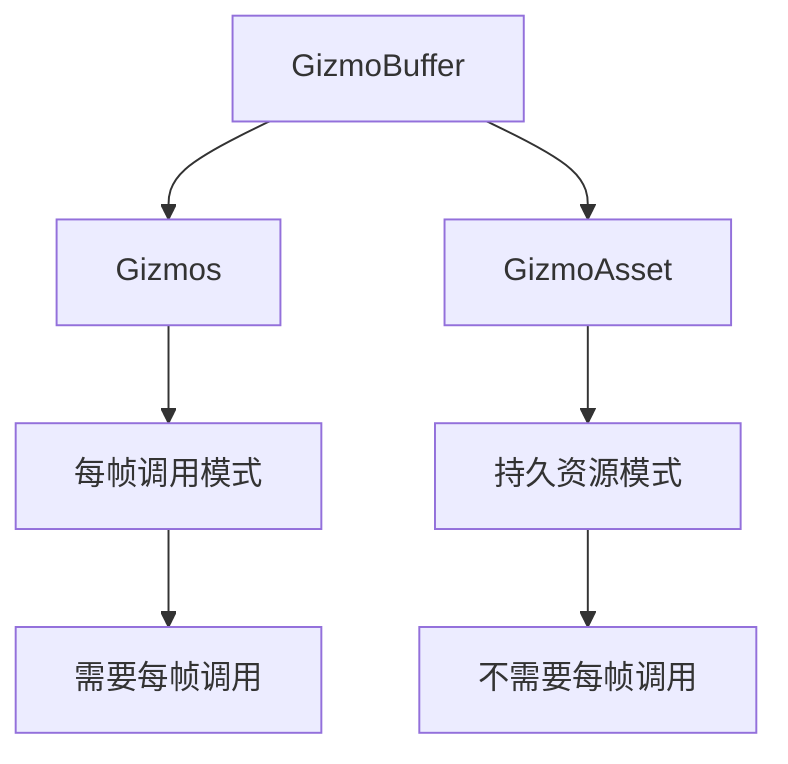

+++
title = "#21717 Remove \"should be called each frame\" in `GizmoBuffer` document."
date = "2025-11-03T00:00:00"
draft = false
template = "pull_request_page.html"
in_search_index = false

[extra]
current_language = "zh-cn"
available_languages = {"en" = { name = "English", url = "/pull_request/bevy/2025-11/pr-21717-en-20251103" }, "zh-cn" = { name = "中文", url = "/pull_request/bevy/2025-11/pr-21717-zh-cn-20251103" }}
labels = ["C-Docs", "A-Gizmos", "D-Straightforward"]
+++

# Remove "should be called each frame" in `GizmoBuffer` document.

## Basic Information
- **Title**: Remove "should be called each frame" in `GizmoBuffer` document.
- **PR Link**: https://github.com/bevyengine/bevy/pull/21717
- **Author**: kaoet
- **Status**: MERGED
- **Labels**: C-Docs, S-Ready-For-Final-Review, A-Gizmos, D-Straightforward
- **Created**: 2025-11-02T06:28:50Z
- **Merged**: 2025-11-03T19:20:03Z
- **Merged By**: alice-i-cecile

## Description Translation
`GizmoBuffer` 被 `GizmoAsset` 和 `Gizmos` 共同使用，而前者并不要求这些方法每帧调用。

# 目标

修复 #21711

## 解决方案

- 从文档中删除这些行。

## 测试

- 运行 `cargo doc` 并确认在 `GizmoAsset` 的文档中不再看到这些行。

## The Story of This Pull Request

这个 PR 源于一个文档准确性问题。开发者发现 `GizmoBuffer` 的文档中存在不准确的说明，这些说明可能会误导用户。

问题的核心在于 `GizmoBuffer` 是一个被多个组件共享的基础设施。具体来说，它同时被 `GizmoAsset` 和 `Gizmos` 使用，但这两个组件的使用模式不同。`Gizmos` 通常用于每帧绘制的调试图形，而 `GizmoAsset` 则用于创建持久的 gizmo 资源，不需要每帧调用。

在原始实现中，几乎所有绘制方法的文档都包含了 "This should be called for each frame the ... needs to be rendered" 这样的说明。这种说明对于 `Gizmos` 的使用场景是正确的，但对于 `GizmoAsset` 的使用场景则是错误的。当用户查看 `GizmoAsset` 的文档时，会看到这些误导性的说明，认为他们需要每帧调用这些方法，而实际上并不需要。

这个问题的技术背景涉及到 Bevy 引擎中 gizmo 系统的架构设计。`GizmoBuffer` 作为一个底层缓冲区，为不同的 gizmo 绘制接口提供支持。这种设计允许代码重用，但同时也需要在文档中准确反映不同使用场景的要求。

解决方案很直接：删除这些不准确的文档行。由于这些说明只对部分使用场景正确，而对其他场景错误，最安全的做法是完全移除它们，让用户根据具体的组件（`Gizmos` 或 `GizmoAsset`）的使用模式来决定调用频率。

这个修改虽然简单，但体现了良好的 API 设计原则：文档应该准确反映组件的实际行为，避免误导用户。在游戏引擎这样的复杂系统中，准确的文档对于开发者正确使用 API 至关重要。

从工程角度来看，这个 PR 展示了如何在保持向后兼容性的同时修复文档问题。没有修改任何实际的代码逻辑，只是移除了可能引起混淆的文档内容。

## Visual Representation



## Key Files Changed

这个 PR 修改了多个文件，主要移除了重复的文档说明。以下是几个关键文件的修改：

**crates/bevy_gizmos/src/gizmos.rs** (-32 lines)
这个文件包含了主要的 gizmo 绘制方法，移除了所有方法中的 "This should be called for each frame" 说明：

```rust
// 修改前：
/// Draw a line in 3D from `start` to `end`.
///
/// This should be called for each frame the line needs to be rendered.
///
/// # Example

// 修改后：
/// Draw a line in 3D from `start` to `end`.
///
/// # Example
```

**crates/bevy_gizmos/src/arrows.rs** (-8 lines)
移除了箭头绘制方法中的重复文档说明：

```rust
// 修改前：
/// Draw an arrow in 3D, from `start` to `end`. Has four tips for convenient viewing from any direction.
///
/// This should be called for each frame the arrow needs to be rendered.
///
/// # Example

// 修改后：
/// Draw an arrow in 3D, from `start` to `end`. Has four tips for convenient viewing from any direction.
///
/// # Example
```

**crates/bevy_gizmos/src/circles.rs** (-8 lines)
移除了圆形和球体绘制方法中的文档说明：

```rust
// 修改前：
/// Draw a wireframe sphere in 3D made out of three circles around the origin.
///
/// This should be called for each frame the sphere needs to be rendered.
///
/// # Example

// 修改后：
/// Draw a wireframe sphere in 3D made out of three circles around the origin.
///
/// # Example
```

**crates/bevy_gizmos/src/grid.rs** (-6 lines)
移除了网格绘制方法中的文档说明：

```rust
// 修改前：
/// Draw a 2D grid in 3D.
///
/// This should be called for each frame the grid needs to be rendered.
///
/// The grid's default orientation aligns with the XY-plane.

// 修改后：
/// Draw a 2D grid in 3D.
///
/// The grid's default orientation aligns with the XY-plane.
```

## Further Reading

- [Bevy Gizmos 官方文档](https://docs.rs/bevy_gizmos/latest/bevy_gizmos/)
- [Rust 文档注释指南](https://doc.rust-lang.org/rustdoc/how-to-write-documentation.html)
- [API 设计原则：准确性的重要性](https://rust-lang.github.io/api-guidelines/documentation.html)

# Full Code Diff
[完整代码差异见原始 PR 描述]