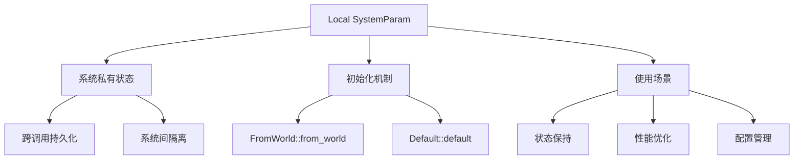

+++
title = "#21718 Improve Local SystemParam text, examples"
date = "2025-11-05T00:00:00"
draft = false
template = "pull_request_page.html"
in_search_index = false

[extra]
current_language = "zh-cn"
available_languages = {"en" = { name = "English", url = "/pull_request/bevy/2025-11/pr-21718-en-20251105" }, "zh-cn" = { name = "中文", url = "/pull_request/bevy/2025-11/pr-21718-zh-cn-20251105" }}
+++

# Improve Local SystemParam text, examples

## 基本信息
- **标题**: Improve Local SystemParam text, examples
- **PR链接**: https://github.com/bevyengine/bevy/pull/21718
- **作者**: isHavvy
- **状态**: 已合并
- **标签**: C-Docs, A-ECS, S-Ready-For-Final-Review, X-Uncontroversial, D-Straightforward
- **创建时间**: 2025-11-02T07:10:33Z
- **合并时间**: 2025-11-05T03:39:21Z
- **合并者**: alice-i-cecile

## 描述翻译
改进 `Local<T>` 对新手用户的说明。

### 解决方案
添加更多关于如何使用 `Local<T>` 的示例，并记录 `T` 是如何为这种类型初始化的。

我尝试将示例从基础信息到更特殊的信息进行排序。

我不确定配置示例是否有用，甚至不确定它想要表达什么。blame 日志显示之前有一些配置相关的内容被移除了。

此外，我在 SystemParam 实现中添加了一个文档注释，简要描述了它作为系统参数提供的内容。我认为所有非元组实现都应该提供这样的简短说明，这样查看 trait 本身的实现时除了名称之外还能提供有用的信息。如果需要这样做，应该为此开一个 issue。如果不需要，我或者提交此 PR 的审阅者可以删除该行。

### 测试
我运行了文档测试。我还构建了文档并检查了链接是否有效。

## 这个 Pull Request 的故事

这个 PR 的核心目标是解决一个文档质量问题：`Local<T>` 这个 SystemParam 对于新手开发者来说不够清晰。在 Bevy ECS 系统中，`Local<T>` 是一个特殊类型的系统参数，它允许系统在多次调用之间保持私有状态，但这个概念对于不熟悉 ECS 模式的开发者来说可能比较难以理解。

### 问题识别

原有的 `Local<T>` 文档存在几个问题：
1. 初始化机制不明确 - 开发者不清楚 `T` 是如何被初始化的
2. 示例不够直观 - 原有的计数器示例使用两个系统来演示，增加了理解复杂度
3. 缺乏实际应用场景 - 没有展示 `Local<T>` 在实际开发中的实用价值

### 解决方案设计

开发者 isHavvy 采取了渐进式的文档改进策略，通过添加多个从简单到复杂的示例来覆盖不同的使用场景：

**基础概念澄清**：首先在 SystemParam 实现中添加了明确的初始化说明：
```rust
/// The initial value is created by calling `T`'s [`FromWorld::from_world`] 
/// (or [`Default::default`] if `T: Default`).
```

这明确了 `Local<T>` 的初始化机制 - 要么通过 `FromWorld` trait，要么通过 `Default` trait。

**示例重构**：将原有的复杂示例替换为更直观的单系统计数器：
```rust
fn counter(mut count: Local<u32>) -> u32 {
    *count += 1;
    *count
}
```

这个示例清楚地展示了 `Local<u32>` 如何在系统调用之间保持状态，从 0 开始每次调用递增。

### 技术实现细节

PR 添加了多个层次的示例来展示 `Local<T>` 的不同用法：

**自定义初始值模式**：展示了如何使用 `Option` 包装来设置非默认的初始值：
```rust
fn counter_from_10(mut count: Local<Option<u32>>) -> u32 {
    let count = count.get_or_insert(10);
    *count += 1;
    *count
}
```

这种模式在实际开发中很常见，特别是当需要基于配置或其他运行时信息来初始化局部状态时。

**多 Local 参数演示**：展示了同一个系统中可以使用多个相同类型的 `Local`：
```rust
fn double_counter(mut count: Local<u32>, mut double_count: Local<u32>) -> (u32, u32) {
    *count += 1;
    *double_count += 2;
    (*count, *double_count)
}
```

这澄清了一个重要概念：即使类型相同，每个 `Local` 参数都是独立的实例。

**系统隔离性验证**：通过两个系统的示例证明了 `Local` 的系统私有特性：
```rust
fn write_to_local(mut local: Local<usize>) { *local = 42; }
fn read_from_local(local: Local<usize>) -> usize { *local }
```

这个示例清楚地展示了修改一个系统的 `Local` 不会影响另一个系统的 `Local`。

### 实际应用价值

最重要的改进之一是添加了性能优化场景的示例：
```rust
fn some_system(mut vec: Local<Vec<u32>>) {
    // Do your regular system logic, using the vec, as normal.
    vec.clear();  // Reuse allocation in next system call
}
```

这展示了 `Local<T>` 在避免重复内存分配方面的实际价值，对于性能敏感的系统特别有用。

### 技术洞察

这个 PR 揭示了 `Local<T>` 的几个关键特性：
1. **生命周期**：`Local<T>` 的值在系统调用之间持续存在
2. **作用域**：每个系统实例有自己的 `Local<T>` 副本
3. **初始化**：依赖于 `FromWorld` 或 `Default` trait
4. **性能**：可用于缓存和避免重复分配

### 影响评估

这些文档改进对于 Bevy 生态有重要意义：
- **降低学习曲线**：新开发者能更快理解 `Local<T>` 的概念和用法
- **减少错误使用**：清晰的示例能防止开发者误用系统局部状态
- **促进最佳实践**：展示了性能优化等高级用法模式

## 视觉表示



## 关键文件更改

### `crates/bevy_ecs/src/system/system_param.rs` (+65/-15)

这是本次 PR 唯一修改的文件，包含了所有文档改进：

**主要改进包括：**

1. **添加了清晰的初始化说明**：
```rust
// 之前：没有明确的初始化说明
// 之后：
/// A [`SystemParam`] that provides a system-private value of `T` that persists across system calls.
///
/// The initial value is created by calling `T`'s [`FromWorld::from_world`] (or [`Default::default`] if `T: Default`).
```

2. **重构了基础示例**：
```rust
// 之前：
fn write_to_local(mut local: Local<usize>) {
    *local = 42;
}
fn read_from_local(local: Local<usize>) -> usize {
    *local
}

// 之后：
fn counter(mut count: Local<u32>) -> u32 {
    *count += 1;
    *count
}
```

3. **添加了多个新示例**：
```rust
// 自定义初始值
fn counter_from_10(mut count: Local<Option<u32>>) -> u32 {
    let count = count.get_or_insert(10);
    *count += 1;
    *count
}

// 多 Local 参数
fn double_counter(mut count: Local<u32>, mut double_count: Local<u32>) -> (u32, u32) {
    *count += 1;
    *double_count += 2;
    (*count, *double_count)
}

// 性能优化用例
fn some_system(mut vec: Local<Vec<u32>>) {
    // Do your regular system logic, using the vec, as normal.
    vec.clear();
}
```

## 进一步阅读

- [Bevy ECS 系统文档](https://bevyengine.org/learn/quick-start/ecs/system-params/)
- [SystemParam trait 参考](https://docs.rs/bevy_ecs/latest/bevy_ecs/system/trait.SystemParam.html)
- [FromWorld trait 文档](https://docs.rs/bevy_ecs/latest/bevy_ecs/world/trait.FromWorld.html)
- [Bevy 官方示例仓库](https://github.com/bevyengine/bevy/tree/main/examples)

## 完整代码差异
```diff
diff --git a/crates/bevy_ecs/src/system/system_param.rs b/crates/bevy_ecs/src/system/system_param.rs
index 909e434c19242..6e6c4deadff3f 100644
--- a/crates/bevy_ecs/src/system/system_param.rs
+++ b/crates/bevy_ecs/src/system/system_param.rs
@@ -972,7 +972,9 @@ unsafe impl<'w> SystemParam for DeferredWorld<'w> {
     }
 }
 
-/// A system local [`SystemParam`].
+/// A [`SystemParam`] that provides a system-private value of `T` that persists across system calls.
+///
+/// The initial value is created by calling `T`'s [`FromWorld::from_world`] (or [`Default::default`] if `T: Default`).
 ///
 /// A local may only be accessed by the system itself and is therefore not visible to other systems.
 /// If two or more systems specify the same local type each will have their own unique local.
@@ -986,21 +988,17 @@ unsafe impl<'w> SystemParam for DeferredWorld<'w> {
 /// ```
 /// # use bevy_ecs::prelude::*;
 /// # let world = &mut World::default();
-/// fn write_to_local(mut local: Local<usize>) {
-///     *local = 42;
-/// }
-/// fn read_from_local(local: Local<usize>) -> usize {
-///     *local
+/// fn counter(mut count: Local<u32>) -> u32 {
+///     *count += 1;
+///     *count
 /// }
-/// let mut write_system = IntoSystem::into_system(write_to_local);
-/// let mut read_system = IntoSystem::into_system(read_from_local);
-/// write_system.initialize(world);
-/// read_system.initialize(world);
+/// let mut counter_system = IntoSystem::into_system(counter);
+/// counter_system.initialize(world);
 ///
-/// assert_eq!(read_system.run((), world).unwrap(), 0);
-/// write_system.run((), world);
-/// // Note how the read local is still 0 due to the locals not being shared.
-/// assert_eq!(read_system.run((), world).unwrap(), 0);
+/// // Counter is initialized to u32's default value of 0, and increases to 1 on first run.
+/// assert_eq!(counter_system.run((), world).unwrap(), 1);
+/// // Counter gets the same value and increases to 2 on its second call.
+/// assert_eq!(counter_system.run((), world).unwrap(), 2);
 /// ```
 ///
 /// A simple way to set a different default value for a local is by wrapping the value with an Option.
@@ -1008,7 +1006,7 @@ unsafe impl<'w> SystemParam for DeferredWorld<'w> {
 /// ```
 /// # use bevy_ecs::prelude::*;
 /// # let world = &mut World::default();
-/// fn counter_from_10(mut count: Local<Option<usize>>) -> usize {
+/// fn counter_from_10(mut count: Local<Option<u32>>) -> u32 {
 ///     let count = count.get_or_insert(10);
 ///     *count += 1;
 ///     *count
@@ -1022,6 +1020,58 @@ unsafe impl<'w> SystemParam for DeferredWorld<'w> {
 /// assert_eq!(counter_system.run((), world).unwrap(), 12);
 /// ```
 ///
+/// A system can have multiple `Local` values with the same type, each with distinct values.
+///
+/// ```
+/// # use bevy_ecs::prelude::*;
+/// # let world = &mut World::default();
+/// fn double_counter(mut count: Local<u32>, mut double_count: Local<u32>) -> (u32, u32) {
+///     *count += 1;
+///     *double_count += 2;
+///     (*count, *double_count)
+/// }
+/// let mut counter_system = IntoSystem::into_system(double_counter);
+/// counter_system.initialize(world);
+///
+/// assert_eq!(counter_system.run((), world).unwrap(), (1, 2));
+/// assert_eq!(counter_system.run((), world).unwrap(), (2, 4));
+/// ```
+///
+/// This example shows that two systems using the same type for their own `Local` get distinct locals.
+///
+/// ```
+/// # use bevy_ecs::prelude::*;
+/// # let world = &mut World::default();
+/// fn write_to_local(mut local: Local<usize>) {
+///     *local = 42;
+/// }
+/// fn read_from_local(local: Local<usize>) -> usize {
+///     *local
+/// }
+/// let mut write_system = IntoSystem::into_system(write_to_local);
+/// let mut read_system = IntoSystem::into_system(read_from_local);
+/// write_system.initialize(world);
+/// read_system.initialize(world);
+///
+/// assert_eq!(read_system.run((), world).unwrap(), 0);
+/// write_system.run((), world);
+/// // The read local is still 0 due to the locals not being shared.
+/// assert_eq!(read_system.run((), world).unwrap(), 0);
+/// ```
+///
+/// You can use a `Local` to avoid reallocating memory every system call.
+///
+/// ```
+/// # use bevy_ecs::prelude::*;
+/// fn some_system(mut vec: Local<Vec<u32>>) {
+///     // Do your regular system logic, using the vec, as normal.
+///
+///     // At end of function, clear the vec's contents so its empty for next system call.
+///     // If it's possible the capacity could get too large, you may want to check and resize that as well.
+///     vec.clear();
+/// }
+/// ```
+///
 /// N.B. A [`Local`]s value cannot be read or written to outside of the containing system.
 /// To add configuration to a system, convert a capturing closure into the system instead:
 ///
```