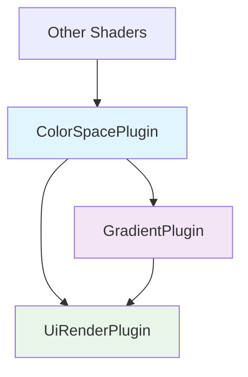

+++
title = "#21720 Move wgsl color space utils to separate plugin"
date = "2025-11-03T00:00:00"
draft = false
template = "pull_request_page.html"
in_search_index = true

[taxonomies]
list_display = ["show"]

[extra]
current_language = "en"
available_languages = {"en" = { name = "English", url = "/pull_request/bevy/2025-11/pr-21720-en-20251103" }, "zh-cn" = { name = "中文", url = "/pull_request/bevy/2025-11/pr-21720-zh-cn-20251103" }}
labels = ["A-Rendering", "C-Code-Quality", "C-Usability"]
+++

# Move wgsl color space utils to separate plugin

## Basic Information
- **Title**: Move wgsl color space utils to separate plugin
- **PR Link**: https://github.com/bevyengine/bevy/pull/21720
- **Author**: rossleonardy
- **Status**: MERGED
- **Labels**: A-Rendering, C-Code-Quality, C-Usability, S-Ready-For-Final-Review
- **Created**: 2025-11-02T14:03:57Z
- **Merged**: 2025-11-03T19:22:50Z
- **Merged By**: alice-i-cecile

## Description Translation
# Objective
- Color conversion functions for shaders
#20523 

## Solution
- Moving these wgsl functions to a separate plugin so they can be reused 
- Users can import the plugin itself or import UiRenderPlugin, which also adds the plugin.

- Not sure how to make it more clear that GradientPlugin now requires ColorSpacePlugin to be added first for any users that don't import all of UiRenderPlugin
https://github.com/bevyengine/bevy/issues/69

- Because shader libraries needs to be added in a plugin, I left this in bevy_ui_render. If non-ui consumers want to use this and not have a bevy_ui_render dependency, it might need to be moved. bevy_color is the logical place for this but it would introduce a dependency to bevy_ecs and bevy_shader there 

## Testing
- I retested the gradient shaders on the testbed example

## Showcase


## The Story of This Pull Request

This PR addresses a code organization issue where color space conversion utilities were embedded within gradient shader code, limiting their reusability across the codebase. The problem stemmed from the fact that these color space functions—including conversions between sRGB, linear RGB, HSL, HSV, and Oklab color spaces—were only accessible to gradient shaders, preventing other shaders from leveraging the same functionality.

The developer's approach was to extract these color space utilities into a separate, dedicated plugin that could be imported independently. This follows established software engineering principles of separation of concerns and code reuse. The implementation required creating a new `ColorSpacePlugin` that loads the color space shader library, then refactoring the existing gradient code to import these functions rather than defining them inline.

Looking at the technical implementation, the key insight was recognizing that color space conversion is a distinct concern from gradient rendering. The color space functions handle mathematical transformations between different color representations, while the gradient code focuses on interpolating colors across geometric spaces. By separating these concerns, the codebase gains modularity—other rendering features can now use color space conversions without depending on gradient functionality.

The implementation involved significant code movement. The developer extracted 264 lines of color space conversion code from `gradient.wgsl` into a new `color_space.wgsl` file. This included functions like:

```wgsl
fn srgb_to_linear_rgb(color: vec3<f32>) -> vec3<f32> {
    return vec3(
        gamma(color.x),
        gamma(color.y),
        gamma(color.z)
    );
}

fn hsl_to_linear_rgb(hsl: vec3<f32>) -> vec3<f32> {
    let h = hsl.x;
    let s = hsl.y;
    let l = hsl.z;
    let c = (1.0 - abs(2.0 * l - 1.0)) * s;
    let hp = h * 6.0;
    let x = c * (1.0 - abs(hp % 2.0 - 1.0));
    // ... color conversion logic
}
```

The gradient shader was then updated to import these functions:

```wgsl
#import bevy_ui_render::color_space::{
    convert_to_linear_rgba,
    mix_oklch,
    mix_oklch_long,
    mix_hsv,
    mix_hsv_long,
    mix_hsl,
    mix_hsl_long,
    oklch_to_linear_rgb,
    hsv_to_linear_rgb,
    hsl_to_linear_rgb,
    oklab_to_linear_rgb,
}
```

One important consideration was dependency management. The `GradientPlugin` now requires the `ColorSpacePlugin` to be added first, creating an explicit dependency relationship. The developer addressed this by ensuring `UiRenderPlugin` includes both plugins in the correct order, but noted this as a potential pain point for users who only import individual plugins.

The impact of this change is improved code organization and reusability. Other rendering features can now easily incorporate color space conversions by importing the color space plugin. The gradient code is more focused and maintainable, having been reduced from 307 lines to 60 lines in the gradient-specific file. Testing confirmed that the refactoring didn't break existing gradient functionality, as demonstrated by the provided screenshot showing gradients working correctly.

## Visual Representation



## Key Files Changed

### `crates/bevy_ui_render/src/color_space.rs` (+11/-0)
**Purpose**: Creates the new ColorSpacePlugin that loads the color space shader library.

```rust
use bevy_app::{App, Plugin};
use bevy_shader::load_shader_library;

/// A plugin for WGSL color space utility functions
pub struct ColorSpacePlugin;

impl Plugin for ColorSpacePlugin {
    fn build(&self, app: &mut App) {
        load_shader_library!(app, "color_space.wgsl");
    }
}
```

### `crates/bevy_ui_render/src/color_space.wgsl` (+264/-0)
**Purpose**: Contains all the extracted color space conversion and mixing functions.

```wgsl
#define_import_path bevy_ui_render::color_space
#import bevy_render::maths::PI

const TAU: f32 = 2. * PI;
const HUE_GUARD: f32 = 0.0001;

// https://en.wikipedia.org/wiki/SRGB
fn gamma(value: f32) -> f32 {
    if value <= 0.0 {
        return value;
    }
    if value <= 0.04045 {
        return value / 12.92; // linear falloff in dark values
    } else {
        return pow((value + 0.055) / 1.055, 2.4); // gamma curve in other area
    }
}

// Additional color space functions...
```

### `crates/bevy_ui_render/src/gradient.wgsl` (+60/-307)
**Purpose**: Refactored gradient shader that now imports color space functions instead of defining them.

```wgsl
// Before: 307 lines of embedded color space functions
// After: Clean imports and gradient-specific logic only

#import bevy_ui_render::color_space::{
    convert_to_linear_rgba,
    mix_oklch,
    mix_oklch_long,
    mix_hsv,
    mix_hsv_long,
    mix_hsl,
    mix_hsl_long,
    oklch_to_linear_rgb,
    hsv_to_linear_rgb,
    hsl_to_linear_rgb,
    oklab_to_linear_rgb,
}

// Gradient-specific functions remain...
```

### `crates/bevy_ui_render/src/lib.rs` (+4/-0)
**Purpose**: Integrates the new ColorSpacePlugin into the UI rendering system.

```rust
use color_space::ColorSpacePlugin;

impl Plugin for UiRenderPlugin {
    fn build(&self, app: &mut App) {
        // ... existing setup
        
        app.add_plugins(UiTextureSlicerPlugin);
        app.add_plugins(ColorSpacePlugin);  // New plugin addition
        app.add_plugins(GradientPlugin);
        app.add_plugins(BoxShadowPlugin);
    }
}
```

## Further Reading

- [Bevy Plugin System Documentation](https://bevyengine.org/learn/quick-start/plugins/)
- [WGSL Shader Language Specification](https://www.w3.org/TR/WGSL/)
- [Color Space Conversions in Computer Graphics](https://en.wikipedia.org/wiki/Color_space)
- [sRGB Color Space Specification](https://en.wikipedia.org/wiki/SRGB)