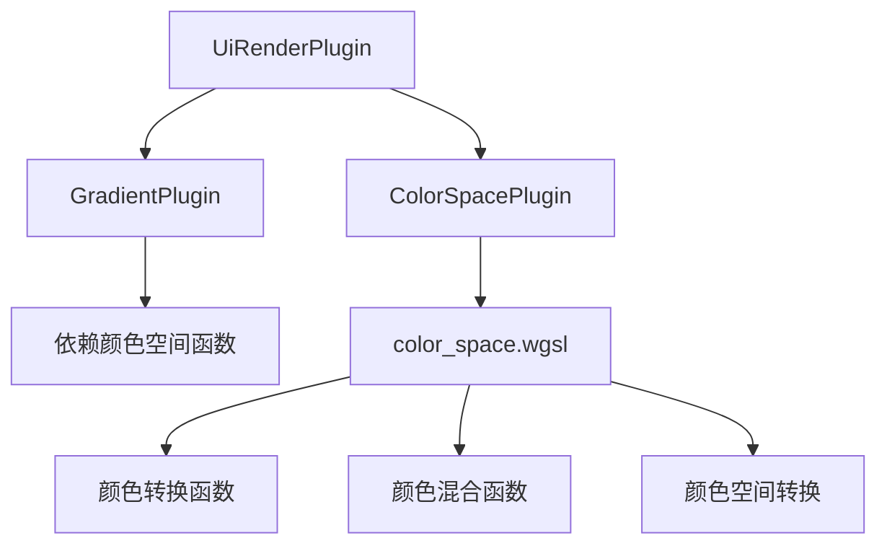

+++
title = "#21720 Move wgsl color space utils to separate plugin"
date = "2025-11-03T00:00:00"
draft = false
template = "pull_request_page.html"
in_search_index = false

[extra]
current_language = "zh-cn"
available_languages = {"en" = { name = "English", url = "/pull_request/bevy/2025-11/pr-21720-en-20251103" }, "zh-cn" = { name = "中文", url = "/pull_request/bevy/2025-11/pr-21720-zh-cn-20251103" }}
+++

# Move wgsl color space utils to separate plugin

## 基本信息
- **标题**: Move wgsl color space utils to separate plugin
- **PR链接**: https://github.com/bevyengine/bevy/pull/21720
- **作者**: rossleonardy
- **状态**: 已合并
- **标签**: A-Rendering, C-Code-Quality, C-Usability, S-Ready-For-Final-Review
- **创建时间**: 2025-11-02T14:03:57Z
- **合并时间**: 2025-11-03T19:22:50Z
- **合并者**: alice-i-cecile

## 描述翻译
# 目标
- 为着色器提供颜色转换函数
#20523 

## 解决方案
- 将这些WGSL函数移动到一个单独的插件中，以便可以重复使用
- 用户可以导入插件本身，也可以导入UiRenderPlugin，后者也会添加此插件。

- 不确定如何更清楚地表明GradientPlugin现在需要先添加ColorSpacePlugin，对于不导入整个UiRenderPlugin的用户
https://github.com/bevyengine/bevy/issues/69

- 因为着色器库需要在一个插件中添加，我将这个留在bevy_ui_render中。如果非UI消费者想要使用这个功能而不依赖bevy_ui_render，可能需要移动它。bevy_color是这个功能的逻辑位置，但这会在那里引入对bevy_ecs和bevy_shader的依赖

## 测试
- 我在testbed示例中重新测试了渐变着色器

## 展示


## 这个Pull Request的故事

这个PR的核心问题是代码复用和模块化。在Bevy的UI渲染系统中，渐变着色器包含了大量的颜色空间转换函数，这些函数在其他上下文中也可能有用，但被锁定在渐变特定的模块中。

### 问题识别
在之前的实现中，`gradient.wgsl`文件包含了307行代码，其中大部分是通用的颜色空间转换函数，如：
- sRGB与线性RGB的相互转换
- HSL、HSV、Oklab、Oklch颜色空间的转换
- 不同颜色空间中的颜色混合函数

这些函数虽然用于渐变渲染，但它们本质上是通用的颜色操作工具。将它们与渐变特定的逻辑耦合在一起违反了单一职责原则，也阻碍了在其他着色器中重用这些功能。

### 解决方案设计
开发者采用了经典的模块化方法：提取通用功能到独立的模块中。具体来说：

1. **创建新的颜色空间插件**：新增`ColorSpacePlugin`来管理颜色空间相关的WGSL函数
2. **分离关注点**：将颜色转换逻辑从渐变逻辑中分离出来
3. **保持向后兼容**：通过让`UiRenderPlugin`自动包含新的颜色空间插件来确保现有代码继续工作

### 实现细节
实现过程主要涉及文件重组和依赖管理：

在`color_space.wgsl`中，开发者创建了一个完整的颜色空间工具库，包含：
```wgsl
#define_import_path bevy_ui_render::color_space

fn srgb_to_linear_rgb(color: vec3<f32>) -> vec3<f32> {
    return vec3(
        gamma(color.x),
        gamma(color.y),
        gamma(color.z)
    );
}

fn mix_oklch(a: vec3<f32>, b: vec3<f32>, t: f32) -> vec3<f32> {
    // 色度接近零时的智能色调插值逻辑
    // ...
}
```

同时，在`gradient.wgsl`中，原来的颜色转换函数被移除，改为导入新的颜色空间模块：
```wgsl
#import bevy_ui_render::color_space::{
    convert_to_linear_rgba,
    mix_oklch,
    mix_oklch_long,
    // ... 其他函数
}
```

这种重构显著简化了渐变着色器，从原来的307行减少到60行，同时提高了代码的可维护性。

### 技术洞察
这个重构展示了几个重要的软件工程原则：

**依赖管理考虑**：开发者明确考虑了依赖关系的问题。新的`ColorSpacePlugin`需要在使用它的`GradientPlugin`之前被添加。虽然这引入了一个新的依赖约束，但通过让`UiRenderPlugin`包含两者来最小化对现有用户的影响。

**代码组织策略**：将通用着色器函数组织到独立的库中，遵循了Bevy的着色器模块化模式。这允许其他系统在需要颜色操作时重用这些函数，而不必依赖整个UI渲染系统。

**性能考量**：通过将函数提取到单独的WGSL模块中，编译器可以更好地优化这些函数的使用，特别是在多个着色器都使用相同函数的情况下。

### 影响与改进
这个变更带来了几个重要的改进：

1. **代码复用性**：其他需要颜色转换的着色器现在可以轻松导入这些函数
2. **可维护性**：颜色空间逻辑现在集中在一个地方，更容易测试和维护
3. **关注点分离**：渐变着色器现在专注于渐变特定的计算，而颜色转换由专门的模块处理

一个值得注意的权衡是引入了新的插件依赖关系，但考虑到代码复用带来的好处，这是一个合理的折衷。

## 视觉表示



## 关键文件更改

### `crates/bevy_ui_render/src/color_space.wgsl` (新增)
新增了264行的颜色空间工具库，包含完整的颜色转换和混合功能。

关键代码片段：
```wgsl
#define_import_path bevy_ui_render::color_space

// sRGB转换函数
fn srgb_to_linear_rgb(color: vec3<f32>) -> vec3<f32> {
    return vec3(
        gamma(color.x),
        gamma(color.y),
        gamma(color.z)
    );
}

// 智能颜色混合函数
fn mix_oklch(a: vec3<f32>, b: vec3<f32>, t: f32) -> vec3<f32> {
    // 当端点色度接近零时，不插值色调
    // 这允许从黑色或白色平滑过渡到目标颜色
    var h = a.z;
    var g = b.z;
    if a.y < HUE_GUARD {
        h = g;
    } else if b.y < HUE_GUARD {
        g = h;
    }
    // ... 色调插值逻辑
}
```

### `crates/bevy_ui_render/src/gradient.wgsl` (重构)
从307行减少到60行，移除了所有颜色转换函数，改为导入颜色空间模块。

重构前后的对比：
```wgsl
// 重构前：包含内联的颜色转换函数
const PI: f32 = 3.14159265358979323846;
const TAU: f32 = 2. * PI;

// 内联的gamma校正函数等...
fn gamma(value: f32) -> f32 {
    // 实现细节...
}

// 重构后：导入颜色空间模块
#import bevy_ui_render::color_space::{
    convert_to_linear_rgba,
    mix_oklch,
    mix_oklch_long,
    // ... 其他函数
}
#import bevy_render::maths::PI
```

### `crates/bevy_ui_render/src/color_space.rs` (新增)
新增了颜色空间插件，负责加载WGSL颜色空间库。

```rust
use bevy_app::{App, Plugin};
use bevy_shader::load_shader_library;

/// 用于WGSL颜色空间工具函数的插件
pub struct ColorSpacePlugin;

impl Plugin for ColorSpacePlugin {
    fn build(&self, app: &mut App) {
        load_shader_library!(app, "color_space.wgsl");
    }
}
```

### `crates/bevy_ui_render/src/lib.rs` (修改)
在UI渲染插件中注册新的颜色空间插件。

```rust
// 新增模块声明
mod color_space;

// 在插件构建中注册
impl Plugin for UiRenderPlugin {
    fn build(&self, app: &mut App) {
        app.add_plugins(UiTextureSlicerPlugin);
        app.add_plugins(ColorSpacePlugin);  // 新增
        app.add_plugins(GradientPlugin);
        app.add_plugins(BoxShadowPlugin);
    }
}
```

## 进一步阅读

- [Bevy着色器系统文档](https://bevyengine.org/learn/book/getting-started/shaders/)
- [WGSL颜色空间规范](https://www.w3.org/TR/WGSL/)
- [sRGB颜色空间标准](https://en.wikipedia.org/wiki/SRGB)
- [Oklab感知均匀颜色空间](https://bottosson.github.io/posts/oklab/)

---

# 完整代码差异
```diff
diff --git a/crates/bevy_ui_render/src/color_space.rs b/crates/bevy_ui_render/src/color_space.rs
new file mode 100644
index 0000000000000..765ed6e660a2a
--- /dev/null
+++ b/crates/bevy_ui_render/src/color_space.rs
@@ -0,0 +1,11 @@
+use bevy_app::{App, Plugin};
+use bevy_shader::load_shader_library;
+
+/// A plugin for WGSL color space utility functions
+pub struct ColorSpacePlugin;
+
+impl Plugin for ColorSpacePlugin {
+    fn build(&self, app: &mut App) {
+        load_shader_library!(app, "color_space.wgsl");
+    }
+}
diff --git a/crates/bevy_ui_render/src/color_space.wgsl b/crates/bevy_ui_render/src/color_space.wgsl
new file mode 100644
index 0000000000000..80401e10b506c
--- /dev/null
+++ b/crates/bevy_ui_render/src/color_space.wgsl
@@ -0,0 +1,264 @@
+#define_import_path bevy_ui_render::color_space
+#import bevy_render::maths::PI
+
+const TAU: f32 = 2. * PI;
+const HUE_GUARD: f32 = 0.0001;
+
+// https://en.wikipedia.org/wiki/SRGB
+fn gamma(value: f32) -> f32 {
+    if value <= 0.0 {
+        return value;
+    }
+    if value <= 0.04045 {
+        return value / 12.92; // linear falloff in dark values
+    } else {
+        return pow((value + 0.055) / 1.055, 2.4); // gamma curve in other area
+    }
+}
+
+// https://en.wikipedia.org/wiki/SRGB
+fn inverse_gamma(value: f32) -> f32 {
+    if value <= 0.0 {
+        return value;
+    }
+
+    if value <= 0.0031308 {
+        return value * 12.92; // linear falloff in dark values
+    } else {
+        return 1.055 * pow(value, 1.0 / 2.4) - 0.055; // gamma curve in other area
+    }
+}
+
+fn srgb_to_linear_rgb(color: vec3<f32>) -> vec3<f32> {
+    return vec3(
+        gamma(color.x),
+        gamma(color.y),
+        gamma(color.z)
+    );
+}
+
+fn linear_rgb_to_srgb(color: vec3<f32>) -> vec3<f32> {
+    return vec3(
+        inverse_gamma(color.x),
+        inverse_gamma(color.y),
+        inverse_gamma(color.z)
+    );
+}
+
+fn oklab_to_linear_rgb(c: vec3<f32>) -> vec3<f32> {
+    let l_ = c.x + 0.39633778 * c.y + 0.21580376 * c.z;
+    let m_ = c.x - 0.105561346 * c.y - 0.06385417 * c.z;
+    let s_ = c.x - 0.08948418 * c.y - 1.2914855 * c.z;
+    let l = l_ * l_ * l_;
+    let m = m_ * m_ * m_;
+    let s = s_ * s_ * s_;
+    return vec3(
+        4.0767417 * l - 3.3077116 * m + 0.23096994 * s,
+        -1.268438 * l + 2.6097574 * m - 0.34131938 * s,
+        -0.0041960863 * l - 0.7034186 * m + 1.7076147 * s,
+    );
+}
+
+fn hsl_to_linear_rgb(hsl: vec3<f32>) -> vec3<f32> {
+    let h = hsl.x;
+    let s = hsl.y;
+    let l = hsl.z;
+    let c = (1.0 - abs(2.0 * l - 1.0)) * s;
+    let hp = h * 6.0;
+    let x = c * (1.0 - abs(hp % 2.0 - 1.0));
+    var r: f32 = 0.0;
+    var g: f32 = 0.0;
+    var b: f32 = 0.0;
+    if 0.0 <= hp && hp < 1.0 {
+        r = c; g = x; b = 0.0;
+    } else if 1.0 <= hp && hp < 2.0 {
+        r = x; g = c; b = 0.0;
+    } else if 2.0 <= hp && hp < 3.0 {
+        r = 0.0; g = c; b = x;
+    } else if 3.0 <= hp && hp < 4.0 {
+        r = 0.0; g = x; b = c;
+    } else if 4.0 <= hp && hp < 5.0 {
+        r = x; g = 0.0; b = c;
+    } else if 5.0 <= hp && hp < 6.0 {
+        r = c; g = 0.0; b = x;
+    }
+    let m = l - 0.5 * c;
+    return srgb_to_linear_rgb(vec3(r + m, g + m, b + m));
+}
+
+fn hsv_to_linear_rgb(hsva: vec3<f32>) -> vec3<f32> {
+    let h = hsva.x * 6.0;
+    let s = hsva.y;
+    let v = hsva.z;
+    let c = v * s;
+    let x = c * (1.0 - abs(h % 2.0 - 1.0));
+    let m = v - c;
+    var r: f32 = 0.0;
+    var g: f32 = 0.0;
+    var b: f32 = 0.0;
+    if 0.0 <= h && h < 1.0 {
+        r = c; g = x; b = 0.0;
+    } else if 1.0 <= h && h < 2.0 {
+        r = x; g = c; b = 0.0;
+    } else if 2.0 <= h && h < 3.0 {
+        r = 0.0; g = c; b = x;
+    } else if 3.0 <= h && h < 4.0 {
+        r = 0.0; g = x; b = c;
+    } else if 4.0 <= h && h < 5.0 {
+        r = x; g = 0.0; b = c;
+    } else if 5.0 <= h && h < 6.0 {
+        r = c; g = 0.0; b = x;
+    }
+    return srgb_to_linear_rgb(vec3(r + m, g + m, b + m));
+}
+
+fn oklch_to_linear_rgb(c: vec3<f32>) -> vec3<f32> {
+    let hue = c.z * TAU;
+    return oklab_to_linear_rgb(vec3(c.x, c.y * cos(hue), c.y * sin(hue)));
+}
+
+fn mix_oklch(a: vec3<f32>, b: vec3<f32>, t: f32) -> vec3<f32> {
+    // If the chroma is close to zero for one of the endpoints, don't interpolate 
+    // the hue and instead use the hue of the other endpoint. This allows gradients that smoothly 
+    // transition from black or white to a target color without passing through unrelated hues.
+    var h = a.z;
+    var g = b.z;
+    if a.y < HUE_GUARD {
+        h = g;
+    } else if b.y < HUE_GUARD {
+        g = h;
+    }
+
+    let hue_diff = g - h;
+    if abs(hue_diff) > 0.5 {
+        if hue_diff > 0.0 {
+            h += (hue_diff - 1.) * t;
+        } else {
+            h += (hue_diff + 1.) * t;
+        }
+    } else {
+        h += hue_diff * t;
+    }
+    return vec3(
+        mix(a.x, b.x, t),
+        mix(a.y, b.y, t),
+        fract(h),
+    );
+}
+
+fn mix_oklch_long(a: vec3<f32>, b: vec3<f32>, t: f32) -> vec3<f32> {
+    var h = a.z;
+    var g = b.z;
+    if a.y < HUE_GUARD {
+        h = g;
+    } else if b.y < HUE_GUARD {
+        g = h;
+    }
+
+    let hue_diff = g - h;
+    if abs(hue_diff) < 0.5 {
+        if hue_diff >= 0.0 {
+            h += (hue_diff - 1.) * t;
+        } else {
+            h += (hue_diff + 1.) * t;
+        }
+    } else {
+        h += hue_diff * t;
+    }
+    return vec3(
+        mix(a.x, b.x, t),
+        mix(a.y, b.y, t),
+        fract(h),
+    );
+}
+
+fn mix_hsl(a: vec3<f32>, b: vec3<f32>, t: f32) -> vec3<f32> {
+    // If the saturation is close to zero for one of the endpoints, don't interpolate 
+    // the hue and instead use the hue of the other endpoint. This allows gradients that smoothly 
+    // transition from black or white to a target color without passing through unrelated hues.
+    var h = a.x; 
+    var g = b.x;
+    if a.y < HUE_GUARD {
+        h = g;
+    } else if b.y < HUE_GUARD {
+        g = h;
+    }
+
+    return vec3(
+        fract(h + (fract(g - h + 0.5) - 0.5) * t),
+        mix(a.y, b.y, t),
+        mix(a.z, b.z, t),
+    );
+}
+
+fn mix_hsl_long(a: vec3<f32>, b: vec3<f32>, t: f32) -> vec3<f32> {
+    var h = a.x;
+    var g = b.x;
+    if a.y < HUE_GUARD {
+        h = g;
+    } else if b.y < HUE_GUARD {
+        g = h;
+    }
+
+    let d = fract(g - h + 0.5) - 0.5;
+    return vec3(
+        fract(h + (d + select(1., -1., 0. < d)) * t),
+        mix(a.y, b.y, t),
+        mix(a.z, b.z, t),
+    );
+}
+
+fn mix_hsv(a: vec3<f32>, b: vec3<f32>, t: f32) -> vec3<f32> {
+    // If the saturation is close to zero for one of the endpoints, don't interpolate 
+    // the hue and instead use the hue of the other endpoint. This allows gradients that smoothly 
+    // transition from black or white to a target color without passing through unrelated hues.
+    var h = a.x;
+    var g = b.x;
+    if a.y < HUE_GUARD {
+        h = g;
+    } else if b.y < HUE_GUARD {
+        g = h;
+    }
+
+    let hue_diff = g - h;
+    if abs(hue_diff) > 0.5 {
+        if hue_diff > 0.0 {
+            h += (hue_diff - 1.0) * t;
+        } else {
+            h += (hue_diff + 1.0) * t;
+        }
+    } else {
+        h += hue_diff * t;
+    }
+    return vec3(
+        fract(h),
+        mix(a.y, b.y, t),
+        mix(a.z, b.z, t),
+    );
+}
+
+fn mix_hsv_long(a: vec3<f32>, b: vec3<f32>, t: f32) -> vec3<f32> {
+    var h = a.x;
+    var g = b.x;
+    if a.y < HUE_GUARD {
+        h = g;
+    } else if b.y < HUE_GUARD {
+        g = h;
+    }
+
+    let hue_diff = g - h;
+    if abs(hue_diff) < 0.5 {
+        if hue_diff >= 0.0 {
+            h += (hue_diff - 1.0) * t;
+        } else {
+            h += (hue_diff + 1.0) * t;
+        }
+    } else {
+        h += hue_diff * t;
+    }
+    return vec3(
+        fract(h),
+        mix(a.y, b.y, t),
+        mix(a.z, b.z, t),
+    );
+}
diff --git a/crates/bevy_ui_render/src/gradient.wgsl b/crates/bevy_ui_render/src/gradient.wgsl
index c36db3abb5895..aa4487f97b12a 100644
--- a/crates/bevy_ui_render/src/gradient.wgsl
+++ b/crates/bevy_ui_render/src/gradient.wgsl
@@ -4,11 +4,24 @@
     draw_uinode_border,
 }
 
-const PI: f32 = 3.14159265358979323846;
+#import bevy_ui_render::color_space::{
+    convert_to_linear_rgba,
+    mix_oklch,
+    mix_oklch_long,
+    mix_hsv,
+    mix_hsv_long,
+    mix_hsl,
+    mix_hsl_long,
+    oklch_to_linear_rgb,
+    hsv_to_linear_rgb,
+    hsl_to_linear_rgb,
+    oklab_to_linear_rgb,
+}
+
+#import bevy_render::maths::PI
+
 const TAU: f32 = 2. * PI;
-const HUE_GUARD: f32 = 0.0001;
 
-const TEXTURED = 1u;
 const RIGHT_VERTEX = 2u;
 const BOTTOM_VERTEX = 4u;
 // must align with BORDER_* shader_flags from bevy_ui/render/mod.rs
@@ -115,124 +128,10 @@ fn fragment(in: GradientVertexOutput) -> @location(0) vec4<f32> {
     }
 }
 
-// https://en.wikipedia.org/wiki/SRGB
-fn gamma(value: f32) -> f32 {
-    if value <= 0.0 {
-        return value;
-    }
-    if value <= 0.04045 {
-        return value / 12.92; // linear falloff in dark values
-    } else {
-        return pow((value + 0.055) / 1.055, 2.4); // gamma curve in other area
-    }
-}
-
-// https://en.wikipedia.org/wiki/SRGB
-fn inverse_gamma(value: f32) -> f32 {
-    if value <= 0.0 {
-        return value;
-    }
-
-    if value <= 0.0031308 {
-        return value * 12.92; // linear falloff in dark values
-    } else {
-        return 1.055 * pow(value, 1.0 / 2.4) - 0.055; // gamma curve in other area
-    }
-}
-
-fn srgb_to_linear_rgb(color: vec3<f32>) -> vec3<f32> {
-    return vec3(
-        gamma(color.x),
-        gamma(color.y),
-        gamma(color.z)
-    );
-}
-
-fn linear_rgb_to_srgb(color: vec3<f32>) -> vec3<f32> {
-    return vec3(
-        inverse_gamma(color.x),
-        inverse_gamma(color.y),
-        inverse_gamma(color.z)
-    );
-}
-
-fn oklab_to_linear_rgb(c: vec3<f32>) -> vec3<f32> {
-    let l_ = c.x + 0.39633778 * c.y + 0.21580376 * c.z;
-    let m_ = c.x - 0.105561346 * c.y - 0.06385417 * c.z;
-    let s_ = c.x - 0.08948418 * c.y - 1.2914855 * c.z;
-    let l = l_ * l_ * l_;
-    let m = m_ * m_ * m_;
-    let s = s_ * s_ * s_;
-    return vec3(
-        4.0767417 * l - 3.3077116 * m + 0.23096994 * s,
-        -1.268438 * l + 2.6097574 * m - 0.34131938 * s,
-        -0.0041960863 * l - 0.7034186 * m + 1.7076147 * s,
-    );
-}
-
-fn hsl_to_linear_rgb(hsl: vec3<f32>) -> vec3<f32> {
-    let h = hsl.x;
-    let s = hsl.y;
-    let l = hsl.z;
-    let c = (1.0 - abs(2.0 * l - 1.0)) * s;
-    let hp = h * 6.0;
-    let x = c * (1.0 - abs(hp % 2.0 - 1.0));
-    var r: f32 = 0.0;
-    var g: f32 = 0.0;
-    var b: f32 = 0.0;
-    if 0.0 <= hp && hp < 1.0 {
-        r = c; g = x; b = 0.0;
-    } else if 1.0 <= hp && hp < 2.0 {
-        r = x; g = c; b = 0.0;
-    } else if 2.0 <= hp && hp < 3.0 {
-        r = 0.0; g = c; b = x;
-    } else if 3.0 <= hp && hp < 4.0 {
-        r = 0.0; g = x; b = c;
-    } else if 4.0 <= hp && hp < 5.0 {
-        r = x; g = 0.0; b = c;
-    } else if 5.0 <= hp && hp < 6.0 {
-        r = c; g = 0.0; b = x;
-    }
-    let m = l - 0.5 * c;
-    return srgb_to_linear_rgb(vec3(r + m, g + m, b + m));
-}
-
-fn hsv_to_linear_rgb(hsva: vec3<f32>) -> vec3<f32> {
-    let h = hsva.x * 6.0;
-    let s = hsva.y;
-    let v = hsva.z;
-    let c = v * s;
-    let x = c * (