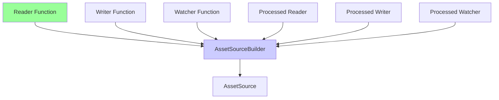

+++
title = "#21721 Make building asset sources infallible."
date = "2025-11-03T00:00:00"
draft = false
template = "pull_request_page.html"
in_search_index = true

[taxonomies]
list_display = ["show"]

[extra]
current_language = "en"
available_languages = {"en" = { name = "English", url = "/pull_request/bevy/2025-11/pr-21721-en-20251103" }, "zh-cn" = { name = "中文", url = "/pull_request/bevy/2025-11/pr-21721-zh-cn-20251103" }}
labels = ["A-Assets", "C-Usability", "M-Migration-Guide", "D-Straightforward"]
+++

# Title

## Basic Information
- **Title**: Make building asset sources infallible.
- **PR Link**: https://github.com/bevyengine/bevy/pull/21721
- **Author**: andriyDev
- **Status**: MERGED
- **Labels**: A-Assets, C-Usability, S-Ready-For-Final-Review, M-Migration-Guide, D-Straightforward
- **Created**: 2025-11-02T19:04:50Z
- **Merged**: 2025-11-03T19:31:14Z
- **Merged By**: alice-i-cecile

## Description Translation

# Objective

- Creating an asset source without a reader results in entirely skipping the asset source.

## Solution

- Make the `AssetSourceBuilder` take a reader builder fn in a `new` method.
- Remove `AssetSource::build` - users should just call the builder directly.

## Testing

- Tests still pass.

## The Story of This Pull Request

This PR addresses a subtle but important issue in Bevy's asset system where asset sources could be created without a reader, leading to those asset sources being silently skipped during initialization. The problem stemmed from the previous design where `AssetSourceBuilder` had an optional reader field, and if no reader was provided, the `build` method would return `None`, effectively ignoring the asset source without any warning to the developer.

The solution involved making the asset source construction process infallible by requiring a reader at construction time. This was achieved through several key changes:

First, the `AssetSourceBuilder` struct was redesigned to no longer derive `Default` and instead require a reader function through a new constructor method. This ensures that every asset source must have at least a reader:

```rust
// Before: reader was Option<...>
pub struct AssetSourceBuilder {
    pub reader: Option<Box<dyn FnMut() -> Box<dyn ErasedAssetReader> + Send + Sync>>,
    // ...
}

// After: reader is required
pub struct AssetSourceBuilder {
    pub reader: Box<dyn FnMut() -> Box<dyn ErasedAssetReader> + Send + Sync>,
    // ...
}

impl AssetSourceBuilder {
    pub fn new(
        reader: impl FnMut() -> Box<dyn ErasedAssetReader> + Send + Sync + 'static,
    ) -> AssetSourceBuilder {
        Self {
            reader: Box::new(reader),
            writer: None,
            // ... other fields initialized to None
        }
    }
}
```

Second, the `AssetSource::build` method was removed entirely, and all code was updated to use `AssetSourceBuilder::new` directly. This change simplifies the API surface and eliminates the possibility of creating an incomplete asset source builder:

```rust
// Before
let source = AssetSource::build()
    .with_reader(|| Box::new(reader))
    .with_writer(|| Some(Box::new(writer)));

// After  
let source = AssetSourceBuilder::new(|| Box::new(reader))
    .with_writer(|| Some(Box::new(writer)));
```

The `AssetSourceBuilder::build` method was also updated to always return an `AssetSource` instead of `Option<AssetSource>`, since the reader is now guaranteed to exist:

```rust
// Before: returned Option<AssetSource>
pub fn build(...) -> Option<AssetSource> {
    let reader = self.reader.as_mut()?(); // Could return None
    // ...
}

// After: always returns AssetSource  
pub fn build(...) -> AssetSource {
    let reader = self.reader.as_mut()(); // Always succeeds
    // ...
}
```

This change cascaded through the entire asset system, requiring updates to all places where asset sources are created, including the embedded asset system, web asset system, and numerous test cases. The consistency of this change is evident in how uniformly the migration was applied across the codebase.

From an engineering perspective, this change improves the robustness of the asset system by eliminating a silent failure mode. Developers can no longer accidentally create asset sources that are silently ignored, which was particularly problematic because the failure occurred at initialization time without clear error messages. The new design makes the requirement explicit at the type system level, leveraging Rust's type safety to prevent invalid configurations.

The PR also includes a comprehensive migration guide that clearly explains the required changes for users who have implemented custom asset sources, demonstrating good maintainer practices for breaking changes.

## Visual Representation



## Key Files Changed

### `crates/bevy_asset/src/io/source.rs` (+26/-18)

This file contains the core changes to the `AssetSourceBuilder` struct and its methods.

**Key changes:**
- Removed `Default` derivation from `AssetSourceBuilder`
- Added `new` constructor that requires a reader function
- Updated `build` method to always return `AssetSource` instead of `Option<AssetSource>`
- Removed optional wrapper from reader field

```rust
// Before:
#[derive(Default)]
pub struct AssetSourceBuilder {
    pub reader: Option<Box<dyn FnMut() -> Box<dyn ErasedAssetReader> + Send + Sync>>,
    // ...
}

// After:
pub struct AssetSourceBuilder {
    pub reader: Box<dyn FnMut() -> Box<dyn ErasedAssetReader> + Send + Sync>,
    // ...
}

impl AssetSourceBuilder {
    // New constructor
    pub fn new(reader: impl FnMut() -> Box<dyn ErasedAssetReader> + Send + Sync + 'static) -> Self {
        Self {
            reader: Box::new(reader),
            writer: None,
            // ...
        }
    }
    
    // build method now infallible
    pub fn build(...) -> AssetSource { // Was Option<AssetSource>
        let reader = self.reader.as_mut()(); // No longer checks for None
        // ...
    }
}
```

### `crates/bevy_asset/src/io/embedded/mod.rs` (+20/-20)

Updated the embedded asset source to use the new builder pattern.

```rust
// Before:
let mut source = AssetSource::build()
    .with_reader(move || Box::new(MemoryAssetReader { root: dir.clone() }))
    .with_processed_reader(move || Box::new(MemoryAssetReader { root: processed_dir.clone() }));

// After:
let mut source = AssetSourceBuilder::new(move || Box::new(MemoryAssetReader { root: dir.clone() }))
    .with_processed_reader(move || Box::new(MemoryAssetReader { root: processed_dir.clone() }));
```

### `crates/bevy_asset/src/lib.rs` (+17/-18)

Updated multiple test cases to use the new API pattern.

### `release-content/migration-guides/custom_asset_source_infallible.md` (+28/-0)

Added comprehensive migration guide explaining the changes.

### `crates/bevy_asset/src/io/web.rs` (+5/-5)

Updated web asset sources to use the new builder pattern.

```rust
// Before:
app.register_asset_source(
    "http",
    AssetSource::build()
        .with_reader(move || Box::new(WebAssetReader::Http))
        .with_processed_reader(move || Box::new(WebAssetReader::Http)),
);

// After:
app.register_asset_source(
    "http", 
    AssetSourceBuilder::new(move || Box::new(WebAssetReader::Http))
        .with_processed_reader(move || Box::new(WebAssetReader::Http)),
);
```

## Further Reading

- [Bevy Asset System Documentation](https://bevyengine.org/learn/quick-start/assets/)
- [Rust Error Handling Patterns](https://doc.rust-lang.org/book/ch09-00-error-handling.html)
- [Builder Pattern in Rust](https://doc.rust-lang.org/1.0.0/style/ownership/builders.html)