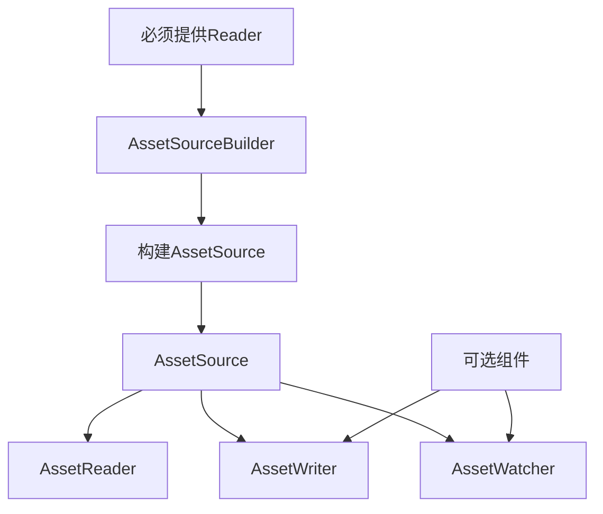

+++
title = "#21721 Make building asset sources infallible."
date = "2025-11-03T00:00:00"
draft = false
template = "pull_request_page.html"
in_search_index = false

[extra]
current_language = "zh-cn"
available_languages = {"en" = { name = "English", url = "/pull_request/bevy/2025-11/pr-21721-en-20251103" }, "zh-cn" = { name = "中文", url = "/pull_request/bevy/2025-11/pr-21721-zh-cn-20251103" }}
labels = ["A-Assets", "C-Usability", "M-Migration-Guide", "D-Straightforward"]
+++

# Make building asset sources infallible.

## Basic Information
- **Title**: Make building asset sources infallible.
- **PR Link**: https://github.com/bevyengine/bevy/pull/21721
- **Author**: andriyDev
- **Status**: MERGED
- **Labels**: A-Assets, C-Usability, S-Ready-For-Final-Review, M-Migration-Guide, D-Straightforward
- **Created**: 2025-11-02T19:04:50Z
- **Merged**: 2025-11-03T19:31:14Z
- **Merged By**: alice-i-cecile

## Description Translation
# 目标

- 在没有reader的情况下创建asset source会导致完全跳过该asset source。

## 解决方案

- 让`AssetSourceBuilder`在`new`方法中接受一个reader构建函数。
- 移除`AssetSource::build` - 用户应该直接调用构建器。

## 测试

- 测试仍然通过。

## The Story of This Pull Request

这个PR解决了一个在Bevy资产系统中存在的潜在问题：当开发者创建asset source时如果没有提供reader，整个asset source会被静默跳过，这会导致难以调试的问题。

**问题根源**在于原有的`AssetSourceBuilder`设计允许创建没有reader的asset source。在`AssetSourceBuilder::build`方法中，如果reader为`None`，方法会返回`None`，导致asset source不会被注册。这种静默失败的行为对于开发者来说是不直观的，特别是当他们在自定义asset source时。

**解决方案**采用了强制性的设计方法：通过修改`AssetSourceBuilder`的构造函数，要求必须提供reader构建函数。具体来说：

1. 移除了`AssetSourceBuilder`的`Default`实现
2. 新增了`AssetSourceBuilder::new`方法，强制要求传入reader构建函数
3. 将`reader`字段从`Option`改为直接的类型，确保其始终存在
4. 相应地修改了`build`方法，现在它总是返回`AssetSource`而不是`Option<AssetSource>`

**技术实现**的关键在于重构了构建模式。原来的构建模式从：
```rust
AssetSource::build()
    .with_reader(|| ...)
```
改为：
```rust
AssetSourceBuilder::new(|| ...)
```

这种改变确保了在构建asset source的起始阶段就必须提供reader，从而消除了静默失败的可能性。

**架构影响**体现在整个资产系统的初始化流程中。现在，当`AssetSourceBuilders`构建实际的asset source时，不再需要处理`None`的情况，因为每个asset source保证都有reader。这简化了调用方的代码逻辑，减少了潜在的错误。

这个修改体现了防御性编程的原则：通过API设计来防止错误的发生，而不是依赖文档或开发者记忆来避免错误。

## Visual Representation



## Key Files Changed

### `crates/bevy_asset/src/io/source.rs` (+26/-18)

这是本次修改的核心文件，重构了`AssetSourceBuilder`的设计：

```rust
// Before:
#[derive(Default)]
pub struct AssetSourceBuilder {
    pub reader: Option<Box<dyn FnMut() -> Box<dyn ErasedAssetReader> + Send + Sync>>,
    // ... 其他可选字段
}

impl AssetSourceBuilder {
    pub fn build(...) -> Option<AssetSource> {
        let reader = self.reader.as_mut()?; // 可能返回None
        // ...
    }
}

// After:
pub struct AssetSourceBuilder {
    pub reader: Box<dyn FnMut() -> Box<dyn ErasedAssetReader> + Send + Sync>,
    // ... 其他可选字段
}

impl AssetSourceBuilder {
    pub fn new(reader: impl FnMut() -> Box<dyn ErasedAssetReader> + Send + Sync + 'static) -> AssetSourceBuilder {
        Self {
            reader: Box::new(reader),
            // ... 其他字段初始化为None
        }
    }
    
    pub fn build(...) -> AssetSource {  // 不再返回Option
        let reader = self.reader.as_mut()(); // 总是有reader
        // ...
    }
}
```

### `crates/bevy_asset/src/lib.rs` (+17/-18)

更新了测试代码以使用新的API：

```rust
// Before:
app.register_asset_source(
    AssetSourceId::Default,
    AssetSource::build().with_reader(move || Box::new(memory_reader.clone())),
)

// After:
app.register_asset_source(
    AssetSourceId::Default,
    AssetSourceBuilder::new(move || Box::new(memory_reader.clone())),
)
```

### `release-content/migration-guides/custom_asset_source_infallible.md` (+28/-0)

新增了迁移指南，指导用户如何更新他们的代码：

```markdown
Previously, it was possible to create asset sources with no reader, resulting in your asset sources
silently being skipped. This is no longer possible, since `AssetSourceBuilder` must now be given a
reader to start. We also slightly changed how sources are expected to be built.

In previous versions, creating a custom source would look like:

```rust
AssetSource::build()
    .with_reader(move || todo!("the reader!"))
    .with_writer(move || todo!())
    .with_processed_reader(move || todo!())
    .with_processed_writer(move || todo!())
```

In Bevy 0.18, this now looks like:

```rust
// You may need to import AssetSourceBuilder.
AssetSourceBuilder::new(move || todo!("the reader!"))
    .with_writer(move || todo!())
    .with_processed_reader(move || todo!())
    .with_processed_writer(move || todo!())
```
```

### `crates/bevy_asset/src/io/embedded/mod.rs` (+20/-20)

更新了embedded asset source的实现：

```rust
// Before:
let mut source = AssetSource::build()
    .with_reader(move || Box::new(MemoryAssetReader { root: dir.clone() }))

// After:
let mut source = AssetSourceBuilder::new(move || Box::new(MemoryAssetReader { root: dir.clone() }))
```

### `crates/bevy_asset/src/io/web.rs` (+5/-5)

更新了web asset source的实现：

```rust
// Before:
app.register_asset_source(
    "http",
    AssetSource::build()
        .with_reader(move || Box::new(WebAssetReader::Http))
)

// After:
app.register_asset_source(
    "http",
    AssetSourceBuilder::new(move || Box::new(WebAssetReader::Http))
)
```

## Further Reading

- [Bevy Assets Documentation](https://bevyengine.org/learn/quick-start/assets/)
- [Builder Pattern in Rust](https://doc.rust-lang.org/1.0.0/style/ownership/builders.html)
- [Defensive Programming Principles](https://en.wikipedia.org/wiki/Defensive_programming)

# Full Code Diff
<由于代码diff过长，已在上述分析中分段展示关键修改>