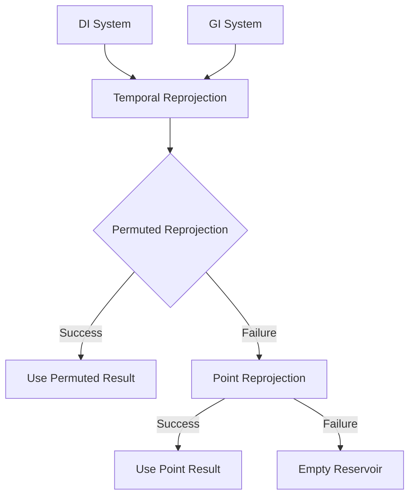

+++
title = "#21722 Solari: Fallback to point temporal reprojection when permutation fails"
date = "2025-11-04T00:00:00"
draft = false
template = "pull_request_page.html"
in_search_index = true

[taxonomies]
list_display = ["show"]

[extra]
current_language = "en"
available_languages = {"en" = { name = "English", url = "/pull_request/bevy/2025-11/pr-21722-en-20251104" }, "zh-cn" = { name = "中文", url = "/pull_request/bevy/2025-11/pr-21722-zh-cn-20251104" }}
labels = ["A-Rendering", "C-Refinement"]
+++

# Title

## Basic Information
- **Title**: Solari: Fallback to point temporal reprojection when permutation fails
- **PR Link**: https://github.com/bevyengine/bevy/pull/21722
- **Author**: JMS55
- **Status**: MERGED
- **Labels**: A-Rendering, S-Ready-For-Final-Review, C-Refinement
- **Created**: 2025-11-03T01:30:05Z
- **Merged**: 2025-11-04T06:57:42Z
- **Merged By**: alice-i-cecile

## Description Translation

Permutation tends to lead to temporal reprojection failures on the edges of objects (not a huge deal for DI, very problematic for GI).

Now when the initial permuted reprojection fails, we instead fallback to non-permuted reprojection.

Before:


After:


## The Story of This Pull Request

This PR addresses a specific issue in Bevy's Solari rendering system related to temporal reprojection failures at object edges. The problem occurs when using pixel permutation for temporal reprojection, which can fail on object boundaries and cause visual artifacts.

The core issue stems from how temporal reprojection works in ReSTIR (Reusable Spatio-Temporal Importance Resampling) implementations. When reprojecting pixels from previous frames to the current frame, the system uses motion vectors to find corresponding pixels. Pixel permutation is a technique that helps reduce bias by randomly shuffling pixel coordinates, but it has a weakness: it can fail at object edges where geometry changes abruptly between frames.

The solution implemented here is straightforward but effective: when the initial permuted reprojection fails, the system falls back to non-permuted (point) reprojection. This creates a two-stage approach that maintains the benefits of permutation while providing a safety net for edge cases.

The implementation required changes to both Direct Illumination (DI) and Global Illumination (GI) shaders. In each case, the existing `load_temporal_reservoir` function was refactored to extract the core reprojection logic into a new `load_temporal_reservoir_inner` function. This allowed the main function to first attempt permuted reprojection, then fall back to point reprojection if the initial attempt failed.

For DI, the validity check uses a dedicated `reservoir_valid` function, while for GI it checks if the reservoir radiance is all zeros. This difference reflects the different data structures and validation requirements between the two illumination systems.

The engineering trade-off here is clear: we're adding a fallback path that may be slightly more expensive computationally, but the benefit is significantly improved visual quality, especially for GI where temporal artifacts are more problematic. The approach maintains the anti-bias benefits of permutation while ensuring robustness at object boundaries.

## Visual Representation



## Key Files Changed

### `crates/bevy_solari/src/realtime/restir_di.wgsl` (+17/-8)

This file handles Direct Illumination temporal reprojection. The main change refactors the reprojection logic to support fallback behavior.

**Key changes:**
- Extracted core reprojection logic into `load_temporal_reservoir_inner`
- Added fallback from permuted to point reprojection
- Maintains existing validity checks for lights and pixel dissimilarity

```wgsl
// Before:
let temporal_pixel_id = permute_pixel(vec2<u32>(temporal_pixel_id_float), constants.frame_index, view.viewport.zw);

// Check if the pixel features have changed heavily between the current and previous frame
let temporal_depth = textureLoad(previous_depth_buffer, temporal_pixel_id, 0);
let temporal_surface = gpixel_resolve(textureLoad(previous_gbuffer, temporal_pixel_id, 0), temporal_depth, temporal_pixel_id, view.main_pass_viewport.zw, previous_view.world_from_clip);
if pixel_dissimilar(depth, world_position, temporal_surface.world_position, world_normal, temporal_surface.world_normal, view) {
    return empty_reservoir();
}

var temporal_reservoir = load_reservoir_a(temporal_pixel_id);

// After:
let permuted_temporal_pixel_id = permute_pixel(vec2<u32>(temporal_pixel_id_float), constants.frame_index, view.viewport.zw);
var temporal_reservoir = load_temporal_reservoir_inner(permuted_temporal_pixel_id, depth, world_position, world_normal);

// If permuted reprojection failed (tends to happen on object edges), try point reprojection
if !reservoir_valid(temporal_reservoir) {
    temporal_reservoir = load_temporal_reservoir_inner(vec2<u32>(temporal_pixel_id_float), depth, world_position, world_normal);
}
```

### `crates/bevy_solari/src/realtime/restir_gi.wgsl` (+15/-4)

This file handles Global Illumination temporal reprojection with similar refactoring.

**Key changes:**
- Same fallback pattern as DI but with GI-specific data structures
- Uses radiance zero-check for validity instead of dedicated function
- Maintains confidence weight capping

```wgsl
// Before:
let temporal_pixel_id = permute_pixel(vec2<u32>(temporal_pixel_id_float), constants.frame_index, view.viewport.zw);

// Check if the current pixel was off screen during the previous frame (current pixel is newly visible),
// or if all temporal history should assumed to be invalid
if any(temporal_pixel_id_float < vec2(0.0)) || any(temporal_pixel_id_float >= view.main_pass_viewport.zw) || constants.temporal_history_invalid {
    return NeighborInfo(empty_reservoir(), vec3(0.0), vec3(0.0), vec3(0.0));
}

// After:
let permuted_temporal_pixel_id = permute_pixel(vec2<u32>(temporal_pixel_id_float), constants.frame_index, view.viewport.zw);
var temporal = load_temporal_reservoir_inner(permuted_temporal_pixel_id, depth, world_position, world_normal);

// If permuted reprojection failed (tends to happen on object edges), try point reprojection
if all(temporal.reservoir.radiance == vec3(0.0)) {
    temporal = load_temporal_reservoir_inner(vec2<u32>(temporal_pixel_id_float), depth, world_position, world_normal);
}
```

## Further Reading

- [ReSTIR: Reusable Spatio-Temporal Importance Resampling](https://research.nvidia.com/publication/2020-07_restir-reusable-spatio-temporal-importance-resampling) - Original paper on ReSTIR technique
- [Temporal Anti-Aliasing](https://en.wikipedia.org/wiki/Temporal_anti-aliasing) - Background on temporal techniques in rendering
- [Bevy Solari Documentation](https://github.com/bevyengine/bevy/tree/main/crates/bevy_solari) - Bevy's real-time GI system implementation