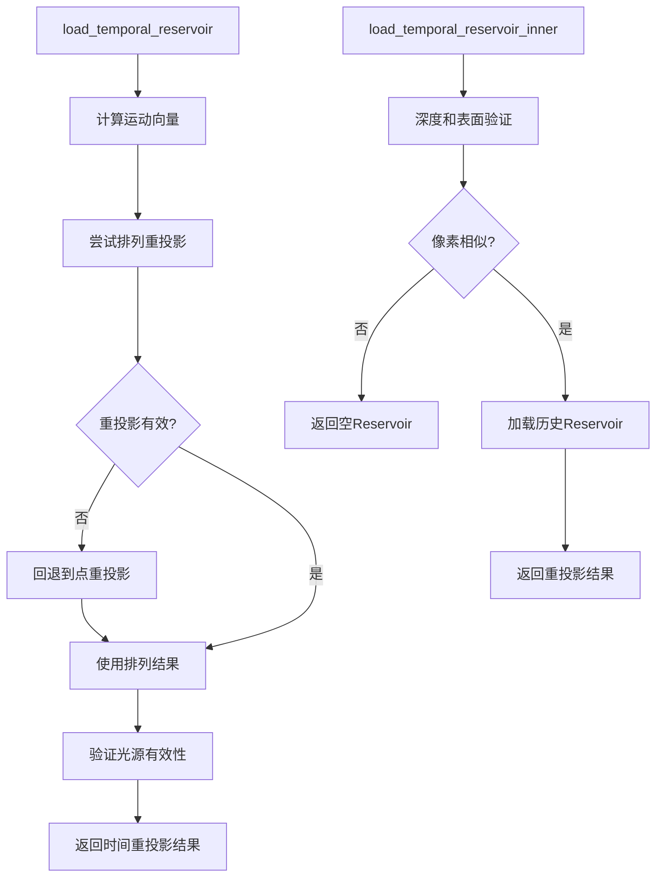

+++
title = "#21722 Solari: Fallback to point temporal reprojection when permutation fails"
date = "2025-11-04T00:00:00"
draft = false
template = "pull_request_page.html"
in_search_index = false

[extra]
current_language = "zh-cn"
available_languages = {"en" = { name = "English", url = "/pull_request/bevy/2025-11/pr-21722-en-20251104" }, "zh-cn" = { name = "中文", url = "/pull_request/bevy/2025-11/pr-21722-zh-cn-20251104" }}
labels = ["A-Rendering", "C-Refinement"]
+++

# Solari: Fallback to point temporal reprojection when permutation fails

## Basic Information
- **Title**: Solari: Fallback to point temporal reprojection when permutation fails
- **PR Link**: https://github.com/bevyengine/bevy/pull/21722
- **Author**: JMS55
- **Status**: MERGED
- **Labels**: A-Rendering, S-Ready-For-Final-Review, C-Refinement
- **Created**: 2025-11-03T01:30:05Z
- **Merged**: 2025-11-04T06:57:42Z
- **Merged By**: alice-i-cecile

## Description Translation
排列（permutation）往往会导致在物体边缘的时间重投影（temporal reprojection）失败（对于直接光照（DI）影响不大，但对于全局光照（GI）则问题严重）。

现在当初始的排列重投影失败时，我们回退到非排列的重投影。

之前：


之后：


## The Story of This Pull Request

这个PR解决了Solari渲染系统中一个关键的时间重投影问题。问题的核心在于，当使用排列（permutation）技术进行时间重投影时，在物体边缘经常会出现失败的情况。

**问题背景**
在实时渲染中，时间重投影技术用于复用前一帧的采样信息，以减少当前帧的噪声。排列技术通过在像素坐标上应用伪随机偏移，帮助打破空间相关性并减少重影（ghosting）伪影。然而，这种技术在物体边界处特别容易失败，因为相邻像素可能属于不同的表面，导致重投影时采样到不相关的数据。

对于直接光照（DI），这种失败通常影响不大，但对于全局光照（GI）来说，问题就变得非常严重，因为GI对采样的连续性要求更高。

**解决方案设计**
开发者采用了一个简单而有效的策略：实现一个两级回退机制。首先尝试使用排列的重投影，如果失败，则回退到标准的点重投影。这种设计既保留了排列技术带来的好处（减少重影），又确保了在边缘情况下系统能够降级到更可靠的方法。

**实现细节**
实现的关键在于重构了`load_temporal_reservoir`函数，将其核心逻辑提取到一个新的内部函数`load_temporal_reservoir_inner`中。这个内部函数负责执行实际的重投影验证和采样工作。

在DI的实现中：
```wgsl
let permuted_temporal_pixel_id = permute_pixel(vec2<u32>(temporal_pixel_id_float), constants.frame_index, view.viewport.zw);
var temporal_reservoir = load_temporal_reservoir_inner(permuted_temporal_pixel_id, depth, world_position, world_normal);

// If permuted reprojection failed (tends to happen on object edges), try point reprojection
if !reservoir_valid(temporal_reservoir) {
    temporal_reservoir = load_temporal_reservoir_inner(vec2<u32>(temporal_pixel_id_float), depth, world_position, world_normal);
}
```

在GI的实现中采用了类似的模式，但使用不同的有效性检查：
```wgsl
// If permuted reprojection failed (tends to happen on object edges), try point reprojection
if all(temporal.reservoir.radiance == vec3(0.0)) {
    temporal = load_temporal_reservoir_inner(vec2<u32>(temporal_pixel_id_float), depth, world_position, world_normal);
}
```

**技术洞察**
这个实现展示了几个重要的工程原则：

1. **渐进式降级**：系统首先尝试最优方法，在失败时优雅地降级到次优但更可靠的方法。

2. **代码复用**：通过提取内部函数，避免了在两个回退路径中重复相同的验证逻辑。

3. **领域特定验证**：DI和GI使用不同的有效性检查标准，反映了它们各自的数据特性和要求。

**性能考量**
虽然这个实现增加了额外的重投影尝试，但由于重投影失败主要发生在物体边缘（这些区域通常只占屏幕的一小部分），整体性能影响应该是可以接受的。这种权衡在实时渲染中很常见：用少量的额外计算换取显著的视觉质量提升。

**影响评估**
从提供的对比图像可以看出，这个修复显著改善了物体边缘的重投影质量。对于依赖时间累积的渲染技术（如ReSTIR），这种改进对于减少闪烁和保持视觉稳定性至关重要。

## Visual Representation



## Key Files Changed

### `crates/bevy_solari/src/realtime/restir_di.wgsl` (+17/-8)

这个文件实现了直接光照的ReSTIR算法。主要变化是重构了时间重投影逻辑，增加了回退机制。

**关键修改：**
```wgsl
// Before:
let temporal_pixel_id = permute_pixel(vec2<u32>(temporal_pixel_id_float), constants.frame_index, view.viewport.zw);

// Check if the pixel features have changed heavily between the current and previous frame
let temporal_depth = textureLoad(previous_depth_buffer, temporal_pixel_id, 0);
let temporal_surface = gpixel_resolve(textureLoad(previous_gbuffer, temporal_pixel_id, 0), temporal_depth, temporal_pixel_id, view.main_pass_viewport.zw, previous_view.world_from_clip);
if pixel_dissimilar(depth, world_position, temporal_surface.world_position, world_normal, temporal_surface.world_normal, view) {
    return empty_reservoir();
}

var temporal_reservoir = load_reservoir_a(temporal_pixel_id);

// After:
let permuted_temporal_pixel_id = permute_pixel(vec2<u32>(temporal_pixel_id_float), constants.frame_index, view.viewport.zw);
var temporal_reservoir = load_temporal_reservoir_inner(permuted_temporal_pixel_id, depth, world_position, world_normal);

// If permuted reprojection failed (tends to happen on object edges), try point reprojection
if !reservoir_valid(temporal_reservoir) {
    temporal_reservoir = load_temporal_reservoir_inner(vec2<u32>(temporal_pixel_id_float), depth, world_position, world_normal);
}
```

新增的内部函数：
```wgsl
fn load_temporal_reservoir_inner(temporal_pixel_id: vec2<u32>, depth: f32, world_position: vec3<f32>, world_normal: vec3<f32>) -> Reservoir {
    // Check if the pixel features have changed heavily between the current and previous frame
    let temporal_depth = textureLoad(previous_depth_buffer, temporal_pixel_id, 0);
    let temporal_surface = gpixel_resolve(textureLoad(previous_gbuffer, temporal_pixel_id, 0), temporal_depth, temporal_pixel_id, view.main_pass_viewport.zw, previous_view.world_from_clip);
    if pixel_dissimilar(depth, world_position, temporal_surface.world_position, world_normal, temporal_surface.world_normal, view) {
        return empty_reservoir();
    }

    return load_reservoir_a(temporal_pixel_id);
}
```

### `crates/bevy_solari/src/realtime/restir_gi.wgsl` (+15/-4)

这个文件实现了全局光照的ReSTIR算法，采用了与DI类似的回退机制。

**关键修改：**
```wgsl
// Before:
let temporal_pixel_id = permute_pixel(vec2<u32>(temporal_pixel_id_float), constants.frame_index, view.viewport.zw);

// Check if the pixel features have changed heavily between the current and previous frame
let temporal_depth = textureLoad(previous_depth_buffer, temporal_pixel_id, 0);
let temporal_surface = gpixel_resolve(textureLoad(previous_gbuffer, temporal_pixel_id, 0), temporal_depth, temporal_pixel_id, view.main_pass_viewport.zw, previous_view.world_from_clip);
if pixel_dissimilar(depth, world_position, temporal_surface.world_position, world_normal, temporal_surface.world_normal, view) {
    return NeighborInfo(empty_reservoir(), vec3(0.0), vec3(0.0), vec3(0.0));
}

let temporal_pixel_index = temporal_pixel_id.x + temporal_pixel_id.y * u32(view.main_pass_viewport.z);
var temporal_reservoir = gi_reservoirs_a[temporal_pixel_index];

temporal_reservoir.confidence_weight = min(temporal_reservoir.confidence_weight, CONFIDENCE_WEIGHT_CAP);

// After:
let permuted_temporal_pixel_id = permute_pixel(vec2<u32>(temporal_pixel_id_float), constants.frame_index, view.viewport.zw);
var temporal = load_temporal_reservoir_inner(permuted_temporal_pixel_id, depth, world_position, world_normal);

// If permuted reprojection failed (tends to happen on object edges), try point reprojection
if all(temporal.reservoir.radiance == vec3(0.0)) {
    temporal = load_temporal_reservoir_inner(vec2<u32>(temporal_pixel_id_float), depth, world_position, world_normal);
}

temporal.reservoir.confidence_weight = min(temporal.reservoir.confidence_weight, CONFIDENCE_WEIGHT_CAP);
```

## Further Reading

- [ReSTIR: Path Resampling for Real-Time Path Tracing](https://research.nvidia.com/publication/2020-07_restir-path-resampling-real-time-path-tracing) - ReSTIR算法的原始论文
- [Temporal Antialiasing in Production](https://de45xmedrsdbp.cloudfront.net/Resources/files/TemporalAA_small-59732822.pdf) - 时间重投影技术的详细介绍
- [Bevy Engine Rendering Documentation](https://bevyengine.org/learn/quick-start/rendering/) - Bevy引擎渲染系统概览