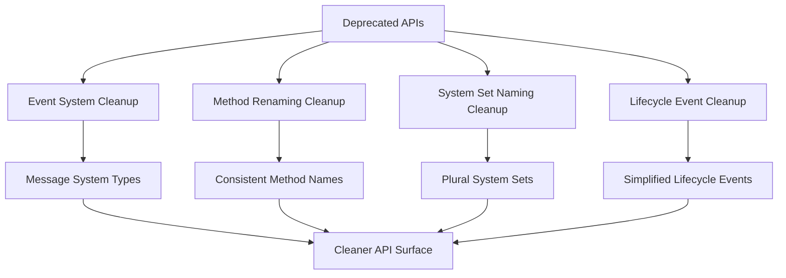

+++
title = "#21723 remove deprecated APIs in 0.17"
date = "2025-11-03T00:00:00"
draft = false
template = "pull_request_page.html"
in_search_index = true

[taxonomies]
list_display = ["show"]

[extra]
current_language = "en"
available_languages = {"en" = { name = "English", url = "/pull_request/bevy/2025-11/pr-21723-en-20251103" }, "zh-cn" = { name = "中文", url = "/pull_request/bevy/2025-11/pr-21723-zh-cn-20251103" }}
labels = ["D-Trivial", "C-Code-Quality", "A-Cross-Cutting"]
+++

# remove deprecated APIs in 0.17

## Basic Information
- **Title**: remove deprecated APIs in 0.17
- **PR Link**: https://github.com/bevyengine/bevy/pull/21723
- **Author**: re0312
- **Status**: MERGED
- **Labels**: D-Trivial, C-Code-Quality, S-Ready-For-Final-Review, A-Cross-Cutting
- **Created**: 2025-11-03T03:30:02Z
- **Merged**: 2025-11-03T19:26:50Z
- **Merged By**: alice-i-cecile

## Description Translation
# Objective

- removes all APIs that were marked as deprecated in 0.17,

## The Story of This Pull Request

This PR addresses the routine but important task of cleaning up deprecated APIs from the Bevy codebase. When Bevy 0.17 introduced breaking changes, many APIs were marked with deprecation warnings to give users time to migrate. Now that the transition period has passed, these deprecated APIs need to be removed to reduce code complexity, eliminate potential confusion, and prevent users from relying on outdated patterns.

The approach taken is straightforward: systematically remove all types, functions, methods, and macros that were marked as deprecated in version 0.17. This is a mechanical but essential maintenance task that follows semantic versioning principles - breaking changes are allowed in major versions, and deprecated APIs should be removed in subsequent releases.

Looking at the implementation, the changes span multiple areas of the codebase, reflecting the scope of the 0.17 API changes:

**Event System Migration**: The most significant change involves the transition from "events" to "messages" terminology. In Bevy 0.17, the event system was renamed to message system to better reflect its purpose and avoid confusion with observer-based events. This PR removes all the deprecated event-related aliases:

```rust
// Before (deprecated):
pub type EventCursor<E> = crate::message::MessageCursor<E>;
pub type EventReader<'w, 's, E> = crate::message::MessageReader<'w, 's, E>;
pub type EventWriter<'w, E> = crate::message::MessageWriter<'w, E>;

// After (removed):
// Only MessageCursor, MessageReader, MessageWriter remain
```

**API Method Renaming**: Many methods were renamed for consistency and clarity. The old names were kept as deprecated aliases in 0.17, and now they're being removed:

```rust
// Before (deprecated):
pub fn send_event<E: Message>(event: E) -> impl Command {
    write_message(event)
}

// After (removed):
// Only write_message remains
```

**System Set Naming**: System sets were renamed from singular to plural forms for grammatical consistency:

```rust
// Before (deprecated):
pub type CameraUpdateSystem = CameraUpdateSystems;

// After (removed):
// Only CameraUpdateSystems remains
```

**Lifecycle Event Updates**: The lifecycle event system was simplified by removing the "On" prefix from event types:

```rust
// Before (deprecated):
pub type OnAdd = Add;
pub type OnInsert = Insert;
pub type OnReplace = Replace;

// After (removed):
// Only Add, Insert, Replace remain
```

The technical insights from this cleanup are clear: maintaining a clean API surface is crucial for long-term code health. Deprecated APIs create maintenance burden, increase documentation complexity, and can confuse new users. By removing them, the codebase becomes more focused and easier to understand.

The impact of these changes is primarily on users who haven't yet migrated from the 0.17 deprecated APIs. Their code will break, but this is expected and documented in the migration guide. For the Bevy team, this reduces the testing surface and makes future development easier by eliminating legacy code paths.

## Visual Representation



## Key Files Changed

### `crates/bevy_ecs/src/system/function_system.rs` (+0/-53)
This file removed deprecated methods from `SystemState` that were made obsolete by API simplifications. The methods were either redundant or their functionality was consolidated into other methods.

```rust
// Removed deprecated methods:
#[deprecated(since = "0.17.0", note = "No longer has any effect. Calls may be removed.")]
pub fn update_archetypes(&mut self, _world: &World) {}

#[deprecated(since = "0.17.0", note = "Call `SystemState::get` instead.")]
pub fn get_manual<'w, 's>(&'s mut self, world: &'w World) -> SystemParamItem<'w, 's, Param>
```

### `crates/bevy_time/src/timer.rs` (+1/-50)
Removed deprecated methods from the `Timer` struct that were renamed for consistency with Rust naming conventions.

```rust
// Before (deprecated):
#[deprecated(since = "0.17.0", note = "Use `is_finished` instead")]
pub fn finished(&self) -> bool {
    self.finished
}

// After (removed):
// Only is_finished() remains
```

### `crates/bevy_ecs/src/lifecycle.rs` (+0/-50)
Cleaned up lifecycle event type aliases and method names that were simplified in 0.17.

```rust
// Removed deprecated type aliases:
#[deprecated(since = "0.17.0", note = "Renamed to `Add`.")]
pub type OnAdd = Add;

#[deprecated(since = "0.17.0", note = "Renamed to `RemovedComponentMessages`.")]
pub type RemovedComponentEvents = RemovedComponentMessages;
```

### `crates/bevy_ecs/src/schedule/condition.rs` (+0/-41)
Removed deprecated condition functions that were renamed as part of the event-to-message migration.

```rust
// Removed deprecated function:
#[deprecated(since = "0.17.0", note = "Use `on_message` instead.")]
pub fn on_event<T: Message>(reader: MessageReader<T>) -> bool {
    on_message(reader)
}
```

### `crates/bevy_ecs/src/world/deferred_world.rs` (+0/-36)
Removed deprecated event-sending methods that were renamed to use the new message terminology.

```rust
// Removed deprecated methods:
#[deprecated(since = "0.17.0", note = "Use `DeferredWorld::write_message` instead.")]
pub fn send_event<E: Message>(&mut self, event: E) -> Option<MessageId<E>> {
    self.write_message(event)
}
```

## Further Reading

- [Bevy 0.17 Release Notes](https://bevyengine.org/news/bevy-0-17/) - Details the original deprecations and migration path
- [Bevy Migration Guide](https://bevyengine.org/learn/migration-guides/) - Comprehensive guide for updating code between versions
- [Semantic Versioning](https://semver.org/) - Understanding how version numbers communicate API stability
- [Rust API Guidelines](https://rust-lang.github.io/api-guidelines/) - Best practices for Rust API design and deprecation