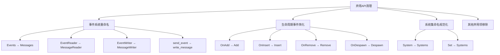

+++
title = "#21723 remove deprecated APIs in 0.17"
date = "2025-11-03T00:00:00"
draft = false
template = "pull_request_page.html"
in_search_index = false

[extra]
current_language = "zh-cn"
available_languages = {"en" = { name = "English", url = "/pull_request/bevy/2025-11/pr-21723-en-20251103" }, "zh-cn" = { name = "中文", url = "/pull_request/bevy/2025-11/pr-21723-zh-cn-20251103" }}
+++

# remove deprecated APIs in 0.17

## Basic Information
- **标题**: remove deprecated APIs in 0.17
- **PR链接**: https://github.com/bevyengine/bevy/pull/21723
- **作者**: re0312
- **状态**: 已合并
- **标签**: D-Trivial, C-Code-Quality, S-Ready-For-Final-Review, A-Cross-Cutting
- **创建时间**: 2025-11-03T03:30:02Z
- **合并时间**: 2025-11-03T19:26:50Z
- **合并者**: alice-i-cecile

## 描述翻译

# 目标

- 移除在0.17版本中被标记为弃用的所有API，

## 这个Pull Request的故事

这个PR的核心任务是在Bevy 0.17版本发布后，清理所有被标记为弃用的API。这是一个标准的维护性工作，旨在保持代码库的整洁和减少技术债务。

在软件开发的迭代过程中，当引入新的API来替代旧的实现时，通常会将旧API标记为弃用，给用户一个过渡期来迁移他们的代码。Bevy 0.17版本引入了多个重要的API重构，特别是在事件系统（现在称为消息系统）和生命周期事件方面。现在，经过一个版本的过渡期，是时候移除这些旧的API了。

这个PR的修改范围很广，涉及45个文件，但所有的变更都遵循相同的模式：移除被`#[deprecated(since = "0.17.0")]`属性标记的代码。这些变更主要分为几类：

**事件系统到消息系统的重命名**是最大的变更集。在Bevy 0.17中，事件系统被重构为更通用的消息系统，相关的类型和方法都被重命名：
- `Events<E>` → `Messages<M>`
- `EventReader` → `MessageReader` 
- `EventWriter` → `MessageWriter`
- `send_event` → `write_message`

这种重命名不仅仅是术语的变化，还反映了系统功能的扩展，从单纯处理事件到处理更广泛的消息类型。

**生命周期事件的重命名**是另一个重要变更。Bevy将生命周期事件从`OnX`模式改为更简洁的名称：
- `OnAdd` → `Add`
- `OnInsert` → `Insert`
- `OnRemove` → `Remove`
- `OnDespawn` → `Despawn`

这种简化使得API更加直观，减少了不必要的冗长。

**系统集(SystemSet)的命名规范化**也在这个PR中完成。Bevy将系统集的命名从单数形式统一为复数形式，以更好地反映它们的用途：
- `CameraUpdateSystem` → `CameraUpdateSystems`
- `TimeSystem` → `TimeSystems`
- `InputSystem` → `InputSystems`

这种命名约定使得代码更加一致，让开发者更容易理解这些系统集包含多个相关的系统。

从技术实现角度看，这个PR展示了良好的软件工程实践。所有的移除操作都是机械性的，没有引入新的逻辑或破坏性变更。每个被移除的API都有明确的替代方案，并且在之前的版本中已经提供了足够的迁移时间。

对于开发者来说，这个PR的影响是直接的：任何仍然使用0.17弃用API的代码在升级后将无法编译。但迁移路径很清晰，因为每个弃用注解都包含了应该使用哪个新API的说明。

这个清理工作为Bevy未来的开发奠定了基础，减少了维护负担，让团队可以更专注于新功能的开发而不是维护旧的兼容性代码。

## 可视化表示



## 关键文件变更

**crates/bevy_ecs/src/system/function_system.rs** (+0/-53)
- 移除了`SystemState`中已弃用的方法
- 这些方法在0.17中已被更简单的方法替代

```rust
// 被移除的方法示例：
#[deprecated(since = "0.17.0", note = "No longer has any effect.  Calls may be removed.")]
pub fn update_archetypes(&mut self, _world: &World) {}

#[deprecated(since = "0.17.0", note = "Call `SystemState::get` instead.")]
pub fn get_manual<'w, 's>(&'s mut self, world: &'w World) -> SystemParamItem<'w, 's, Param>
```

**crates/bevy_time/src/timer.rs** (+1/-50)
- 移除了`Timer`中已弃用的方法
- 方法命名更加一致

```rust
// 被移除的方法：
#[deprecated(since = "0.17.0", note = "Use `is_finished` instead")]
pub fn finished(&self) -> bool {
    self.finished
}

#[deprecated(since = "0.17.0", note = "Use `is_paused` instead")]
pub fn paused(&self) -> bool {
    self.stopwatch.is_paused()
}
```

**crates/bevy_ecs/src/lifecycle.rs** (+0/-50)
- 移除了生命周期事件的旧命名
- 简化了API命名

```rust
// 被移除的类型别名：
#[deprecated(since = "0.17.0", note = "Renamed to `Add`.")]
pub type OnAdd = Add;

#[deprecated(since = "0.17.0", note = "Renamed to `Insert`.")]
pub type OnInsert = Insert;
```

**crates/bevy_ecs/src/schedule/condition.rs** (+0/-41)
- 移除了已弃用的运行条件
- 统一使用新的消息系统术语

```rust
// 被移除的条件函数：
#[deprecated(since = "0.17.0", note = "Use `on_message` instead.")]
pub fn on_event<T: Message>(reader: MessageReader<T>) -> bool {
    on_message(reader)
}
```

**crates/bevy_ecs/src/world/deferred_world.rs** (+0/-36)
- 移除了已弃用的消息写入方法
- 统一使用`write_message`系列方法

```rust
// 被移除的方法：
#[deprecated(since = "0.17.0", note = "Use `DeferredWorld::write_message` instead.")]
pub fn send_event<E: Message>(&mut self, event: E) -> Option<MessageId<E>> {
    self.write_message(event)
}
```

## 进一步阅读

- [Bevy 0.17 发布说明](https://bevyengine.org/news/bevy-0-17/) - 了解引入这些变更的背景
- [Bevy迁移指南](https://bevyengine.org/learn/migration-guides/) - 如何从旧API迁移到新API
- [Rust的弃用属性](https://doc.rust-lang.org/reference/attributes/diagnostics.html#the-deprecated-attribute) - 了解Rust中弃用机制的工作原理