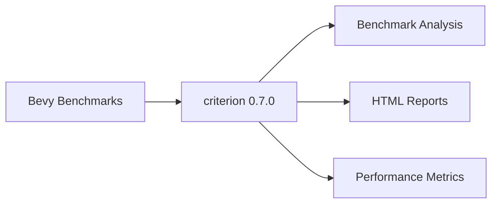

+++
title = "#21726 Update criterion requirement from 0.6.0 to 0.7.0"
date = "2025-11-04T00:00:00"
draft = false
template = "pull_request_page.html"
in_search_index = true

[taxonomies]
list_display = ["show"]

[extra]
current_language = "en"
available_languages = {"en" = { name = "English", url = "/pull_request/bevy/2025-11/pr-21726-en-20251104" }, "zh-cn" = { name = "中文", url = "/pull_request/bevy/2025-11/pr-21726-zh-cn-20251104" }}
labels = ["C-Dependencies"]
+++

# Update criterion requirement from 0.6.0 to 0.7.0

## Basic Information
- **Title**: Update criterion requirement from 0.6.0 to 0.7.0
- **PR Link**: https://github.com/bevyengine/bevy/pull/21726
- **Author**: app/dependabot
- **Status**: MERGED
- **Labels**: C-Dependencies, S-Ready-For-Final-Review
- **Created**: 2025-11-03T06:12:53Z
- **Merged**: 2025-11-04T08:17:57Z
- **Merged By**: mockersf

## Description Translation
Updates the requirements on [criterion](https://github.com/bheisler/criterion.rs) to permit the latest version.
<details>
<summary>Changelog</summary>
<p><em>Sourced from <a href="https://github.com/bheisler/criterion.rs/blob/master/CHANGELOG.md">criterion's changelog</a>.</em></p>
<blockquote>
<h2>[0.7.0] - 2025-07-25</h2>
<ul>
<li>Bump version of criterion-plot to align dependencies.</li>
</ul>
<h2>[0.6.0] - 2025-05-17</h2>
<h3>Changed</h3>
<ul>
<li>MSRV bumped to 1.80</li>
<li>The <code>real_blackbox</code> feature no longer has any impact. Criterion always uses <code>std::hint::black_box()</code> now.
Users of <code>criterion::black_box()</code> should switch to <code>std::hint::black_box()</code>.</li>
<li><code>clap</code> dependency unpinned.</li>
</ul>
<h3>Fixed</h3>
<ul>
<li>gnuplot version is now correctly detected when using certain Windows binaries/configurations that used to fail</li>
</ul>
<h3>Added</h3>
<ul>
<li>Async benchmarking with Tokio may be done via a <code>tokio::runtime::Handle</code>, not only a <code>tokio::runtime::Runtime</code></li>
</ul>
<h2>[0.5.1] - 2023-05-26</h2>
<h3>Fixed</h3>
<ul>
<li>Quick mode (--quick) no longer crashes with measured times over 5 seconds when --noplot is not active</li>
</ul>
<h2>[0.5.0] - 2023-05-23</h2>
<h3>Changed</h3>
<ul>
<li>Replaced lazy_static dependency with once_cell</li>
<li>Improved documentation of the <code>html_reports</code> feature</li>
<li>Replaced atty dependency with is-terminal</li>
<li>MSRV bumped to 1.64</li>
<li>Upgraded clap dependency to v4</li>
<li>Upgraded tempfile dependency to v3.5.0</li>
</ul>
<h3>Fixed</h3>
<ul>
<li>Quick mode (<code>--quick</code>) no longer outputs 1ms for measured times over 5 seconds</li>
<li>Documentation updates</li>
</ul>
<h2>[0.4.0] - 2022-09-10</h2>
<h3>Removed</h3>
<ul>
<li>The <code>Criterion::can_plot</code> function has been removed.</li>
<li>The <code>Criterion::bench_function_over_inputs</code> function has been removed.</li>
<li>The <code>Criterion::bench_functions</code> function has been removed.</li>
<li>The <code>Criterion::bench</code> function has been removed.</li>
</ul>
<h3>Changed</h3>
<ul>
<li>HTML report hidden behind non-default feature flag: 'html_reports'</li>
<li>Standalone support (ie without cargo-criterion) feature flag: 'cargo_bench_support'</li>
<li>MSRV bumped to 1.57</li>
</ul>
<!-- raw HTML omitted -->
</blockquote>
<p>... (truncated)</p>
</details>
<details>
<summary>Commits</summary>
<ul>
<li><a href="https://github.com/bheisler/criterion.rs/commit/567405d25363804dd1e6d440a0c9d6612c4cecd8"><code>567405d</code></a> release: bump criterion and criterion-plot versions (<a href="https://redirect.github.com/bheisler/criterion.rs/issues/878">#878</a>)</li>
<li><a href="https://github.com/bheisler/criterion.rs/commit/ccccbcc15237233af22af4c76751a7aa184609b3"><code>ccccbcc</code></a> fix: deal with throughput in bits (<a href="https://redirect.github.com/bheisler/criterion.rs/issues/861">#861</a>)</li>
<li><a href="https://github.com/bheisler/criterion.rs/commit/deb0eb021dbaa58678222725a455662f780751d0"><code>deb0eb0</code></a> feat: support throughput reports in bits (<a href="https://redirect.github.com/bheisler/criterion.rs/issues/833">#833</a>)</li>
<li><a href="https://github.com/bheisler/criterion.rs/commit/d4fd7cc478dfb15e82ea9726c8e4c5a3afc4bc49"><code>d4fd7cc</code></a> Add CI job checking library builds with oldest allowed dependencies (<a href="https://redirect.github.com/bheisler/criterion.rs/issues/854">#854</a>)</li>
<li>See full diff in <a href="https://github.com/bheisler/criterion.rs/compare/0.6.0...0.7.0">compare view</a></li>
</ul>
</details>
<br />


Dependabot will resolve any conflicts with this PR as long as you don't alter it yourself. You can also trigger a rebase manually by commenting `@dependabot rebase`.

[//]: # (dependabot-automerge-start)
[//]: # (dependabot-automerge-end)

---

<details>
<summary>Dependabot commands and options</summary>
<br />

You can trigger Dependabot actions by commenting on this PR:
- `@dependabot rebase` will rebase this PR
- `@dependabot recreate` will recreate this PR, overwriting any edits that have been made to it
- `@dependabot merge` will merge this PR after your CI passes on it
- `@dependabot squash and merge` will squash and merge this PR after your CI passes on it
- `@dependabot cancel merge` will cancel a previously requested merge and block automerging
- `@dependabot reopen` will reopen this PR if it is closed
- `@dependabot close` will close this PR and stop Dependabot recreating it. You can achieve the same result by closing it manually
- `@dependabot show <dependency name> ignore conditions` will show all of the ignore conditions of the specified dependency
- `@dependabot ignore this major version` will close this PR and stop Dependabot creating any more for this major version (unless you reopen the PR or upgrade to it yourself)
- `@dependabot ignore this minor version` will close this PR and stop Dependabot creating any more for this minor version (unless you reopen the PR or upgrade to it yourself)
- `@dependabot ignore this dependency` will close this PR and stop Dependabot creating any more for this dependency (unless you reopen the PR or upgrade to it yourself)


</details>

## The Story of This Pull Request

This PR represents a routine but important maintenance task for the Bevy project - updating a key dependency to its latest stable version. The change was automated by Dependabot, GitHub's dependency management service, which monitors project dependencies and creates pull requests when newer versions become available.

The core issue was straightforward: Bevy's benchmarking infrastructure relied on criterion version 0.6.0, while version 0.7.0 had been released with various improvements and bug fixes. Keeping dependencies current is essential for maintaining code security, performance, and compatibility with the broader Rust ecosystem.

Looking at the criterion changelog, the upgrade from 0.6.0 to 0.7.0 included several notable changes. The 0.6.0 release itself had significant updates including an MSRV (Minimum Supported Rust Version) bump to 1.80, removal of the `real_blackbox` feature in favor of using `std::hint::black_box()` directly, and improved async benchmarking support with Tokio. The 0.7.0 release primarily focused on aligning dependencies with criterion-plot.

For a project like Bevy that relies heavily on performance benchmarking to guide optimization efforts, maintaining an up-to-date benchmarking framework is crucial. The changes in criterion 0.6.0, particularly the standardization around `std::hint::black_box()`, represent important improvements to benchmarking accuracy and reliability.

The implementation approach was minimal and surgical - a single-line change in the benches workspace's Cargo.toml file. This simplicity reflects the well-maintained nature of both the criterion library and Bevy's dependency management. The fact that only the version number needed updating suggests good API stability and backward compatibility in the criterion library.

From a technical perspective, this update brings several concrete benefits to Bevy's benchmarking capabilities:
- Improved Windows compatibility with better gnuplot detection
- More flexible async benchmarking options
- Dependency updates that improve security and performance
- Standardized black box implementation using Rust's standard library

The impact of this change is primarily about maintaining code health rather than introducing new functionality. By keeping dependencies current, the Bevy team ensures they benefit from the latest improvements in the Rust benchmarking ecosystem while minimizing technical debt.

## Visual Representation



## Key Files Changed

The PR modifies only one file:

**File: `benches/Cargo.toml`**

This file defines the dependencies for Bevy's benchmarking workspace. The change updates the criterion dependency from version 0.6.0 to 0.7.0 while preserving the `html_reports` feature flag.

```toml
# File: benches/Cargo.toml
# Before:
criterion = { version = "0.6.0", features = ["html_reports"] }

# After:
criterion = { version = "0.7.0", features = ["html_reports"] }
```

The change is minimal but significant - it ensures Bevy's benchmarking infrastructure uses the latest stable version of criterion with all its improvements and bug fixes.

## Further Reading

- [criterion.rs GitHub Repository](https://github.com/bheisler/criterion.rs)
- [criterion Documentation](https://docs.rs/criterion/)
- [Rust Benchmarking Guide](https://doc.rust-lang.org/stable/unstable-book/library-features/test.html)
- [Dependabot Documentation](https://docs.github.com/en/code-security/dependabot)

# Full Code Diff
```diff
diff --git a/benches/Cargo.toml b/benches/Cargo.toml
index 6d4c1e77f9a96..f569def4edbfd 100644
--- a/benches/Cargo.toml
+++ b/benches/Cargo.toml
@@ -10,7 +10,7 @@ autobenches = false
 [dependencies]
 # The primary crate that runs and analyzes our benchmarks. This is a regular dependency because the
 # `bench!` macro refers to it in its documentation.
-criterion = { version = "0.6.0", features = ["html_reports"] }
+criterion = { version = "0.7.0", features = ["html_reports"] }
 
 [dev-dependencies]
 # Bevy crates
```