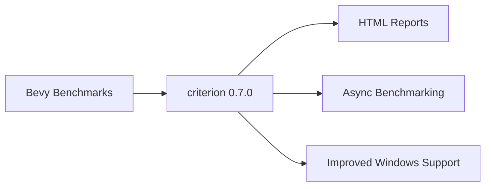

+++
title = "#21726 Update criterion requirement from 0.6.0 to 0.7.0"
date = "2025-11-04T00:00:00"
draft = false
template = "pull_request_page.html"
in_search_index = false

[extra]
current_language = "zh-cn"
available_languages = {"en" = { name = "English", url = "/pull_request/bevy/2025-11/pr-21726-en-20251104" }, "zh-cn" = { name = "中文", url = "/pull_request/bevy/2025-11/pr-21726-zh-cn-20251104" }}
+++

# Update criterion requirement from 0.6.0 to 0.7.0

## 基本信息
- **标题**: Update criterion requirement from 0.6.0 to 0.7.0
- **PR链接**: https://github.com/bevyengine/bevy/pull/21726
- **作者**: app/dependabot
- **状态**: 已合并
- **标签**: C-Dependencies, S-Ready-For-Final-Review
- **创建时间**: 2025-11-03T06:12:53Z
- **合并时间**: 2025-11-04T08:17:57Z
- **合并者**: mockersf

## 描述翻译
更新对 [criterion](https://github.com/bheisler/criterion.rs) 的要求以允许最新版本。
<details>
<summary>更新日志</summary>
<p><em>摘自 <a href="https://github.com/bheisler/criterion.rs/blob/master/CHANGELOG.md">criterion的更新日志</a>。</em></p>
<blockquote>
<h2>[0.7.0] - 2025-07-25</h2>
<ul>
<li>提升criterion-plot的版本以对齐依赖。</li>
</ul>
<h2>[0.6.0] - 2025-05-17</h2>
<h3>变更</h3>
<ul>
<li>MSRV（最低支持的Rust版本）提升至1.80</li>
<li><code>real_blackbox</code>特性不再有任何影响。Criterion现在总是使用<code>std::hint::black_box()</code>。
使用<code>criterion::black_box()</code>的用户应切换到<code>std::hint::black_box()</code>。</li>
<li><code>clap</code>依赖不再固定版本。</li>
</ul>
<h3>修复</h3>
<ul>
<li>修正了在使用某些Windows二进制文件/配置时，gnuplot版本的正确检测问题，这些配置以前会失败</li>
</ul>
<h3>新增</h3>
<ul>
<li>通过<code>tokio::runtime::Handle</code>进行异步基准测试，而不仅限于<code>tokio::runtime::Runtime</code></li>
</ul>
<h2>[0.5.1] - 2023-05-26</h2>
<h3>修复</h3>
<ul>
<li>快速模式（--quick）在测量时间超过5秒且没有使用--noplot时不再崩溃</li>
</ul>
<h2>[0.5.0] - 2023-05-23</h2>
<h3>变更</h3>
<ul>
<li>将lazy_static依赖替换为once_cell</li>
<li>改进了<code>html_reports</code>特性的文档</li>
<li>将atty依赖替换为is-terminal</li>
<li>MSRV提升至1.64</li>
<li>将clap依赖升级到v4</li>
<li>将tempfile依赖升级到v3.5.0</li>
</ul>
<h3>修复</h3>
<ul>
<li>快速模式（<code>--quick</code>）不再对超过5秒的测量时间输出1ms</li>
<li>文档更新</li>
</ul>
<h2>[0.4.0] - 2022-09-10</h2>
<h3>移除</h3>
<ul>
<li>移除了<code>Criterion::can_plot</code>函数。</li>
<li>移除了<code>Criterion::bench_function_over_inputs</code>函数。</li>
<li>移除了<code>Criterion::bench_functions</code>函数。</li>
<li>移除了<code>Criterion::bench</code>函数。</li>
</ul>
<h3>变更</h3>
<ul>
<li>HTML报告隐藏在非默认特性标志后面：'html_reports'</li>
<li>独立支持（即没有cargo-criterion）的特性标志：'cargo_bench_support'</li>
<li>MSRV提升至1.57</li>
</ul>
<!-- raw HTML omitted -->
</blockquote>
<p>... (截断)</p>
</details>
<details>
<summary>提交</summary>
<ul>
<li><a href="https://github.com/bheisler/criterion.rs/commit/567405d25363804dd1e6d440a0c9d6612c4cecd8"><code>567405d</code></a> release: 提升criterion和criterion-plot的版本 (<a href="https://redirect.github.com/bheisler/criterion.rs/issues/878">#878</a>)</li>
<li><a href="https://github.com/bheisler/criterion.rs/commit/ccccbcc15237233af22af4c76751a7aa184609b3"><code>ccccbcc</code></a> fix: 处理以比特为单位的吞吐量 (<a href="https://redirect.github.com/bheisler/criterion.rs/issues/861">#861</a>)</li>
<li><a href="https://github.com/bheisler/criterion.rs/commit/deb0eb021dbaa58678222725a455662f780751d0"><code>deb0eb0</code></a> feat: 支持以比特为单位的吞吐量报告 (<a href="https://redirect.github.com/bheisler/criterion.rs/issues/833">#833</a>)</li>
<li><a href="https://github.com/bheisler/criterion.rs/commit/d4fd7cc478dfb15e82ea9726c8e4c5a3afc4bc49"><code>d4fd7cc</code></a> 添加CI作业，检查使用最旧允许依赖的库构建 (<a href="https://redirect.github.com/bheisler/criterion.rs/issues/854">#854</a>)</li>
<li>查看完整差异请访问 <a href="https://github.com/bheisler/criterion.rs/compare/0.6.0...0.7.0">比较视图</a></li>
</ul>
</details>
<br />

Dependabot将解决与此PR的任何冲突，只要您不自行修改它。您也可以通过评论`@dependabot rebase`手动触发变基。

[//]: # (dependabot-automerge-start)
[//]: # (dependabot-automerge-end)

---

<details>
<summary>Dependabot命令和选项</summary>
<br />

您可以通过评论此PR来触发Dependabot操作：
- `@dependabot rebase` 将变基此PR
- `@dependabot recreate` 将重新创建此PR，覆盖已对其进行的任何编辑
- `@dependabot merge` 将在CI通过后合并此PR
- `@dependabot squash and merge` 将在CI通过后压缩并合并此PR
- `@dependabot cancel merge` 将取消先前请求的合并并阻止自动合并
- `@dependabot reopen` 如果此PR已关闭，将重新打开它
- `@dependabot close` 将关闭此PR并停止Dependabot重新创建它。您可以通过手动关闭它来实现相同的结果
- `@dependabot show <dependency name> ignore conditions` 将显示指定依赖项的所有忽略条件
- `@dependabot ignore this major version` 将关闭此PR并停止Dependabot为此主要版本创建更多PR（除非您重新打开PR或自行升级）
- `@dependabot ignore this minor version` 将关闭此PR并停止Dependabot为此次要版本创建更多PR（除非您重新打开PR或自行升级）
- `@dependabot ignore this dependency` 将关闭此PR并停止Dependabot为此依赖项创建更多PR（除非您重新打开PR或自行升级）


</details>

## 这个Pull Request的故事

这是一个典型的依赖管理更新场景。Dependabot自动检测到criterion库有新版本可用，并创建了此PR来更新依赖版本。对于像Bevy这样的大型开源项目，保持依赖项的及时更新是维持项目健康的重要实践。

**问题和上下文**：Bevy使用criterion作为其基准测试框架，这是一个专门用于Rust性能测试的库。在版本0.6.0到0.7.0的更新中，criterion引入了一些重要的变更，包括MSRV（最低支持的Rust版本）提升到1.80，以及black box函数的标准化处理。保持依赖更新可以确保项目能够受益于最新的性能改进和bug修复。

**解决方案方法**：这个PR采用了最直接的方法——简单地将依赖版本从0.6.0更新到0.7.0。由于这是一个向后兼容的minor版本更新，不需要对现有代码进行任何修改。Dependabot自动处理了版本号的更新，并提供了完整的变更日志供审查。

**技术洞察**：从变更日志可以看出，criterion 0.7.0主要是一个维护版本，专注于依赖对齐。而0.6.0版本则包含了更重要的变更，特别是`real_blackbox`特性的移除，这意味着现在criterion总是使用标准的`std::hint::black_box()`函数。这个变化对于基准测试的准确性很重要，因为black box函数用于防止编译器对基准测试代码进行过度优化。

**影响**：这个更新确保了Bevy的基准测试基础设施能够使用criterion的最新特性和修复。特别是对Windows上gnuplot检测的修复，可以改善跨平台的基准测试体验。异步基准测试支持的增强也为未来可能的异步性能测试提供了更好的基础设施。

## 视觉表示



## 关键文件更改

- `benches/Cargo.toml` (+1/-1)

这个文件是Bevy基准测试项目的Cargo清单文件。变更内容很简单：

```toml
# 变更前：
criterion = { version = "0.6.0", features = ["html_reports"] }

# 变更后：
criterion = { version = "0.7.0", features = ["html_reports"] }
```

这个变更将criterion依赖从0.6.0版本更新到0.7.0，同时保持了`html_reports`特性的启用。这个特性允许生成HTML格式的基准测试报告，对于性能分析和比较非常有用。

## 进一步阅读

- [criterion.rs GitHub仓库](https://github.com/bheisler/criterion.rs)
- [criterion文档](https://docs.rs/criterion)
- [Rust基准测试指南](https://doc.rust-lang.org/stable/unstable-book/library-features/test.html)
- [Dependabot文档](https://docs.github.com/en/code-security/dependabot)

# Full Code Diff
diff --git a/benches/Cargo.toml b/benches/Cargo.toml
index 6d4c1e77f9a96..f569def4edbfd 100644
--- a/benches/Cargo.toml
+++ b/benches/Cargo.toml
@@ -10,7 +10,7 @@ autobenches = false
 [dependencies]
 # The primary crate that runs and analyzes our benchmarks. This is a regular dependency because the
 # `bench!` macro refers to it in its documentation.
-criterion = { version = "0.6.0", features = ["html_reports"] }
+criterion = { version = "0.7.0", features = ["html_reports"] }
 
 [dev-dependencies]
 # Bevy crates