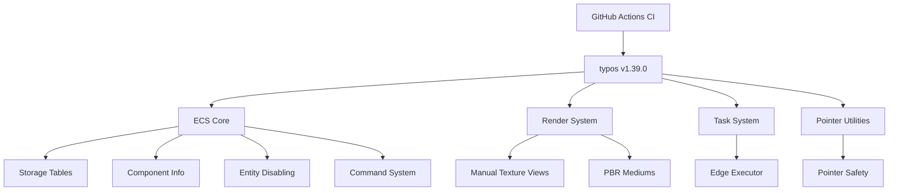

+++
title = "#21728 Bump crate-ci/typos from 1.38.1 to 1.39.0 (adopted, attempt 2)"
date = "2025-11-03T00:00:00"
draft = false
template = "pull_request_page.html"
in_search_index = true

[taxonomies]
list_display = ["show"]

[extra]
current_language = "en"
available_languages = {"en" = { name = "English", url = "/pull_request/bevy/2025-11/pr-21728-en-20251103" }, "zh-cn" = { name = "中文", url = "/pull_request/bevy/2025-11/pr-21728-zh-cn-20251103" }}
labels = ["C-Docs", "D-Trivial", "A-Build-System"]
+++

# Title

## Basic Information
- **Title**: Bump crate-ci/typos from 1.38.1 to 1.39.0 (adopted, attempt 2)
- **PR Link**: https://github.com/bevyengine/bevy/pull/21728
- **Author**: greeble-dev
- **Status**: MERGED
- **Labels**: C-Docs, D-Trivial, A-Build-System, S-Needs-Review
- **Created**: 2025-11-03T08:49:37Z
- **Merged**: 2025-11-03T09:39:09Z
- **Merged By**: mockersf

## Description Translation
Bumps [crate-ci/typos](https://github.com/crate-ci/typos) from 1.38.1 to 1.39.0. Adopted from https://github.com/bevyengine/bevy/pull/21724. Supercedes #21727 which targeted the wrong branch.

## The Story of This Pull Request

This PR represents a routine but important maintenance task in the Bevy engine's development workflow. The core issue was straightforward: the project's automated spell-checking tool needed to be updated from version 1.38.1 to 1.39.0. However, the execution path revealed some interesting aspects of the project's CI/CD practices and code quality standards.

The developer started by updating the GitHub Actions workflow configuration to use the newer version of the typos tool:

```yaml
# File: .github/workflows/ci.yml
# Before:
uses: crate-ci/typos@v1.38.1

# After:
uses: crate-ci/typos@v1.39.0
```

This simple version bump triggered the typos tool to run against the codebase, which identified several spelling errors that had previously gone undetected. The tool's improved detection capabilities in version 1.39.0 caught several subtle but important typos across multiple crates in the Bevy ecosystem.

One of the most significant patterns emerged in the ECS (Entity Component System) storage implementation, where the same typo appeared multiple times in safety comments:

```rust
// File: crates/bevy_ecs/src/storage/table/mod.rs
// Before:
// SAFETY: This was sawp removed and was not last, so it must be in bounds.

// After:
// SAFETY: This was swap removed and was not last, so it must be in bounds.
```

This particular fix is important because safety comments in unsafe Rust code blocks serve as crucial documentation for developers understanding the invariants being maintained. Having correct spelling in these comments improves readability and reduces cognitive load when reviewing complex memory safety logic.

In the component system documentation, another important correction was made:

```rust
// File: crates/bevy_ecs/src/component/info.rs
// Before:
// This is kept internal and local to verify that no deadlocks can occor.

// After:
// This is kept internal and local to verify that no deadlocks can occur.
```

This comment explains the rationale behind a design decision related to synchronization primitives, making it important for the spelling to be accurate to avoid confusion about the system's thread safety guarantees.

The PR also fixed several documentation examples and API comments that contained misspellings:

```rust
// File: crates/bevy_ecs/src/system/commands/mod.rs
// Before:
// The fact that `Epxlode` is a single-field tuple struct

// After:
// The fact that `Explode` is a single-field tuple struct
```

This correction ensures that code examples in documentation remain accurate and maintain the project's professional standards. Similarly, in the renderer code:

```rust
// File: crates/bevy_render/src/texture/manual_texture_view.rs
// Before:
// Now you can spawn a Cemera that renders to the manual view:

// After:
// Now you can spawn a Camera that renders to the manual view:
```

From an engineering perspective, this PR demonstrates the value of automated code quality tools in large codebases. While the changes themselves are minor, they collectively improve the codebase's readability and maintainability. The fact that these typos were caught by an updated version of the tool suggests that the typos project continues to improve its detection capabilities, making regular updates worthwhile.

The development workflow around this PR is also noteworthy. The description mentions this being "attempt 2" and superseding previous attempts that targeted the wrong branches. This indicates a mature CI/CD process where tool updates are systematically applied across the codebase, with proper branching strategies and version control practices.

## Visual Representation



## Key Files Changed

The most significant files modified in this PR:

### `.github/workflows/ci.yml` (+1/-1)
- **Change**: Updated typos action from v1.38.1 to v1.39.0
- **Purpose**: Enable improved spell-checking with the latest version
- **Impact**: Triggers the entire typo-fixing process

### `crates/bevy_ecs/src/storage/table/mod.rs` (+4/-4)
- **Change**: Fixed "sawp" to "swap" in multiple safety comments
- **Purpose**: Improve documentation clarity in unsafe code sections
- **Significance**: These comments explain memory safety invariants

```rust
// Example correction in table storage:
// Before:
// SAFETY: This was sawp removed and was not last, so it must be in bounds.

// After:
// SAFETY: This was swap removed and was not last, so it must be in bounds.
```

### `crates/bevy_ecs/src/component/info.rs` (+1/-1)
- **Change**: Fixed "occor" to "occur" in deadlock prevention comment
- **Purpose**: Clarify synchronization behavior documentation

### `crates/bevy_ecs/src/system/commands/mod.rs` (+1/-1)
- **Change**: Fixed "Epxlode" to "Explode" in documentation example
- **Purpose**: Ensure code examples are accurate and professional

### `crates/bevy_pbr/src/medium.rs` (+1/-1)
- **Change**: Fixed "obsorption" to "absorption" in material system
- **Purpose**: Correct technical terminology in rendering code

```rust
// Before:
/// This term's optical obsorption density

// After:
/// This term's optical absorption density
```

### `crates/bevy_ptr/src/lib.rs` (+1/-1)
- **Change**: Fixed "exctra" to "extra" in pointer safety documentation
- **Purpose**: Improve clarity in unsafe pointer manipulation guidelines

### `crates/bevy_render/src/texture/manual_texture_view.rs` (+1/-1)
- **Change**: Fixed "Cemera" to "Camera" in API documentation
- **Purpose**: Correct fundamental terminology in graphics system

### `crates/bevy_tasks/src/edge_executor.rs` (+1/-1)
- **Change**: Fixed "Runnnable" to "Runnable" in task system documentation
- **Purpose**: Ensure consistent terminology in async execution system

## Further Reading

- [crate-ci/typos GitHub Repository](https://github.com/crate-ci/typos) - The spell-checking tool used in this PR
- [Bevy Engine GitHub](https://github.com/bevyengine/bevy) - The main project repository
- [Rust API Guidelines on Documentation](https://rust-lang.github.io/api-guidelines/documentation.html) - Best practices for Rust documentation
- [GitHub Actions Documentation](https://docs.github.com/en/actions) - CI/CD workflows used in this update