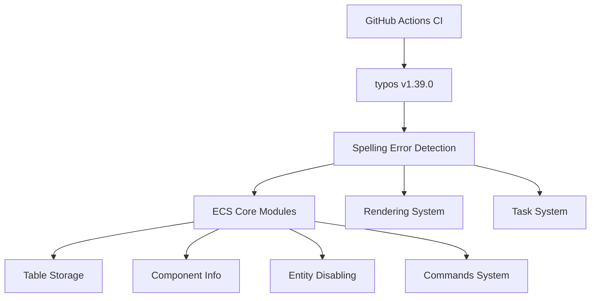

+++
title = "#21728 Bump crate-ci/typos from 1.38.1 to 1.39.0 (adopted, attempt 2)"
date = "2025-11-03T00:00:00"
draft = false
template = "pull_request_page.html"
in_search_index = false

[extra]
current_language = "zh-cn"
available_languages = {"en" = { name = "English", url = "/pull_request/bevy/2025-11/pr-21728-en-20251103" }, "zh-cn" = { name = "中文", url = "/pull_request/bevy/2025-11/pr-21728-zh-cn-20251103" }}
labels = ["C-Docs", "D-Trivial", "A-Build-System"]
+++

# Title

## Basic Information
- **Title**: Bump crate-ci/typos from 1.38.1 to 1.39.0 (adopted, attempt 2)
- **PR Link**: https://github.com/bevyengine/bevy/pull/21728
- **Author**: greeble-dev
- **Status**: MERGED
- **Labels**: C-Docs, D-Trivial, A-Build-System, S-Needs-Review
- **Created**: 2025-11-03T08:49:37Z
- **Merged**: 2025-11-03T09:39:09Z
- **Merged By**: mockersf

## Description Translation
将 crate-ci/typos 从 1.38.1 升级到 1.39.0。从 https://github.com/bevyengine/bevy/pull/21724 采纳。取代 #21727，该 PR 目标分支错误。

## The Story of This Pull Request

这个 PR 的核心是一个简单的依赖升级任务，但体现了开源项目维护中的典型工作流程。开发者需要将代码库中使用的 typos 拼写检查工具从 1.38.1 版本升级到 1.39.0 版本。

升级过程中，新版本的 typos 工具检测到了代码库中存在的拼写错误，这触发了相应的修复工作。这种模式在依赖管理实践中很常见：工具升级不仅带来新功能，还会暴露之前未被发现的问题。

PR 的作者采用了从另一个 PR (#21724) 采纳变更的策略，这显示了在开源协作中如何有效利用已有工作。同时，作者还处理了先前 PR (#21727) 目标分支错误的问题，体现了对 Git 工作流程的熟悉。

在技术实现层面，这个 PR 主要包含两类变更：

首先是对 CI 配置的更新，将 GitHub Actions 工作流中的 typos 版本从 1.38.1 更新到 1.39.0：

```yaml
# .github/workflows/ci.yml
-        uses: crate-ci/typos@v1.38.1
+        uses: crate-ci/typos@v1.39.0
```

其次是修复新版本 typos 工具检测到的拼写错误。这些错误分布在多个核心模块中，包括 ECS 系统、渲染引擎和任务系统。例如，在 `bevy_ecs` 的表格存储模块中，多处 "sawp" 被修正为 "swap"：

```rust
// crates/bevy_ecs/src/storage/table/mod.rs
-            // SAFETY: This was sawp removed and was not last, so it must be in bounds.
+            // SAFETY: This was swap removed and was not last, so it must be in bounds.
```

在命令系统模块中，一个重要的拼写错误被修复：

```rust
// crates/bevy_ecs/src/system/commands/mod.rs
-    ///     // The fact that `Epxlode` is a single-field tuple struct
+    ///     // The fact that `Explode` is a single-field tuple struct
```

这些修复虽然看似简单，但对代码质量有实际影响。正确的拼写改善了代码可读性，特别是对于新贡献者理解代码逻辑。在注释和文档中的拼写错误可能会误导开发者，而修复这些错误有助于维护项目的专业形象。

从工程角度看，这个 PR 展示了持续集成流程的价值。自动化工具能够在代码合并前发现问题，确保代码库保持高质量标准。同时，它也体现了依赖管理的最佳实践：及时升级工具以获取最新功能和改进，同时处理升级带来的任何必要变更。

## Visual Representation



## Key Files Changed

### `.github/workflows/ci.yml`
**变更**: 将 typos 工具版本从 1.38.1 升级到 1.39.0
```yaml
# Before:
        uses: crate-ci/typos@v1.38.1

# After:
        uses: crate-ci/typos@v1.39.0
```
**说明**: 这是 PR 的主要目的，更新 CI 流程中使用的拼写检查工具版本。

### `crates/bevy_ecs/src/storage/table/mod.rs`
**变更**: 修复多处 "sawp" 拼写错误为 "swap"
```rust
// Before:
// SAFETY: This was sawp removed and was not last, so it must be in bounds.

// After:
// SAFETY: This was swap removed and was not last, so it must be in bounds.
```
**说明**: 这些注释描述了表格行交换操作的安全保证，正确的术语对于理解内存安全很重要。

### `crates/bevy_ecs/src/component/info.rs`
**变更**: 修复 "occor" 为 "occur"
```rust
// Before:
// This is kept internal and local to verify that no deadlocks can occor.

// After:
// This is kept internal and local to verify that no deadlocks can occur.
```
**说明**: 这个注释解释了死锁预防机制，正确的拼写有助于理解这个重要的并发安全考虑。

### `crates/bevy_ecs/src/entity_disabling.rs`
**变更**: 修复 "enire" 为 "entire"
```rust
// Before:
// the enire [`World`], especially when they cause queries to mix sparse and table components.

// After:
// the entire [`World`], especially when they cause queries to mix sparse and table components.
```
**说明**: 这个文档注释解释了实体禁用功能对整个 World 的性能影响。

### `crates/bevy_ecs/src/system/commands/mod.rs`
**变更**: 修复 "Epxlode" 为 "Explode"
```rust
// Before:
    ///     // The fact that `Epxlode` is a single-field tuple struct

// After:
    ///     // The fact that `Explode` is a single-field tuple struct
```
**说明**: 这个示例代码中的类型名拼写错误会影响开发者理解命令系统的用法。

### `crates/bevy_pbr/src/medium.rs`
**变更**: 修复 "obsorption" 为 "absorption"
```rust
// Before:
    /// This term's optical obsorption density, or how much light of each wavelength

// After:
    /// This term's optical absorption density, or how much light of each wavelength
```
**说明**: 这是物理渲染系统中关于光学吸收的正确术语。

### `crates/bevy_ptr/src/lib.rs`
**变更**: 修复 "exctra" 为 "extra"
```rust
// Before:
    ///   around code that may panic. This requires exctra caution

// After:
    ///   around code that may panic. This requires extra caution
```
**说明**: 这个安全注释强调了在处理可能 panic 的代码时需要额外的谨慎。

### `crates/bevy_render/src/texture/manual_texture_view.rs`
**变更**: 修复 "Cemera" 为 "Camera"
```rust
// Before:
/// // Now you can spawn a Cemera that renders to the manual view:

// After:
/// // Now you can spawn a Camera that renders to the manual view:
```
**说明**: 这个示例代码展示了如何创建渲染到手动纹理视图的相机。

### `crates/bevy_tasks/src/edge_executor.rs`
**变更**: 修复 "Runnnable" 为 "Runnable"
```rust
// Before:
    /// - `Some(Runnnable)` - the first task scheduled for execution. Calling `Runnable::run` will

// After:
    /// - `Some(Runnable)` - the first task scheduled for execution. Calling `Runnable::run` will
```
**说明**: 这个文档注释描述了任务执行器的返回类型，正确的类型名对于理解 API 很重要。

## Further Reading

- [typos 项目主页](https://github.com/crate-ci/typos) - 了解这个拼写检查工具的功能和使用方法
- [GitHub Actions 文档](https://docs.github.com/en/actions) - 学习如何配置和维护 CI/CD 流程
- [Bevy ECS 架构指南](https://bevyengine.org/learn/book/ecs/) - 理解被修改的 ECS 核心模块的设计原理
- [Rust 代码风格指南](https://doc.rust-lang.org/1.0.0/style/README.html) - 了解 Rust 项目的代码质量和文档标准