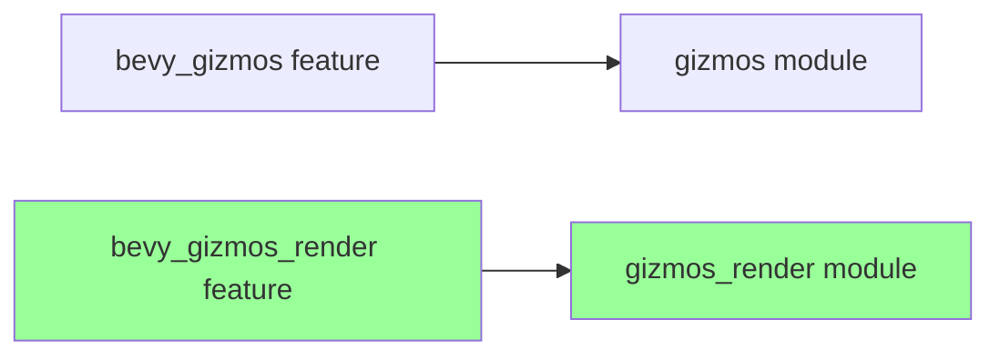

+++
title = "#21734 Fix gizmos_render feature typo"
date = "2025-11-03T00:00:00"
draft = false
template = "pull_request_page.html"
in_search_index = true

[taxonomies]
list_display = ["show"]

[extra]
current_language = "en"
available_languages = {"en" = { name = "English", url = "/pull_request/bevy/2025-11/pr-21734-en-20251103" }, "zh-cn" = { name = "中文", url = "/pull_request/bevy/2025-11/pr-21734-zh-cn-20251103" }}
labels = ["C-Bug", "D-Trivial", "A-Gizmos"]
+++

# Title

## Basic Information
- **Title**: Fix gizmos_render feature typo
- **PR Link**: https://github.com/bevyengine/bevy/pull/21734
- **Author**: dloukadakis
- **Status**: MERGED
- **Labels**: C-Bug, D-Trivial, S-Ready-For-Final-Review, A-Gizmos
- **Created**: 2025-11-03T17:21:40Z
- **Merged**: 2025-11-03T18:08:56Z
- **Merged By**: mockersf

## Description Translation
# Objective

Fix gizmos_render feature typo

## Solution

Use bevy_gizmos_render instead of bevy_gizmos feature

## The Story of This Pull Request

This pull request addresses a straightforward but important configuration issue in the Bevy engine's feature system. The problem was a feature flag typo that affected conditional compilation of the `gizmos_render` module.

The issue occurred in the `bevy_internal` crate's main library file, where the conditional compilation attribute for the `gizmos_render` module was incorrectly checking for the wrong feature flag. Instead of looking for the `bevy_gizmos_render` feature, it was checking for the `bevy_gizmos` feature. This meant that the `gizmos_render` module would only be compiled when the `bevy_gizmos` feature was enabled, rather than when the specific `bevy_gizmos_render` feature was enabled.

In Rust's feature system, this kind of misconfiguration can lead to several problems. The most immediate issue is that the `gizmos_render` module might not be available when it should be, or conversely, it might be included when it shouldn't be. This breaks the expected behavior of feature-based conditional compilation and can cause compilation errors or unexpected runtime behavior.

The fix is simple but important: change the feature flag from `bevy_gizmos` to `bevy_gizmos_render` in the conditional compilation attribute. This ensures that the `gizmos_render` module is only compiled when the correct feature is explicitly enabled by users.

This type of bug is common in large codebases with complex feature flag systems. While the change itself is minimal, it demonstrates the importance of careful feature flag management in Rust projects. Feature flags control which parts of the codebase are compiled, and incorrect flags can lead to broken builds, missing functionality, or unintended dependencies.

The fix was quickly reviewed and merged, indicating that it was clearly correct and addressed a known issue. The labeling with "C-Bug" and "D-Trivial" accurately reflects the nature of the change - it's a bug fix that's simple to implement but important for maintaining correct build behavior.

## Visual Representation



## Key Files Changed

### `crates/bevy_internal/src/lib.rs` (+1/-1)

This file contains the main library definitions for the Bevy engine, including feature-gated module exports. The change fixes a feature flag mismatch that was preventing the correct conditional compilation of the `gizmos_render` module.

**Code Change:**
```rust
// File: crates/bevy_internal/src/lib.rs
// Before:
#[cfg(feature = "bevy_gizmos")]
pub use bevy_gizmos_render as gizmos_render;

// After:
#[cfg(feature = "bevy_gizmos_render")]
pub use bevy_gizmos_render as gizmos_render;
```

The change ensures that the `gizmos_render` module is only compiled and exported when the `bevy_gizmos_render` feature is enabled, rather than when the unrelated `bevy_gizmos` feature is enabled.

## Further Reading

- [Rust Conditional Compilation Documentation](https://doc.rust-lang.org/reference/conditional-compilation.html)
- [Cargo Features Guide](https://doc.rust-lang.org/cargo/reference/features.html)
- [Bevy Engine Documentation](https://bevyengine.org/learn/)

# Full Code Diff
diff --git a/crates/bevy_internal/src/lib.rs b/crates/bevy_internal/src/lib.rs
index e034b1688df7c..d1dab307fa7b6 100644
--- a/crates/bevy_internal/src/lib.rs
+++ b/crates/bevy_internal/src/lib.rs
@@ -45,7 +45,7 @@ pub use bevy_feathers as feathers;
 pub use bevy_gilrs as gilrs;
 #[cfg(feature = "bevy_gizmos")]
 pub use bevy_gizmos as gizmos;
-#[cfg(feature = "bevy_gizmos")]
+#[cfg(feature = "bevy_gizmos_render")]
 pub use bevy_gizmos_render as gizmos_render;
 #[cfg(feature = "bevy_gltf")]
 pub use bevy_gltf as gltf;