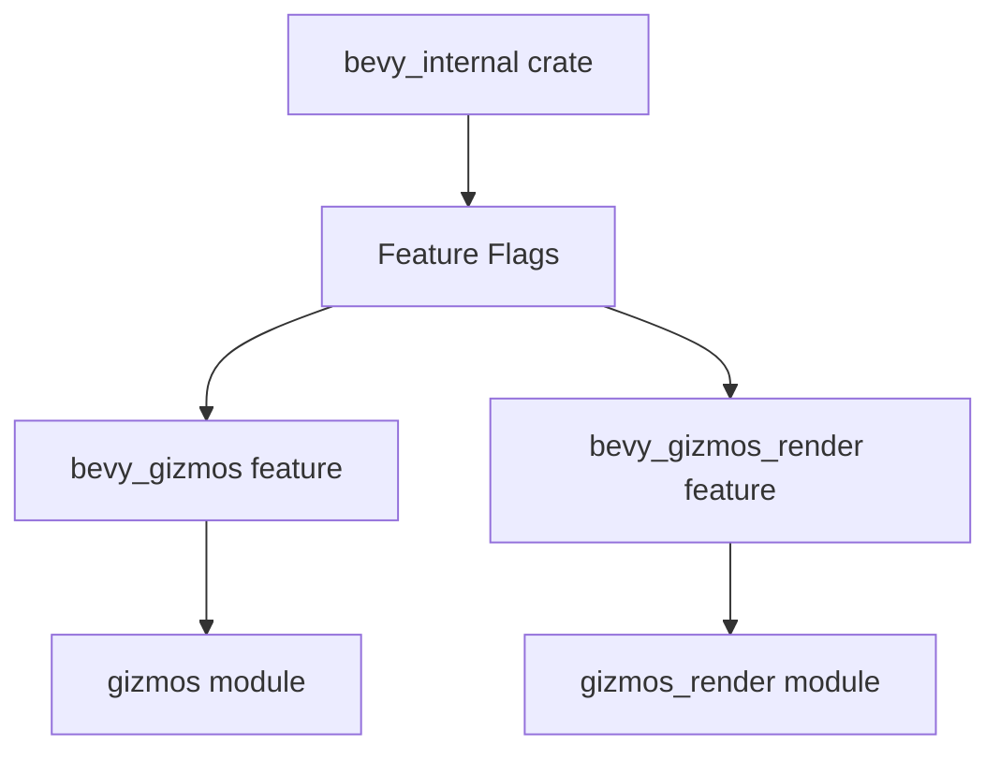

+++
title = "#21734 Fix gizmos_render feature typo"
date = "2025-11-03T00:00:00"
draft = false
template = "pull_request_page.html"
in_search_index = false

[extra]
current_language = "zh-cn"
available_languages = {"en" = { name = "English", url = "/pull_request/bevy/2025-11/pr-21734-en-20251103" }, "zh-cn" = { name = "中文", url = "/pull_request/bevy/2025-11/pr-21734-zh-cn-20251103" }}
labels = ["C-Bug", "D-Trivial", "A-Gizmos"]
+++

# Fix gizmos_render feature typo

## Basic Information
- **Title**: Fix gizmos_render feature typo
- **PR Link**: https://github.com/bevyengine/bevy/pull/21734
- **Author**: dloukadakis
- **Status**: MERGED
- **Labels**: C-Bug, D-Trivial, S-Ready-For-Final-Review, A-Gizmos
- **Created**: 2025-11-03T17:21:40Z
- **Merged**: 2025-11-03T18:08:56Z
- **Merged By**: mockersf

## Description Translation
修复 gizmos_render 功能特性拼写错误

## 解决方案

使用 bevy_gizmos_render 而不是 bevy_gizmos 功能特性

## The Story of This Pull Request

这个PR解决了一个在Bevy引擎条件编译配置中的简单但重要的拼写错误。问题出现在`bevy_internal` crate的lib.rs文件中，具体涉及gizmos渲染模块的功能特性配置。

在Bevy的模块化架构中，功能特性（features）用于控制哪些模块被编译和包含在最终的构建中。这种条件编译机制允许开发者根据需求选择性地启用或禁用特定功能，从而优化编译时间和最终二进制文件的大小。

问题出现在第48行的条件编译属性中。原始代码错误地使用了`#[cfg(feature = "bevy_gizmos")]`来保护`bevy_gizmos_render`模块的导入。这意味着只有当`bevy_gizmos`特性被启用时，`bevy_gizmos_render`模块才会被包含在构建中。

这种配置存在逻辑问题：`bevy_gizmos_render`应该有自己的独立功能特性控制，而不是依赖于`bevy_gizmos`特性。在功能特性管理的上下文中，每个模块应该有自己的独立开关，这样开发者可以更精确地控制要包含哪些组件。

从技术角度来看，这个错误可能导致以下问题：
1. 当开发者只启用`bevy_gizmos_render`特性而没有启用`bevy_gizmos`特性时，gizmos渲染模块不会被正确包含
2. 功能特性的依赖关系变得不清晰
3. 模块的独立控制能力受损

修复方案很直接：将条件编译属性从`bevy_gizmos`改为`bevy_gizmos_render`。这样确保了每个模块都有自己的独立功能特性控制，符合Bevy的模块化设计原则。

这个修改虽然只有一行代码的变化，但对于维护清晰的模块边界和正确的功能特性管理至关重要。它确保了功能特性配置的准确性和一致性，让开发者能够按照预期的方式控制各个模块的包含情况。

## Visual Representation



## Key Files Changed

### `crates/bevy_internal/src/lib.rs` (+1/-1)

这个文件是Bevy内部crate的主入口点，负责根据功能特性条件性地重新导出各种模块。

**关键修改：**
```rust
// File: crates/bevy_internal/src/lib.rs
// Before:
#[cfg(feature = "bevy_gizmos")]
pub use bevy_gizmos_render as gizmos_render;

// After:
#[cfg(feature = "bevy_gizmos_render")]
pub use bevy_gizmos_render as gizmos_render;
```

这个修改将条件编译属性从依赖`bevy_gizmos`特性改为依赖`bevy_gizmos_render`特性，确保了gizmos渲染模块能够被正确地独立控制。

## Further Reading

- [Bevy Engine Feature Flags Documentation](https://github.com/bevyengine/bevy/blob/main/docs/plugins_guidelines.md#features)
- [Rust Conditional Compilation](https://doc.rust-lang.org/reference/conditional-compilation.html)
- [Cargo Features Guide](https://doc.rust-lang.org/cargo/reference/features.html)

# Full Code Diff
```diff
diff --git a/crates/bevy_internal/src/lib.rs b/crates/bevy_internal/src/lib.rs
index e034b1688df7c..d1dab307fa7b6 100644
--- a/crates/bevy_internal/src/lib.rs
+++ b/crates/bevy_internal/src/lib.rs
@@ -45,7 +45,7 @@ pub use bevy_feathers as feathers;
 pub use bevy_gilrs as gilrs;
 #[cfg(feature = "bevy_gizmos")]
 pub use bevy_gizmos as gizmos;
-#[cfg(feature = "bevy_gizmos")]
+#[cfg(feature = "bevy_gizmos_render")]
 pub use bevy_gizmos_render as gizmos_render;
 #[cfg(feature = "bevy_gltf")]
 pub use bevy_gltf as gltf;
```