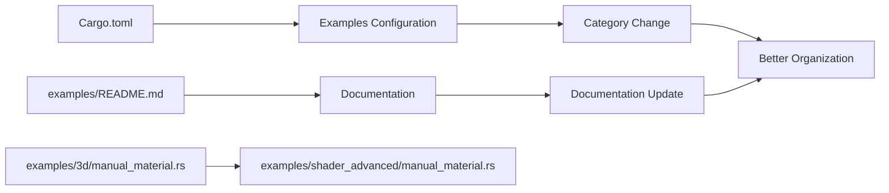

+++
title = "#21735 Move manual_material to shader_advanced category"
date = "2025-11-03T00:00:00"
draft = false
template = "pull_request_page.html"
in_search_index = true

[taxonomies]
list_display = ["show"]

[extra]
current_language = "en"
available_languages = {"en" = { name = "English", url = "/pull_request/bevy/2025-11/pr-21735-en-20251103" }, "zh-cn" = { name = "中文", url = "/pull_request/bevy/2025-11/pr-21735-zh-cn-20251103" }}
labels = ["D-Trivial", "A-Rendering", "C-Examples"]
+++

# Title
Move manual_material to shader_advanced category

## Basic Information
- **Title**: Move manual_material to shader_advanced category
- **PR Link**: https://github.com/bevyengine/bevy/pull/21735
- **Author**: IceSentry
- **Status**: MERGED
- **Labels**: D-Trivial, A-Rendering, C-Examples, S-Ready-For-Final-Review
- **Created**: 2025-11-03T17:49:05Z
- **Merged**: 2025-11-03T19:29:33Z
- **Merged By**: alice-i-cecile

## Description Translation

# Objective

- This example is intended for advanced users

## Solution

- Move it to the shader_advanced category

## Testing

- I ran the example and it worked

## The Story of This Pull Request

This PR addresses a straightforward but important organizational issue in the Bevy engine's example structure. The `manual_material` example, which demonstrates how to implement a material manually using Bevy's mid-level render APIs, was previously categorized under "3D Rendering" alongside more basic examples. However, the example's content is specifically targeted at advanced users who need to work with lower-level rendering APIs.

The problem was one of discoverability and appropriate categorization. When users browse examples, they expect to find basic concepts in general categories and advanced techniques in specialized sections. Having an advanced material implementation example mixed with basic 3D rendering examples could confuse beginners and make it harder for advanced users to find the specialized examples they need.

The solution approach was simple and effective: move the example from the "3D Rendering" category to the "shader_advanced" category where it better belongs. This required three coordinated changes:

1. Updating the Cargo.toml configuration to change the example's category and path
2. Updating the examples README.md to reflect the new categorization
3. Physically moving the example file to the appropriate directory

The implementation demonstrates good software organization practices. By maintaining the example's functionality while improving its discoverability, the change enhances the developer experience without introducing any technical risk. The author confirmed the example still works after the move, which is crucial for maintaining code quality.

From an engineering perspective, this change follows the principle of organizing code by complexity and intended audience. The "shader_advanced" category is specifically designed for examples that require deeper understanding of Bevy's rendering system, making it the appropriate home for material implementation examples that use mid-level render APIs.

## Visual Representation



## Key Files Changed

### `Cargo.toml` (+11/-12)

This file contains the example configuration for Bevy's build system. The changes remove the example from the 3D Rendering section and add it to the Shader Advanced section.

```toml
# Before (removed from 3D Rendering section):
[[example]]
name = "manual_material"
path = "examples/3d/manual_material.rs"
doc-scrape-examples = true

[package.metadata.example.manual_material]
name = "Manual Material Implementation"
description = "Demonstrates how to implement a material manually using the mid-level render APIs"
category = "3D Rendering"
wasm = true

# After (added to Shader Advanced section):
[[example]]
name = "manual_material"
path = "examples/shader_advanced/manual_material.rs"
doc-scrape-examples = true

[package.metadata.example.manual_material]
name = "Manual Material Implementation"
description = "Demonstrates how to implement a material manually using the mid-level render APIs"
category = "Shader Advanced"
wasm = true
```

### `examples/README.md` (+7/-1)

The documentation file needed updates to reflect the example's new category location.

```markdown
# Before (in 3D Rendering section):
[Manual Material Implementation](../examples/3d/manual_material.rs) | Demonstrates how to implement a material manually using the mid-level render APIs

# After (removed from 3D Rendering, added to new Shader Advanced section):
### Shader Advanced

Example | Description
--- | ---
[Manual Material Implementation](../examples/shader_advanced/manual_material.rs) | Demonstrates how to implement a material manually using the mid-level render APIs
```

### `examples/shader_advanced/manual_material.rs` (+0/-0)

The example file itself was moved without any code changes:
- From: `examples/3d/manual_material.rs`
- To: `examples/shader_advanced/manual_material.rs`

The file similarity index of 100% confirms no functional changes were made to the example code.

## Further Reading

- [Bevy Examples Documentation](https://github.com/bevyengine/bevy/tree/main/examples) - Overview of Bevy's example structure
- [Bevy Render Pipeline Guide](https://bevy-cheatbook.github.io/features/pipelined-rendering.html) - Understanding Bevy's rendering architecture
- [WGSL Shader Language](https://gpuweb.github.io/gpuweb/wgsl/) - WebGPU Shading Language used in Bevy shaders
- [Bevy Material System](https://bevyengine.org/learn/quick-start/3d/materials/) - Official documentation on Bevy's material system

# Full Code Diff
```diff
diff --git a/Cargo.toml b/Cargo.toml
index 9e1af044b7401..0c023fb96b200 100644
--- a/Cargo.toml
+++ b/Cargo.toml
@@ -1186,17 +1186,6 @@ description = "Showcases different blend modes"
 category = "3D Rendering"
 wasm = true
 
-[[example]]
-name = "manual_material"
-path = "examples/3d/manual_material.rs"
-doc-scrape-examples = true
-
-[package.metadata.example.manual_material]
-name = "Manual Material Implementation"
-description = "Demonstrates how to implement a material manually using the mid-level render APIs"
-category = "3D Rendering"
-wasm = true
-
 [[example]]
 name = "lighting"
 path = "examples/3d/lighting.rs"
@@ -3091,6 +3080,17 @@ description = "Shows how to make a complete render phase"
 category = "Shaders"
 wasm = true
 
+[[example]]
+name = "manual_material"
+path = "examples/shader_advanced/manual_material.rs"
+doc-scrape-examples = true
+
+[package.metadata.example.manual_material]
+name = "Manual Material Implementation"
+description = "Demonstrates how to implement a material manually using the mid-level render APIs"
+category = "Shader Advanced"
+wasm = true
+
 [[example]]
 name = "texture_binding_array"
 path = "examples/shader_advanced/texture_binding_array.rs"
@@ -3102,7 +3102,6 @@ description = "A shader that shows how to bind and sample multiple textures as a
 category = "Shaders"
 wasm = false
 
-
 [[example]]
 name = "specialized_mesh_pipeline"
 path = "examples/shader_advanced/specialized_mesh_pipeline.rs"
diff --git a/examples/README.md b/examples/README.md
index c83abdb3dd1de..23e5e8ae19829 100644
--- a/examples/README.md
+++ b/examples/README.md
@@ -60,6 +60,7 @@ git checkout v0.4.0
   - [Reflection](#reflection)
   - [Remote Protocol](#remote-protocol)
   - [Scene](#scene)
+  - [Shader Advanced](#shader-advanced)
   - [Shaders](#shaders)
   - [State](#state)
   - [Stress Tests](#stress-tests)
@@ -164,7 +165,6 @@ Example | Description
 [Lighting](../examples/3d/lighting.rs) | Illustrates various lighting options in a simple scene
 [Lightmaps](../examples/3d/lightmaps.rs) | Rendering a scene with baked lightmaps
 [Lines](../examples/3d/lines.rs) | Create a custom material to draw 3d lines
-[Manual Material Implementation](../examples/3d/manual_material.rs) | Demonstrates how to implement a material manually using the mid-level render APIs
 [Mesh Ray Cast](../examples/3d/mesh_ray_cast.rs) | Demonstrates ray casting with the `MeshRayCast` system parameter
 [Meshlet](../examples/3d/meshlet.rs) | Meshlet rendering for dense high-poly scenes (experimental)
 [Mixed lighting](../examples/3d/mixed_lighting.rs) | Demonstrates how to combine baked and dynamic lighting
@@ -445,6 +445,12 @@ Example | Description
 --- | ---
 [Scene](../examples/scene/scene.rs) | Demonstrates loading from and saving scenes to files
 
+### Shader Advanced
+
+Example | Description
+--- | ---
+[Manual Material Implementation](../examples/shader_advanced/manual_material.rs) | Demonstrates how to implement a material manually using the mid-level render APIs
+
 ### Shaders
 
 These examples demonstrate how to implement different shaders in user code.
diff --git a/examples/3d/manual_material.rs b/examples/shader_advanced/manual_material.rs
similarity index 100%
rename from examples/3d/manual_material.rs
rename to examples/shader_advanced/manual_material.rs
```