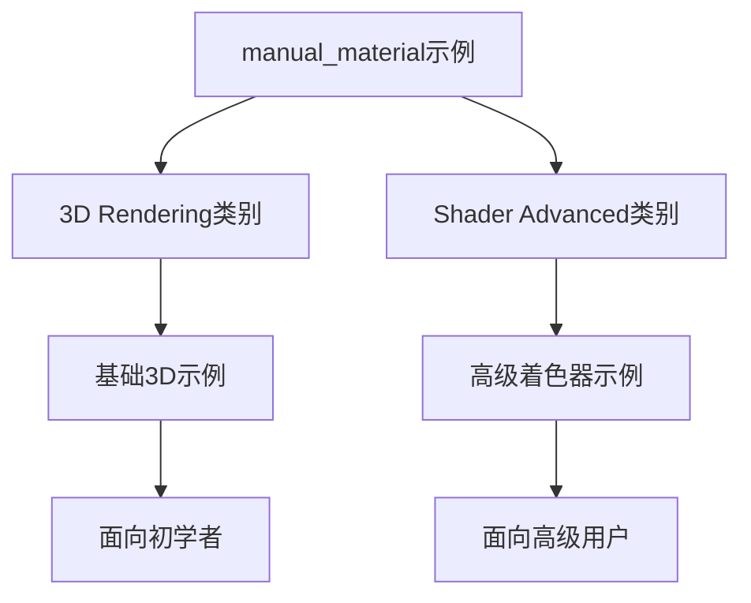

+++
title = "#21735 Move manual_material to shader_advanced category"
date = "2025-11-03T00:00:00"
draft = false
template = "pull_request_page.html"
in_search_index = false

[extra]
current_language = "zh-cn"
available_languages = {"en" = { name = "English", url = "/pull_request/bevy/2025-11/pr-21735-en-20251103" }, "zh-cn" = { name = "中文", url = "/pull_request/bevy/2025-11/pr-21735-zh-cn-20251103" }}
labels = ["D-Trivial", "A-Rendering", "C-Examples"]
+++

# Move manual_material to shader_advanced category

## Basic Information
- **Title**: Move manual_material to shader_advanced category
- **PR Link**: https://github.com/bevyengine/bevy/pull/21735
- **Author**: IceSentry
- **Status**: MERGED
- **Labels**: D-Trivial, A-Rendering, C-Examples, S-Ready-For-Final-Review
- **Created**: 2025-11-03T17:49:05Z
- **Merged**: 2025-11-03T19:29:33Z
- **Merged By**: alice-i-cecile

## Description Translation
### 目标

- 这个示例面向高级用户

### 解决方案

- 将其移动到 shader_advanced 类别

### 测试

- 我运行了该示例，它工作正常

## The Story of This Pull Request

这个PR的核心问题是一个分类问题。在Bevy引擎的示例系统中，`manual_material`示例原本位于"3D Rendering"类别，但开发者意识到这个示例实际上更适合"Shader Advanced"类别。

问题的根源在于示例的组织结构需要准确反映内容的复杂程度和目标受众。`manual_material`示例展示了如何使用中等级渲染API手动实现材质，这涉及到比普通3D渲染示例更深入的技术细节。对于初学者来说，这个示例可能会造成困惑，因为它需要理解Bevy渲染系统的内部工作原理。

开发者采用了一个直接而有效的解决方案：将示例文件移动到更合适的目录，并更新相关的配置文件和文档。这种方法的优势在于保持了代码的完整性，只是改变了它的组织位置。

从技术实现角度来看，这个PR涉及三个关键文件的修改：

1. **Cargo.toml** - 更新示例的配置信息，包括路径和类别
2. **examples/README.md** - 更新文档中的示例列表和分类
3. **文件重命名** - 将示例从3D目录移动到shader_advanced目录

在Cargo.toml中的修改特别值得注意，因为这里不仅改变了路径，还更新了类别描述：

```toml
# Before:
category = "3D Rendering"

# After:  
category = "Shader Advanced"
```

这种分类调整对于用户体验有实际影响。现在，当用户浏览示例时，他们会在更合适的上下文中找到这个高级示例。这对于学习路径的构建很重要 - 初学者可以从基础的3D渲染示例开始，而高级用户可以直接找到他们需要的复杂着色器示例。

从工程角度来看，这个PR展示了良好的代码组织原则。通过保持示例的准确分类，项目维护者可以确保代码库的可发现性和可维护性。虽然这个更改看起来很小，但它反映了对用户学习体验的细致考虑。

## Visual Representation



## Key Files Changed

### 1. `Cargo.toml` (+11/-12)

这个文件包含了示例的配置信息。主要变化是移动了`manual_material`示例的配置块位置，并更新了其类别。

```toml
# 从3D Rendering部分移除
-[[example]]
-name = "manual_material"
-path = "examples/3d/manual_material.rs"
-doc-scrape-examples = true
-
-[package.metadata.example.manual_material]
-name = "Manual Material Implementation"
-description = "Demonstrates how to implement a material manually using the mid-level render APIs"
-category = "3D Rendering"
-wasm = true

# 添加到Shader Advanced部分
+[[example]]
+name = "manual_material"
+path = "examples/shader_advanced/manual_material.rs"
+doc-scrape-examples = true
+
+[package.metadata.example.manual_material]
+name = "Manual Material Implementation"
+description = "Demonstrates how to implement a material manually using the mid-level render APIs"
+category = "Shader Advanced"
+wasm = true
```

### 2. `examples/README.md` (+7/-1)

更新了文档结构，在适当的位置添加和移除示例链接。

```markdown
# 在目录中添加了新的Shader Advanced部分
+  - [Shader Advanced](#shader-advanced)

# 从3D Rendering部分移除
-[Manual Material Implementation](../examples/3d/manual_material.rs) | Demonstrates how to implement a material manually using the mid-level render APIs

# 在Shader Advanced部分添加
+### Shader Advanced
+
+Example | Description
+--- | ---
+[Manual Material Implementation](../examples/shader_advanced/manual_material.rs) | Demonstrates how to implement a material manually using the mid-level render APIs
```

### 3. `examples/shader_advanced/manual_material.rs` (+0/-0)

文件内容没有变化，只是从`examples/3d/manual_material.rs`移动到了新的位置。

```rust
// 文件内容保持不变，只是位置变化
// 从: examples/3d/manual_material.rs  
// 到: examples/shader_advanced/manual_material.rs
```

## Further Reading

对于想要深入了解Bevy示例系统和着色器开发的开发者，建议参考：

1. [Bevy官方示例文档](https://github.com/bevyengine/bevy/tree/main/examples) - 了解所有可用示例
2. [Bevy着色器系统文档](https://bevyengine.org/learn/quick-start/getting-started/shaders/) - 学习Bevy的着色器架构
3. [WGSL着色器语言规范](https://gpuweb.github.io/gpuweb/wgsl/) - 理解Bevy使用的WebGPU着色语言

# Full Code Diff
diff --git a/Cargo.toml b/Cargo.toml
index 9e1af044b7401..0c023fb96b200 100644
--- a/Cargo.toml
+++ b/Cargo.toml
@@ -1186,17 +1186,6 @@ description = "Showcases different blend modes"
 category = "3D Rendering"
 wasm = true
 
-[[example]]
-name = "manual_material"
-path = "examples/3d/manual_material.rs"
-doc-scrape-examples = true
-
-[package.metadata.example.manual_material]
-name = "Manual Material Implementation"
-description = "Demonstrates how to implement a material manually using the mid-level render APIs"
-category = "3D Rendering"
-wasm = true
-
 [[example]]
 name = "lighting"
 path = "examples/3d/lighting.rs"
@@ -3091,6 +3080,17 @@ description = "Shows how to make a complete render phase"
 category = "Shaders"
 wasm = true
 
+[[example]]
+name = "manual_material"
+path = "examples/shader_advanced/manual_material.rs"
+doc-scrape-examples = true
+
+[package.metadata.example.manual_material]
+name = "Manual Material Implementation"
+description = "Demonstrates how to implement a material manually using the mid-level render APIs"
+category = "Shader Advanced"
+wasm = true
+
 [[example]]
 name = "texture_binding_array"
 path = "examples/shader_advanced/texture_binding_array.rs"
@@ -3102,7 +3102,6 @@ description = "A shader that shows how to bind and sample multiple textures as a
 category = "Shaders"
 wasm = false
 
-
 [[example]]
 name = "specialized_mesh_pipeline"
 path = "examples/shader_advanced/specialized_mesh_pipeline.rs"
diff --git a/examples/README.md b/examples/README.md
index c83abdb3dd1de..23e5e8ae19829 100644
--- a/examples/README.md
+++ b/examples/README.md
@@ -60,6 +60,7 @@ git checkout v0.4.0
   - [Reflection](#reflection)
   - [Remote Protocol](#remote-protocol)
   - [Scene](#scene)
+  - [Shader Advanced](#shader-advanced)
   - [Shaders](#shaders)
   - [State](#state)
   - [Stress Tests](#stress-tests)
@@ -164,7 +165,6 @@ Example | Description
 [Lighting](../examples/3d/lighting.rs) | Illustrates various lighting options in a simple scene
 [Lightmaps](../examples/3d/lightmaps.rs) | Rendering a scene with baked lightmaps
 [Lines](../examples/3d/lines.rs) | Create a custom material to draw 3d lines
-[Manual Material Implementation](../examples/3d/manual_material.rs) | Demonstrates how to implement a material manually using the mid-level render APIs
 [Mesh Ray Cast](../examples/3d/mesh_ray_cast.rs) | Demonstrates ray casting with the `MeshRayCast` system parameter
 [Meshlet](../examples/3d/meshlet.rs) | Meshlet rendering for dense high-poly scenes (experimental)
 [Mixed lighting](../examples/3d/mixed_lighting.rs) | Demonstrates how to combine baked and dynamic lighting
@@ -445,6 +445,12 @@ Example | Description
 --- | ---
 [Scene](../examples/scene/scene.rs) | Demonstrates loading from and saving scenes to files
 
+### Shader Advanced
+
+Example | Description
+--- | ---
+[Manual Material Implementation](../examples/shader_advanced/manual_material.rs) | Demonstrates how to implement a material manually using the mid-level render APIs
+
 ### Shaders
 
 These examples demonstrate how to implement different shaders in user code.
diff --git a/examples/3d/manual_material.rs b/examples/shader_advanced/manual_material.rs
similarity index 100%
rename from examples/3d/manual_material.rs
rename to examples/shader_advanced/manual_material.rs