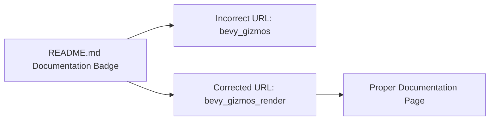

+++
title = "#21736 Fix typo in bevy_gizmos_render docs URL"
date = "2025-11-03T00:00:00"
draft = false
template = "pull_request_page.html"
in_search_index = true

[taxonomies]
list_display = ["show"]

[extra]
current_language = "en"
available_languages = {"en" = { name = "English", url = "/pull_request/bevy/2025-11/pr-21736-en-20251103" }, "zh-cn" = { name = "中文", url = "/pull_request/bevy/2025-11/pr-21736-zh-cn-20251103" }}
labels = ["D-Trivial", "A-Gizmos"]
+++

# Title
Fix typo in bevy_gizmos_render docs URL

## Basic Information
- **Title**: Fix typo in bevy_gizmos_render docs URL
- **PR Link**: https://github.com/bevyengine/bevy/pull/21736
- **Author**: dloukadakis
- **Status**: MERGED
- **Labels**: D-Trivial, S-Ready-For-Final-Review, A-Gizmos
- **Created**: 2025-11-03T19:30:37Z
- **Merged**: 2025-11-03T21:49:04Z
- **Merged By**: alice-i-cecile

## Description Translation
# Objective

Fix typo in bevy_gizmos_render docs URL

## The Story of This Pull Request

This PR addresses a straightforward but important documentation issue in the Bevy game engine's gizmos rendering module. The problem was discovered in the README file for the `bevy_gizmos_render` crate, where the documentation badge was pointing to an incorrect URL due to a typo.

The issue was in the documentation badge link within the README.md file. The badge was configured to point to `https://docs.rs/bevy_gizmos/latest/bevy_gizmos_render/` instead of the correct `https://docs.rs/bevy_gizmos_render/latest/bevy_gizmos_render/`. The discrepancy occurred because the URL used `bevy_gizmos` as the crate name in the path, while it should have been `bevy_gizmos_render`.

This type of documentation link error is common in large codebases with multiple related crates, where similar naming patterns can lead to copy-paste mistakes. While the fix itself is minimal, it has practical importance for developers working with the Bevy engine. Incorrect documentation links can waste developer time and create confusion when users are trying to access the correct API documentation.

The solution approach was direct and precise - simply correcting the typo in the URL path from `bevy_gizmos` to `bevy_gizmos_render`. This ensures that when users click the documentation badge in the crate's README, they are directed to the correct documentation page for the `bevy_gizmos_render` crate specifically, rather than potentially ending up on documentation for a different but similarly named crate.

From an engineering perspective, this fix demonstrates the importance of attention to detail in documentation, which is crucial for maintaining developer experience and reducing friction when working with the codebase. Even small documentation errors can create significant confusion, especially for new contributors who rely heavily on accurate documentation to understand the codebase structure.

## Visual Representation



## Key Files Changed

**File: `crates/bevy_gizmos_render/README.md`**

This file contains the README documentation for the `bevy_gizmos_render` crate. The change fixes a typo in the documentation badge URL that was pointing to the wrong crate's documentation.

**Code Change:**
```markdown
# Before:
[](https://docs.rs/bevy_gizmos/latest/bevy_gizmos_render/)

# After:
[](https://docs.rs/bevy_gizmos_render/latest/bevy_gizmos_render/)
```

The change replaces `bevy_gizmos` with `bevy_gizmos_render` in the documentation URL path, ensuring the badge links to the correct crate documentation.

## Further Reading

- [Bevy Engine Documentation](https://bevyengine.org/learn/)
- [docs.rs - Rust documentation hosting](https://docs.rs/)
- [Bevy Gizmos Module](https://github.com/bevyengine/bevy/tree/main/crates/bevy_gizmos)
- [Rust Documentation Guidelines](https://rust-lang.github.io/rfcs/1574-more-api-documentation-conventions.html)

# Full Code Diff
```diff
diff --git a/crates/bevy_gizmos_render/README.md b/crates/bevy_gizmos_render/README.md
index 7c5be1b4647f7..5f6936e16a636 100644
--- a/crates/bevy_gizmos_render/README.md
+++ b/crates/bevy_gizmos_render/README.md
@@ -3,5 +3,5 @@
 [](https://github.com/bevyengine/bevy#license)
 [](https://crates.io/crates/bevy_gizmos_render)
 [](https://crates.io/crates/bevy_gizmos_render)
-[](https://docs.rs/bevy_gizmos/latest/bevy_gizmos_render/)
+[](https://docs.rs/bevy_gizmos_render/latest/bevy_gizmos_render/)
 [](https://discord.gg/bevy)
```