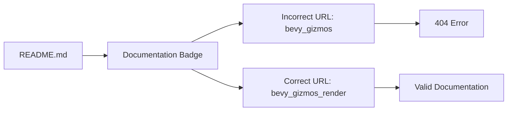

+++
title = "#21736 Fix typo in bevy_gizmos_render docs URL"
date = "2025-11-03T00:00:00"
draft = false
template = "pull_request_page.html"
in_search_index = false

[extra]
current_language = "zh-cn"
available_languages = {"en" = { name = "English", url = "/pull_request/bevy/2025-11/pr-21736-en-20251103" }, "zh-cn" = { name = "中文", url = "/pull_request/bevy/2025-11/pr-21736-zh-cn-20251103" }}
labels = ["D-Trivial", "A-Gizmos"]
+++

# Fix typo in bevy_gizmos_render docs URL

## Basic Information
- **Title**: Fix typo in bevy_gizmos_render docs URL
- **PR Link**: https://github.com/bevyengine/bevy/pull/21736
- **Author**: dloukadakis
- **Status**: MERGED
- **Labels**: D-Trivial, S-Ready-For-Final-Review, A-Gizmos
- **Created**: 2025-11-03T19:30:37Z
- **Merged**: 2025-11-03T21:49:04Z
- **Merged By**: alice-i-cecile

## Description Translation
# Objective

修复 bevy_gizmos_render 文档 URL 中的拼写错误

## The Story of This Pull Request

这是一个简单的文档修复PR，专注于解决一个具体的拼写错误问题。开发者dloukadakis在查看bevy_gizmos_render模块的README文件时，发现文档徽章的链接指向了错误的URL。

问题的根源在于文档链接中使用了不正确的crate名称。原本的链接指向了`bevy_gizmos`，而实际上这个crate的正确名称应该是`bevy_gizmos_render`。这种错误虽然看起来很小，但在实际使用中会导致文档链接失效，影响开发者的体验。

从技术角度来看，这个问题属于URL路径错误。在Rust的文档系统中，docs.rs会根据crate名称来生成对应的文档页面。当URL中的crate名称与实际发布的crate名称不匹配时，链接就会指向404页面或者错误的文档。

解决方案非常直接：将URL中的`bevy_gizmos`更正为`bevy_gizmos_render`。这个修改确保了文档徽章能够正确链接到该crate的实际文档页面。

这种类型的修复虽然简单，但对于开源项目的可维护性很重要。正确的文档链接能够帮助开发者快速访问相关API文档，提高开发效率。同时，这也体现了对项目细节的关注，即使是小问题也值得修复。

从工程实践的角度看，这类拼写错误的修复通常应该尽快合并，因为它们：
- 修复了实际的功能问题（文档链接）
- 不会引入任何破坏性变更
- 代码审查成本极低
- 对项目有明确的正面影响

## Visual Representation



## Key Files Changed

**crates/bevy_gizmos_render/README.md** (+1/-1)

这个文件包含了bevy_gizmos_render模块的README文档。修改的内容是文档徽章的链接URL。

```markdown
# Before:
[](https://docs.rs/bevy_gizmos/latest/bevy_gizmos_render/)

# After:
[](https://docs.rs/bevy_gizmos_render/latest/bevy_gizmos_render/)
```

修改说明：
- 将文档链接中的`bevy_gizmos`更正为`bevy_gizmos_render`
- 保持了徽章图片URL不变（因为徽章URL本身是正确的）
- 只修改了链接的目标URL

## Further Reading

- [Bevy Engine Documentation](https://bevyengine.org/learn/)
- [Rust docs.rs Service](https://docs.rs/)
- [Bevy Gizmos Module Documentation](https://docs.rs/bevy_gizmos_render)

# Full Code Diff
diff --git a/crates/bevy_gizmos_render/README.md b/crates/bevy_gizmos_render/README.md
index 7c5be1b4647f7..5f6936e16a636 100644
--- a/crates/bevy_gizmos_render/README.md
+++ b/crates/bevy_gizmos_render/README.md
@@ -3,5 +3,5 @@
 [](https://github.com/bevyengine/bevy#license)
 [](https://crates.io/crates/bevy_gizmos_render)
 [](https://crates.io/crates/bevy_gizmos_render)
-[](https://docs.rs/bevy_gizmos/latest/bevy_gizmos_render/)
+[](https://docs.rs/bevy_gizmos_render/latest/bevy_gizmos_render/)
 [](https://discord.gg/bevy)