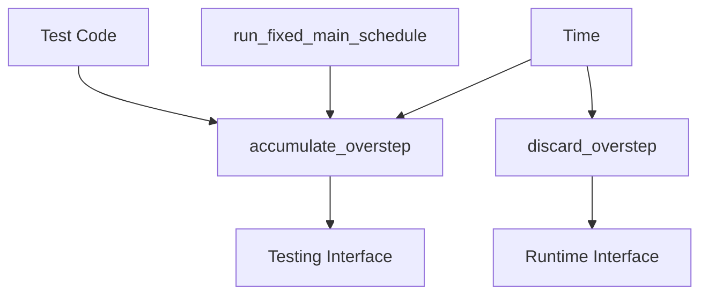

+++
title = "#21738 Allow setting time overstep in tests"
date = "2025-11-04T00:00:00"
draft = false
template = "pull_request_page.html"
in_search_index = true

[taxonomies]
list_display = ["show"]

[extra]
current_language = "en"
available_languages = {"en" = { name = "English", url = "/pull_request/bevy/2025-11/pr-21738-en-20251104" }, "zh-cn" = { name = "中文", url = "/pull_request/bevy/2025-11/pr-21738-zh-cn-20251104" }}
labels = ["D-Trivial", "C-Usability", "A-Time"]
+++

# Title

## Basic Information
- **Title**: Allow setting time overstep in tests
- **PR Link**: https://github.com/bevyengine/bevy/pull/21738
- **Author**: andrewhickman
- **Status**: MERGED
- **Labels**: D-Trivial, C-Usability, S-Ready-For-Final-Review, A-Time
- **Created**: 2025-11-03T22:36:02Z
- **Merged**: 2025-11-04T17:39:14Z
- **Merged By**: alice-i-cecile

## Description Translation

# Objective

There is currently no way to construct a `Time<Fixed>` with a non-zero overstep. The only way to test systems which use the overstep is to advance the virtual time and run the `RunFixedMainLoop` schedule, which is cumbersome.

## Solution

Exposes the `accumulate_overstep` method as a counterpart of `discard_overstep`.

## Testing

This method is covered by existing tests.

## The Story of This Pull Request

This PR addresses a testing limitation in Bevy's fixed timestep system. The core issue was that developers couldn't directly manipulate the overstep value in `Time<Fixed>` for testing purposes, forcing them to use more complex workarounds.

In Bevy's fixed timestep system, overstep represents accumulated time that hasn't yet been processed by fixed updates. This is a critical component for systems that need to handle variable frame rates while maintaining consistent simulation steps. However, testing code that depended on overstep values was problematic because the only way to create a non-zero overstep was to simulate the entire fixed update loop, which involved advancing virtual time and running complex scheduling logic.

The solution was straightforward: expose the existing internal `accumulate` functionality as a public method. The implementation follows a clean pattern where `accumulate_overstep` serves as the counterpart to the existing `discard_overstep` method, creating a symmetrical API for manipulating overstep time.

Looking at the implementation, the developer extracted the core logic from the private `accumulate` method and made it public as `accumulate_overstep`. The method signature is simple - it takes a `Duration` parameter and adds it to the current overstep value. This change maintains the existing behavior while exposing the necessary functionality for testing.

```rust
/// Increase the overstep time accumulated towards new steps.
///
/// This method is provided for use in tests. Ordinarily, the [`run_fixed_main_schedule`] system is responsible for calculating the overstep.
#[inline]
pub fn accumulate_overstep(&mut self, delta: Duration) {
    self.context_mut().overstep += delta;
}
```

The documentation clearly states that this method is intended for testing, which helps prevent misuse in production code. The `#[inline]` attribute suggests this is expected to be a performance-neutral change for the common case where it's not used.

The changes also required updating the internal usage of the now-removed private `accumulate` method. The `run_fixed_main_schedule` system now calls the public `accumulate_overstep` method:

```rust
pub fn run_fixed_main_schedule(world: &mut World) {
    let delta = world.resource::<Time<Virtual>>().delta();
    world
        .resource_mut::<Time<Fixed>>()
        .accumulate_overstep(delta);
    // ... rest of implementation
}
```

All existing tests were updated to use the new public method instead of the private one, ensuring that the test coverage remains intact while using the officially supported API.

This change demonstrates good API design principles - it exposes just enough functionality to solve the testing problem without compromising the encapsulation of the fixed timestep system. The solution is minimal, focused, and maintains backward compatibility while significantly improving testability.

## Visual Representation



## Key Files Changed

- `crates/bevy_time/src/fixed.rs` (+15/-9)

The main changes in this file involve exposing the overstep accumulation functionality for testing:

1. **Added public `accumulate_overstep` method**:
```rust
/// Increase the overstep time accumulated towards new steps.
///
/// This method is provided for use in tests. Ordinarily, the [`run_fixed_main_schedule`] system is responsible for calculating the overstep.
#[inline]
pub fn accumulate_overstep(&mut self, delta: Duration) {
    self.context_mut().overstep += delta;
}
```

2. **Removed private `accumulate` method and updated callers**:
```rust
// Before:
fn accumulate(&mut self, delta: Duration) {
    self.context_mut().overstep += delta;
}

// After: (method removed, functionality moved to accumulate_overstep)
```

3. **Updated `run_fixed_main_schedule` to use public method**:
```rust
// Before:
world.resource_mut::<Time<Fixed>>().accumulate(delta);

// After:
world
    .resource_mut::<Time<Fixed>>()
    .accumulate_overstep(delta);
```

4. **Updated test code to use public API**:
```rust
// Before:
time.accumulate(Duration::from_secs(1));

// After:
time.accumulate_overstep(Duration::from_secs(1));
```

## Further Reading

- [Bevy Time Documentation](https://docs.rs/bevy_time/latest/bevy_time/)
- [Fixed Timestep Pattern in Game Engines](https://gafferongames.com/post/fix_your_timestep/)
- [Bevy Testing Guide](https://bevyengine.org/learn/quick-start/testing/)