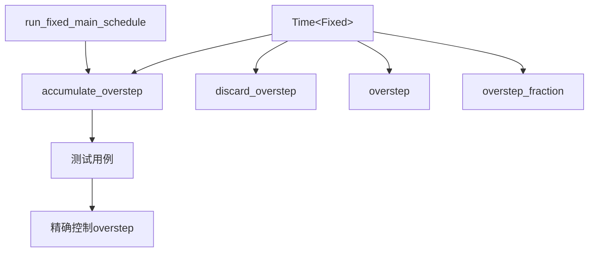

+++
title = "#21738 Allow setting time overstep in tests"
date = "2025-11-04T00:00:00"
draft = false
template = "pull_request_page.html"
in_search_index = false

[extra]
current_language = "zh-cn"
available_languages = {"en" = { name = "English", url = "/pull_request/bevy/2025-11/pr-21738-en-20251104" }, "zh-cn" = { name = "中文", url = "/pull_request/bevy/2025-11/pr-21738-zh-cn-20251104" }}
+++

# Allow setting time overstep in tests

## Basic Information
- **标题**: Allow setting time overstep in tests
- **PR 链接**: https://github.com/bevyengine/bevy/pull/21738
- **作者**: andrewhickman
- **状态**: 已合并
- **标签**: D-Trivial, C-Usability, S-Ready-For-Final-Review, A-Time
- **创建时间**: 2025-11-03T22:36:02Z
- **合并时间**: 2025-11-04T17:39:14Z
- **合并者**: alice-i-cecile

## 描述翻译

### 目标

目前没有办法构造一个具有非零 overstep 的 `Time<Fixed>`。测试使用 overstep 的系统的唯一方法是推进虚拟时间并运行 `RunFixedMainLoop` 调度，这很繁琐。

### 解决方案

将 `accumulate_overstep` 方法公开，作为 `discard_overstep` 的对应方法。

### 测试

此方法已被现有测试覆盖。

## 这个 Pull Request 的故事

### 问题背景

在 Bevy 游戏引擎的固定时间步长系统中，`Time<Fixed>` 结构体负责管理时间步长和 overstep（超步）时间。overstep 是指累积的、超出当前时间步长的额外时间，用于决定在下一个固定更新周期中需要执行多少次系统。

开发者在编写测试时面临一个实际问题：无法直接构造具有特定 overstep 值的 `Time<Fixed>` 实例。在现有实现中，唯一的测试方法是先推进虚拟时间，然后运行完整的 `RunFixedMainLoop` 调度系统。这种方法不仅繁琐，而且对于需要精确控制测试条件的场景来说过于重量级。

### 解决方案设计

这个 PR 采用了直接而有效的解决方案：将已有的内部方法 `accumulate` 重构为公开的 `accumulate_overstep` 方法。这个设计决策有几个关键优势：

1. **最小化变更**：不引入新的逻辑，只是暴露现有功能
2. **一致性**：作为现有 `discard_overstep` 方法的对应方法
3. **测试友好**：为测试代码提供精确控制 overstep 的能力

### 实现细节

核心变更集中在 `crates/bevy_time/src/fixed.rs` 文件中。原来的私有方法 `accumulate` 被重构：

```rust
// 之前：私有方法
fn accumulate(&mut self, delta: Duration) {
    self.context_mut().overstep += delta;
}

// 之后：公开方法
pub fn accumulate_overstep(&mut self, delta: Duration) {
    self.context_mut().overstep += delta;
}
```

这个重构不仅仅是简单的可见性修改，还包括了重要的文档注释，明确说明了方法的用途和限制：

```rust
/// Increase the overstep time accumulated towards new steps.
///
/// This method is provided for use in tests. Ordinarily, the [`run_fixed_main_schedule`] system is responsible for calculating the overstep.
```

在系统层面，`run_fixed_main_schedule` 函数中的调用也相应更新：

```rust
// 之前：
world.resource_mut::<Time<Fixed>>().accumulate(delta);

// 之后：
world.resource_mut::<Time<Fixed>>().accumulate_overstep(delta);
```

### 测试覆盖

所有现有的测试用例都进行了相应的更新，将原来的 `accumulate` 调用改为 `accumulate_overstep`。这确保了：

- 向后兼容性得到维护
- 测试覆盖范围保持不变
- 新方法的正确性得到验证

例如，在测试中：

```rust
// 之前：
time.accumulate(Duration::from_secs(1));

// 之后：
time.accumulate_overstep(Duration::from_secs(1));
```

### 技术影响

这个看似简单的变更实际上解决了测试工程中的重要痛点：

1. **测试精度**：开发者现在可以精确设置 overstep 值，创建特定的测试场景
2. **测试性能**：避免了运行完整调度系统的开销
3. **测试可读性**：测试代码更加直观，直接反映了测试意图

从架构角度看，这个变更遵循了良好的 API 设计原则：将内部实现细节适当地暴露给测试层，同时保持生产代码的封装性。

## 可视化表示



## 关键文件变更

### `crates/bevy_time/src/fixed.rs` (+15/-9)

这个文件包含了所有主要的变更：

1. **新增公开方法**：添加了 `accumulate_overstep` 方法
2. **移除私有方法**：删除了原来的 `accumulate` 方法
3. **系统调用更新**：更新了 `run_fixed_main_schedule` 中的调用
4. **测试用例更新**：更新了所有相关测试

关键代码变更：

```rust
// 新增的公开方法
#[inline]
pub fn accumulate_overstep(&mut self, delta: Duration) {
    self.context_mut().overstep += delta;
}

// 移除的私有方法
// fn accumulate(&mut self, delta: Duration) {
//     self.context_mut().overstep += delta;
// }
```

```rust
// 系统调用更新
// 之前：
world.resource_mut::<Time<Fixed>>().accumulate(delta);

// 之后：
world.resource_mut::<Time<Fixed>>()
    .accumulate_overstep(delta);
```

## 进一步阅读

- [Bevy 时间系统文档](https://docs.rs/bevy_time/latest/bevy_time/)
- [固定时间步长模式说明](https://github.com/bevyengine/bevy/blob/main/examples/ecs/fixed_timestep.rs)
- [Rust 测试最佳实践](https://doc.rust-lang.org/book/ch11-00-testing.html)

## 完整代码差异

```diff
diff --git a/crates/bevy_time/src/fixed.rs b/crates/bevy_time/src/fixed.rs
index 13f1590b33a95..b1483de3f6236 100644
--- a/crates/bevy_time/src/fixed.rs
+++ b/crates/bevy_time/src/fixed.rs
@@ -182,6 +182,14 @@ impl Time<Fixed> {
         self.context().overstep
     }
 
+    /// Increase the overstep time accumulated towards new steps.
+    ///
+    /// This method is provided for use in tests. Ordinarily, the [`run_fixed_main_schedule`] system is responsible for calculating the overstep.
+    #[inline]
+    pub fn accumulate_overstep(&mut self, delta: Duration) {
+        self.context_mut().overstep += delta;
+    }
+
     /// Discard a part of the overstep amount.
     ///
     /// If `discard` is higher than overstep, the overstep becomes zero.
@@ -205,10 +213,6 @@ impl Time<Fixed> {
         self.context().overstep.as_secs_f64() / self.context().timestep.as_secs_f64()
     }
 
-    fn accumulate(&mut self, delta: Duration) {
-        self.context_mut().overstep += delta;
-    }
-
     fn expend(&mut self) -> bool {
         let timestep = self.timestep();
         if let Some(new_value) = self.context_mut().overstep.checked_sub(timestep) {
@@ -238,7 +242,9 @@ impl Default for Fixed {
 /// [`RunFixedMainLoopSystems`](bevy_app::prelude::RunFixedMainLoopSystems).
 pub fn run_fixed_main_schedule(world: &mut World) {
     let delta = world.resource::<Time<Virtual>>().delta();
-    world.resource_mut::<Time<Fixed>>().accumulate(delta);
+    world
+        .resource_mut::<Time<Fixed>>()
+        .accumulate_overstep(delta);
 
     // Run the schedule until we run out of accumulated time
     let _ = world.try_schedule_scope(FixedMain, |world, schedule| {
@@ -278,7 +284,7 @@ mod test {
         assert_eq!(time.delta(), Duration::ZERO);
         assert_eq!(time.elapsed(), Duration::ZERO);
 
-        time.accumulate(Duration::from_secs(1));
+        time.accumulate_overstep(Duration::from_secs(1));
 
         assert_eq!(time.delta(), Duration::ZERO);
         assert_eq!(time.elapsed(), Duration::ZERO);
@@ -294,7 +300,7 @@ mod test {
         assert_eq!(time.overstep_fraction(), 0.5);
         assert_eq!(time.overstep_fraction_f64(), 0.5);
 
-        time.accumulate(Duration::from_secs(1));
+        time.accumulate_overstep(Duration::from_secs(1));
 
         assert_eq!(time.delta(), Duration::ZERO);
         assert_eq!(time.elapsed(), Duration::ZERO);
@@ -318,7 +324,7 @@ mod test {
         assert_eq!(time.overstep_fraction(), 0.0);
         assert_eq!(time.overstep_fraction_f64(), 0.0);
 
-        time.accumulate(Duration::from_secs(1));
+        time.accumulate_overstep(Duration::from_secs(1));
 
         assert_eq!(time.delta(), Duration::from_secs(2));
         assert_eq!(time.elapsed(), Duration::from_secs(2));
@@ -339,7 +345,7 @@ mod test {
     fn test_expend_multiple() {
         let mut time = Time::<Fixed>::from_seconds(2.0);
 
-        time.accumulate(Duration::from_secs(7));
+        time.accumulate_overstep(Duration::from_secs(7));
         assert_eq!(time.overstep(), Duration::from_secs(7));
 
         assert!(time.expend()); // true
```