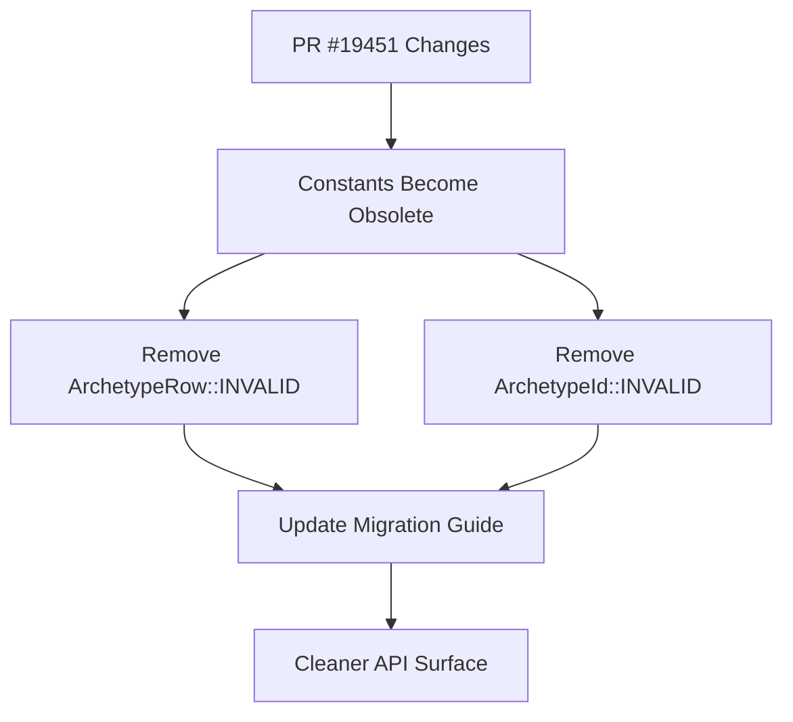

+++
title = "#21741 Removed invalid ECS archetype constants"
date = "2025-11-04T00:00:00"
draft = false
template = "pull_request_page.html"
in_search_index = true

[taxonomies]
list_display = ["show"]

[extra]
current_language = "en"
available_languages = {"en" = { name = "English", url = "/pull_request/bevy/2025-11/pr-21741-en-20251104" }, "zh-cn" = { name = "中文", url = "/pull_request/bevy/2025-11/pr-21741-zh-cn-20251104" }}
labels = ["D-Trivial", "A-ECS", "C-Code-Quality"]
+++

# Title
Removed invalid ECS archetype constants

## Basic Information
- **Title**: Removed invalid ECS archetype constants
- **PR Link**: https://github.com/bevyengine/bevy/pull/21741
- **Author**: ElliottjPierce
- **Status**: MERGED
- **Labels**: D-Trivial, A-ECS, C-Code-Quality, S-Ready-For-Final-Review
- **Created**: 2025-11-04T20:55:59Z
- **Merged**: 2025-11-04T21:47:20Z
- **Merged By**: alice-i-cecile

## Description Translation
# Objective

This is a tiny clean up to #19451 that removes some now completely unneeded public constants.
I mean, they aren't wrong, but there's no point to their existence.

## Solution

Removed `ArchetypeRow::INVALID` and `ArchetypeId::INVALID` and extend migration guide.

## The Story of This Pull Request

This PR represents a straightforward cleanup task in the Bevy ECS (Entity Component System) codebase. The core issue was that two public constants - `ArchetypeRow::INVALID` and `ArchetypeId::INVALID` - had become obsolete after previous changes in PR #19451.

The problem stemmed from these constants no longer serving any practical purpose in the codebase. While they weren't technically incorrect or causing bugs, their continued presence created unnecessary API surface area and potential confusion for developers. In software engineering terms, this is a classic case of removing dead code to maintain code quality and reduce cognitive overhead.

The solution approach was direct and minimal: simply remove the unused constants and update the migration guide to inform users about the change. This reflects good software maintenance practices - when functionality becomes obsolete, it's better to remove it completely rather than leave it as deprecated code that still needs to be maintained.

Looking at the implementation, the changes are surgical. In the archetype.rs file, the removal of `ArchetypeRow::INVALID` eliminated a placeholder constant that was previously marked with a TODO comment indicating it should be deprecated in favor of using options. Similarly, `ArchetypeId::INVALID` was removed along with its safety comment about maintaining an all-1s bit pattern for entity ID space allocation.

The technical insight here is about API design and maintenance. The original constants were likely used for internal bookkeeping or as sentinel values, but as the system evolved, they became unnecessary. By removing them, the codebase becomes cleaner and the API more intentional. The migration guide update shows good practice in communicating breaking changes to users, even for minor removals.

The impact of these changes is primarily on code quality and maintainability. While not affecting performance or functionality, removing unused public API elements reduces the surface area that needs to be tested, documented, and maintained. It also prevents future developers from accidentally using these constants in new code, which could lead to confusion or incorrect implementations.

## Visual Representation



## Key Files Changed

### `crates/bevy_ecs/src/archetype.rs` (+0/-9)

This file contains the core ECS archetype implementation. The changes remove two obsolete constants that were no longer needed after previous refactoring.

**Key modifications:**
```rust
// Before:
pub struct ArchetypeRow(NonMaxU32);

impl ArchetypeRow {
    /// Index indicating an invalid archetype row.
    /// This is meant to be used as a placeholder.
    // TODO: Deprecate in favor of options, since `INVALID` is, technically, valid.
    pub const INVALID: ArchetypeRow = ArchetypeRow(NonMaxU32::MAX);

    // ... other methods
}

pub struct ArchetypeId(u32);

impl ArchetypeId {
    /// The ID for the [`Archetype`] without any components.
    pub const EMPTY: ArchetypeId = ArchetypeId(0);
    /// # Safety:
    ///
    /// This must always have an all-1s bit pattern to ensure soundness in fast entity id space allocation.
    pub const INVALID: ArchetypeId = ArchetypeId(u32::MAX);

    // ... other methods
}

// After:
pub struct ArchetypeRow(NonMaxU32);

impl ArchetypeRow {
    // INVALID constant removed

    // ... other methods remain
}

pub struct ArchetypeId(u32);

impl ArchetypeId {
    /// The ID for the [`Archetype`] without any components.
    pub const EMPTY: ArchetypeId = ArchetypeId(0);

    // INVALID constant and safety comment removed

    // ... other methods remain
}
```

### `release-content/migration-guides/entities_apis.md` (+3/-0)

This file contains migration guidance for entity-related API changes. The update informs users about the removed constants and suggests alternatives.

**Key modifications:**
```markdown
// Addition to the migration guide:

### Other entity interactions

The `ArchetypeRow::INVALID` and `ArchetypeId::INVALID` constants have been removed, since they are no longer needed for flushing.
If you depended on these, use options instead.

// Existing content continues...
```

## Further Reading

- [Bevy ECS Documentation](https://docs.rs/bevy_ecs/latest/bevy_ecs/) - Comprehensive documentation for Bevy's Entity Component System
- [PR #19451](https://github.com/bevyengine/bevy/pull/19451) - The original PR that made these constants obsolete
- [Entity Component System Pattern](https://en.wikipedia.org/wiki/Entity_component_system) - General information about ECS architecture
- [Rust API Guidelines](https://rust-lang.github.io/api-guidelines/) - Best practices for Rust API design, including when to remove obsolete items